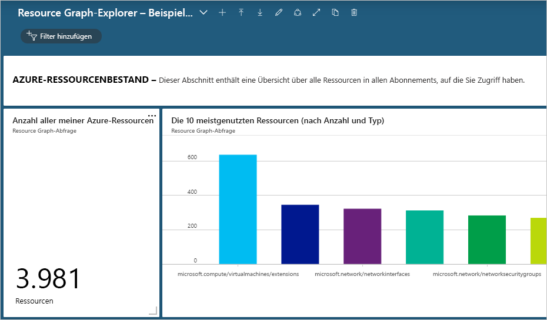
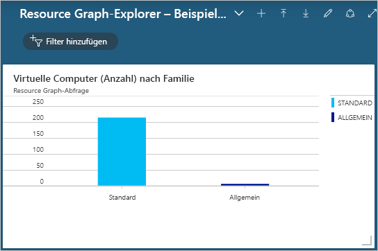

# <a name="quickstart-run-your-first-resource-graph-query-using-azure-resource-graph-explorer"></a>Schnellstart: Ausführen Ihrer ersten Resource Graph-Abfrage mithilfe des Azure Resource Graph-Explorers

Azure Resource Graph steht Ihnen direkt im Azure-Portal über den Azure Resource Graph-Explorer zur Verfügung. Der Resource Graph-Explorer stellt durchsuchbare Informationen über die Azure Resource Manager-Ressourcentypen und Eigenschaften bereit, die Sie abfragen können. Der Resource Graph-Explorer bietet auch eine übersichtliche Oberfläche, auf der Sie mit mehreren Abfragen arbeiten, die Ergebnisse auswerten und sogar die Ergebnisse mancher Abfragen in ein Diagramm umwandeln können, das Sie anschließend an ein Azure-Dashboard anheften können.

Am Ende dieser Schnellstartanleitung haben Sie das Azure-Portal und den Resource Graph-Explorer verwendet, um Ihre erste Resource Graph-Abfrage auszuführen, und haben die Ergebnisse an ein Dashboard angeheftet.

Wenn Sie kein Azure-Abonnement besitzen, können Sie ein [kostenloses Konto](https://azure.microsoft.com/free/) erstellen, bevor Sie beginnen.

## <a name="run-your-first-resource-graph-query"></a>Ausführen Ihrer ersten Resource Graph-Abfrage

Öffnen Sie das [Azure-Portal](https://portal.azure.com), und suchen und verwenden Sie den Resource Graph-Explorer, indem Sie die folgenden Schritte ausführen, damit Sie anschließend Ihre erste Resource Graph-Abfrage ausführen können:

1. Wählen Sie **Alle Dienste** im linken Bereich aus. Suchen Sie die Option **Resource Graph-Explorer**, und wählen Sie sie aus.

1. Geben Sie im Fenster unter **Query 1** (Abfrage 1) die Abfrage `Resources | project name, type | limit 5` ein, und wählen Sie **Abfrage ausführen** aus.

   > [!NOTE]
   > Da dieses Abfragebeispiel keinen Sortierungsmodifizierer wie `order by` umfasst, ergibt die mehrfache Ausführung dieser Abfrage unter Umständen pro Anforderung einen anderen Satz von Ressourcen.

1. Die Abfrageergebnisse werden auf der Registerkarte **Ergebnisse** angezeigt. Wählen Sie die Registerkarte **Meldungen** aus, um Details zur Abfrage anzuzeigen, einschließlich der Anzahl der Ergebnisse und der Dauer der Abfrage. Wenn Fehler auftreten, werden diese ebenfalls auf dieser Registerkarte angezeigt.

1. Aktualisieren Sie die Abfrage, sodass die Sortierung `order by` nach der Eigenschaft **Name** gilt: `Resources | project name, type | limit 5 | order by name asc`. Wählen Sie anschließend **Abfrage ausführen** aus.

   > [!NOTE]
   > Genau wie bei der ersten Abfrage ergibt die mehrfache Ausführung dieser Abfrage vermutlich pro Anforderung einen anderen Satz von Ressourcen. Die Reihenfolge der Abfragebefehle ist wichtig. In diesem Beispiel kommt `order by` nach `limit`. Dies beschränkt zunächst die Ergebnisse der Abfrage und sortiert sie dann.

1. Aktualisieren Sie die Abfrage, sodass zuerst die Sortierung `order by` nach der Eigenschaft **Name** vorgenommen wird, und begrenzen Sie die Ergebnisse mithilfe von `limit` auf die fünf relevantesten Ergebnisse: `Resources | project name, type | order by name asc | limit 5`. Wählen Sie anschließend **Abfrage ausführen** aus.

Wenn die letzte Abfrage mehrmals ausgeführt wird, sind die zurückgegebenen Ergebnisse – vorausgesetzt, dass sich in Ihrer Umgebung nichts ändert – konsistent und wie erwartet: sortiert nach der Eigenschaft **Name**, aber immer noch auf die fünf relevantesten Ergebnisse begrenzt.

### <a name="schema-browser"></a>Schemabrowser

Der Schemabrowser befindet sich im linken Bereich des Resource Graph-Explorers. Diese Liste der Ressourcen zeigt alle _Ressourcentypen_ von Azure-Ressourcen an, die von Azure Resource Graph unterstützt werden und in einem Mandanten vorhanden sind, auf den Sie Zugriff haben. Wenn Sie einen Ressourcentyp oder Untereigenschaften erweitern, werden untergeordnete Eigenschaften angezeigt, die zum Erstellen einer Resource Graph-Abfrage verwendet werden können.

Wenn Sie den Ressourcentyp auswählen, wird `where type =="<resource type>"` in das Abfragefeld eingefügt. Wenn Sie eine der untergeordneten Eigenschaften auswählen, wird `where <propertyName> == "INSERT_VALUE_HERE"` zum Abfragefeld hinzugefügt.
Der Schemabrowser ist eine hervorragende Möglichkeit zum Entdecken von Eigenschaften, die in Abfragen verwendet werden können. Stellen Sie sicher, dass Sie _INSERT\_VALUE\_HERE_ durch Ihren eigenen Wert ersetzen und die Abfrage mit Bedingungen, Operatoren und Funktionen anpassen, um die gewünschten Ergebnisse zu erzielen.

## <a name="create-a-chart-from-the-resource-graph-query"></a>Erstellen eines Diagramms aus der Resource Graph-Abfrage

Wenn Sie nach dem Ausführen der letzten Abfrage oben die Registerkarte **Diagramme** auswählen, erhalten Sie eine Meldung mit dem Hinweis, dass der Ergebnissatz nicht mit einer Kreisdiagrammvisualisierung kompatibel ist. Abfragen, die Ergebnisse auflisten, können nicht in einem Diagramm dargestellt werden, Abfragen, die die Anzahl von Ressourcen angeben, hingegen schon. Erstellen Sie mit der [Beispielabfrage zum Zählen von virtuellen Computern nach Betriebssystemtyp](./samples/starter.md#count-virtual-machines-by-os-type) eine Visualisierung aus der Resource Graph-Abfrage.

1. Geben Sie im Fenster unter **Query 1** (Abfrage 1) die folgende Abfrage ein, und wählen Sie **Abfrage ausführen** aus.

   ```kusto
   Resources
   | where type =~ 'Microsoft.Compute/virtualMachines'
   | summarize count() by tostring(properties.storageProfile.osDisk.osType)
   ```

1. Wählen Sie die Registerkarte **Ergebnisse** aus. Beachten Sie, dass die Antwort dieser Abfrage Zahlen enthält.

1. Wählen Sie die Registerkarte **Diagramme** aus. Nun gibt die Abfrage Visualisierungen aus. Ändern Sie den Typ von _Diagrammtyp auswählen..._ entweder in _Balkendiagramm_ oder in _Ringdiagramm_, um die verfügbaren Visualisierungsoptionen kennenzulernen.

## <a name="pin-the-query-visualization-to-a-dashboard"></a>Anheften der Abfragevisualisierung an ein Dashboard

Bei Ergebnissen aus einer Abfrage, die visualisiert werden können, kann diese Datenvisualisierung an eines Ihrer Dashboards angeheftet werden. Führen Sie nach dem Ausführen der obigen Abfrage die folgenden Schritte aus:

1. Wählen Sie **Speichern** aus, und geben Sie den Namen „VMS nach Betriebssystemtyp“ an. Wählen Sie anschließend unten im rechten Bereich **Speichern** aus.

1. Wählen Sie **Abfrage ausführen** aus, um die Abfrage erneut auszuführen, nachdem sie gespeichert wurde.

1. Wählen Sie auf der Registerkarte **Diagramme** eine Datenvisualisierung aus. Wählen Sie anschließend die Option **An Dashboard anheften** aus.

1. Wählen Sie entweder die angezeigte Portalbenachrichtigung aus, oder wählen Sie im linken Bereich **Dashboard** aus.

Die Abfrage ist nun in Ihrem Dashboard verfügbar. Sie trägt den Titel der Kachel, die mit dem Abfragenamen übereinstimmt. Wenn die Abfrage beim Anheften nicht gespeichert war, wird sie „Abfrage 1“ genannt.

Die Abfrage und die resultierende Datenvisualisierung werden jedes Mal ausgeführt und aktualisiert, wenn das Dashboard geladen wird. Dadurch erhalten Sie direkt im Workflow dynamische Echtzeiterkenntnisse zu Ihrer Azure-Umgebung.

> [!NOTE]
> Abfragen, deren Ergebnisse in einer Liste angezeigt werden, können auch an das Dashboard angeheftet werden. Die Funktion ist nicht auf Datenvisualisierungen von Abfragen beschränkt.

## <a name="import-example-resource-graph-explorer-dashboards"></a>Importieren von Resource Graph-Explorer-Beispieldashboards

Sehen Sie sich diese Beispieldashboards an, um Beispiele von Resource Graph-Abfragen kennenzulernen und zu erfahren, wie der Resource Graph-Explorer zum Verbessern des Workflows im Azure-Portal eingesetzt werden kann.

- [Resource Graph-Explorer – Beispieldashboard 1](https://github.com/Azure-Samples/Governance/blob/master/src/resource-graph/portal-dashboards/sample-1/resourcegraphexplorer-sample-1.json)

  [](./media/arge-sample1-large.png#lightbox)

- [Resource Graph-Explorer – Beispieldashboard 2](https://github.com/Azure-Samples/Governance/blob/master/src/resource-graph/portal-dashboards/sample-2/resourcegraphexplorer-sample-2.json)

  [](./media/arge-sample2-large.png#lightbox)

> [!NOTE]
> Die Zahlen und Diagramme in den obigen Screenshots von Beispieldashboards variieren in Abhängigkeit von Ihrer Azure-Umgebung.

1. Wählen Sie das Beispieldashboard aus, das Sie auswerten möchten, und laden Sie es herunter.

1. Wählen Sie im Azure-Portal im linken Bereich **Dashboard** aus.

1. Wählen Sie **Hochladen** aus, suchen Sie die heruntergeladene Beispieldashboarddatei, und wählen Sie sie aus. Wählen Sie anschließend **Öffnen** aus.

Das importierte Dashboard wird automatisch angezeigt. Da es jetzt in Ihrem Azure-Portal vorhanden ist, können Sie es nach Bedarf testen und Änderungen daran vornehmen oder neue Dashboards aus dem Beispiel erstellen, um sie für Ihre Teams freizugeben. Weitere Informationen zur Verwendung von Dashboards finden Sie unter [Erstellen und Freigeben von Dashboards im Azure-Portal](../../azure-portal/azure-portal-dashboards.md).

## <a name="clean-up-resources"></a>Bereinigen von Ressourcen

Wenn Sie die Resource Graph-Beispieldashboards aus der Azure-Portalumgebung entfernen möchten, führen Sie die folgenden Schritte aus:

1. Wählen Sie im linken Bereich **Dashboard** aus.

1. Wählen Sie im Dropdownmenü des Dashboards das Resource Graph-Beispieldashboard aus, das Sie löschen möchten.

1. Wählen Sie im Dashboardmenü oben auf dem Dashboard die Option **Löschen** aus, und bestätigen Sie dies anschließend mit **OK**.

## <a name="next-steps"></a>Nächste Schritte

- Erfahren Sie mehr über die [Abfragesprache](./concepts/query-language.md)
- Lernen Sie, [Ressourcen zu untersuchen](./concepts/explore-resources.md)
- Führen Sie Ihre erste Abfrage mit der [Azure CLI](first-query-azurecli.md) aus.
- Siehe Beispiele der [einfachen Abfragen](./samples/starter.md)
- Siehe Beispiele der [erweiterten Abfragen](./samples/advanced.md)
- Senden von Feedback über [UserVoice](https://feedback.azure.com/forums/915958-azure-governance)