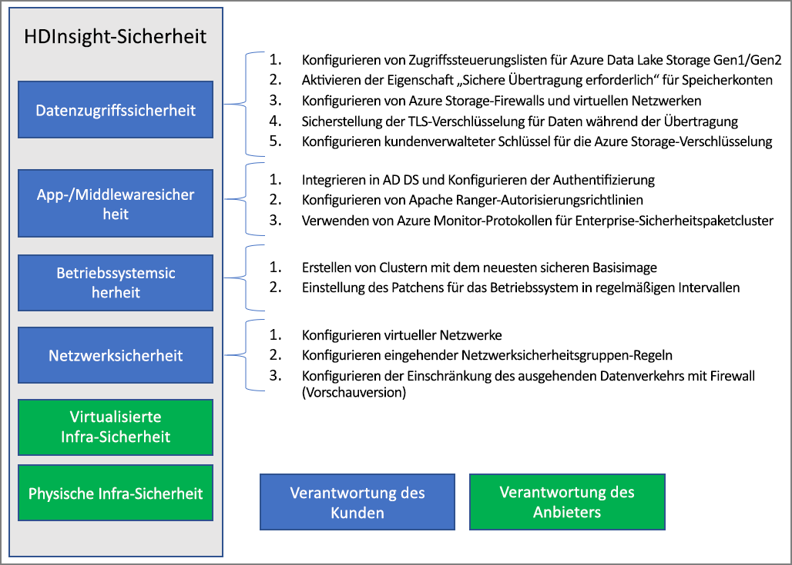

# Übersicht über die Unternehmenssicherheit in Azure HDInsight

Azure HDInsight bietet eine Reihe von Methoden, um Ihre Sicherheitsanforderungen im Unternehmen zu erfüllen. Die meisten dieser Lösungen sind standardmäßig nicht aktiviert. Diese Flexibilität ermöglicht es Ihnen, die Sicherheitsfeatures auszuwählen, die für Sie am wichtigsten sind, und hilft Ihnen zu vermeiden, das Sie für nicht erforderliche Features bezahlen. Dies bedeutet auch, dass Sie dafür verantwortlich sind, sicherzustellen, dass die richtigen Lösungen für Ihr Setup und Ihre Umgebung aktiviert sind.

Dieser Artikel befasst sich mit Sicherheitslösungen, indem die Sicherheitslösungen nach den vier traditionellen Sicherheitssäulen gegliedert werden: Umgebungssicherheit, Authentifizierung, Autorisierung und Verschlüsselung.

Dieser Artikel stellt auch das **Azure HDInsight Enterprise-Sicherheitspaket (ESP)** vor, das Active Directory-basierte Authentifizierung, Unterstützung mehrerer Benutzer und die rollenbasierte Zugriffssteuerung für HDInsight-Cluster bietet.

## Enterprise-Sicherheitssäulen

Eine Art der Betrachtung der Unternehmenssicherheit unterteilt Sicherheitslösungen in vier Hauptgruppen, die sich nach der Art der Kontrolle richten. Diese Gruppen werden auch als Sicherheitssäulen bezeichnet und sind die folgenden: Umkreissicherheit, Authentifizierung, Autorisierung und Verschlüsselung.

### Umgebungssicherheit

Die Umgebungssicherheit in HDInsight wird mithilfe von [virtuellen Netzwerken](../hdinsight-plan-virtual-network-deployment.md) erreicht. Ein Unternehmensadministrator kann einen Cluster in einem virtuellen Netzwerk (VNET) erstellen und den Zugriff auf das virtuelle Netzwerk mithilfe von Netzwerksicherheitsgruppen (NSG) beschränken. Es können nur die zulässigen IP-Adressen in den eingehenden NSG-Regeln mit dem HDInsight-Cluster kommunizieren. Diese Konfiguration bietet Umgebungssicherheit.

Alle Cluster, die in einem VNET bereitgestellt werden, verfügen auch über einen privaten Endpunkt, der sich auf eine private IP-Adresse innerhalb des VNET auflöst, um privaten HTTP-Zugriff auf die Clustergateways zu ermöglichen.

### Authentication

Das [Enterprise-Sicherheitspaket](apache-domain-joined-architecture.md) von HDInsight unterstützt die Active Directory-basierte Authentifizierung, Unterstützung mehrerer Benutzer und rollenbasierte Zugriffssteuerung. Die Active Directory-Integration wird durch die Verwendung von [Azure Active Directory Domain Services](../../active-directory-domain-services/overview.md) erreicht. Mit diesen Funktionen können Sie einen HDInsight-Cluster erstellen, der in eine verwaltete Active Directory-Domäne eingebunden ist. Sie können dann eine Liste mit Mitarbeitern des Unternehmens konfigurieren, die eine Authentifizierung und Anmeldung am Cluster durchführen können.

In dieser Konfiguration können sich Mitarbeiter des Unternehmens mit ihren Domänenanmeldeinformationen bei den Clusterknoten anmelden. Darüber hinaus können sie sich mit ihren Domänenanmeldeinformationen auch bei anderen genehmigten Endpunkten wie Apache Ambari Views, ODBC, JDBC, PowerShell und REST-APIs authentifizieren, um mit dem Cluster zu interagieren. 

### Authorization

In den meisten Unternehmen hat es sich bewährt, dass nicht jeder Mitarbeiter Zugriff auf alle Unternehmensressourcen hat. Analog dazu kann der Administrator für die Clusterressourcen Richtlinien für die rollenbasierte Zugriffssteuerung definieren. Dies ist nur in den ESP-Clustern verfügbar.

Der Hadoop-Administrator kann die rollenbasierte Zugriffssteuerung (RBAC) konfigurieren, um Apache [Hive](apache-domain-joined-run-hive.md), [HBase](apache-domain-joined-run-hbase.md) und [Kafka](apache-domain-joined-run-kafka.md) mit diesen Plug-Ins in Apache Ranger zu sichern. Durch die Konfiguration von RBAC-Richtlinien können Sie Berechtigungen einer Rolle in der Organisation zuordnen. Diese Abstraktionsebene erleichtert die Sicherstellung, dass Personen nur über die Berechtigungen verfügen, die sie zur Erfüllung ihrer beruflichen Aufgaben benötigen. Mit Ranger können Sie auch den Datenzugriff von Mitarbeitern und alle Änderungen an den Zugriffssteuerungsrichtlinien überwachen.

So kann der Administrator etwa [Apache Ranger](https://ranger.apache.org/) zum Festlegen von Zugriffssteuerungsrichtlinien für Hive konfigurieren. Diese Funktionalität gewährleistet die Filterung auf Zeilen- und Spaltenebene (Datenmaskierung) und filtert die sensiblen Daten von nicht autorisierten Benutzern.

### Überwachung

Die Überwachung des gesamten Zugriffs auf die Clusterressourcen und der Daten ist erforderlich, um unbefugten oder versehentlichen Zugriff auf die Ressourcen nachzuverfolgen. Dies ist ebenso wichtig wie der Schutz der HDInsight-Clusterressourcen vor nicht autorisierten Benutzern und das Sichern von Daten.

Der Administrator kann sämtliche Zugriffe auf die Ressourcen und Daten des HDInsight-Clusters anzeigen und entsprechende Berichte erstellen. Außerdem kann er sämtliche Änderungen an den Zugriffssteuerungsrichtlinien anzeigen, die an von Apache Ranger unterstützten Endpunkten vorgenommen werden, und entsprechende Berichte erstellen. 

Aktivieren Sie [Azure Monitor](../hdinsight-hadoop-oms-log-analytics-tutorial.md#cluster-auditing), und zeigen Sie die Tabellen mit Überwachungsdatensätzen an, um auf Überwachungsprotokolle von Apache Ranger und Ambari sowie SSH-Zugriffsprotokolle zuzugreifen.

### Verschlüsselung

Der Schutz von Daten ist wichtig, um die Sicherheits- und Compliance-Anforderungen des Unternehmens zu erfüllen. Sie sollten den Zugriff auf Daten durch nicht autorisierte Mitarbeitern nicht nur beschränken, sondern Sie sollten diesen auch verschlüsseln.

Beide Datenspeicher für HDInsight-Cluster – Azure Blob Storage und Azure Data Lake Storage Gen1/Gen2 – unterstützen die transparente serverseitige [Verschlüsselung von Daten](../../storage/common/storage-service-encryption.md) im Ruhezustand. Sichere HDInsight-Cluster arbeiten reibungslos mit dieser Funktion zur serverseitigen Verschlüsselung ruhender Daten zusammen.

### Compliance

Azure-Complianceangebote basieren auf unterschiedlichen Arten von Zusicherungen, z.B. formalen Zertifizierungen, Nachweisen, Validierungen, Autorisierungen und Bewertungen, die von unabhängigen externen Prüfungsgesellschaften erstellt wurden, sowie Vertragsänderungen, Selbstbewertungen und Kundenleitfäden, die von Microsoft erstellt wurden. Informationen zur HDInsight-Compliance finden Sie im [Microsoft Trust Center](https://www.microsoft.com/trust-center) und in der [Übersicht der Microsoft Azure-Complianceangebote](https://gallery.technet.microsoft.com/Overview-of-Azure-c1be3942) (in englischer Sprache).

## Modell der gemeinsamen Zuständigkeit

Die folgende Abbildung fasst die wichtigsten Systemsicherheitsbereiche und die Sicherheitslösungen zusammen, die Ihnen in den einzelnen Bereichen zur Verfügung stehen. Es wird auch hervorgehoben, welche Sicherheitsbereiche in Ihrer Verantwortung als Kunde und welche Bereiche in der Verantwortung von HDInsight als Dienstanbieter liegen.

Die folgende Tabelle enthält Links zu Ressourcen für jede Art von Sicherheitslösung.

| Sicherheitsbereich | Verfügbare Lösungen | Verantwortliche Partei |
|---|---|---|
| Datenzugriffssicherheit | Konfigurieren von [Zugriffssteuerungslisten (ACLs)](../../storage/blobs/data-lake-storage-access-control.md) für Azure Data Lake Storage Gen1 und Gen2  | Kunde |
|  | Aktivieren der Eigenschaft [Sichere Übertragung erforderlich](../../storage/common/storage-require-secure-transfer.md) für Speicherkonten | Kunde |
|  | Konfigurieren von [Azure Storage-Firewalls](../../storage/common/storage-network-security.md) und virtuellen Netzwerken | Kunde |
|  | Konfigurieren von [Azure Virtual Network-Dienstendpunkten](https://docs.microsoft.com/azure/virtual-network/virtual-network-service-endpoints-overview) für Cosmos DB und [Azure SQL-Datenbank](https://docs.microsoft.com/azure/sql-database/sql-database-vnet-service-endpoint-rule-overview) | Kunde |
|  | Sicherstellen, dass die [TLS-Verschlüsselung](../../storage/common/storage-security-tls.md) für Daten während der Übertragung aktiviert ist | Kunde |
|  | Konfigurieren von [Kunden verwalteter Schlüssel](../../storage/common/storage-encryption-keys-portal.md) für die Azure Storage-Verschlüsselung | Kunde |
| Anwendungs- und Middleware-Sicherheit | Integrieren mit AAD-DS und [Konfigurieren der Authentifizierung](apache-domain-joined-configure-using-azure-adds.md) | Kunde |
|  | Konfigurieren der Richtlinien für die [Apache Ranger-Autorisierung](apache-domain-joined-run-hive.md) | Kunde |
|  | Verwenden von [Azure Monitor-Protokollen](../hdinsight-hadoop-oms-log-analytics-tutorial.md) | Kunde |
| Betriebssystemsicherheit | Erstellen von Clustern mit dem aktuellsten sicheren Basisimage | Kunde |
|  | Sicherstellen, dass das [Betriebssystempatching](../hdinsight-os-patching.md) in regelmäßigen Abständen durchgeführt wird | Kunde |
| Netzwerksicherheit | Konfigurieren eines [virtuellen Netzwerks](../hdinsight-plan-virtual-network-deployment.md) |
|  | Konfigurieren [eingehender NSG-Regeln (Netzwerksicherheitsgruppe)](../hdinsight-plan-virtual-network-deployment.md#networktraffic) | Kunde |
|  | Konfigurieren einer [ausgehenden Datenverkehrseinschränkung](../hdinsight-restrict-outbound-traffic.md) mit Firewall (Vorschauversion) | Kunde |
| Virtualisierte Infrastruktur | – | HDInsight (Cloudanbieter) |
| Sicherheit der physischen Infrastruktur | – | HDInsight (Cloudanbieter) |

## Nächste Schritte

* [Planen für HDInsight-Cluster mit Enterprise-Sicherheitspaket](apache-domain-joined-architecture.md)
* [Konfigurieren von HDInsight-Clustern mit Enterprise-Sicherheitspaket](apache-domain-joined-configure.md)
* [Verwalten von HDInsight-Clustern mit ESP](apache-domain-joined-manage.md)
