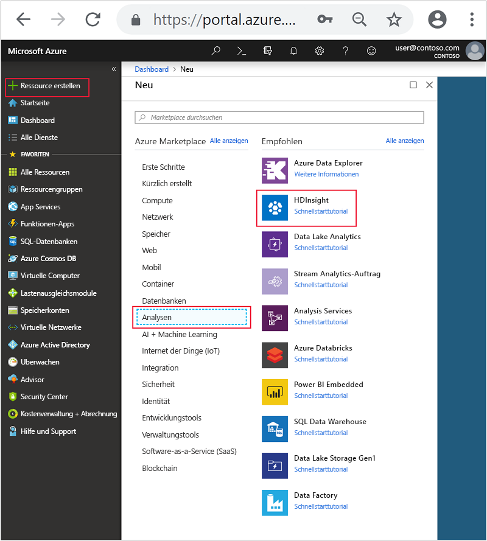
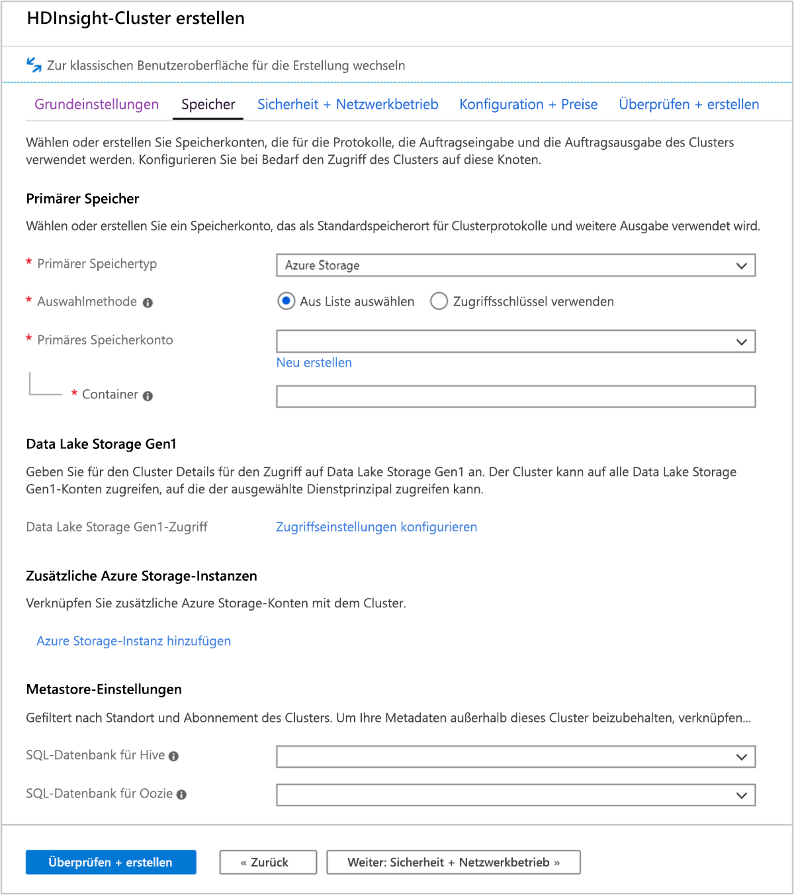
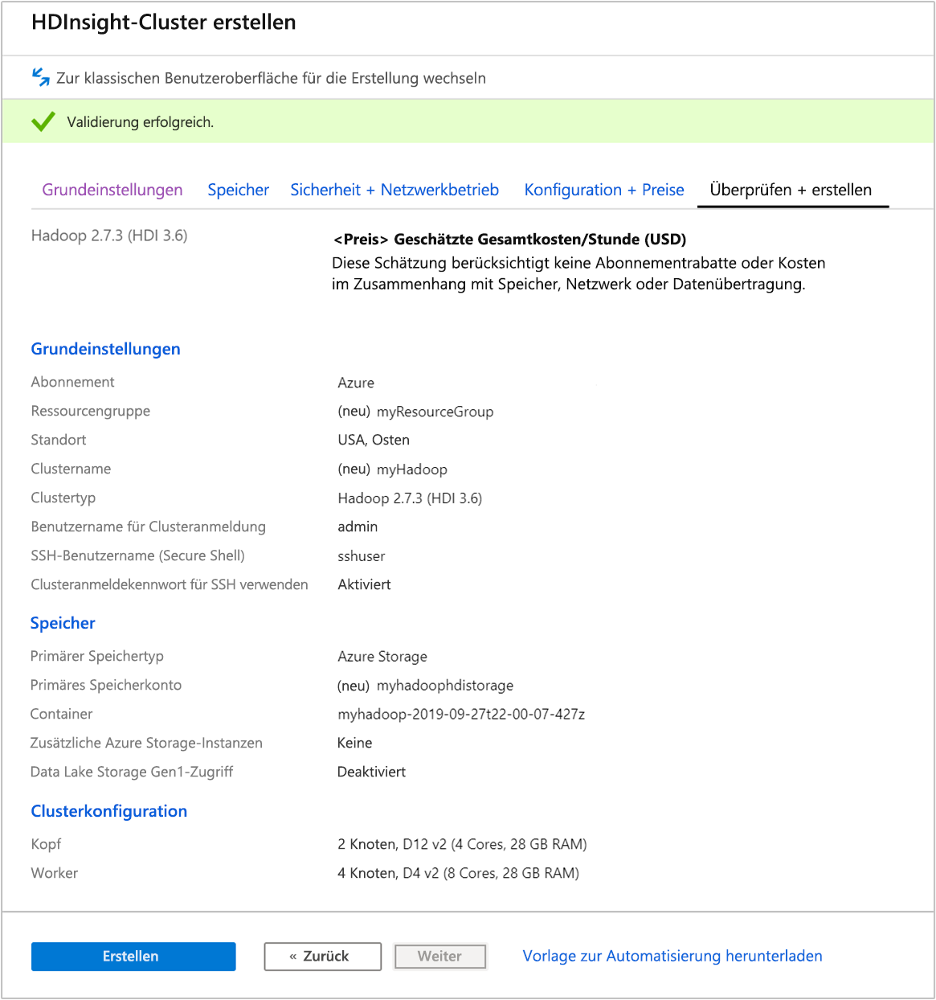
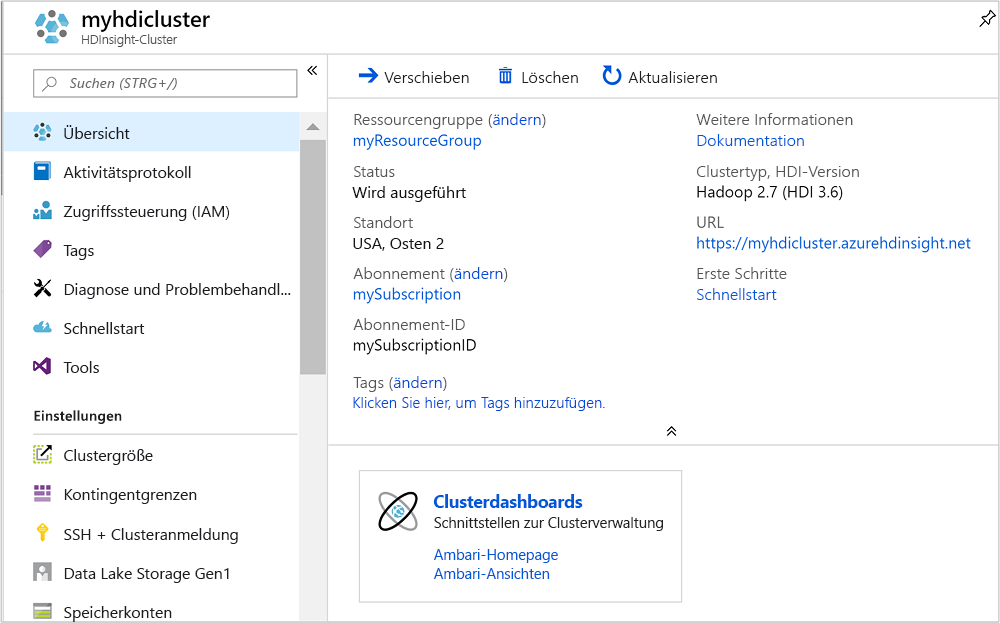
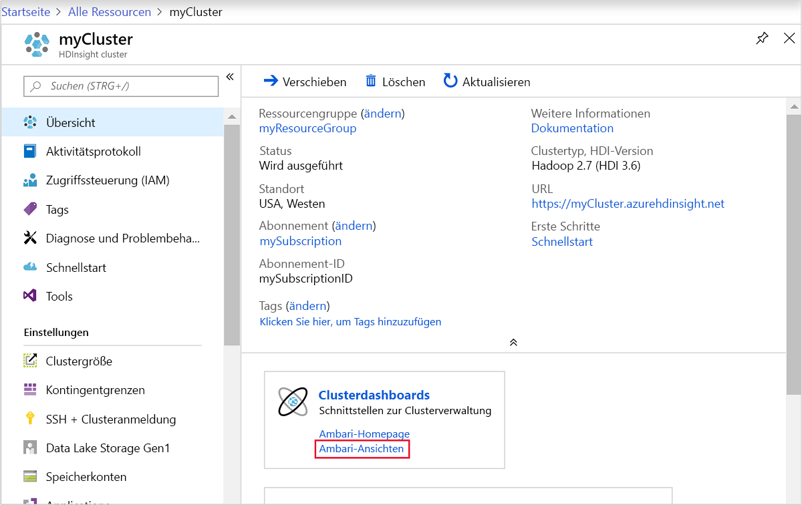
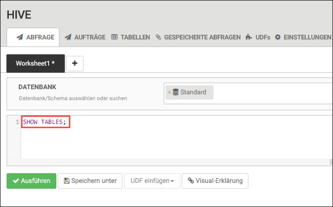
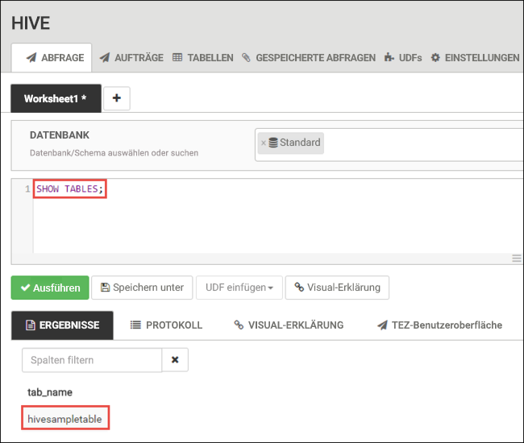
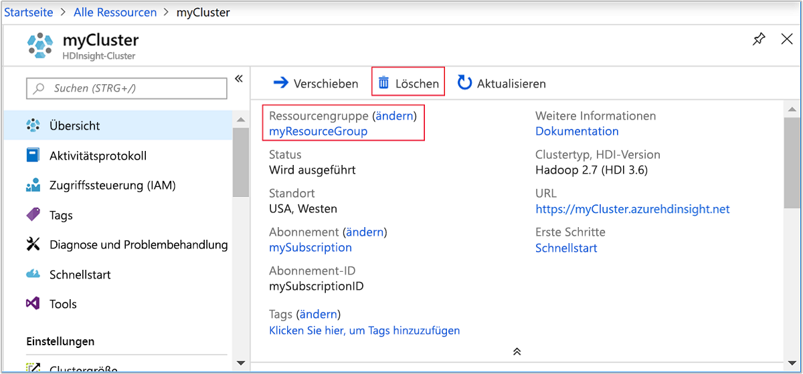

# <a name="quickstart-create-apache-hadoop-cluster-in-azure-hdinsight-using-azure-portal"></a>Schnellstart: Erstellen eines Apache Hadoop-Clusters in Azure HDInsight im Azure-Portal

In diesem Artikel erfahren Sie, wie Sie über das Azure-Portal [Apache Hadoop](https://hadoop.apache.org/)-Cluster in HDInsight erstellen und dann Apache Hive-Aufträge in HDInsight ausführen. Die meisten Hadoop-Aufträge sind Batchaufträge. Sie erstellen einen Cluster, führen einige Aufträge aus und löschen dann den Cluster. In diesem Artikel führen Sie alle drei Aufgaben durch.

In dieser Schnellstartanleitung verwenden Sie das Azure-Portal, um einen HDInsight-Hadoop-Cluster zu erstellen. Sie können einen Cluster auch mithilfe der [Azure Resource Manager-Vorlage](apache-hadoop-linux-tutorial-get-started.md) erstellen.

Zurzeit stehen in HDInsight [sieben verschiedene Clustertypen](../hdinsight-overview.md#cluster-types-in-hdinsight) zur Verfügung. Jeder Clustertyp unterstützt eine andere Gruppe von Komponenten. Alle Clustertypen unterstützen Hive. Eine Liste mit den unterstützten Komponenten in HDInsight finden Sie unter [Neuheiten in den von HDInsight bereitgestellten Apache Hadoop-Clusterversionen](../hdinsight-component-versioning.md).  

Wenn Sie kein Azure-Abonnement besitzen, können Sie ein [kostenloses Konto](https://azure.microsoft.com/free/) erstellen, bevor Sie beginnen.

## <a name="create-an-apache-hadoop-cluster"></a>Erstellen eines Apache Hadoop-Clusters

In diesem Abschnitt erstellen Sie im Azure-Portal einen Hadoop-Cluster in HDInsight.

1. Melden Sie sich beim [Azure-Portal](https://portal.azure.com) an.

1. Navigieren Sie im Azure-Portal zu **Ressource erstellen** > **Analytics** > **HDInsight**.

    

1. Geben Sie unter **Grundlagen** die folgenden Werte ein, bzw. wählen Sie sie aus:

    |Eigenschaft  |BESCHREIBUNG  |
    |---------|---------|
    |Subscription    |  Wählen Sie Ihr Azure-Abonnement. |
    |Resource group     | Erstellen Sie eine Ressourcengruppe, oder wählen Sie eine vorhandene Ressourcengruppe aus.  Bei einer Ressourcengruppe handelt es sich um einen Container mit Azure-Komponenten.  In diesem Fall enthält die Ressourcengruppe den HDInsight-Cluster und das abhängige Azure Storage-Konto. |
    |Clustername   | Geben Sie einen Namen für den Hadoop-Cluster ein. Da für alle Cluster in HDInsight gemeinsam derselbe DNS-Namespace genutzt wird, muss dieser Name eindeutig sein. Der Name kann aus bis zu 59 Zeichen mit Buchstaben, Zahlen und Bindestrichen bestehen. Das erste und das letzte Zeichen des Namens dürfen keine Bindestriche sein. |
    |Location    | Wählen Sie den Azure-Speicherort aus, wo Sie Ihren Cluster erstellen möchten.  Je näher der Standort, desto besser die Leistung. |
    |Clustertyp| Wählen Sie **Clustertyp auswählen** aus. Wählen Sie dann **Hadoop** als Clustertyp aus.|
    |Version|Die Standardversion für den Clustertyp wird angegeben. Wenn Sie eine andere Version angeben möchten, wählen Sie diese in der Dropdownliste aus.|
    |Anmeldebenutzernamen und Kennwort für den Cluster    | Der Standardanmeldename lautet **admin**. Das Kennwort muss mindestens zehn Zeichen lang sein und mindestens eine Ziffer, einen Groß- und einen Kleinbuchstaben sowie ein nicht alphanumerisches Zeichen enthalten (mit Ausnahme folgender Zeichen: ' " ` \)). Stellen Sie sicher, dass Sie **keine** häufig verwendeten Kennwörter wie „Pass@word1“ angeben.|
    |SSH-Benutzername (Secure Shell) | Der Standardbenutzername lautet **sshuser**.  Sie können einen anderen SSH-Benutzernamen angeben. |
    |Verwenden Sie ein Clusteranmeldekennwort für SSH| Aktivieren Sie dieses Kontrollkästchen, um das gleiche Kennwort für den SSH-Benutzer zu verwenden, das Sie für den Clusteranmeldebenutzer angegeben haben.|

    

    Wählen Sie unten auf der Seite die Schaltfläche **Next: Speicher >>** aus, um zu den Speichereinstellungen zu wechseln.

1. Geben Sie auf der Registerkarte **Speicher** die folgenden Werte ein:

    |Eigenschaft  |BESCHREIBUNG  |
    |---------|---------|
    |Primärer Speichertyp|Übernehmen Sie den Standardwert **Azure Storage**.|
    |Auswahlmethode|Übernehmen Sie den Standardwert **Aus Liste auswählen**.|
    |Primäres Speicherkonto|Wählen Sie in der Dropdownliste ein vorhandenes Speicherkonto aus, oder wählen Sie **Neu erstellen** aus. Wenn Sie ein neues Konto erstellen, muss der Name zwischen 3 und 24 Zeichen lang sein und darf nur Zahlen und Kleinbuchstaben enthalten.|
    |Container|Verwenden Sie den automatisch ausgefüllten Wert.|

    

    Wählen Sie die Registerkarte **Überprüfen + erstellen** aus.

1. Überprüfen Sie auf der Registerkarte **Überprüfen + erstellen** die Werte, die Sie in den vorhergehenden Schritten ausgewählt haben.

    

1. Klicken Sie auf **Erstellen**. Das Erstellen eines Clusters dauert ca. 20 Minuten.

Sobald der Cluster erstellt wurde, sehen Sie die Zusammenfassungsseite für den Cluster im Azure-Portal.



Jeder Cluster verfügt über eine Abhängigkeit von einem [Azure Storage-Konto](../hdinsight-hadoop-use-blob-storage.md) oder einem [Azure Data Lake-Konto](../hdinsight-hadoop-use-data-lake-store.md). Es wird als Standardspeicherkonto bezeichnet. Der HDInsight-Cluster und das dazugehörige Speicherkonto müssen sich in derselben Azure-Region befinden. Beim Löschen von Clustern wird das Speicherkonto nicht gelöscht.

> [!NOTE]  
> Andere Methoden zur Erstellung von Clustern und Informationen zu den in diesem Schnellstart verwendeten Eigenschaften finden Sie unter [Erstellen von HDInsight-Clustern](../hdinsight-hadoop-provision-linux-clusters.md).

## <a name="run-apache-hive-queries"></a>Ausführen von Apache Hive-Abfragen

[Apache Hive](hdinsight-use-hive.md) ist die am häufigsten in HDInsight verwendete Komponente. Es gibt viele Verfahren zum Ausführen von Hive-Aufträgen in HDInsight. In diesem Schnellstart verwenden Sie die Ambari Hive-Ansicht aus dem Portal. Andere Methoden zum Übermitteln von Hive-Aufträgen finden Sie unter [Verwenden von Hive in HDInsight](hdinsight-use-hive.md).

1. Um Ambari zu öffnen, wählen Sie im vorherigen Screenshot **Clusterdashboard** aus.  Sie können auch zu `https://ClusterName.azurehdinsight.net` browsen, wobei `ClusterName` der Cluster ist, den Sie im vorherigen Abschnitt erstellt haben.

    

2. Geben Sie den Hadoop-Benutzernamen, den Sie beim Erstellen des Clusters angegeben haben, und das dazugehörige Kennwort ein. Der Standard-Benutzername lautet **admin**.

3. Öffnen Sie die **Hive-Ansicht** wie im folgenden Screenshot dargestellt:

    

4. Fügen Sie auf der Registerkarte **ABFRAGE** die folgenden HiveQL-Anweisungen in das Arbeitsblatt ein:

    ```sql
    SHOW TABLES;
    ```

    

5. Wählen Sie **Execute**(Ausführen). Die Registerkarte **ERGEBNISSE** wird unterhalb der Registerkarte **ABFRAGE** angezeigt und enthält Informationen zum Auftrag. 

    Nach Abschluss der Abfrage werden auf der Registerkarte **ABFRAGE** die Ergebnisse des Vorgangs angezeigt. Sie sehen eine Tabelle mit dem Namen **hivesampletable**. Die ist eine Hive-Beispieltabelle mit allen HDInsight-Clustern.

    

6. Wiederholen Sie die Schritte 4 und 5, um die folgende Abfrage ausführen:

    ```sql
    SELECT * FROM hivesampletable;
    ```

7. Sie können die Ergebnisse der Abfrage auch speichern. Wählen Sie die Menüschaltfläche rechts aus, und geben Sie an, ob Sie die Ergebnisse als CSV-Datei herunterladen oder in dem Speicherkonto speichern möchten, das dem Cluster zugeordnet ist.

    

Nachdem Sie einen Hive-Auftrag abgeschlossen haben, können Sie die [Ergebnisse in eine Azure SQL-Datenbank oder eine SQL Server-Datenbank](apache-hadoop-use-sqoop-mac-linux.md) exportieren und die [Abfrageergebnisse mithilfe von Excel visualisieren](apache-hadoop-connect-excel-power-query.md). Weitere Informationen zum Verwenden von Hive in HDInsight finden Sie unter [Verwenden von Apache Hive und HiveQL mit Apache Hadoop in HDInsight zum Analysieren einer Apache Log4j-Beispieldatei](hdinsight-use-hive.md).

## <a name="clean-up-resources"></a>Bereinigen von Ressourcen

Nachdem Sie den Schnellstart abgeschlossen haben, können Sie den Cluster löschen. Mit HDInsight werden Ihre Daten im Azure-Speicher gespeichert, sodass Sie einen Cluster problemlos löschen können, wenn er nicht verwendet wird. Für einen HDInsight-Cluster fallen auch dann Gebühren an, wenn er nicht verwendet wird. Da die Gebühren für den Cluster erheblich höher sind als die Kosten für den Speicher, ist es sinnvoll, nicht verwendete Cluster zu löschen.

> [!NOTE]  
> Wenn Sie *sofort* mit dem nächsten Artikel fortfahren, um zu erfahren, wie Sie ETL-Vorgänge mithilfe von Hadoop in HDInsight ausführen, können Sie den Cluster weiterhin ausführen. Ansonsten müssen Sie in diesem Tutorial erneut einen Hadoop-Cluster erstellen. Wenn Sie jedoch nicht direkt mit dem nächsten Artikel fortfahren, sollten Sie den Cluster jetzt löschen.

### <a name="to-delete-the-cluster-andor-the-default-storage-account"></a>So löschen Sie den Cluster bzw. das Standardspeicherkonto

1. Wechseln Sie zurück zur Browserregisterkarte für das Azure-Portal. Die Seite mit der Clusterübersicht sollte angezeigt werden. Klicken Sie auf **Löschen**, wenn Sie nur den Cluster löschen, aber das Standardspeicherkonto behalten möchten.

    

2. Wenn Sie sowohl den Cluster als auch das Standardspeicherkonto löschen möchten, wählen Sie den Ressourcengruppennamen (im vorherigen Screenshot markiert) aus, um die Seite für die Ressourcengruppe zu öffnen.

3. Klicken Sie auf **Ressourcengruppe löschen**, um die Ressourcengruppe zu löschen, die den Cluster und das Standardspeicherkonto enthält. Beachten Sie, dass das Speicherkonto beim Löschen der Ressourcengruppe ebenfalls gelöscht wird. Wenn Sie das Speicherkonto beibehalten möchten, müssen Sie auswählen, dass nur der Cluster gelöscht werden soll.

## <a name="next-steps"></a>Nächste Schritte

In diesem Schnellstart haben Sie erfahren, wie Sie mithilfe einer Resource Manager-Vorlage einen Linux-basierten HDInsight-Cluster erstellen und einfache Hive-Abfragen ausführen. Im nächsten Artikel erfahren Sie, wie Sie mithilfe von Hadoop in HDInsight einen ETL-Vorgang zum Extrahieren, Transformieren und Laden von Daten ausführen.

> [!div class="nextstepaction"]
> [Extrahieren, Transformieren und Laden von Daten mithilfe von Interactive Query in HDInsight](../interactive-query/interactive-query-tutorial-analyze-flight-data.md)
