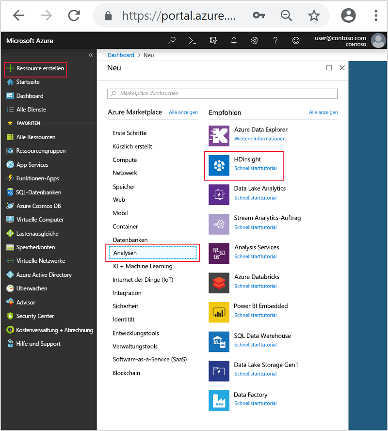
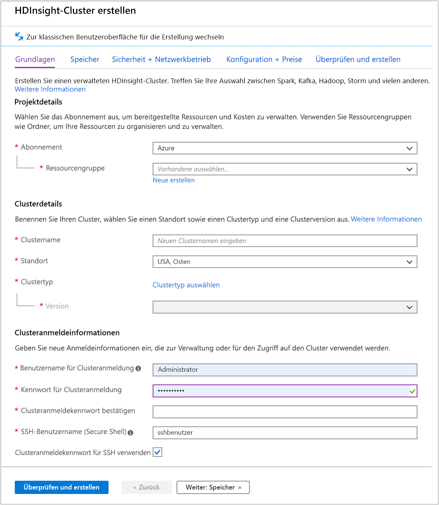
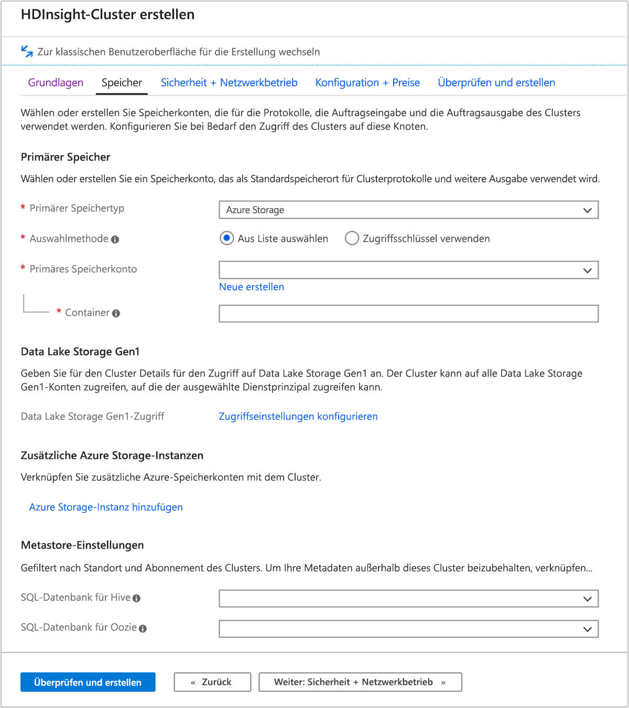
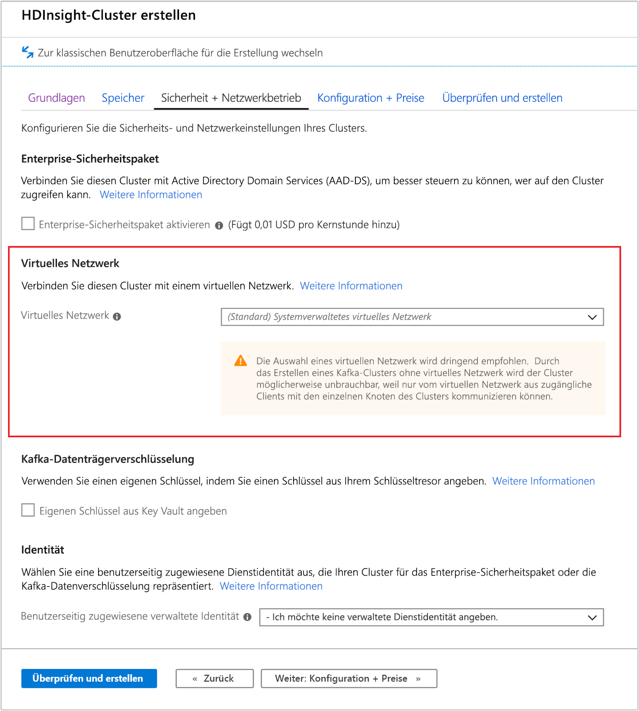
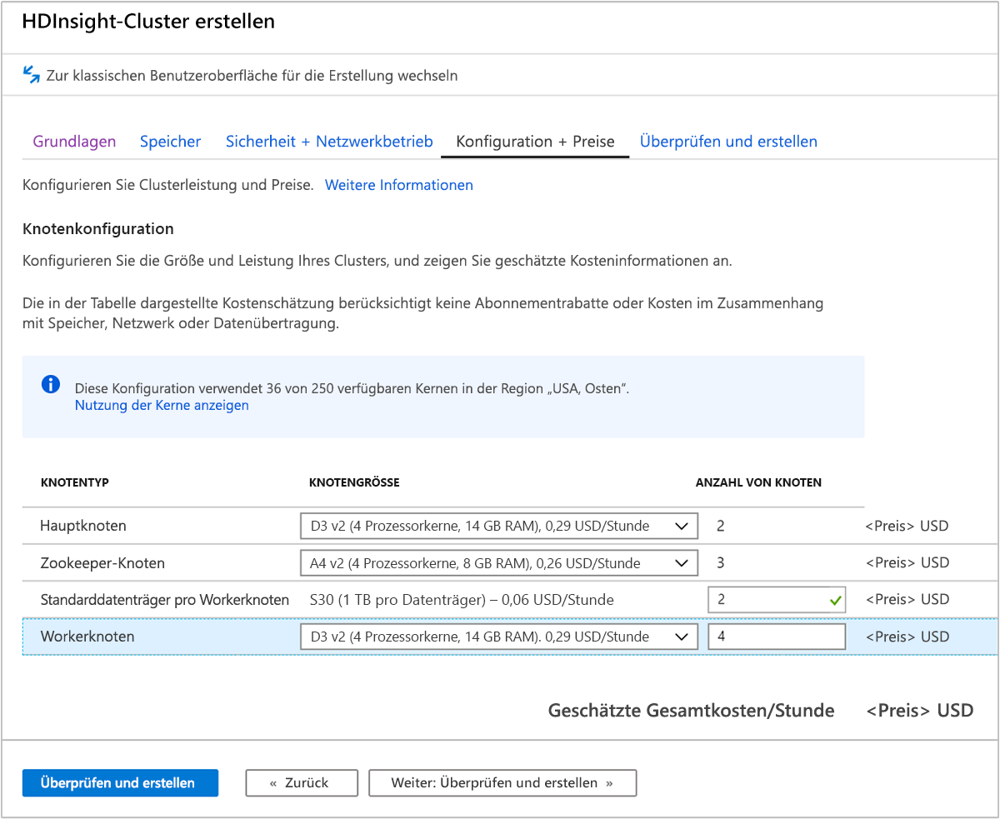
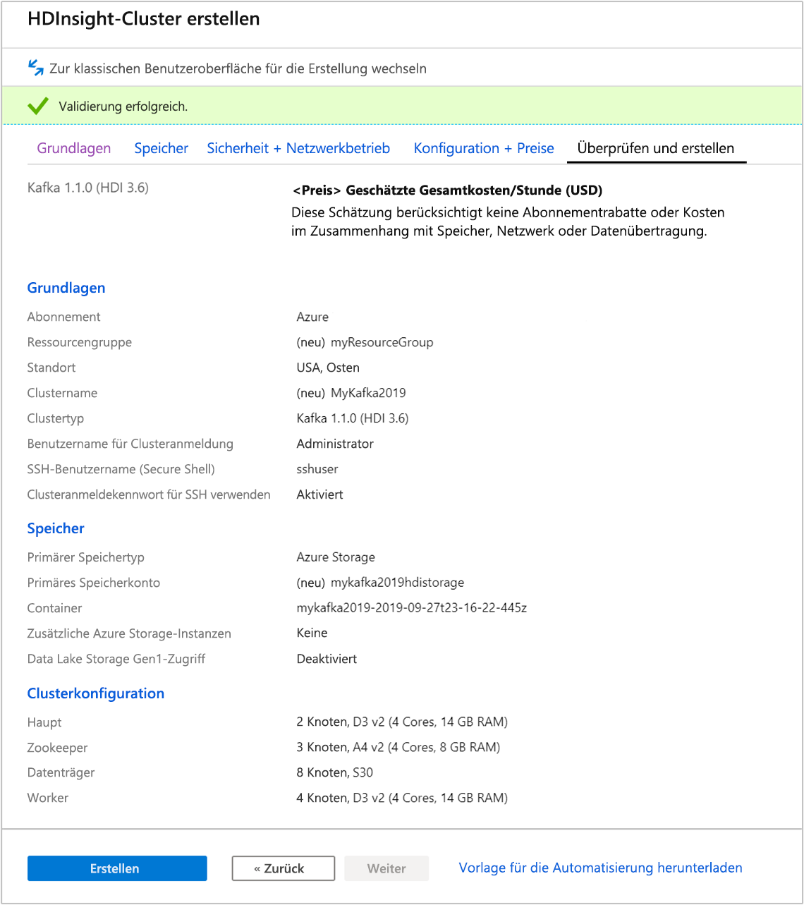

# <a name="quickstart-create-apache-kafka-cluster-in-azure-hdinsight-using-azure-portal"></a>Schnellstart: Erstellen eines Apache Kafka-Clusters in Azure HDInsight im Azure-Portal

Apache Kafka ist eine verteilte Open Source-Streamingplattform. Sie wird häufig als Nachrichtenbroker eingesetzt, da sie eine ähnliche Funktionalität wie eine Veröffentlichen-Abonnieren-Nachrichtenwarteschlange aufweist.

In dieser Schnellstartanleitung lernen Sie, wie Sie mithilfe des Azure-Portals einen [Apache Kafka](https://kafka.apache.org)-Cluster erstellen. Außerdem erfahren Sie, wie Sie mithilfe von enthaltenen Hilfsprogrammen Nachrichten mit Apache Kafka senden und empfangen.

[!INCLUDE [delete-cluster-warning](../../../includes/hdinsight-delete-cluster-warning.md)]

Auf die Apache Kafka-API kann nur von Ressourcen im gleichen virtuellen Netzwerk zugegriffen werden. In dieser Schnellstartanleitung greifen Sie über SSH direkt auf den Cluster zu. Wenn Sie eine Verbindung zwischen anderen Diensten, Netzwerken und virtuellen Computern und Apache Kafka herstellen möchten, müssen Sie zunächst ein virtuelles Netzwerk und anschließend die Ressourcen in diesem Netzwerk erstellen. Weitere Informationen finden Sie im Dokument [Herstellen einer Verbindung mit Apache Kafka in HDInsight über ein virtuelles Azure-Netzwerk](apache-kafka-connect-vpn-gateway.md).

Wenn Sie kein Azure-Abonnement besitzen, können Sie ein [kostenloses Konto](https://azure.microsoft.com/free/?WT.mc_id=A261C142F) erstellen, bevor Sie beginnen.

## <a name="prerequisites"></a>Voraussetzungen

Einen SSH-Client. Weitere Informationen finden Sie unter [Herstellen einer Verbindung mit HDInsight (Hadoop) per SSH](../hdinsight-hadoop-linux-use-ssh-unix.md).

## <a name="create-an-apache-kafka-cluster"></a>Erstellen eines Apache Kafka-Clusters

Gehen Sie wie folgt vor, um einen Apache Kafka-Cluster in HDInsight zu erstellen:

1. Melden Sie sich beim [Azure-Portal](https://portal.azure.com) an.

1. Navigieren Sie im Menü auf der linken Seite zu **+ Ressource erstellen** > **Analytics** > **HDInsight**.

    

1. Geben Sie unter **Grundlagen** die folgenden Werte ein, bzw. wählen Sie sie aus:

    |Eigenschaft  |BESCHREIBUNG  |
    |---------|---------|
    |Subscription    |  Wählen Sie Ihr Azure-Abonnement. |
    |Resource group     | Erstellen Sie eine Ressourcengruppe, oder wählen Sie eine vorhandene Ressourcengruppe aus.  Bei einer Ressourcengruppe handelt es sich um einen Container mit Azure-Komponenten.  In diesem Fall enthält die Ressourcengruppe den HDInsight-Cluster und das abhängige Azure Storage-Konto. |
    |Clustername   | Geben Sie einen Namen für den Hadoop-Cluster ein. Da für alle Cluster in HDInsight gemeinsam derselbe DNS-Namespace genutzt wird, muss dieser Name eindeutig sein. Der Name kann aus bis zu 59 Zeichen mit Buchstaben, Zahlen und Bindestrichen bestehen. Das erste und das letzte Zeichen des Namens dürfen keine Bindestriche sein. |
    |Location    | Wählen Sie den Azure-Speicherort aus, wo Sie Ihren Cluster erstellen möchten.  Je näher der Standort, desto besser die Leistung. |
    |Clustertyp| Wählen Sie **Clustertyp auswählen** aus. Wählen Sie dann **Kafka** als Clustertyp aus.|
    |Version|Die Standardversion für den Clustertyp wird angegeben. Wenn Sie eine andere Version angeben möchten, wählen Sie diese in der Dropdownliste aus.|
    |Anmeldebenutzernamen und Kennwort für den Cluster    | Der Standardanmeldename lautet **admin**. Das Kennwort muss mindestens zehn Zeichen lang sein und mindestens eine Ziffer, einen Groß- und einen Kleinbuchstaben sowie ein nicht alphanumerisches Zeichen enthalten (mit Ausnahme folgender Zeichen: ' " ` \)). Stellen Sie sicher, dass Sie **keine** häufig verwendeten Kennwörter wie „Pass@word1“ angeben.|
    |SSH-Benutzername (Secure Shell) | Der Standardbenutzername lautet **sshuser**.  Sie können einen anderen SSH-Benutzernamen angeben. |
    |Verwenden Sie ein Clusteranmeldekennwort für SSH| Aktivieren Sie dieses Kontrollkästchen, um das gleiche Kennwort für den SSH-Benutzer zu verwenden, das Sie für den Clusteranmeldebenutzer angegeben haben.|

   

    Jede Azure-Region (Standort) verfügt über _Fehlerdomänen_. Eine Fehlerdomäne ist eine logische Gruppierung von zugrundeliegender Hardware in einem Azure-Rechenzentrum. Jede Fehlerdomäne verwendet eine Stromquelle und einen Netzwerkswitch gemeinsam. Die virtuellen Computer und verwalteten Datenträger, die die Knoten innerhalb eines HDInsight-Clusters implementieren, werden auf diese Fehlerdomänen verteilt. Diese Architektur schränkt die potenziellen Auswirkungen physischer Hardwarefehler ein.

    Für Hochverfügbarkeit von Daten wählen Sie eine Region (Speicherort) mit __drei Fehlerdomänen__. Informationen zur Anzahl von Fehlerdomänen in einer Region finden Sie im Dokument [Verwalten der Verfügbarkeit virtueller Linux-Computer](../../virtual-machines/windows/manage-availability.md#use-managed-disks-for-vms-in-an-availability-set).

    Wählen Sie unten auf der Seite die Schaltfläche **Next: Speicher >>** aus, um zu den Speichereinstellungen zu wechseln.

1. Geben Sie auf der Registerkarte **Speicher** die folgenden Werte ein:

    |Eigenschaft  |BESCHREIBUNG  |
    |---------|---------|
    |Primärer Speichertyp|Übernehmen Sie den Standardwert **Azure Storage**.|
    |Auswahlmethode|Übernehmen Sie den Standardwert **Aus Liste auswählen**.|
    |Primäres Speicherkonto|Wählen Sie in der Dropdownliste ein vorhandenes Speicherkonto aus, oder wählen Sie **Neu erstellen** aus. Wenn Sie ein neues Konto erstellen, muss der Name zwischen 3 und 24 Zeichen lang sein und darf nur Zahlen und Kleinbuchstaben enthalten.|
    |Container|Verwenden Sie den automatisch ausgefüllten Wert.|

    

    Wählen Sie die Registerkarte **Sicherheit + Netzwerkbetrieb** aus.

1. Übernehmen Sie im Rahmen dieser Schnellstartanleitung die Standardeinstellung. Weitere Informationen zum Enterprise-Sicherheitspaket finden Sie unter [Konfigurieren eines HDInsight-Clusters mit Enterprise-Sicherheitspaket (Enterprise Security Package, ESP) mithilfe von Azure Active Directory Domain Services](../domain-joined/apache-domain-joined-configure-using-azure-adds.md). Unter [Bring Your Own Key für Apache Kafka in Azure HDInsight (Vorschauversion)](apache-kafka-byok.md) erfahren Sie, wie Sie Ihren eigenen Schlüssel für die Apache Kafka-Datenträgerverschlüsselung verwenden.

   Wenn Sie Ihren Cluster mit einem virtuellen Netzwerk verbinden möchten, wählen Sie ein virtuelles Netzwerk aus der Dropdownliste **Virtuelles Netzwerk** aus.

   

    Wählen Sie die Registerkarte **Konfiguration + Preise** aus.

1. Um die Verfügbarkeit von Apache Kafka in HDInsight zu gewährleisten, muss der Eintrag __Knotenanzahl__ für **Workerknoten** mindestens auf 3 festgelegt werden. Der Standardwert ist 4.

    Der Eintrag für **Standard-Datenträger pro Workerknoten** konfiguriert die Skalierbarkeit von Apache Kafka in HDInsight. Apache Kafka in HDInsight verwendet den lokalen Datenträger der virtuellen Computer im Cluster, um Daten zu speichern. Da Apache Kafka sehr E/A-intensiv ist, wird [Azure Managed Disks](../../virtual-machines/windows/managed-disks-overview.md) verwendet, um einen hohen Durchsatz zu ermöglichen und mehr Speicher pro Knoten bereitzustellen. Der Typ des verwalteten Datenträgers kann entweder __Standard__ (HDD) oder __Premium__ (SSD) sein. Die Art des Datenträgers hängt von der VM-Größe ab, die von den Workerknoten (Apache Kafka-Broker) verwendet wird. Premium-Datenträger werden automatisch mit virtuellen Computern der DS- und GS-Serie verwendet. Alle anderen virtuellen Computertypen verwenden den Standardtyp.

   

    Wählen Sie die Registerkarte **Überprüfen + erstellen** aus.

1. Überprüfen Sie die Konfiguration für den Cluster. Ändern Sie ggf. falsche Einstellungen. Wählen Sie zum Schluss **Erstellen** aus, um den Cluster zu erstellen.

    

    Das Erstellen des Clusters kann bis zu 20 Minuten dauern.

## <a name="connect-to-the-cluster"></a>Verbinden mit dem Cluster

1. Verwenden Sie zum Herstellen einer Verbindung mit dem primären Hauptknoten des Apache Kafka-Clusters den folgenden Befehl. Ersetzen Sie `sshuser` durch den SSH-Benutzernamen. Ersetzen Sie `mykafka` durch den Namen Ihres Apache Kafka-Clusters.

    ```bash
    ssh sshuser@mykafka-ssh.azurehdinsight.net
    ```

2. Wenn Sie zum ersten Mal eine Verbindung mit dem Cluster herstellen, zeigt der SSH-Client unter Umständen eine Warnung mit dem Hinweis an, dass die Echtheit des Hosts nicht bestätigt werden kann. Geben Sie in diesem Fall __Ja__ ein, und drücken Sie dann die __EINGABETASTE__, um den Host der Liste mit den vertrauenswürdigen Servern des SSH-Clients hinzuzufügen.

3. Geben Sie nach Aufforderung das Kennwort für den SSH-Benutzer ein.

    Nach der Verbindungsherstellung sehen die angezeigten Informationen in etwa wie folgt aus:

    ```output
    Authorized uses only. All activity may be monitored and reported.
    Welcome to Ubuntu 16.04.4 LTS (GNU/Linux 4.13.0-1011-azure x86_64)

     * Documentation:  https://help.ubuntu.com
     * Management:     https://landscape.canonical.com
     * Support:        https://ubuntu.com/advantage

      Get cloud support with Ubuntu Advantage Cloud Guest:
        https://www.ubuntu.com/business/services/cloud

    83 packages can be updated.
    37 updates are security updates.


    Welcome to Apache Kafka on HDInsight.

    Last login: Thu Mar 29 13:25:27 2018 from 108.252.109.241
    ```

## <a id="getkafkainfo"></a>Beschaffen der Apache Zookeeper- und Broker-Hostinformationen

Bei der Verwendung von Kafka müssen Ihnen die *Apache Zookeeper*- und die *Broker*-Hosts bekannt sein. Diese Hosts werden zusammen mit der Apache Kafka-API und vielen Hilfsprogrammen verwendet, die in Kafka enthalten sind.

In diesem Abschnitt rufen Sie die Hostinformationen aus der Apache Ambari-REST-API im Cluster ab.

1. Installieren Sie den JSON-Befehlszeilenprozessor [jq](https://stedolan.github.io/jq/). Dieses Hilfsprogramm wird verwendet, um JSON-Dokumente zu analysieren, und es ist beim Analysieren der Hostinformationen hilfreich. Geben Sie über die geöffnete SSH-Verbindung den folgenden Befehl ein, um `jq` zu installieren:

    ```bash
    sudo apt -y install jq
    ```

1. Richten Sie eine Kennwortvariable ein. Ersetzen Sie `PASSWORD` durch das Kennwort für die Clusteranmeldung, und geben Sie dann den folgenden Befehl ein:

    ```bash
    export password='PASSWORD'
    ```

1. Extrahieren Sie den Clusternamen mit korrekter Groß-/Kleinschreibung. Die tatsächliche Schreibweise des Clusternamens kann je nach Clustererstellung anders sein als erwartet. Mit diesem Befehl wird die tatsächliche Schreibweise abgerufen und in einer Variable gespeichert. Geben Sie den folgenden Befehl ein:

    ```bash
    export clusterName=$(curl -u admin:$password -sS -G "http://headnodehost:8080/api/v1/clusters" | jq -r '.items[].Clusters.cluster_name')
    ```
    > [!Note]  
    > Falls Sie diesen Vorgang außerhalb des Clusters ausführen, gilt für das Speichern des Clusternamens eine andere Vorgehensweise. Rufen Sie den Clusternamen in Kleinbuchstaben aus dem Azure-Portal ab. Ersetzen Sie dann im folgenden Befehl den Clusternamen durch `<clustername>`, und führen Sie den Befehl aus: `export clusterName='<clustername>'`.


1. Verwenden Sie den folgenden Befehl, um eine Umgebungsvariable mit Zookeeper-Hostinformationen festzulegen. Dieser Befehl ruft alle Zookeeper-Hosts ab und gibt dann nur die ersten beiden Einträge zurück. Diese Redundanz ist hilfreich, wenn ein Host nicht erreichbar ist.

    ```bash
    export KAFKAZKHOSTS=$(curl -sS -u admin:$password -G https://$clusterName.azurehdinsight.net/api/v1/clusters/$clusterName/services/ZOOKEEPER/components/ZOOKEEPER_SERVER | jq -r '["\(.host_components[].HostRoles.host_name):2181"] | join(",")' | cut -d',' -f1,2);
    ```

    > [!Note]  
    > Für diesen Befehl ist Zugriff auf Ambari erforderlich. Wird Ihr Cluster durch eine NSG geschützt, führen Sie diesen Befehl auf einem Computer aus, über den auf Ambari zugegriffen werden kann. 

1. Vergewissern Sie sich mithilfe des folgenden Befehls, dass die Umgebungsvariable korrekt festgelegt ist:

    ```bash
    echo $KAFKAZKHOSTS
    ```

    Die Ausgabe dieses Befehls sieht in etwa wie folgt aus:

    `zk0-kafka.eahjefxxp1netdbyklgqj5y1ud.ex.internal.cloudapp.net:2181,zk2-kafka.eahjefxxp1netdbyklgqj5y1ud.ex.internal.cloudapp.net:2181`

1. Verwenden Sie den folgenden Befehl, um eine Umgebungsvariable mit Apache Kafka-Brokerhostinformationen festzulegen:

    ```bash
    export KAFKABROKERS=$(curl -sS -u admin:$password -G https://$clusterName.azurehdinsight.net/api/v1/clusters/$clusterName/services/KAFKA/components/KAFKA_BROKER | jq -r '["\(.host_components[].HostRoles.host_name):9092"] | join(",")' | cut -d',' -f1,2);
    ```

    > [!Note]  
    > Für diesen Befehl ist Zugriff auf Ambari erforderlich. Wird Ihr Cluster durch eine NSG geschützt, führen Sie diesen Befehl auf einem Computer aus, über den auf Ambari zugegriffen werden kann. 

1. Vergewissern Sie sich mithilfe des folgenden Befehls, dass die Umgebungsvariable korrekt festgelegt ist:

    ```bash
    echo $KAFKABROKERS
    ```

    Die Ausgabe dieses Befehls sieht in etwa wie folgt aus:

    `wn1-kafka.eahjefxxp1netdbyklgqj5y1ud.cx.internal.cloudapp.net:9092,wn0-kafka.eahjefxxp1netdbyklgqj5y1ud.cx.internal.cloudapp.net:9092`

## <a name="manage-apache-kafka-topics"></a>Verwalten von Apache Kafka-Themen

Kafka speichert Datenströme in *Themen*. Mit dem Hilfsprogramm `kafka-topics.sh` können Sie Themen verwalten.

* Führen Sie folgenden Befehl in der SSH-Verbindung aus, **um ein Thema zu erstellen**:

    ```bash
    /usr/hdp/current/kafka-broker/bin/kafka-topics.sh --create --replication-factor 3 --partitions 8 --topic test --zookeeper $KAFKAZKHOSTS
    ```

    Mit diesem Befehl wird unter Verwendung der in `$KAFKAZKHOSTS` gespeicherten Informationen eine Verbindung mit Zookeeper hergestellt. Anschließend wird ein Apache Kafka-Thema mit dem Namen **test** erstellt.

    * In diesem Thema gespeicherte Daten werden auf acht Partitionen aufgeteilt.

    * Jede Partition wird auf drei Workerknoten im Cluster repliziert.

        Wenn Sie den Cluster in einer Azure-Region mit drei Fehlerdomänen erstellt haben, verwenden Sie den Replikationsfaktor 3. Verwenden Sie andernfalls den Replikationsfaktor 4.
        
        In Regionen mit drei Fehlerdomänen ermöglicht der Replikationsfaktor 3 die Verteilung von Replikaten auf die Fehlerdomänen. In Regionen mit zwei Fehlerdomänen ermöglicht der Replikationsfaktor 4 die gleichmäßige Verteilung von Replikaten auf die Domänen.
        
        Informationen zur Anzahl von Fehlerdomänen in einer Region finden Sie im Dokument [Verwalten der Verfügbarkeit virtueller Linux-Computer](../../virtual-machines/windows/manage-availability.md#use-managed-disks-for-vms-in-an-availability-set).

        Azure-Fehlerdomänen sind Apache Kafka nicht bekannt. Beim Erstellen von Partitionsreplikaten für Themen kann es daher vorkommen, dass die Replikate nicht ordnungsgemäß für Hochverfügbarkeit verteilt werden.

        Verwenden Sie das [Tool zum Ausgleichen von Apache Kafka-Partitionen](https://github.com/hdinsight/hdinsight-kafka-tools), um Hochverfügbarkeit zu gewährleisten. Dieses Tool muss über eine SSH-Verbindung mit dem Hauptknoten des Apache Kafka-Clusters ausgeführt werden.

        Um eine möglichst hohe Verfügbarkeit Ihrer Apache Kafka-Daten zu erreichen, sollten Sie in folgenden Fällen die Partitionsreplikate für Ihr Thema ausgleichen:

        * Wenn ein neues Thema oder eine neue Partition erstellt wird

        * Wenn Sie einen Cluster zentral hochskalieren

* Verwenden Sie den folgenden Befehl, **um Themen aufzulisten**:

    ```bash
    /usr/hdp/current/kafka-broker/bin/kafka-topics.sh --list --zookeeper $KAFKAZKHOSTS
    ```

    Dieser Befehl listet die für den Apache Kafka-Cluster verfügbaren Themen auf.

* Verwenden Sie zum **Löschen eines Themas** den folgenden Befehl:

    ```bash
    /usr/hdp/current/kafka-broker/bin/kafka-topics.sh --delete --topic topicname --zookeeper $KAFKAZKHOSTS
    ```

    Dieser Befehl löscht das Thema `topicname`.

    > [!WARNING]  
    > Wenn Sie das zuvor erstellte Thema `test` löschen, müssen Sie es neu erstellen. Es wird weiter unten in diesem Dokument verwendet.

Wenn Sie weitere Informationen zu den mit dem Hilfsprogramm `kafka-topics.sh` verfügbaren Befehlen anzeigen möchten, verwenden Sie den folgenden Befehl:

```bash
/usr/hdp/current/kafka-broker/bin/kafka-topics.sh
```

## <a name="produce-and-consume-records"></a>Erstellen und Nutzen von Datensätzen

Bei Kafka werden *Datensätze* in Themen gespeichert. Datensätze werden von *Producern* erstellt und von *Consumern* genutzt. Producer und Consumer kommunizieren mit dem *Kafka-Brokerdienst*. Jeder Workerknoten in Ihrem HDInsight-Cluster ist ein Apache Kafka-Brokerhost.

Gehen Sie wie folgt vor, um Datensätze im zuvor erstellten Testthema zu speichern und sie anschließend mithilfe eines Consumers zu lesen:

1. Verwenden Sie zum Schreiben von Datensätzen in das Thema das Hilfsprogramm `kafka-console-producer.sh` über die SSH-Verbindung:

    ```bash
    /usr/hdp/current/kafka-broker/bin/kafka-console-producer.sh --broker-list $KAFKABROKERS --topic test
    ```

    Nach diesem Befehl erreichen Sie eine leere Zeile.

2. Geben Sie eine Textnachricht in die leere Zeile ein, und drücken Sie die EINGABETASTE. Geben Sie auf diese Weise mehrere Nachrichten ein, und drücken Sie anschließend **STRG+C**, um zur normalen Eingabeaufforderung zurückzukehren. Die einzelnen Zeilen werden jeweils als separater Datensatz an das Apache Kafka-Thema gesendet.

3. Verwenden Sie zum Lesen von Datensätzen aus dem Thema das Hilfsprogramm `kafka-console-consumer.sh` über die SSH-Verbindung:

    ```bash
    /usr/hdp/current/kafka-broker/bin/kafka-console-consumer.sh --bootstrap-server $KAFKABROKERS --topic test --from-beginning
    ```

    Die Datensätze werden mit dem Befehl aus dem Thema abgerufen und angezeigt. Mit `--from-beginning` wird der Consumer angewiesen, am Anfang des Datenstroms zu beginnen, damit alle Datensätze abgerufen werden.

    Falls Sie eine ältere Version von Kafka verwenden, ersetzen Sie `--bootstrap-server $KAFKABROKERS` durch `--zookeeper $KAFKAZKHOSTS`.

4. Drücken Sie __STRG+C__, um den Consumer zu beenden.

Sie können Producer und Consumer auch programmgesteuert erstellen. Ein Beispiel für die Verwendung dieser API finden Sie im Dokument [Tutorial: Verwenden der Apache Kafka Producer- und Consumer-APIs](apache-kafka-producer-consumer-api.md).

## <a name="clean-up-resources"></a>Bereinigen von Ressourcen

Um die Ressourcen zu bereinigen, die im Rahmen dieser Schnellstartanleitung erstellt wurden, können Sie die Ressourcengruppe löschen. Dadurch werden auch der zugeordnete HDInsight-Cluster sowie alle anderen Ressourcen gelöscht, die der Ressourcengruppe zugeordnet sind.

So entfernen Sie die Ressourcengruppe über das Azure-Portal:

1. Erweitern Sie im Azure-Portal das Menü auf der linken Seite, um das Menü mit den Diensten zu öffnen, und klicken Sie auf __Ressourcengruppen__, um die Liste mit Ihren Ressourcengruppen anzuzeigen.
2. Suchen Sie die zu löschende Ressourcengruppe, und klicken Sie mit der rechten Maustaste rechts neben dem Eintrag auf die Schaltfläche __Mehr__ (...).
3. Klicken Sie auf __Ressourcengruppe löschen__, und bestätigen Sie den Vorgang.

> [!WARNING]  
> Die Abrechnung für einen HDInsight-Cluster beginnt, sobald der Cluster erstellt wurde, und endet mit dem Löschen des Clusters. Die Gebühren werden anteilig nach Minuten erhoben. Daher sollten Sie Ihren Cluster immer löschen, wenn Sie ihn nicht mehr verwenden.
>
> Wenn Sie einen Apache Kafka-Cluster in HDInsight löschen, werden auch alle in Kafka gespeicherten Daten gelöscht.

## <a name="next-steps"></a>Nächste Schritte

> [!div class="nextstepaction"]
> [Verwenden von Apache Spark mit Apache Kafka](../hdinsight-apache-kafka-spark-structured-streaming.md)
