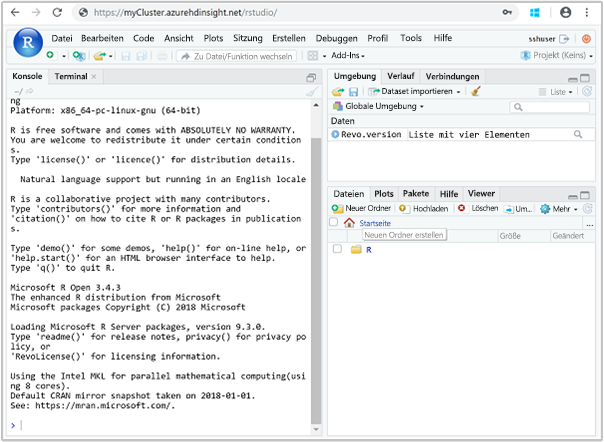

# <a name="quickstart-execute-an-r-script-on-an-ml-services-cluster-in-azure-hdinsight-using-rstudio-server"></a>Schnellstart: Ausführen eines R-Skripts in einem ML Services-Cluster in Azure HDInsight mithilfe von RStudio Server

Mithilfe von ML Services in Azure HDInsight können R-Skripts Apache Spark und Apache Hadoop MapReduce verwenden, um verteilte Berechnungen auszuführen. ML Services bestimmt durch Festlegen des Computekontexts, wie Aufrufe ausgeführt werden. Der Edgeknoten eines Clusters ist ein praktischer Ort für die Verbindungsherstellung mit dem Cluster und die Ausführung Ihrer R-Skripts. Mit einem Edgeknoten haben Sie die Möglichkeit, die parallelisierten verteilten Funktionen von RevoScaleR in allen Kernen der Edgeknotenserver auszuführen. Außerdem können Sie sie auf allen Knoten des Clusters ausführen, indem Sie Hadoop MapReduce von RevoScaleR oder Apache Spark-Computekontexte verwenden.

In diesem Schnellstart erfahren Sie, wie Sie ein R-Skript mithilfe von RStudio Server ausführen, mit dem die Verwendung von Spark für verteilte R-Berechnungen veranschaulicht wird. Sie definieren einen Computekontext, um Berechnungen erst lokal auf einem Edgeknoten und anschließend wieder verteilt auf die Knoten im HDInsight-Cluster durchzuführen.

## <a name="prerequisite"></a>Voraussetzung

Ein ML Services-Cluster in HDInsight. Siehe [Erstellen von Apache Hadoop-Clustern im Azure-Portal](../hdinsight-hadoop-create-linux-clusters-portal.md), und wählen Sie **ML Services** für **Clustertyp** aus.

## <a name="connect-to-rstudio-server"></a>Herstellen einer Verbindung mit RStudio Server

RStudio Server wird auf dem Edgeknoten des Clusters ausgeführt. Navigieren Sie zur folgenden URL, wobei `CLUSTERNAME` der Name des von Ihnen erstellten ML Services-Clusters ist:

```
https://CLUSTERNAME.azurehdinsight.net/rstudio/
```

Bei der ersten Anmeldung müssen Sie sich zweimal authentifizieren. Geben Sie für die erste Authentifizierungseingabeaufforderung die Benutzer-ID und das Kennwort für den Clusteradministrator an. Der Standardwert ist `admin`. Geben Sie für die zweite Authentifizierungseingabeaufforderung die Benutzer-ID und das Kennwort für SSH an. Der Standardwert ist `sshuser`. Für nachfolgende Anmeldungen sind dann nur noch die SSH-Anmeldeinformationen erforderlich.

Nachdem die Verbindung hergestellt wurde, sollte die Anzeige in etwa wie im folgenden Screenshot aussehen:



## <a name="use-a-compute-context"></a>Verwenden eines Rechenkontexts

1. Verwenden Sie über RStudio Server den folgenden Code, um Beispieldaten in den Standardspeicher für HDInsight zu laden:

    ```RStudio
    # Set the HDFS (WASB) location of example data
     bigDataDirRoot <- "/example/data"
    
     # create a local folder for storing data temporarily
     source <- "/tmp/AirOnTimeCSV2012"
     dir.create(source)
    
     # Download data to the tmp folder
     remoteDir <- "https://packages.revolutionanalytics.com/datasets/AirOnTimeCSV2012"
     download.file(file.path(remoteDir, "airOT201201.csv"), file.path(source, "airOT201201.csv"))
     download.file(file.path(remoteDir, "airOT201202.csv"), file.path(source, "airOT201202.csv"))
     download.file(file.path(remoteDir, "airOT201203.csv"), file.path(source, "airOT201203.csv"))
     download.file(file.path(remoteDir, "airOT201204.csv"), file.path(source, "airOT201204.csv"))
     download.file(file.path(remoteDir, "airOT201205.csv"), file.path(source, "airOT201205.csv"))
     download.file(file.path(remoteDir, "airOT201206.csv"), file.path(source, "airOT201206.csv"))
     download.file(file.path(remoteDir, "airOT201207.csv"), file.path(source, "airOT201207.csv"))
     download.file(file.path(remoteDir, "airOT201208.csv"), file.path(source, "airOT201208.csv"))
     download.file(file.path(remoteDir, "airOT201209.csv"), file.path(source, "airOT201209.csv"))
     download.file(file.path(remoteDir, "airOT201210.csv"), file.path(source, "airOT201210.csv"))
     download.file(file.path(remoteDir, "airOT201211.csv"), file.path(source, "airOT201211.csv"))
     download.file(file.path(remoteDir, "airOT201212.csv"), file.path(source, "airOT201212.csv"))
    
     # Set directory in bigDataDirRoot to load the data into
     inputDir <- file.path(bigDataDirRoot,"AirOnTimeCSV2012")
    
     # Make the directory
     rxHadoopMakeDir(inputDir)
    
     # Copy the data from source to input
     rxHadoopCopyFromLocal(source, bigDataDirRoot)
    ```

    Dieser Schritt dauert etwa 8 Minuten.

1. Erstellen Sie einige Dateninformationen, und definieren Sie zwei Datenquellen. Geben Sie den folgenden Code in RStudio ein:

    ```RStudio
    # Define the HDFS (WASB) file system
     hdfsFS <- RxHdfsFileSystem()
    
     # Create info list for the airline data
     airlineColInfo <- list(
          DAY_OF_WEEK = list(type = "factor"),
          ORIGIN = list(type = "factor"),
          DEST = list(type = "factor"),
          DEP_TIME = list(type = "integer"),
          ARR_DEL15 = list(type = "logical"))
    
     # get all the column names
     varNames <- names(airlineColInfo)
    
     # Define the text data source in hdfs
     airOnTimeData <- RxTextData(inputDir, colInfo = airlineColInfo, varsToKeep = varNames, fileSystem = hdfsFS)
    
     # Define the text data source in local system
     airOnTimeDataLocal <- RxTextData(source, colInfo = airlineColInfo, varsToKeep = varNames)
    
     # formula to use
     formula = "ARR_DEL15 ~ ORIGIN + DAY_OF_WEEK + DEP_TIME + DEST"
    ```

1. Führen Sie mit dem **lokalen** Rechenkontext eine logistische Regression für die Daten aus. Geben Sie den folgenden Code in RStudio ein:

    ```RStudio
    # Set a local compute context
     rxSetComputeContext("local")
    
     # Run a logistic regression
     system.time(
        modelLocal <- rxLogit(formula, data = airOnTimeDataLocal)
     )
    
     # Display a summary
     summary(modelLocal)
    ```

    Die Berechnungen sollten etwa 7 Minuten dauern. Es sollte eine Ausgabe, die mit ähnlichen Zeilen wie im folgenden Ausschnitt endet, angezeigt werden:

    ```output
    Data: airOnTimeDataLocal (RxTextData Data Source)
     File name: /tmp/AirOnTimeCSV2012
     Dependent variable(s): ARR_DEL15
     Total independent variables: 634 (Including number dropped: 3)
     Number of valid observations: 6005381
     Number of missing observations: 91381
     -2*LogLikelihood: 5143814.1504 (Residual deviance on 6004750 degrees of freedom)
    
     Coefficients:
                      Estimate Std. Error z value Pr(>|z|)
      (Intercept)   -3.370e+00  1.051e+00  -3.208  0.00134 **
      ORIGIN=JFK     4.549e-01  7.915e-01   0.575  0.56548
      ORIGIN=LAX     5.265e-01  7.915e-01   0.665  0.50590
      ......
      DEST=SHD       5.975e-01  9.371e-01   0.638  0.52377
      DEST=TTN       4.563e-01  9.520e-01   0.479  0.63172
      DEST=LAR      -1.270e+00  7.575e-01  -1.676  0.09364 .
      DEST=BPT         Dropped    Dropped Dropped  Dropped
    
      ---
    
      Signif. codes:  0 ‘***’ 0.001 ‘**’ 0.01 ‘*’ 0.05 ‘.’ 0.1 ‘ ’ 1
    
      Condition number of final variance-covariance matrix: 11904202
      Number of iterations: 7
    ```

1. Führen Sie die gleiche logistische Regression mit dem **Spark**-Kontext aus. Im Spark-Kontext wird die Verarbeitung auf alle Workerknoten im HDInsight-Cluster verteilt. Geben Sie den folgenden Code in RStudio ein:

    ```RStudio
    # Define the Spark compute context
     mySparkCluster <- RxSpark()
    
     # Set the compute context
     rxSetComputeContext(mySparkCluster)
    
     # Run a logistic regression
     system.time(  
        modelSpark <- rxLogit(formula, data = airOnTimeData)
     )
    
     # Display a summary
     summary(modelSpark)
    ```

    Die Berechnungen sollten etwa 5 Minuten dauern.

## <a name="clean-up-resources"></a>Bereinigen von Ressourcen

Nachdem Sie den Schnellstart abgeschlossen haben, können Sie den Cluster löschen. Mit HDInsight werden Ihre Daten im Azure-Speicher gespeichert, sodass Sie einen Cluster problemlos löschen können, wenn er nicht verwendet wird. Für einen HDInsight-Cluster fallen auch dann Gebühren an, wenn er nicht verwendet wird. Da die Gebühren für den Cluster erheblich höher sind als die Kosten für den Speicher, ist es sinnvoll, nicht verwendete Cluster zu löschen.

Informationen zum Löschen eines Clusters finden Sie unter [Löschen eines HDInsight-Clusters mit Ihrem Browser, PowerShell oder der Azure CLI](../hdinsight-delete-cluster.md).

## <a name="next-steps"></a>Nächste Schritte

In diesem Schnellstart haben Sie erfahren, wie Sie ein R-Skript mithilfe von RStudio Server ausführen, mit dem die Verwendung von Spark für verteilte R-Berechnungen veranschaulicht wird.  Im nächsten Artikel lernen Sie die Optionen kennen, mit denen festgelegt werden kann, ob und wie die Ausführung in allen Kernen des Edgeknotens oder im HDInsight-Cluster parallelisiert werden.

> [!div class="nextstepaction"]
>[Computekontextoptionen für ML Services in HDInsight](./r-server-compute-contexts.md)

> [!NOTE]
> Auf dieser Seite sind die Features der RStudio-Software beschrieben. Microsoft Azure HDInsight ist kein Partner von RStudio, Inc.
