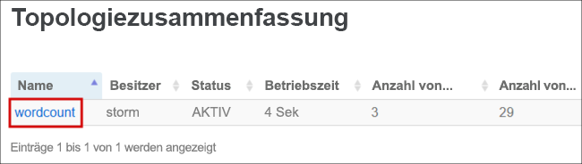
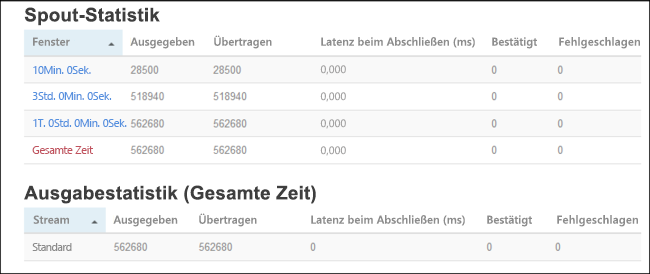

# <a name="quickstart-create-and-monitor-an-apache-storm-topology-in-azure-hdinsight"></a>Schnellstart: Erstellen und Überwachen einer Apache Storm-Topologie in Azure HDInsight

Apache Storm ist ein skalierbares, fehlertolerantes, verteiltes Echtzeit-Berechnungssystem für die Verarbeitung von Datenströmen. Mit Storm in Azure HDInsight können Sie einen cloudbasierten Storm-Cluster erstellen, der Big Data-Analysen in Echtzeit durchführt.

In diesem Schnellstart verwenden Sie ein Beispiel aus dem Apache-Projekt [storm-starter](https://github.com/apache/storm/tree/v2.0.0/examples/storm-starter), um eine Apache Storm-Topologie für einen bestehenden Apache Storm-Cluster zu erstellen und zu überwachen.

## <a name="prerequisites"></a>Voraussetzungen

* Ein Apache Storm-Cluster in HDInsight. Siehe [Erstellen von Apache Hadoop-Clustern im Azure-Portal](../hdinsight-hadoop-create-linux-clusters-portal.md), und wählen Sie **Storm** für **Clustertyp** aus.

* Einen SSH-Client. Weitere Informationen finden Sie unter [Herstellen einer Verbindung mit HDInsight (Hadoop) per SSH](../hdinsight-hadoop-linux-use-ssh-unix.md).

## <a name="create-the-topology"></a>Erstellen der Topologie

1. Stellen Sie eine Verbindung mit Ihrem Storm-Cluster her. Bearbeiten Sie den unten angegebenen Befehl, indem Sie `CLUSTERNAME` durch den Namen Ihres Storm-Clusters ersetzen, und geben Sie den Befehl dann ein:

    ```cmd
    ssh sshuser@CLUSTERNAME-ssh.azurehdinsight.net
    ```

2. Das **WordCount**-Beispiel befindet sich in Ihrem HDInsight-Cluster unter `/usr/hdp/current/storm-client/contrib/storm-starter/`. Die Topologie generiert zufällige Sätze und zählt, wie häufig Wörter vorkommen. Verwenden Sie den folgenden Befehl, um die **wordcount**-Topologie im Cluster zu starten:

    ```bash
    storm jar /usr/hdp/current/storm-client/contrib/storm-starter/storm-starter-topologies-*.jar org.apache.storm.starter.WordCountTopology wordcount
    ```

## <a name="monitor-the-topology"></a>Überwachen der Topologie

Storm bietet eine Weboberfläche zum Arbeiten mit ausgeführten Topologien und befindet sich auf dem HDInsight-Cluster.

Führen Sie die folgenden Schritte aus, um die Topologie mithilfe der Storm-Benutzeroberfläche zu überwachen:

1. Rufen Sie in einem Webbrowser die folgende URL auf, um die Storm-Benutzeroberfläche anzuzeigen: `https://CLUSTERNAME.azurehdinsight.net/stormui`. Ersetzen Sie `CLUSTERNAME` durch den Namen Ihres Clusters.

2. Wählen Sie unter **Topologiezusammenfassung** in der Spalte **Name** den Eintrag **wordcount** aus. Informationen zur Topologie werden angezeigt.

    

    Auf der neuen Seite werden die folgenden Informationen angezeigt:

    |Eigenschaft | BESCHREIBUNG |
    |---|---|
    |Topologiestatistik|Grundlegende Informationen zur Leistung der Topologie, aufgeteilt in Zeitfenster. Durch die Auswahl eines bestimmten Zeitfensters werden die Informationen in den anderen Abschnitten der Seite entsprechend angepasst.|
    |Spouts|Grundlegende Informationen zu Spouts, einschließlich des letzten von einem Spout zurückgegebenen Fehlers.|
    |Bolts|Grundlegende Informationen zu Bolts.|
    |Topologiekonfiguration|Ausführliche Informationen zur Konfiguration der Topologie.|
    |Aktivieren|Setzt die Verarbeitung einer deaktivierten Topologie fort.|
    |Deaktivieren|Hält eine aktive Topologie an.|
    |Ausgleichen|Passt die Parallelität der Topologie an. Sie sollten aktive Topologien ausgleichen, nachdem Sie die Anzahl der Knoten im Cluster geändert haben. Durch Ausgleichen wird die Parallelität angepasst, um die höhere/geringere Anzahl der Knoten im Cluster zu kompensieren. Weitere Informationen finden Sie unter [Grundlegendes zur Parallelität einer Apache Storm-Topologie](https://storm.apache.org/documentation/Understanding-the-parallelism-of-a-Storm-topology.html).|
    |Beenden|Beendet eine Storm-Topologie nach dem angegebenen Zeitlimit.|

3. Wählen Sie auf dieser Seite einen Eintrag aus dem Abschnitt **Spouts** oder **Bolts** aus. Informationen zur ausgewählten Komponente werden angezeigt.

    

    Auf der neuen Seite werden die folgenden Informationen angezeigt:

    |Eigenschaft | BESCHREIBUNG |
    |---|---|
    |Statistik für Spout/Bolt|Grundlegende Informationen zur Leistung der Komponente, aufgeteilt in Zeitfenster. Durch die Auswahl eines bestimmten Zeitfensters werden die Informationen in den anderen Abschnitten der Seite entsprechend angepasst.|
    |Eingabestatistik (nur Bolt)|Informationen zu Komponenten, die vom Bold konsumierte Daten generieren.|
    |Ausgabestatistik|Informationen zu den von diesem Bold ausgegebenen Daten.|
    |Ausführer|Informationen zu Instanzen dieser Komponente.|
    |Errors|Von dieser Komponente generierte Fehler.|

4. Zum Anzeigen der Spout- oder Bolt-Details wählen Sie im Abschnitt **Executors** einen Eintrag aus der Spalte **Port** aus, um die Details einer bestimmten Instanz der Komponente anzuzeigen.

        2015-01-27 14:18:02 b.s.d.task [INFO] Emitting: split default ["with"]
        2015-01-27 14:18:02 b.s.d.task [INFO] Emitting: split default ["nature"]
        2015-01-27 14:18:02 b.s.d.executor [INFO] Processing received message source: split:21, stream: default, id: {}, [snow]
        2015-01-27 14:18:02 b.s.d.task [INFO] Emitting: count default [snow, 747293]
        2015-01-27 14:18:02 b.s.d.executor [INFO] Processing received message source: split:21, stream: default, id: {}, [white]
        2015-01-27 14:18:02 b.s.d.task [INFO] Emitting: count default [white, 747293]
        2015-01-27 14:18:02 b.s.d.executor [INFO] Processing received message source: split:21, stream: default, id: {}, [seven]
        2015-01-27 14:18:02 b.s.d.task [INFO] Emitting: count default [seven, 1493957]

    In diesem Beispiel kam das Wort **sieben** 1493957 Mal vor. So oft wurde dieses Wort seit dem Start der Topologie erkannt.

## <a name="stop-the-topology"></a>Beenden der Topologie

Kehren Sie zur **Topologiezusammenfassung** der WordCount-Topologie zurück, und klicken Sie im Abschnitt mit den **Topologieaktionen** auf die Schaltfläche **Beenden**. Geben Sie auf Aufforderung für die Verzögerung vor dem Beenden der Topologie 10 (Sekunden) ein. Nach dieser Wartezeit wird die Topologie im Abschnitt **Storm-UI** des Dashboards nicht mehr angezeigt.

## <a name="clean-up-resources"></a>Bereinigen von Ressourcen

Nachdem Sie den Schnellstart abgeschlossen haben, können Sie den Cluster löschen. Mit HDInsight werden Ihre Daten im Azure-Speicher gespeichert, sodass Sie einen Cluster problemlos löschen können, wenn er nicht verwendet wird. Für einen HDInsight-Cluster fallen auch dann Gebühren an, wenn er nicht verwendet wird. Da die Gebühren für den Cluster erheblich höher sind als die Kosten für den Speicher, ist es sinnvoll, nicht verwendete Cluster zu löschen.

Informationen zum Löschen eines Clusters finden Sie unter [Löschen eines HDInsight-Clusters mit Ihrem Browser, PowerShell oder der Azure CLI](../hdinsight-delete-cluster.md).

## <a name="next-steps"></a>Nächste Schritte

In diesem Schnellstart verwendeten Sie ein Beispiel aus dem Apache-Projekt [storm-starter](https://github.com/apache/storm/tree/v2.0.0/examples/storm-starter), um eine Apache Storm-Topologie für einen bestehenden Apache Storm-Cluster zu erstellen und zu überwachen. Fahren Sie mit dem nächsten Artikel fort, um die Grundlagen der Verwaltung und Überwachung von Apache Storm-Topologien zu erfahren.

> [!div class="nextstepaction"]
>[Bereitstellen und Verwalten von Apache Storm-Topologien in Azure HDInsight](./apache-storm-deploy-monitor-topology-linux.md)