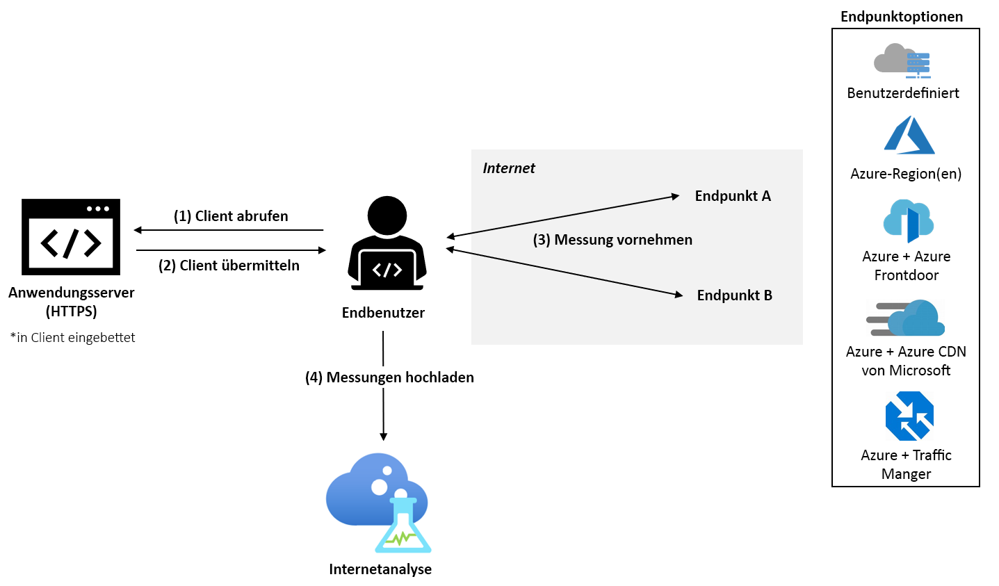

# Was ist Internet Analyzer? (Vorschau)

Internet Analyzer ist eine clientseitige Messplattform, mit der Sie testen können, wie sich Änderungen an der Netzwerkinfrastruktur auf die Leistung auf der Seite Ihrer Kunden auswirken. Unabhängig davon, ob Sie von einer lokalen Einrichtung zu Azure migrieren oder einen neuen Azure-Dienst ausprobieren: Mit Internet Analyzer können Sie von den Daten Ihrer Benutzer und den umfangreichen Analysen von Microsoft lernen, um Ihre Netzwerkinfrastruktur besser zu verstehen und mit Azure zu optimieren – und das schon vor der Migration.

Internet Analyzer verwendet einen kleinen, in Ihre Webanwendung eingebetteten JavaScript-Client, um die Latenz zwischen Endbenutzer und Ihrem ausgewählten Satz an Netzwerkzielen zu messen, die als _Endpunkte_ bezeichnet werden. Mit Internet Analyzer können Sie mehrere Tests nebeneinander einrichten und so eine Vielzahl von Szenarien bewerten, wenn Infrastruktur und Kundenanforderungen wachsen. Internet Analyzer bietet benutzerdefinierte und vorkonfigurierte Endpunkte, sodass Sie bequem und flexibel Entscheidungen in Bezug auf eine vertrauenswürdige Leistung für Ihre Endbenutzer treffen können. 

> [!IMPORTANT]
> Diese öffentliche Vorschauversion wird ohne Servicelevelvereinbarung bereitgestellt und sollte nicht für Produktionsworkloads verwendet werden. Unter Umständen werden bestimmte Features nicht unterstützt, verfügen über eingeschränkte Funktionen und sind nicht an allen Azure-Standorten verfügbar. Weitere Informationen finden Sie unter [Ergänzende Nutzungsbedingungen für Microsoft Azure-Vorschauversionen](https://azure.microsoft.com/support/legal/preview-supplemental-terms/).
>

## Schnelle, anpassbare Tests

Internet Analyzer beantwortet leistungsbezogene Fragen, wenn es um eine Cloudmigration, die Bereitstellung neuer oder weiterer Azure-Regionen oder das Testen neuer Plattformen für Anwendungen und Inhaltsbereitstellung wie z. B. [Azure Front Door](https://azure.microsoft.com/services/frontdoor/) und [Microsoft Azure CDN](https://azure.microsoft.com/services/cdn/) geht. 

Jeder Test, den Sie in Internet Analyzer erstellen, besteht aus zwei Endpunkten: Endpunkt A und Endpunkt B. Analysiert wird die Leistung von Endpunkt B im Verhältnis zu Endpunkt A. 

Sie können selbst einen benutzerdefinierten Endpunkt konfigurieren oder aus einer Vielzahl vorkonfigurierter Azure-Endpunkte auswählen. Benutzerdefinierte Endpunkte sollten verwendet werden, um lokale Workloads, Ihre Instanzen bei anderen Cloudanbietern oder Ihre benutzerdefinierten Azure-Konfigurationen zu bewerten. Tests können aus zwei benutzerdefinierten Endpunkten bestehen, allerdings muss mindestens ein benutzerdefinierter Endpunkt in Azure gehostet werden. Vorkonfigurierte Azure-Endpunkte bieten eine schnelle und einfache Möglichkeit, die Leistung beliebter Azure-Netzwerkplattformen wie Azure Front Door, Azure Traffic Manager oder Azure CDN zu bewerten. 

Während der Vorschau sind die folgenden vorkonfigurierten Endpunkte verfügbar: 

* **Azure-Regionen**
    * Brasilien Süd
    * Indien, Mitte
    * USA (Mitte)
    * Asien, Osten
    * East US
    * Japan, Westen
    * Nordeuropa
    * Südafrika, Norden
    * Asien, Südosten 
    * Vereinigte Arabische Emirate, Norden
    * UK, Westen  
    * Europa, Westen
    * USA (Westen) 
    * USA, Westen 2
* **Kombinationen aus mehreren Azure-Regionen** 
    * USA, Osten; Brasilien, Süden 
    * USA, Osten; Asien, Osten 
    * Europa, Westen; Brasilien, Süden
    * Europa, Westen; Asien, Südosten
    * Europa, Westen; VAE, Norden
    * USA, Westen; USA, Osten 
    * USA, Westen; Europa, Westen
    * USA, Westen; VAE, Norden
    * Europa, Westen; VAE, Norden; Asien, Südosten
    * USA, Westen; Europa, Westen; Asien, Osten
    * USA, Westen; Europa, Norden; Asien, Südosten; VAE, Norden; Südafrika, Norden 
* **Azure & Azure Front Door**: in jeder beliebigen oben aufgeführten Azure-Einzelregion oder Kombination aus mehreren Azure-Regionen bereitgestellt
* **Azure & Azure CDN von Microsoft**: in jeder beliebigen oben aufgeführten Azure-Einzelregion bereitgestellt
* **Azure & Azure Traffic Manager**: in jeder beliebigen oben aufgeführten Kombination aus mehreren Azure-Regionen bereitgestellt

## Vorgeschlagene Testszenarien 

Um Sie dabei zu unterstützen, die richtigen Entscheidungen hinsichtlich der Leistung für Ihre Kunden zu treffen, ermöglicht Internet Analyzer Ihnen die Bewertung von zwei Endpunkten für Ihre spezifische Endbenutzerpopulation. 

Internet Analyzer kann eine Vielzahl von Fragen beantworten, darunter diese sehr häufig gestellten: 
* Wie wirkt sich die Migration zur Cloud auf die Leistung aus? 
    * *Vorgeschlagener Test: Benutzerdefiniert (Ihre aktuelle lokale Infrastruktur) im Vergleich zu Azure (beliebiger vorkonfigurierter Endpunkt)*
* Welche Vorteile ergeben sich, wenn ich meine Daten statt in einem Rechenzentrum am Edge platziere? 
    *  *Vorgeschlagener Test: Azure im Vergleich zu Azure Front Door im Vergleich zu Azure CDN von Microsoft*
* Welche Leistungsvorteile bietet Azure Front Door?
    *  *Vorgeschlagener Test: Benutzerdefiniert/Azure/CDN im Vergleich zu Azure Front Door*
* Welche Leistungsvorteile bietet Azure CDN von Microsoft? 
    *  *Vorgeschlagener Test: Benutzerdefiniert/Azure/Azure Front Door im Vergleich zu Azure CDN von Microsoft*
* Wie schneidet Azure CDN von Microsoft ab? 
    *  *Vorgeschlagener Test: Benutzerdefiniert (anderer CDN-Endpunkt) im Vergleich zu Azure CDN von Microsoft*
* Welches ist die beste Cloud für Ihre Endbenutzerpopulation in jeder Region? 
    *  *Vorgeschlagener Test: Benutzerdefiniert (anderer Clouddienst) im Vergleich zu Azure (beliebiger vorkonfigurierter Endpunkt)*

## So funktioniert's

Um Internet Analyzer zu verwenden, richten Sie eine Internet Analyzer-Ressource im Microsoft Azure-Portal ein, und installieren Sie den kleinen JavaScript-Client in Ihrer Anwendung. Der Client misst die Latenz zwischen Endbenutzern und Ihren ausgewählten Endpunkten, indem er ein 1 Pixel großes Bild über HTTPS herunterlädt. Nach dem Erfassen der Latenzmesswerte sendet der Client die Messdaten an Internet Analyzer.

Wenn ein Benutzer die Webanwendung besucht, wählt der JavaScript-Client zwei Endpunkte aus, für die Messungen für alle konfigurierten Tests ausgeführt werden. Für jeden Endpunkt führt der Client eine _kalte_ und eine _warme_ Messung aus. Die _kalte_ Messung verursacht zusätzliche Latenz – neben der reinen Netzwerklatenz zwischen Benutzer und Endpunkt z. B. bei DNS-Auflösung, TCP-Verbindungshandshake und SSL/TLS-Aushandlung. Die _warme_ Messung erfolgt direkt nach Abschluss der _kalten_ Messung und nutzt das permanente TCP-Verbindungsmanagement moderner Browser, um eine exakte Messung der End-to-End-Latenz zu erhalten. Für ein exaktes Timing der Messungen wird die W3C-API für das Ressourcentiming verwendet, wenn diese vom Browser des Benutzers unterstützt wird. Zurzeit werden nur warme Latenzmessungen für Analysen verwendet.

## Scorecards 

Sobald ein Test gestartet wurde, werden in der Internet Analyzer-Ressource auf der Registerkarte „Scorecard“ Telemetriedaten angezeigt. Diese Daten sind immer aggregiert. Verwenden Sie die folgenden Filter, um die angezeigte Datenansicht zu ändern: 

* **Test (Testen):** Wählen Sie den Test aus, dessen Ergebnisse Sie anzeigen möchten. Testdaten werden angezeigt, sobald genügend Daten vorhanden sind, um die Analyse abzuschließen – in den meisten Fällen innerhalb von 24 Stunden. 
* **Zeitraum und Enddatum**: Internet Analyzer generiert drei Scorecards pro Tag, von denen jede einen anderen Aggregationszeitraum reflektiert: 24 Stunden vorher (Tag), sieben Tage vorher (Woche) und 30 Tage vorher (Monat). Verwenden Sie den Filter „Enddatum“, um den Zeitraum auszuwählen, den Sie anzeigen möchten. 
* **Land**: Verwenden Sie diesen Filter, um Daten für Endbenutzer in einem bestimmten Land anzuzeigen. Der globale Filter zeigt Daten über alle Geografien hinweg an.  

Weitere Informationen zu Scorecards finden Sie auf der Seite [Interpretieren Ihrer Scorecard](internet-analyzer-scorecard.md). 

## Nächste Schritte

* Finden Sie heraus, wie Sie [Ihre erste Internet Analyzer-Ressource erstellen](internet-analyzer-create-test-portal.md).
* Lesen Sie die [häufig gestellten Fragen zu Internet Analyzer](internet-analyzer-faq.md). 
