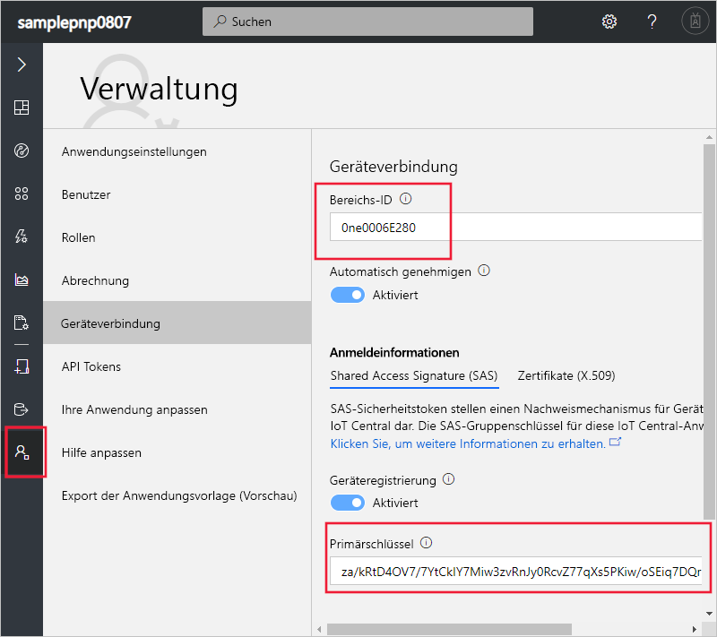
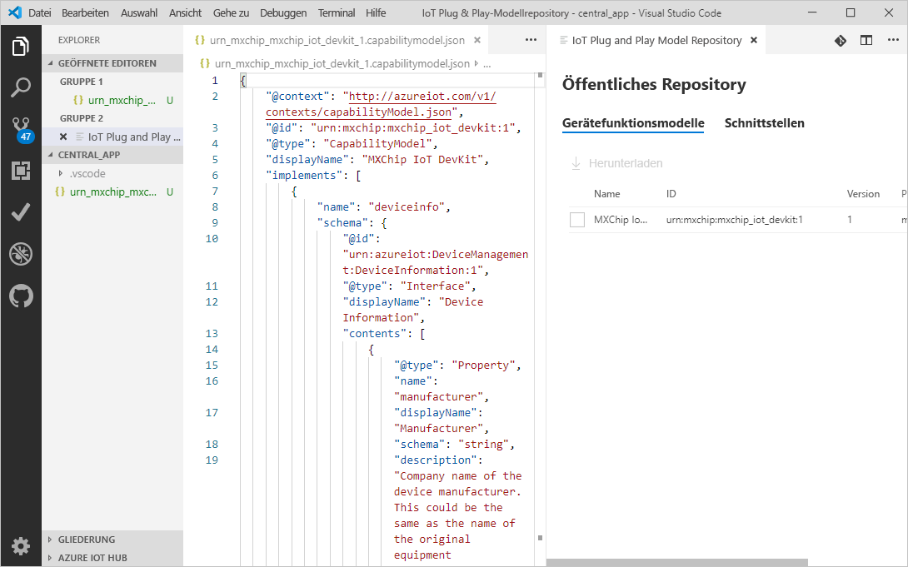
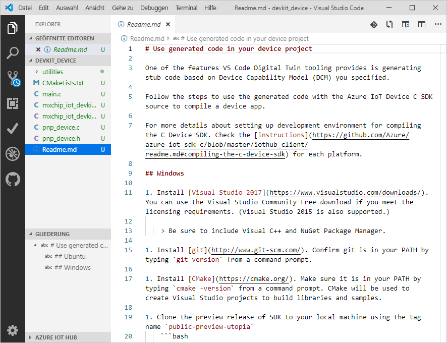
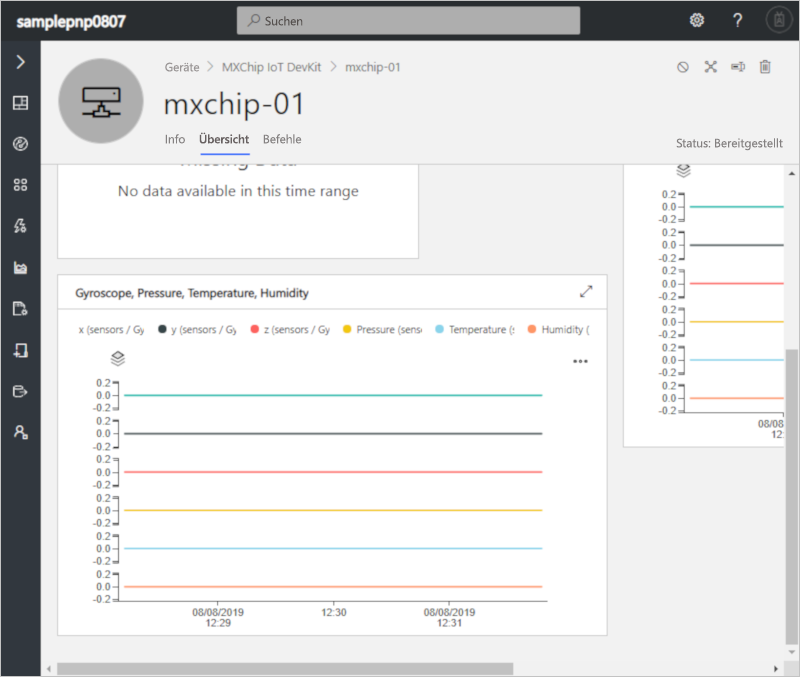
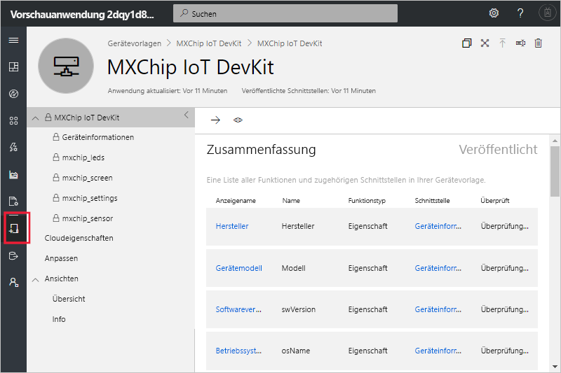

# <a name="quickstart-use-a-device-capability-model-to-create-an-iot-plug-and-play-device-and-connect-it-to-your-iot-central-application"></a>Schnellstart: Verwenden eines Gerätefunktionsmodells zum Erstellen eines IoT Plug & Play-Geräts und Verbinden mit Ihrer IoT Central-Anwendung

[!INCLUDE [iot-central-pnp-original](../../includes/iot-central-pnp-original-note.md)]

Mit einem _Gerätefunktionsmodell_ (Device Capability Model, DCM) werden die Funktionen eines [IoT Plug & Play](../iot-pnp/overview-iot-plug-and-play.md)-Geräts beschrieben. IoT Central kann ein Gerätefunktionsmodell verwenden, um eine Gerätevorlage und Visualisierungen für ein Gerät zu erstellen, wenn das Gerät zum ersten Mal eine Verbindung herstellt. In dieser Schnellstartanleitung wird Folgendes beschrieben:

* Verwenden Sie Visual Studio Code, um mit einem Gerätefunktionsmodell ein IoT Plug & Play-Gerät zu erstellen.
* Führen Sie den Gerätecode unter Windows aus, und verfolgen Sie, wie die Verbindung mit Ihrer IoT Central-Anwendung hergestellt wird.
* Zeigen Sie die simulierten Telemetriedaten an, die vom Gerät gesendet werden.

## <a name="prerequisites"></a>Voraussetzungen

Arbeiten Sie die Schnellstartanleitung [Erstellen einer Azure IoT Central-Anwendung (Previewfunktionen)](./quick-deploy-iot-central-pnp.md?toc=/azure/iot-central-pnp/toc.json&bc=/azure/iot-central-pnp/breadcrumb/toc.json) durch, um mit der Vorlage **Vorschauanwendung** eine IoT Central-Anwendung zu erstellen.

Zum Durcharbeiten dieser Schnellstartanleitung müssen Sie auf Ihrem lokalen Computer die folgende Software installieren:

* [Visual Studio (Community, Professional oder Enterprise):](https://visualstudio.microsoft.com/downloads/) Stellen Sie sicher, dass Sie die Komponente **NuGet-Paket-Manager** und die Workload **Desktopentwicklung mit C++** aktivieren, wenn Sie Visual Studio installieren.
* [Git](https://git-scm.com/download/).
* [CMake](https://cmake.org/download/): Wählen Sie beim Installieren von **CMake** die Option **Add CMake to the system PATH** (CMake dem Systempfad hinzufügen).
* [Visual Studio Code](https://code.visualstudio.com/).
* [Node.js](https://nodejs.org/)
* Hilfsprogramm `dps-keygen`:

    ```cmd/sh
    npm i -g dps-keygen
    ```

### <a name="install-azure-iot-tools"></a>Installieren von Azure IoT-Tools

Führen Sie die folgenden Schritte aus, um das Erweiterungspaket „Azure IoT Tools“ in VS Code zu installieren:

1. Wählen Sie in VS Code die Registerkarte **Erweiterungen**.
1. Suchen Sie nach **Azure IoT Tools**.
1. Wählen Sie **Installieren** aus.

## <a name="prepare-the-development-environment"></a>Vorbereiten der Entwicklungsumgebung

### <a name="get-azure-iot-device-sdk-for-c"></a>Beschaffen des Azure IoT-Geräte-SDK für C

Bereiten Sie eine Entwicklungsumgebung vor, die Sie zum Erstellen des Azure IoT-Geräte-SDK für C verwenden können.

1. Öffnen Sie eine Eingabeaufforderung. Führen Sie den folgenden Befehl zum Klonen des [Azure IoT C SDK](https://github.com/Azure/azure-iot-sdk-c)-GitHub-Repositorys aus:

    ```cmd/sh
    git clone https://github.com/Azure/azure-iot-sdk-c --recursive -b public-preview
    ```

    Sie sollten damit rechnen, dass die Ausführung dieses Vorgangs mehrere Minuten in Anspruch nimmt.

1. Erstellen Sie im Stammverzeichnis des lokalen Repositoryklons den Ordner `central_app`. Sie verwenden diesen Ordner für die Gerätemodelldateien und den Gerätecode-Stub.

    ```cmd/sh
    cd azure-iot-sdk-c
    mkdir central_app
    ```

## <a name="generate-device-key"></a>Generieren des Geräteschlüssels

Zum Herstellen einer Verbindung mit einer IoT Central-Anwendung benötigen Sie einen Geräteschlüssel. Generieren Sie wie folgt einen Geräteschlüssel:

1. Melden Sie sich bei der IoT Central-Anwendung an, die Sie in der vorherigen Schnellstartanleitung erstellt haben.

1. Navigieren Sie zur Seite **Verwaltung**, und wählen Sie **Geräteverbindung**.

1. Notieren Sie sich die **Bereichs-ID** und den **Primärschlüssel**. Diese Werte werden später noch benötigt.

    

1. Öffnen Sie eine Eingabeaufforderung, und führen Sie den folgenden Befehl aus, um einen Geräteschlüssel zu generieren:

    ```cmd/sh
    dps-keygen  -di:mxchip-01 -mk:{Primary Key from previous step}
    ```

    Notieren Sie sich den generierten _Geräteschlüssel_. Sie verwenden diesen Wert in einem späteren Schritt dieser Schnellstartanleitung.

## <a name="download-your-model"></a>Herunterladen des Modells

In dieser Schnellstartanleitung verwenden Sie das öffentliche Gerätefunktionsmodell für ein Gerät vom Typ „MxChip IoT DevKit“. Sie benötigen kein echtes DevKit-Gerät, um den Code auszuführen. In dieser Schnellstartanleitung kompilieren Sie den Code für die Ausführung unter Windows.

1. Öffnen Sie den Ordner `azure-iot-sdk-c\central_app` mit VS Code.

1. Verwenden Sie **STRG+UMSCHALT+P**, um die Befehlspalette zu öffnen, geben Sie **IoT Plug & Play** ein, und wählen Sie **Open Model Repository** (Modellrepository öffnen). Wählen Sie **Public repository** (Öffentliches Repository). VS Code zeigt eine Liste mit den Gerätefunktionsmodellen im öffentlichen Modellrepository an.

1. Wählen Sie das Gerätefunktionsmodell **MXChip IoT DevKit** mit der ID `urn:mxchip:mxchip_iot_devkit:1` aus. Wählen Sie anschließend **Herunterladen**. Sie verfügen nun über eine Kopie des Gerätefunktionsmodells im Ordner `central_app`.



> [!NOTE]
> Für die Zusammenarbeit mit IoT Central muss das Gerätefunktionsmodell über alle definierten Schnittstellen inline in derselben Datei verfügen.

## <a name="generate-the-c-code-stub"></a>Generieren des C-Code-Stubs

Da Sie jetzt über das Gerätefunktionsmodell **MXChip IoT DevKit** und die zugeordneten Schnittstellen verfügen, können Sie den Gerätecode generieren, mit dem das Modell implementiert wird. Generieren Sie wie folgt den C-Code-Stub in VS Code:

1. Drücken Sie bei geöffnetem Ordner mit den Gerätefunktionsmodell-Dateien die Tastenkombination **STRG+UMSCHALT+P**, um die Befehlspalette zu öffnen. Geben Sie **IoT Plug & Play** ein, und wählen Sie **Generate Device Code Stub** (Gerätecode-Stub generieren).

    > [!NOTE]
    > Wenn Sie das Hilfsprogramm „IoT Plug & Play-Codegenerator“ zum ersten Mal verwenden, dauert der Download einige Sekunden.

1. Wählen Sie die Gerätefunktionsmodell-Datei **MXChip IoT DevKit** aus, die Sie gerade heruntergeladen haben.

1. Geben Sie den Projektnamen **devkit_device** ein.

1. Wählen Sie **ANSI C** als Sprache aus.

1. Wählen Sie **CMake-Projekt** als Projekttyp aus. Wählen Sie nicht **MXChip IoT DevKit-Projekt**. Diese Option wird verwendet, wenn Sie ein echtes DevKit-Gerät verwenden.

1. Wählen Sie als Verbindungsmethode die Option **Via DPS (Device Provisioning Service) symmetric key** (Mit symmetrischem Schlüssel per Device Provisioning-Dienst).

1. VS Code öffnet ein neues Fenster mit generierten Gerätecode-Stubdateien im Ordner `devkit_device`.



Fügen Sie die Verbindungsinformationen wie folgt dem generierten Gerätecode hinzu:

1. Im VS Code-Fenster, das den generierten C-Code enthält: Öffnen Sie die Datei `main.c` .

1. Ersetzen Sie `[DPS Id Scope]` durch die **Bereichs-ID**, die Sie sich zuvor notiert haben.

1. Ersetzen Sie `[DPS symmetric key]` durch den Geräteschlüssel, den Sie in einem vorherigen Schritt generiert haben.

1. Ersetzen Sie `[device registration Id]` durch `mxchip-01`.

1. Speichern Sie die Änderungen.

## <a name="build-the-code"></a>Erstellen des Codes

Sie verwenden das Geräte-SDK, um den generierten Gerätecode-Stub zu erstellen. Mit der von Ihnen erstellten Anwendung wird ein Gerät vom Typ **MXChip IoT DevKit** simuliert und eine Verbindung mit Ihrer IoT Central-Anwendung hergestellt. Die Anwendung sendet Telemetriedaten und Eigenschaften und empfängt Befehle.

1. Öffnen Sie in VS Code die Datei `CMakeLists.txt` im Ordner `azure-iot-sdk-c`. Stellen Sie sicher, dass Sie die Datei `CMakeLists.txt` im Ordner `azure-iot-sdk-c` öffnen – und nicht im Ordner `devkit_device`.

1. Fügen Sie die unten angegebene Zeile am Ende der Datei `CMakeLists.txt` hinzu, um beim Kompilieren den Ordner mit dem Gerätecode-Stub einzubinden:

    ```txt
    add_subdirectory(central_app/devkit_device)
    ```

1. Erstellen Sie im Ordner `azure-iot-sdk-c` den Ordner `cmake`, und navigieren Sie über die Eingabeaufforderung zu diesem Ordner:

    ```cmd\sh
    mkdir cmake
    cd cmake
    ```

1. Führen Sie die folgenden Befehle aus, um das Geräte-SDK und den generierten Code-Stub zu erstellen:

    ```cmd\sh
    cmake .. -Duse_prov_client=ON -Dhsm_type_symm_key:BOOL=ON
    cmake --build . -- /m /p:Configuration=Release
    ```

1. Nachdem der Buildvorgang erfolgreich abgeschlossen wurde, können Sie Ihre Anwendung über die Eingabeaufforderung ausführen:

    ```cmd\sh
    .\central_app\devkit_device\Release\devkit_device.exe
    ```

1. Die Geräteanwendung beginnt mit dem Senden von Daten an Ihre IoT Central-Anwendung.

## <a name="view-the-device"></a>Anzeigen des Geräts

Nachdem Ihr Gerätecode eine Verbindung mit Ihrer IoT Central-Instanz hergestellt hat, können Sie die gesendeten Eigenschaften und Telemetriedaten anzeigen:

1. Navigieren Sie in Ihrer IoT Central-Anwendung zur Seite **Geräte**, und wählen Sie das Gerät **mxchip-01** aus. Dieses Gerät wurde automatisch hinzugefügt, als über den Gerätecode die Verbindung hergestellt wurde:

    

    Nach einigen Minuten werden auf dieser Seite Diagramme mit den Telemetriedaten angezeigt, die vom Gerät gesendet werden.

1. Wählen Sie die Seite **Info**, um die vom Gerät gesendeten Eigenschaftswerte anzuzeigen.

1. Wählen Sie die Seite **Befehle**, um Befehle auf dem Gerät aufzurufen. Sie können über die Eingabeaufforderung verfolgen, wie das Gerät antwortet, auf dem der Gerätecode ausgeführt wird.

1. Navigieren Sie zur Seite **Gerätevorlagen**, um die Vorlage anzuzeigen, die von IoT Central über das Gerätefunktionsmodul im öffentlichen Repository erstellt wurde:

    

## <a name="next-steps"></a>Nächste Schritte

In dieser Schnellstartanleitung wurde beschrieben, wie Sie eine Verbindung mit einem IoT Plug & Play-Gerät herstellen, das aus einem Gerätefunktionsmodell im öffentlichen Modellrepository generiert wurde.

Weitere Informationen zu Gerätefunktionsmodellen und zur Erstellung Ihrer eigenen Modelle finden Sie in der Schrittanleitung:

> [!div class="nextstepaction"]
> [Set up and manage a device template](./howto-set-up-template-pnp.md?toc=/azure/iot-central-pnp/toc.json&bc=/azure/iot-central-pnp/breadcrumb/toc.json) (Einrichten und Verwalten einer Gerätevorlage)
