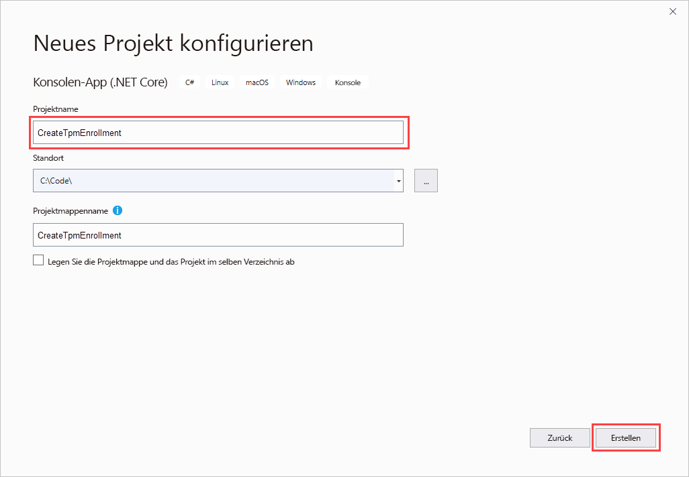
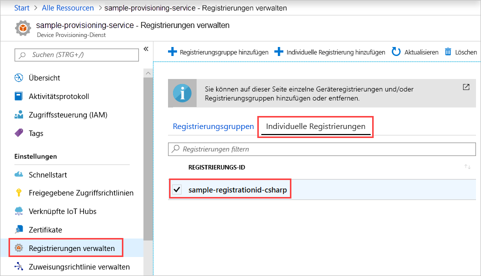

# <a name="quickstart-enroll-tpm-device-to-iot-hub-device-provisioning-service-using-c-service-sdk"></a>Schnellstart: Registrieren eines TPM-Geräts für den IoT Hub Device Provisioning-Dienst per C#-Dienst-SDK

[!INCLUDE [iot-dps-selector-quick-enroll-device-tpm](../../includes/iot-dps-selector-quick-enroll-device-tpm.md)]

In diesem Artikel wird veranschaulicht, wie Sie programmgesteuert eine individuelle Registrierung für ein TPM-Gerät in Azure IoT Hub Device Provisioning Service erstellen, indem Sie das [C#-Dienst-SDK](https://github.com/Azure/azure-iot-sdk-csharp) und eine C#-.NET Core-Beispielanwendung verwenden. Mit diesem Eintrag für die individuelle Registrierung können Sie ein simuliertes TPM-Gerät optional für den Bereitstellungsdienst registrieren. Diese Schritte funktionieren für Windows- und Linux-Computer, aber in diesem Artikel wird nur ein Windows-Entwicklungscomputer verwendet.

## <a name="prepare-the-development-environment"></a>Vorbereiten der Entwicklungsumgebung

1. Stellen Sie sicher, dass [Visual Studio 2019](https://www.visualstudio.com/vs/) lokal auf dem Computer installiert ist.

1. Stellen Sie sicher, dass auf Ihrem Computer das [.NET Core SDK](https://www.microsoft.com/net/download/windows) installiert ist.

1. Führen Sie zunächst die unter [Einrichten des IoT Hub Device Provisioning-Diensts über das Azure-Portal](./quick-setup-auto-provision.md) beschriebenen Schritte aus, bevor Sie fortfahren.

1. (Optional) Wenn Sie am Ende dieser Schnellstartanleitung ein simuliertes Gerät registrieren möchten, können Sie die Schritte unter [Erstellen und Bereitstellen eines simulierten TPM-Geräts mithilfe des C#-Geräte-SDKs](quick-create-simulated-device-tpm-csharp.md) bis zu dem Schritt ausführen, in dem Sie einen Endorsement Key für das Gerät abrufen. Speichern Sie den Endorsement Key, die Registrierungs-ID und optional die Geräte-ID. Sie werden im weiteren Verlauf dieser Schnellstartanleitung benötigt.

   > [!NOTE]
   > Führen Sie die Schritte zum Erstellen einer individuellen Registrierung mit dem Azure-Portal nicht aus.

## <a name="get-the-connection-string-for-your-provisioning-service"></a>Abrufen der Verbindungszeichenfolge für Ihren Bereitstellungsdienst

Für das Beispiel in dieser Schnellstartanleitung benötigen Sie die Verbindungszeichenfolge für Ihren Bereitstellungsdienst.

1. Melden Sie sich beim Azure-Portal an, wählen Sie **Alle Ressourcen** aus, und öffnen Sie die Device Provisioning Service-Instanz.

1. Wählen Sie **Freigegebene Zugriffsrichtlinien** und anschließend die gewünschte Zugriffsrichtlinie aus, um die dazugehörigen Eigenschaften zu öffnen. Kopieren Sie unter **Zugriffsrichtlinie** die Primärschlüssel-Verbindungszeichenfolge, und notieren Sie sie.

    

## <a name="create-the-individual-enrollment-sample"></a>Erstellen des Beispiels für die individuelle Registrierung

Dieser Abschnitt zeigt, wie Sie eine .NET Core-Konsolen-App erstellen, die Ihrem Bereitstellungsdienst eine individuelle Registrierung für ein TPM-Gerät hinzufügt. Wenn Sie diese Schritte etwas abwandeln, können Sie damit auch eine [Windows IoT Core](https://developer.microsoft.com/en-us/windows/iot)-Konsolen-App zum Hinzufügen der individuellen Registrierung erstellen. Weitere Informationen zum Entwickeln mit IoT Core finden Sie in der [Dokumentation zu Windows für IOT](https://docs.microsoft.com/windows/iot-core/).

1. Öffnen Sie Visual Studio, und wählen Sie **Neues Projekt erstellen** aus. Wählen Sie unter **Neues Projekt erstellen** die Projektvorlage **Konsolen-App (.NET Core)** für C# und dann **Weiter** aus.

1. Geben Sie dem Projekt den Namen *CreateTpmEnrollment*, und wählen Sie **Erstellen** aus.

    

1. Klicken Sie im **Projektmappen-Explorer** mit der rechten Maustaste auf das Projekt **CreateTpmEnrollment**, und klicken Sie dann auf **NuGet-Pakete verwalten**.

1. Wählen Sie im **NuGet-Paket-Manager** die Option **Durchsuchen** aus, suchen Sie nach **Microsoft.Azure.Devices.Provisioning.Service**, wählen Sie diese Option aus, und klicken Sie dann auf **Installieren**.

   

   In diesem Schritt wird das NuGet-Paket mit dem [Client-SDK für Azure IoT Provisioning Service](https://www.nuget.org/packages/Microsoft.Azure.Devices.Provisioning.Service/) heruntergeladen und installiert und ein Verweis auf das Paket und seine Abhängigkeiten hinzugefügt.

1. Fügen Sie am Anfang von `Program.cs` nach den anderen `using`-Anweisungen die folgenden `using`-Anweisungen hinzu:
  
   ```csharp
   using System.Threading.Tasks;
   using Microsoft.Azure.Devices.Provisioning.Service;
   ```

1. Fügen Sie die folgenden Felder zur `Program`-Klasse hinzu, und nehmen Sie die aufgeführten Änderungen vor.

   ```csharp
   private static string ProvisioningConnectionString = "{Your provisioning service connection string}";
   private const string RegistrationId = "sample-registrationid-csharp";
   private const string TpmEndorsementKey =
       "AToAAQALAAMAsgAgg3GXZ0SEs/gakMyNRqXXJP1S124GUgtk8qHaGzMUaaoABgCAAEMAEAgAAAAAAAEAxsj2gUS" +
       "cTk1UjuioeTlfGYZrrimExB+bScH75adUMRIi2UOMxG1kw4y+9RW/IVoMl4e620VxZad0ARX2gUqVjYO7KPVt3d" +
       "yKhZS3dkcvfBisBhP1XH9B33VqHG9SHnbnQXdBUaCgKAfxome8UmBKfe+naTsE5fkvjb/do3/dD6l4sGBwFCnKR" +
       "dln4XpM03zLpoHFao8zOwt8l/uP3qUIxmCYv9A7m69Ms+5/pCkTu/rK4mRDsfhZ0QLfbzVI6zQFOKF/rwsfBtFe" +
       "WlWtcuJMKlXdD8TXWElTzgh7JS4qhFzreL0c1mI0GCj+Aws0usZh7dLIVPnlgZcBhgy1SSDQMQ==";
       
   // Optional parameters
   private const string OptionalDeviceId = "myCSharpDevice";
   private const ProvisioningStatus OptionalProvisioningStatus = ProvisioningStatus.Enabled;
   ```

   * Ersetzen Sie den Platzhalterwert `ProvisioningConnectionString` durch die Verbindungszeichenfolge des Bereitstellungsdiensts, für den Sie die Registrierung erstellen möchten.

   * Sie können optional die Registrierungs-ID, den Endorsement Key, die Geräte-ID und den Bereitstellungsstatus ändern.

   * Wenn Sie diese Schnellstartanleitung zusammen mit der Schnellstartanleitung [Erstellen und Bereitstellen eines simulierten TPM-Geräts mithilfe des C#-Geräte-SDKs](quick-create-simulated-device-tpm-csharp.md) verwenden, um ein simuliertes Gerät bereitzustellen, ersetzen Sie den Endorsement Key und die Registrierungs-ID durch die Werte, die Sie sich in dieser Schnellstartanleitung notiert haben. Die Geräte-ID können Sie durch den in der Schnellstartanleitung vorgeschlagenen Wert ersetzen, auf einen eigenen Wert festlegen oder den Standardwert in diesem Beispiel verwenden.

1. Fügen Sie der `Program`-Klasse die folgende Methode hinzu.  Dieser Code erstellt einen individuellen Registrierungseintrag und ruft dann die `CreateOrUpdateIndividualEnrollmentAsync`-Methode für `ProvisioningServiceClient` auf, um die individuelle Registrierung zum Bereitstellungsdienst hinzuzufügen.

   ```csharp
   public static async Task RunSample()
   {
       Console.WriteLine("Starting sample...");

       using (ProvisioningServiceClient provisioningServiceClient =
               ProvisioningServiceClient.CreateFromConnectionString(ProvisioningConnectionString))
       {
           #region Create a new individualEnrollment config
           Console.WriteLine("\nCreating a new individualEnrollment...");
           Attestation attestation = new TpmAttestation(TpmEndorsementKey);
           IndividualEnrollment individualEnrollment =
                   new IndividualEnrollment(
                           RegistrationId,
                           attestation);

           // The following parameters are optional. Remove them if you don't need them.
           individualEnrollment.DeviceId = OptionalDeviceId;
           individualEnrollment.ProvisioningStatus = OptionalProvisioningStatus;
           #endregion

           #region Create the individualEnrollment
           Console.WriteLine("\nAdding new individualEnrollment...");
           IndividualEnrollment individualEnrollmentResult =
               await provisioningServiceClient.CreateOrUpdateIndividualEnrollmentAsync(individualEnrollment).ConfigureAwait(false);
           Console.WriteLine("\nIndividualEnrollment created with success.");
           Console.WriteLine(individualEnrollmentResult);
           #endregion
        
       }
   }
   ```

1. Ersetzen Sie schließlich den Text der Methode `Main` durch die folgenden Zeilen:

   ```csharp
   RunSample().GetAwaiter().GetResult();
   Console.WriteLine("\nHit <Enter> to exit ...");
   Console.ReadLine();
   ```

1. Erstellen Sie die Projektmappe.

## <a name="run-the-individual-enrollment-sample"></a>Ausführen des Beispiels für die individuelle Registrierung
  
Führen Sie das Beispiel in Visual Studio aus, um die individuelle Registrierung für Ihr TPM-Gerät zu erstellen.

Nach erfolgreicher Erstellung werden im Eingabeaufforderungsfenster die Eigenschaften der neuen individuellen Registrierung angezeigt.

Überprüfen Sie, ob eine individuelle Registrierung erstellt wurde. Navigieren Sie zur Device Provisioning Service-Zusammenfassung, und wählen Sie **Registrierungen verwalten** und anschließend **Individuelle Registrierungen** aus. Daraufhin sollte ein neuer Registrierungseintrag mit der im Beispiel verwendeten Registrierungs-ID angezeigt werden.



Wählen Sie den Eintrag aus, um den Endorsement Key und andere Eigenschaften für den Eintrag zu überprüfen.

Wenn Sie die Schritte aus der Schnellstartanleitung [Erstellen und Bereitstellen eines simulierten TPM-Geräts mithilfe des C#-Geräte-SDKs](quick-create-simulated-device-tpm-csharp.md) ausgeführt haben, können Sie mit den restlichen Schritten in dieser Schnellstartanleitung fortfahren, um Ihr simuliertes Gerät zu registrieren. Überspringen Sie dabei die Schritte zum Erstellen einer individuellen Registrierung mit dem Azure-Portal.

## <a name="clean-up-resources"></a>Bereinigen von Ressourcen

Wenn Sie sich das C#-Dienstbeispiel näher ansehen möchten, dürften Sie die in dieser Schnellstartanleitung erstellten Ressourcen nicht bereinigen. Führen Sie andernfalls die folgenden Schritte aus, um alle Ressourcen zu löschen, die im Rahmen dieser Schnellstartanleitung erstellt wurden.

1. Schließen Sie das Ausgabefenster des C#-Beispiels auf Ihrem Computer.

1. Navigieren Sie im Azure-Portal zu Ihrem Device Provisioning Service, klicken Sie auf **Registrierungen verwalten**, und klicken Sie anschließend auf die Registerkarte **Individuelle Registrierungen**. Wählen Sie die *Registrierungs-ID* für den Registrierungseintrag aus, den Sie mit dieser Schnellstartanleitung erstellt haben, und wählen Sie **Löschen** aus.

1. Falls Sie die Schritte aus der Schnellstartanleitung [Erstellen und Bereitstellen eines simulierten TPM-Geräts mithilfe des C#-Geräte-SDKs](quick-create-simulated-device-tpm-csharp.md) ausgeführt haben, um ein simuliertes TPM-Gerät zu erstellen, führen Sie die folgenden Schritte aus:

    1. Schließen Sie das TPM-Simulatorfenster und das Beispielausgabefenster für das simulierte Gerät.

    1. Navigieren Sie im Azure-Portal zu der IoT Hub-Instanz, in der Ihr Gerät bereitgestellt wurde. Wählen Sie im Menü unter **Explorer** die Option **IoT-Geräte** aus, aktivieren Sie das Kontrollkästchen neben Ihrem Gerät, und wählen Sie dann **Löschen** aus.

## <a name="next-steps"></a>Nächste Schritte

In dieser Schnellstartanleitung haben Sie programmgesteuert einen individuellen Registrierungseintrag für ein TPM-Gerät erstellt. Optional haben Sie auf Ihrem Computer ein simuliertes TPM-Gerät erstellt und es mithilfe von Azure IoT Hub Device Provisioning Service für Ihren IoT-Hub bereitgestellt. Ausführlichere Informationen zur Gerätebereitstellung finden Sie im Tutorial zur Einrichtung des Device Provisioning-Diensts über das Azure-Portal.

> [!div class="nextstepaction"]
> [Tutorials für den Azure IoT Hub Device Provisioning-Dienst](./tutorial-set-up-cloud.md)
