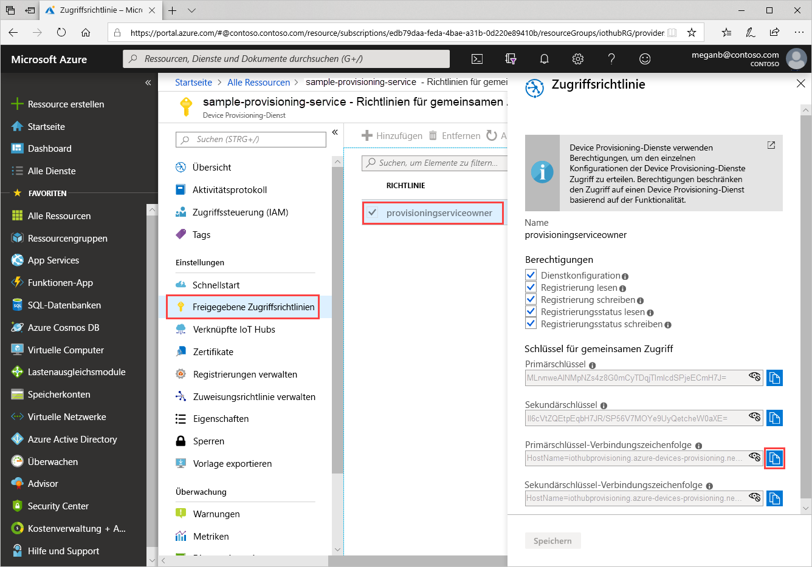
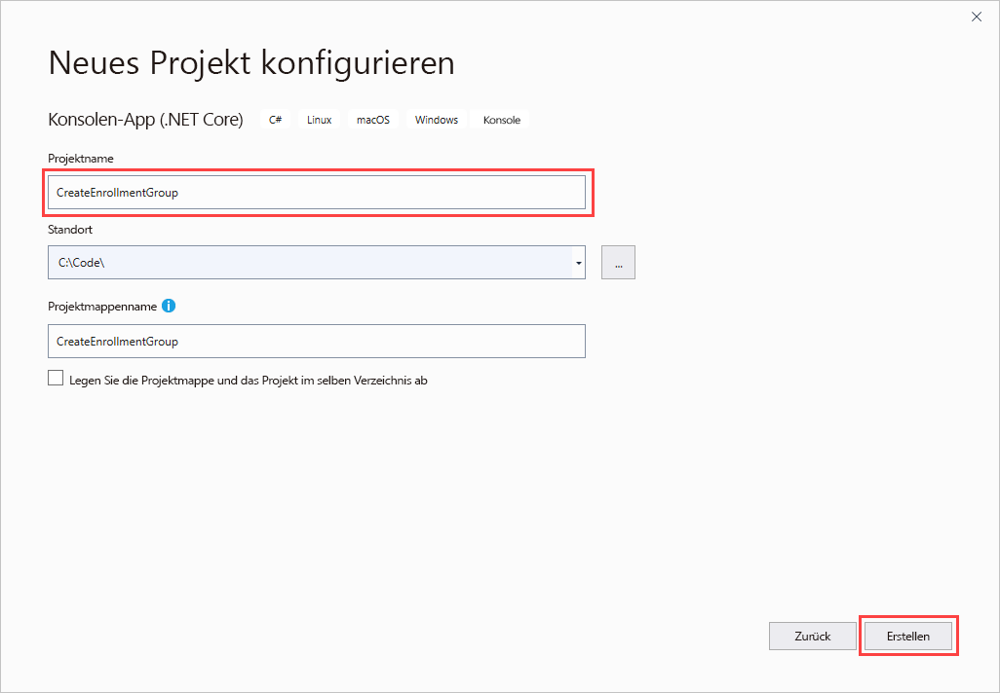
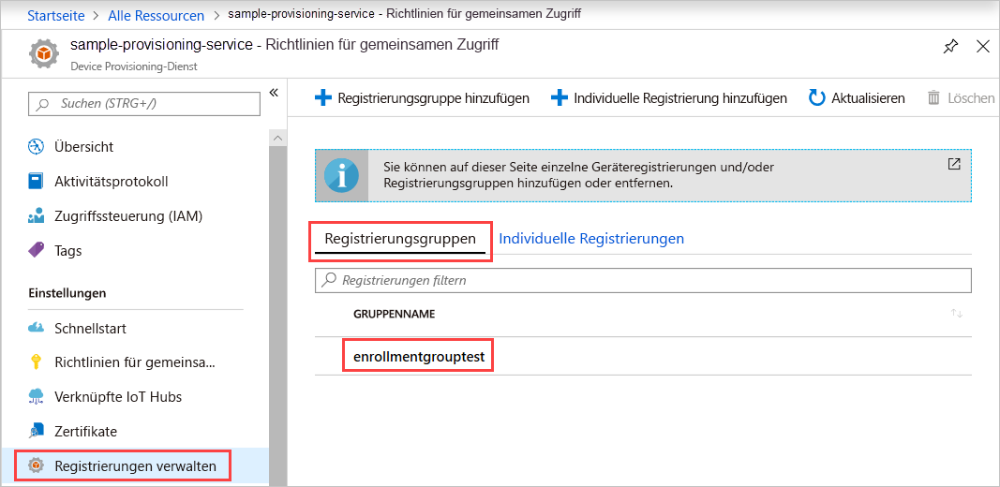

# <a name="quickstart-enroll-x509-devices-to-the-device-provisioning-service-using-c"></a>Schnellstart: Registrieren von X.509-Geräten für den Device Provisioning-Dienst mit C#

[!INCLUDE [iot-dps-selector-quick-enroll-device-x509](../../includes/iot-dps-selector-quick-enroll-device-x509.md)]

In dieser Schnellstartanleitung wird veranschaulicht, wie Sie mit C# programmgesteuert eine [Registrierungsgruppe](concepts-service.md#enrollment-group) erstellen, für die X.509-Zertifizierungsstellenzertifikate (Zwischen- oder Stammzertifikat) verwendet werden. Die Registrierungsgruppe wird mit dem [Microsoft Azure IoT SDK für .NET](https://github.com/Azure/azure-iot-sdk-csharp) und einer C# .NET Core-Beispielanwendung erstellt. Eine Registrierungsgruppe steuert den Zugriff auf den Bereitstellungsdienst für Geräte, die das gleiche allgemeine Signaturzertifikat in ihrer Zertifikatkette verwenden. Weitere Informationen finden Sie unter [Steuern des Gerätezugriffs auf den Bereitstellungsdienst mit X.509-Zertifikaten](./concepts-security.md#controlling-device-access-to-the-provisioning-service-with-x509-certificates). Weitere Informationen zur Verwendung der auf dem X.509-Zertifikat basierenden Public Key-Infrastruktur (PKI) mit Azure IoT Hub und dem Device Provisioning-Dienst finden Sie unter [Geräteauthentifizierung mit X.509-Zertifikaten](https://docs.microsoft.com/azure/iot-hub/iot-hub-x509ca-overview). 

In dieser Schnellstartanleitung wird vorausgesetzt, dass Sie bereits einen IoT Hub und Device Provisioning Service-Instanz erstellt haben. Falls diese Ressourcen noch nicht vorhanden sind, gehen Sie zunächst die Schnellstartanleitung [Einrichten des IoT Hub Device Provisioning-Diensts über das Azure-Portal](./quick-setup-auto-provision.md) durch, bevor Sie mit diesem Artikel fortfahren.

Die Schritte in diesem Artikel funktionieren für Windows- und Linux-Computer. In diesem Artikel wird allerdings nur ein Windows-Entwicklungscomputer verwendet.

[!INCLUDE [quickstarts-free-trial-note](../../includes/quickstarts-free-trial-note.md)]

## <a name="prerequisites"></a>Voraussetzungen

* Installieren Sie [Visual Studio 2019](https://www.visualstudio.com/vs/).
* Installieren Sie das [.NET Core SDK](https://www.microsoft.com/net/download/windows).
* Installieren Sie [Git](https://git-scm.com/download/).

## <a name="prepare-test-certificates"></a>Vorbereiten von Testzertifikaten

Für diese Schnellstartanleitung müssen Sie über eine PEM- oder CER-Datei verfügen, die den öffentlichen Teil eines X.509-Zertifizierungsstellenzertifikats (Zwischen- oder Stammzertifikat) enthält. Dieses Zertifikat muss in Ihren Bereitstellungsdienst hochgeladen und vom Dienst überprüft werden.

Das [Azure IoT C SDK](https://github.com/Azure/azure-iot-sdk-c) enthält Testtools zum Erstellen einer X.509-Zertifikatkette, zum Hochladen eines Stamm- oder Zwischenzertifikats aus dieser Kette und zum Durchführen eines Eigentumsnachweises über den Dienst, um das Zertifikat zu überprüfen.

> [!CAUTION]
> Verwenden Sie Zertifikate, die mit den SDK-Tools sind ausschließlich zur Verwendung für Tests in der Entwicklung erstellt wurden.
> Verwenden Sie diese Zertifikate nicht in der Produktionsumgebung.
> Sie enthalten hartcodierte Kennwörter wie etwa *1234*, die nach 30 Tagen ablaufen.
> Informationen zum Abrufen von Zertifikaten, die für den Einsatz in der Produktion geeignet sind, finden Sie in der Azure IoT Hub-Dokumentation unter [Abrufen eines X.509-Zertifizierungsstellenzertifikats](https://docs.microsoft.com/azure/iot-hub/iot-hub-x509ca-overview#how-to-get-an-x509-ca-certificate).
>

Führen Sie die folgenden Schritte aus, um diese Testtools zum Generieren von Zertifikaten zu verwenden:

1. Öffnen Sie ein Eingabeaufforderungsfenster oder eine Git Bash-Shell, und wechseln Sie auf Ihrem Computer in einen Arbeitsordner. Führen Sie den folgenden Befehl zum Klonen des [Azure IoT C SDK](https://github.com/Azure/azure-iot-sdk-c)-GitHub-Repositorys aus:

   ```cmd/sh
   git clone https://github.com/Azure/azure-iot-sdk-c.git --recursive
   ```

   Sie sollten damit rechnen, dass die Ausführung dieses Vorgangs mehrere Minuten in Anspruch nimmt.

   Die Testtools befinden sich im geklonten Repository unter *azure-iot-sdk-c/tools/CACertificates*.

1. Führen Sie die Schritte unter [Managing test CA certificates for samples and tutorials](https://github.com/Azure/azure-iot-sdk-c/blob/master/tools/CACertificates/CACertificateOverview.md) (Verwalten von Zertifizierungsstellen-Testzertifikaten für Beispiele und Tutorials) aus.

Zusätzlich zu den Tools im C SDK veranschaulicht das [Beispiel zum Überprüfen des Gruppenzertifikats](https://github.com/Azure-Samples/azure-iot-samples-csharp/tree/master/provisioning/Samples/service/GroupCertificateVerificationSample) im *Microsoft Azure IoT SDK für .NET* das Ausführen eines Eigentumsnachweises in C# für ein vorhandenes X.509-Zwischen- oder -Stammzertifikat einer Zertifizierungsstelle.

## <a name="get-the-connection-string-for-your-provisioning-service"></a>Abrufen der Verbindungszeichenfolge für Ihren Bereitstellungsdienst

Für das Beispiel in dieser Schnellstartanleitung benötigen Sie die Verbindungszeichenfolge für Ihren Bereitstellungsdienst.

1. Melden Sie sich beim Azure-Portal an, wählen Sie **Alle Ressourcen** aus, und öffnen Sie die Device Provisioning Service-Instanz.

1. Wählen Sie **Freigegebene Zugriffsrichtlinien** und anschließend die gewünschte Zugriffsrichtlinie aus, um die dazugehörigen Eigenschaften zu öffnen. Kopieren Sie unter **Zugriffsrichtlinie** die Primärschlüssel-Verbindungszeichenfolge, und notieren Sie sie.

    

## <a name="create-the-enrollment-group-sample"></a>Erstellen des Registrierungsgruppenbeispiels 

Dieser Abschnitt zeigt, wie Sie eine .NET Core-Konsolen-App erstellen, die Ihrem Bereitstellungsdienst eine Registrierungsgruppe hinzufügt. Wenn Sie diese Schritte etwas abwandeln, können Sie damit auch eine [Windows IoT Core](https://developer.microsoft.com/en-us/windows/iot)-Konsolen-App zum Hinzufügen der Registrierungsgruppe erstellen. Weitere Informationen zum Entwickeln mit IoT Core finden Sie in der [Windows IoT Core-Dokumentation für Entwickler](https://docs.microsoft.com/windows/iot-core/).

1. Öffnen Sie Visual Studio, und wählen Sie **Neues Projekt erstellen** aus. Wählen Sie unter **Neues Projekt erstellen** die Projektvorlage **Konsolen-App (.NET Core)** für C# und dann **Weiter** aus.

1. Nennen Sie das Projekt *CreateEnrollmentGroup*, und wählen Sie anschließend **Erstellen** aus.

    

1. Klicken Sie im **Projektmappen-Explorer** mit der rechten Maustaste auf das Projekt **CreateEnrollmentGroup**, und wählen Sie dann **NuGet-Pakete verwalten** aus.

1. Wählen Sie im **NuGet-Paket-Manager** die Option **Durchsuchen** aus, suchen Sie nach **Microsoft.Azure.Devices.Provisioning.Service**, wählen Sie diese Option aus, und klicken Sie dann auf **Installieren**.

    

   In diesem Schritt wird das NuGet-Paket mit dem [Client-SDK für Azure IoT Provisioning Service](https://www.nuget.org/packages/Microsoft.Azure.Devices.Provisioning.Service/) heruntergeladen und installiert und ein Verweis auf das Paket und seine Abhängigkeiten hinzugefügt.

1. Fügen Sie am Anfang von `Program.cs` nach den anderen `using`-Anweisungen die folgenden `using`-Anweisungen hinzu:

   ```csharp
   using System.Security.Cryptography.X509Certificates;
   using System.Threading.Tasks;
   using Microsoft.Azure.Devices.Provisioning.Service;
   ```

1. Fügen Sie die folgenden Felder zur `Program`-Klasse hinzu, und nehmen Sie die aufgeführten Änderungen vor.  

   ```csharp
   private static string ProvisioningConnectionString = "{Your provisioning service connection string}";
   private static string EnrollmentGroupId = "enrollmentgrouptest";
   private static string X509RootCertPath = @"{Path to a .cer or .pem file for a verified root CA or intermediate CA X.509 certificate}";
   ```

   * Ersetzen Sie den Platzhalterwert `ProvisioningConnectionString` durch die Verbindungszeichenfolge des Bereitstellungsdiensts, für den Sie die Registrierung erstellen möchten.

   * Ersetzen Sie den Platzhalterwert `X509RootCertPath` durch den Pfad zu einer PEM- oder CER-Datei. Diese Datei stellt den öffentlichen Teil eines X.509-Zwischenzertifikats oder -Stammzertifikats einer Zertifizierungsstelle dar, das zuvor für Ihren Bereitstellungsdienst hochgeladen und überprüft wurde.

   * Sie können auch den Wert `EnrollmentGroupId` ändern, dies ist jedoch optional. Die Zeichenfolge darf nur Kleinbuchstaben und Bindestriche enthalten.

   > [!IMPORTANT]
   > Beachten Sie bei Produktionscode die folgenden Sicherheitshinweise:
   >
   > * Die Hartcodierung der Verbindungszeichenfolge für den Bereitstellungsdienstadministrator verstößt gegen die bewährten Methoden für die Sicherheit. Stattdessen sollte die Verbindungszeichenfolge sicher gespeichert werden, etwa in einer sicheren Konfigurationsdatei oder in der Registrierung.
   > * Achten Sie darauf, dass nur der öffentliche Teil des Signaturzertifikats hochgeladen wird. Laden Sie nie PFX-Dateien (PKCS12) oder PEM-Dateien mit privaten Schlüsseln in den Bereitstellungsdienst hoch.

1. Fügen Sie der `Program`-Klasse die folgende Methode hinzu. Dieser Code erstellt einen Registrierungsgruppeneintrag und ruft dann die `CreateOrUpdateEnrollmentGroupAsync`-Methode für `ProvisioningServiceClient` auf, um die Registrierungsgruppe zum Bereitstellungsdienst hinzuzufügen.

   ```csharp
   public static async Task RunSample()
   {
       Console.WriteLine("Starting sample...");
 
       using (ProvisioningServiceClient provisioningServiceClient =
               ProvisioningServiceClient.CreateFromConnectionString(ProvisioningConnectionString))
       {
           #region Create a new enrollmentGroup config
           Console.WriteLine("\nCreating a new enrollmentGroup...");
           var certificate = new X509Certificate2(X509RootCertPath);
           Attestation attestation = X509Attestation.CreateFromRootCertificates(certificate);
           EnrollmentGroup enrollmentGroup =
                   new EnrollmentGroup(
                           EnrollmentGroupId,
                           attestation)
                   {
                       ProvisioningStatus = ProvisioningStatus.Enabled
                   };
           Console.WriteLine(enrollmentGroup);
           #endregion
 
           #region Create the enrollmentGroup
           Console.WriteLine("\nAdding new enrollmentGroup...");
           EnrollmentGroup enrollmentGroupResult =
               await provisioningServiceClient.CreateOrUpdateEnrollmentGroupAsync(enrollmentGroup).ConfigureAwait(false);
           Console.WriteLine("\nEnrollmentGroup created with success.");
           Console.WriteLine(enrollmentGroupResult);
           #endregion
 
       }
   }
   ```

1. Ersetzen Sie schließlich den Text der Methode `Main` durch die folgenden Zeilen:

   ```csharp
   RunSample().GetAwaiter().GetResult();
   Console.WriteLine("\nHit <Enter> to exit ...");
   Console.ReadLine();
   ```

1. Erstellen Sie die Projektmappe.

## <a name="run-the-enrollment-group-sample"></a>Ausführen des Registrierungsgruppenbeispiels
  
Führen Sie das Beispiel in Visual Studio aus, um die Registrierungsgruppe zu erstellen. Nach erfolgreicher Erstellung werden im Eingabeaufforderungsfenster die Eigenschaften der neuen Registrierungsgruppe angezeigt.

Überprüfen Sie, ob die Registrierungsgruppe erstellt wurde. Navigieren Sie zur Device Provisioning Service-Zusammenfassung, und wählen Sie **Registrierungen verwalten** und anschließend **Registrierungsgruppen** aus. Daraufhin sollte ein neuer Registrierungseintrag mit der im Beispiel verwendeten Registrierungs-ID angezeigt werden.



Wählen Sie den Eintrag aus, um den Zertifikatfingerabdruck und andere Eigenschaften für den Eintrag zu überprüfen.

## <a name="clean-up-resources"></a>Bereinigen von Ressourcen

Wenn Sie sich das C#-Dienstbeispiel näher ansehen möchten, dürften Sie die in dieser Schnellstartanleitung erstellten Ressourcen nicht bereinigen. Führen Sie andernfalls die folgenden Schritte aus, um alle Ressourcen zu löschen, die im Rahmen dieser Schnellstartanleitung erstellt wurden.

1. Schließen Sie das Ausgabefenster des C#-Beispiels auf Ihrem Computer.

1. Navigieren Sie im Azure-Portal zu Ihrem Device Provisioning Service, klicken Sie auf **Registrierungen verwalten**, und wählen Sie anschließend **Registrierungsgruppen** aus. Wählen Sie die *Registrierungs-ID* für den Registrierungseintrag aus, den Sie mit dieser Schnellstartanleitung erstellt haben, und wählen Sie **Löschen** aus.

1. Klicken Sie im Azure-Portal für Ihren Device Provisioning Service auf **Zertifikate**, wählen Sie das Zertifikat aus, das Sie für diesen Schnellstart hochgeladen haben, und klicken Sie anschließend über **Zertifikatdetails** auf **Löschen**.  

## <a name="next-steps"></a>Nächste Schritte

In dieser Schnellstartanleitung haben Sie eine Registrierungsgruppe für ein X.509-Zwischenzertifikat oder -Stammzertifikat einer Zertifizierungsstelle erstellt, indem Sie Azure IoT Hub Device Provisioning Service verwendet haben. Ausführlichere Informationen zur Gerätebereitstellung finden Sie im Tutorial zur Einrichtung des Device Provisioning-Diensts über das Azure-Portal.

> [!div class="nextstepaction"]
> [Tutorials für den Azure IoT Hub Device Provisioning-Dienst](./tutorial-set-up-cloud.md)
