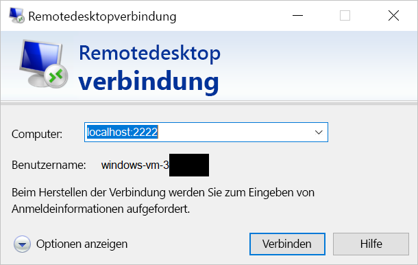

# <a name="quickstart-enable-ssh-and-rdp-over-an-iot-hub-device-stream-by-using-a-nodejs-proxy-application-preview"></a>Schnellstart: Ermöglichen von SSH und RDP über einen IoT Hub-Gerätestream unter Verwendung einer Node.js-Proxyanwendung (Vorschauversion)

[!INCLUDE [iot-hub-quickstarts-4-selector](../../includes/iot-hub-quickstarts-4-selector.md)]

Microsoft Azure IoT Hub unterstützt derzeit Gerätestreams als [Previewfunktion](https://azure.microsoft.com/support/legal/preview-supplemental-terms/).

Über [IoT Hub-Gerätestreams](./iot-hub-device-streams-overview.md) können Dienst- und Geräteanwendungen sicher und firewallfreundlich kommunizieren. 

In dieser Schnellstartanleitung erfahren Sie, wie Sie eine serverseitig ausgeführte Node.js-Proxyanwendung ausführen, sodass SSH-Datenverkehr (Secure Shell) und RDP-Datenverkehr (Remotedesktopprotokoll) über einen Gerätestream an das Gerät gesendet werden kann. Eine Übersicht über das Setup finden Sie im [Beispiel für lokale Proxys](./iot-hub-device-streams-overview.md#local-proxy-sample-for-ssh-or-rdp). 

Während der Public Preview-Phase unterstützt das Node.js SDK nur dienstseitige Gerätestreams. Aus diesem Grund wird in dieser Schnellstartanleitung nur das Ausführen der lokalen Dienstproxyanwendung erläutert. Informationen zum Ausführen der lokalen Geräteproxyanwendung finden Sie in den folgenden Artikeln:  

   * [Schnellstart: SSH/RDP über einen IoT Hub-Gerätestream unter Verwendung einer C-Proxyanwendung (Vorschauversion)](./quickstart-device-streams-proxy-c.md)
   * [Schnellstart: SSH/RDP über einen IoT Hub-Gerätestream unter Verwendung einer C#-Proxyanwendung (Vorschauversion)](./quickstart-device-streams-proxy-csharp.md)

Dieser Artikel beschreibt das Setup für SSH (unter Verwendung von Port 22) und anschließend, wie das Setup für RDP (verwendet Port 3389) geändert wird. Gerätestreams sind anwendungs- und protokollunabhängig. Das gleiche Beispiel kann daher für andere Arten von Anwendungsdatenverkehr von Clients/Servern angepasst werden (in der Regel durch Ändern des Kommunikationsports).

[!INCLUDE [cloud-shell-try-it.md](../../includes/cloud-shell-try-it.md)]

Wenn Sie kein Azure-Abonnement besitzen, können Sie ein [kostenloses Konto](https://azure.microsoft.com/free/?WT.mc_id=A261C142F) erstellen, bevor Sie beginnen.

## <a name="prerequisites"></a>Voraussetzungen

* Die Vorschau der Gerätestreams wird derzeit nur für IoT-Hubs unterstützt, die in folgenden Regionen erstellt werden:

  * USA (Mitte)
  * USA, Mitte (EUAP)

* Auf Ihrem Entwicklungscomputer muss mindestens Node.js v10.x.x installiert sein, um die lokale Dienstanwendung in diesem Schnellstart ausführen zu können.
  * Laden Sie [Node.js](https://nodejs.org) für mehrere Plattformen herunter.
  * Überprüfen Sie mit dem folgenden Befehl die aktuelle Node.js-Version auf Ihrem Entwicklungscomputer:

   ```
   node --version
   ```

* Führen Sie den folgenden Befehl aus, um Ihrer Cloud Shell-Instanz die Azure IoT-Erweiterung für die Azure-Befehlszeilenschnittstelle hinzuzufügen. Die IoT-Erweiterung fügt der Azure-Befehlszeilenschnittstelle spezifische Befehle für IoT Hub, IoT Edge und IoT Device Provisioning Service (DPS) hinzu.

    ```azurecli-interactive
    az extension add --name azure-cli-iot-ext
    ```

* [Laden Sie das Node.js-Beispielprojekt herunter](https://github.com/Azure-Samples/azure-iot-samples-node/archive/streams-preview.zip), und extrahieren Sie das ZIP-Archiv (falls Sie dies nicht bereits getan haben).

## <a name="create-an-iot-hub"></a>Erstellen eines IoT Hubs

Wenn Sie das vorherige Tutorial [Schnellstart: Senden von Telemetriedaten von einem Gerät an eine IoT Hub-Instanz und Lesen der Telemetriedaten aus der IoT Hub-Instanz mit einer Back-End-Anwendung (Node.js)](quickstart-send-telemetry-node.md) absolviert haben, können Sie diesen Schritt überspringen.

[!INCLUDE [iot-hub-include-create-hub-device-streams](../../includes/iot-hub-include-create-hub-device-streams.md)]

## <a name="register-a-device"></a>Registrieren eines Geräts

Wenn Sie [Schnellstart: Senden von Telemetriedaten von einem Gerät an eine IoT Hub-Instanz und Lesen der Telemetriedaten aus der IoT Hub-Instanz mit einer Back-End-Anwendung (Node.js)](quickstart-send-telemetry-node.md) absolviert haben, können Sie diesen Schritt überspringen.

Ein Gerät muss bei Ihrer IoT Hub-Instanz registriert sein, um eine Verbindung herstellen zu können. In diesem Abschnitt verwenden Sie Azure Cloud Shell, um ein simuliertes Gerät zu registrieren.

1. Führen Sie in Cloud Shell den folgenden Befehl aus, um die Geräteidentität zu erstellen:

   > [!NOTE]
   > * Ersetzen Sie den Platzhalter *YourIoTHubName* durch den Namen, den Sie für Ihren IoT-Hub wählen.
   > * Verwenden Sie *MyDevice* wie gezeigt. Der für das registrierte Gerät angegebene Name. Wenn Sie für Ihr Gerät einen anderen Namen auswählen, verwenden Sie diesen im gesamten Artikel, und aktualisieren Sie den Gerätenamen in den Beispielanwendungen, bevor Sie sie ausführen.

    ```azurecli-interactive
    az iot hub device-identity create --hub-name YourIoTHubName --device-id MyDevice
    ```

1. Darüber hinaus benötigen Sie eine *Dienstverbindungszeichenfolge*, damit die Back-End-Anwendung eine Verbindung mit Ihrem IoT-Hub herstellen und die Nachrichten abrufen kann. Der folgende Befehl ruft die Zeichenfolge für Ihren IoT-Hub ab:

   > [!NOTE]
   > Ersetzen Sie den Platzhalter *YourIoTHubName* durch den Namen, den Sie für Ihren IoT-Hub wählen.

    ```azurecli-interactive
    az iot hub show-connection-string --policy-name service --name YourIoTHubName
    ```

    Notieren Sie sich den zurückgegebenen Wert zur späteren Verwendung in dieser Schnellstartanleitung. Dies sieht in etwa wie im folgenden Beispiel aus:

   `"HostName={YourIoTHubName}.azure-devices.net;SharedAccessKeyName=service;SharedAccessKey={YourSharedAccessKey}"`

## <a name="ssh-to-a-device-via-device-streams"></a>Herstellen einer SSH-Verbindung mit einem Gerät über Gerätestreams

In diesem Abschnitt richten Sie einen End-to-End-Stream ein, um SSH-Datenverkehr zu tunneln.

### <a name="run-the-device-local-proxy-application"></a>Ausführen der lokalen Geräteproxyanwendung

Wie bereits erwähnt, unterstützt das IoT Hub Node.js SDK nur dienstseitige Gerätestreams. Verwenden Sie für die lokale Geräteanwendung eine Geräteproxyanwendung, die in den folgenden Schnellstartanleitungen verfügbar ist:

   * [Schnellstart: SSH/RDP über einen IoT Hub-Gerätestream unter Verwendung einer C-Proxyanwendung (Vorschauversion)](./quickstart-device-streams-proxy-c.md)
   * [Schnellstart: SSH/RDP über einen IoT Hub-Gerätestream unter Verwendung einer C#-Proxyanwendung (Vorschauversion)](./quickstart-device-streams-proxy-csharp.md) 

Vergewissern Sie sich, dass die lokale Geräteproxyanwendung ausgeführt wird, bevor Sie mit dem nächsten Schritt fortfahren.

### <a name="run-the-service-local-proxy-application"></a>Ausführen der lokalen Dienstproxyanwendung

Wenn die lokale Geräteproxyanwendung ausgeführt wird, führen Sie die in Node.js geschriebene lokale Dienstproxyanwendung wie folgt aus:

1. Geben Sie für Umgebungsvariablen Ihre Dienstanmeldeinformationen, die ID des Zielgeräts, auf dem der SSH-Daemon ausgeführt wird, und die Portnummer für den auf dem Gerät ausgeführten Proxy ein.

   ```
   # In Linux
   export IOTHUB_CONNECTION_STRING="<provide_your_service_connection_string>"
   export STREAMING_TARGET_DEVICE="MyDevice"
   export PROXY_PORT=2222

   # In Windows
   SET IOTHUB_CONNECTION_STRING=<provide_your_service_connection_string>
   SET STREAMING_TARGET_DEVICE=MyDevice
   SET PROXY_PORT=2222
   ```

   Ändern Sie die Werte oben basierend auf Ihrer Geräte-ID und Verbindungszeichenfolge.

1. Navigieren Sie in Ihrem entzippten Projektordner zum Verzeichnis *Quickstarts/device-streams-service*, und führen Sie die lokale Dienstproxyanwendung aus.

   ```
   cd azure-iot-samples-node-streams-preview/iot-hub/Quickstarts/device-streams-service

   # Install the preview service SDK, and other dependencies
   npm install azure-iothub@streams-preview
   npm install

   # Run the service-local proxy application
   node proxy.js
   ```

### <a name="ssh-to-your-device-via-device-streams"></a>Herstellen einer SSH-Verbindung mit Ihrem Gerät über Gerätestreams

Verwenden Sie unter Linux `ssh $USER@localhost -p 2222` in einem Terminal, um SSH auszuführen. Verwenden Sie unter Windows Ihren bevorzugten SSH-Client (beispielsweise PuTTY).

Im Anschluss sehen Sie die Konsolenausgabe des lokalen Diensts nach Einrichtung der SSH-Sitzung. (Die lokale Dienstproxyanwendung lauscht an Port 2222.)


Konsolenausgabe des SSH-Clientprogramms (Der SSH-Client kommuniziert mit dem SSH-Daemon, indem er eine Verbindung mit Port 22 herstellt, an dem die lokale Dienstproxyanwendung lauscht.)


### <a name="rdp-to-your-device-via-device-streams"></a>Herstellen einer RDP-Verbindung mit Ihrem Gerät über Gerätestreams

Stellen Sie nun mithilfe Ihrer RDP-Clientanwendung eine Verbindung mit dem lokalen Dienstproxy an Port 2222 her. (Hierbei handelt es sich um einen beliebigen Port, den Sie zuvor ausgewählt haben.)

> [!NOTE]
> Vergewissern Sie sich, dass Ihr Geräteproxy ordnungsgemäß für RDP sowie mit dem RDP-Port 3389 konfiguriert ist.



## <a name="clean-up-resources"></a>Bereinigen von Ressourcen

[!INCLUDE [iot-hub-quickstarts-clean-up-resources](../../includes/iot-hub-quickstarts-clean-up-resources-device-streams.md)]

## <a name="next-steps"></a>Nächste Schritte

In dieser Schnellstartanleitung haben Sie einen IoT-Hub eingerichtet, ein Gerät registriert und eine Dienstproxyanwendung bereitgestellt, um RDP- und SSH-Verbindungen mit einem IoT-Gerät zu ermöglichen. RDP- und SSH-Datenverkehr wird über einen Gerätestream über den IoT-Hub getunnelt. Bei diesem Vorgang ist keine direkte Verbindung mit dem Gerät erforderlich.

Weitere Informationen zu Gerätestreams finden Sie hier:

> [!div class="nextstepaction"]
> [IoT Hub-Gerätestreams (Vorschau)](./iot-hub-device-streams-overview.md)
