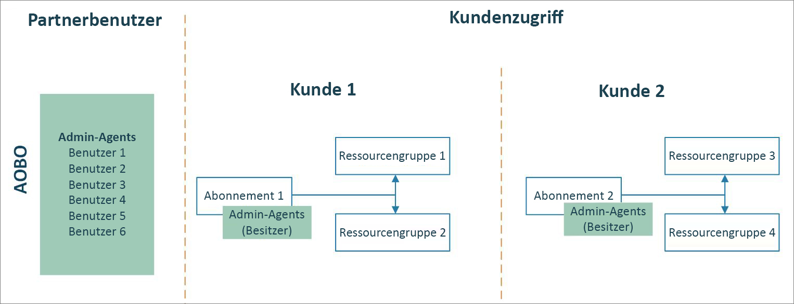
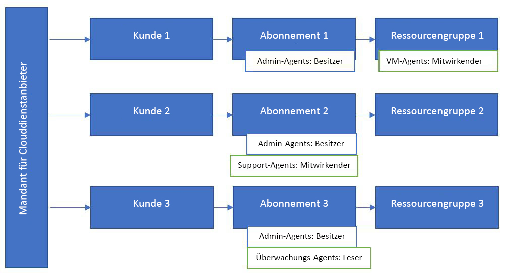

# Azure Lighthouse und das Programm für Cloud-Lösungsanbieter

Als [CSP](https://docs.microsoft.com/partner-center/csp-overview)-Partner (Cloud Solution Provider) können Sie bereits auf die durch das CSP-Programm für Ihre Kunden erstellten Azure-Abonnements zugreifen, indem Sie die Funktion [AOBO (Administer On Behalf Of, Verwalten im Namen von)](https://channel9.msdn.com/Series/cspdev/Module-11-Admin-On-Behalf-Of-AOBO) verwenden. Dieser Zugriff gestattet es Ihnen, die Abonnements Ihrer Kunden direkt zu unterstützen, zu konfigurieren und zu verwalten.

Mit Azure Lighthouse können Sie die delegierte Azure-Ressourcenverwaltung zusammen mit AOBO verwenden. Dies trägt zur Verbesserung der Sicherheit bei und reduziert unnötigen Zugriff, da Sie präzisere Berechtigungen für Ihre Benutzer vergeben können. Darüber hinaus werden eine höhere Effizienz und Skalierbarkeit ermöglicht, da Ihre Benutzer mit nur einer Anmeldung bei Ihrem Mandanten mehrere Kundenabonnements verwenden können.

> [!TIP]
> Damit die Ressourcen der Kunden geschützt sind, überprüfen und befolgen Sie unsere [empfohlenen Sicherheitsmaßnahmen](recommended-security-practices.md) sowie die [Sicherheitsanforderungen für Partner](https://docs.microsoft.com/partner-center/partner-security-requirements).

## Verwalten im Namen von (AOBO)

Mit AOBO erhält jeder Benutzer mit der Rolle [Administrator-Agent](https://docs.microsoft.com/partner-center/permissions-overview#manage-commercial-transactions-in-partner-center-azure-ad-and-csp-roles) in Ihrem Mandanten AOBO-Zugriff auf Azure-Abonnements, die Sie durch das CSP-Programm erstellen. Alle Benutzer, die Zugriff auf Abonnements von Kunden benötigen, müssen Mitglied dieser Gruppe sein. AOBO lässt nicht die Flexibilität zu, unterschiedliche Gruppen zu erstellen, die mit verschiedenen Kunden zusammenarbeiten, oder verschiedene Rollen für Gruppen oder Benutzer zu aktivieren.

## Delegierte Azure-Ressourcenverwaltung

Mithilfe der delegierten Azure-Ressourcenverwaltung können Sie verschiedenen Kunden oder Rollen unterschiedliche Gruppen zuweisen, wie im folgenden Diagramm dargestellt. Da Benutzer durch die delegierte Azure-Ressourcenverwaltung über die geeignete Zugriffsebene verfügen, können Sie die Anzahl der Benutzer verringern, die über die Rolle „Administrator-Agent“ verfügen (und somit über AOBO-Vollzugriff verfügen). Dies trägt zu einer höheren Sicherheit durch Einschränkung des unnötigen Zugriffs auf die Ressourcen ihrer Kunden bei. Es verleiht Ihnen außerdem mehr Flexibilität, um mehrere Kunden skaliert zu verwalten.

Das Onboarding eines Abonnements, das Sie über das CSP-Programm erstellt haben, erfolgt gemäß den Schritten, die in [Onboarding eines Abonnements in die delegierte Azure-Ressourcenverwaltung](../how-to/onboard-customer.md) beschrieben sind. Jeder Benutzer, der in Ihrem Mandanten über die Rolle „Administrator-Agent“ verfügt, kann dieses Onboarding durchführen.

## Nächste Schritte

- Erfahren Sie über [Mandantenübergreifende Verwaltungsmöglichkeiten](cross-tenant-management-experience.md).
- Erfahren Sie, wie Sie [das Onboarding eines Abonnements für delegierte Azure-Ressourcenverwaltung durchführen](../how-to/onboard-customer.md).
- Erhalten Sie Informationen über das [Programm für Cloud-Lösungsanbieter](https://docs.microsoft.com/partner-center/csp-overview).
