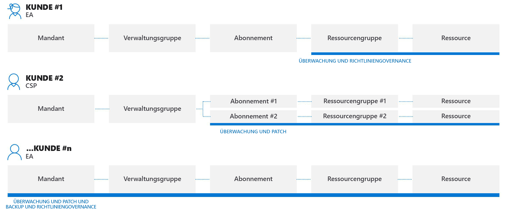
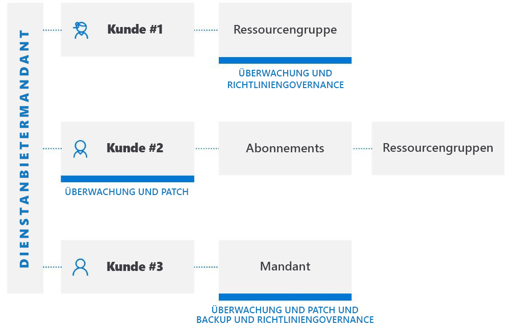

# Mandantenübergreifende Verwaltungsmöglichkeiten

In diesem Artikel werden die Szenarien beschrieben, die Sie als Dienstanbieter mit der [delegierten Azure-Ressourcenverwaltung](../concepts/azure-delegated-resource-management.md) nutzen können, um Azure-Ressourcen für mehrere Kunden in Ihrem eigenen Mandanten im [Azure-Portal](https://portal.azure.com) zu verwalten.

> [!NOTE]
> Die delegierte Azure-Ressourcenverwaltung kann auch in einem Unternehmen verwendet werden, das über mehrere eigene Mandanten verfügt, um die mandantenübergreifende Verwaltung zu vereinfachen.

## Grundlegendes zu Kundenmandanten

Ein Azure Active Directory-Mandant (Azure AD) ist eine Darstellung einer Organisation. Es handelt sich um eine dedizierte Instanz von Azure AD, die Organisationen bereitgestellt wird, wenn diese sich für Azure, Microsoft 365 oder andere Dienste registrieren und damit eine Geschäftsbeziehung mit Microsoft eingehen. Jeder Azure AD-Mandant ist eindeutig und von anderen Azure AD-Mandanten getrennt und verfügt über eine eigene Mandanten-ID (eine GUID). Weitere Informationen finden Sie unter [Was ist Azure Active Directory?](https://docs.microsoft.com/azure/active-directory/fundamentals/active-directory-whatis).

Um Azure-Ressourcen für einen Kunden zu verwalten, müssten sich Dienstanbieter in der Regel mit einem Konto beim Azure-Portal anmelden, das dem Mandanten dieses Kunden zugeordnet ist, wofür ein Administrator im Mandanten des Kunden benötigt wird, um Benutzerkonten für den Dienstanbieter zu erstellen und zu verwalten.

Mit der delegierten Azure-Ressourcenverwaltung gibt der Onboardingprozess Benutzer im Mandanten des Dienstanbieters an, die auf Abonnements, Ressourcengruppen und Ressourcen im Mandanten des Kunden zugreifen und diese verwalten können sollen. Diese Benutzer können sich dann beim Azure-Portal mit ihren eigenen Anmeldeinformationen anmelden. Innerhalb des Azure-Portals können Sie Ressourcen verwalten, die zu allen Kunden gehören, auf die sie Zugriff haben. Hierzu können Sie die Seite [Meine Kunden](../how-to/view-manage-customers.md) im Azure-Portal besuchen oder direkt im Kontext des Abonnements dieses Kunden arbeiten, entweder im Azure-Portal oder mittels APIs.

Die delegierte Azure-Ressourcenverwaltung ermöglicht größere Flexibilität bei der Verwaltung von Ressourcen für mehrere Kunden, ohne sich bei verschiedenen Konten in unterschiedlichen Mandanten anmelden zu müssen. So kann ein Dienstanbieter beispielsweise drei Kunden mit unterschiedlichen Zuständigkeiten und Zugriffsebenen haben, wie hier gezeigt:

Mithilfe der delegierten Azure-Ressourcenverwaltung können sich autorisierte Benutzer beim Mandanten des Dienstanbieters anmelden, um auf diese Ressourcen zuzugreifen, wie hier gezeigt:

## Unterstützte Dienste und Szenarien

Zurzeit unterstützt die mandantenübergreifende Verwaltung die folgenden Szenarien mit delegierten Kundenressourcen:

[Azure Automation](https://docs.microsoft.com/azure/automation/):

- Verwenden von Automation-Konten für den Zugriff auf und die Arbeit mit delegierten Kundenressourcen

[Azure Backup](https://docs.microsoft.com/azure/backup/):

- Sichern und Wiederherstellen von Kundendaten in Kundenmandanten

[Azure Kubernetes Service (AKS)](https://docs.microsoft.com//azure/aks/):

- Verwalten gehosteter Kubernetes-Umgebungen und Bereitstellen und Verwalten von Containeranwendungen innerhalb von Kundenmandanten

[Azure Monitor](https://docs.microsoft.com/azure/azure-monitor/):

- Anzeigen von Warnungen für delegierte Abonnements im Azure-Portal oder programmgesteuert durch REST-API-Aufrufe mit der Möglichkeit zum Anzeigen von Warnungen aus allen Abonnements
- Anzeigen von Aktivitätsprotokolldetails für delegierte Abonnements
- Log Analytics: Abfragen von Daten aus Remote-Kundenarbeitsbereichen in mehreren Mandanten
- Erstellen von Warnungen in Kundenmandanten, die eine Automatisierung auslösen, wie z. B. Azure Automation-Runbooks oder Azure Functions im Dienstanbietermandanten über Webhooks

[Azure Policy](https://docs.microsoft.com/azure/governance/policy/):

- Compliancemomentaufnahmen zeigen Details von zugewiesenen Richtlinien innerhalb delegierter Abonnements
- Erstellen und Bearbeiten von Richtliniendefinitionen innerhalb eines delegierten Abonnements
- Zuweisen der von Kunden definierten Richtliniendefinitionen innerhalb des delegierten Abonnements
- Kunden werden Richtlinien, die vom Dienstanbieter erstellt wurden, zusammen mit allen Richtlinien angezeigt, die sie selbst erstellt haben.
- [Beheben von „deployIfNotExists“ oder Ändern von Zuweisungen innerhalb des Kundenmandanten](../how-to/deploy-policy-remediation.md)

[Azure Resource Graph](https://docs.microsoft.com/azure/governance/resource-graph/):

- Enthält jetzt die Mandanten-ID in zurückgegebenen Abfrageergebnissen, sodass Sie ermitteln können, ob ein Abonnement zum Mandanten des Kunden oder dem des Dienstanbieters gehört.

[Azure Security Center](https://docs.microsoft.com/azure/security-center/):

- Mandantenübergreifende Sichtbarkeit
  - Überwachen der Compliance mit Sicherheitsrichtlinien und Sicherstellen der Sicherheitsabdeckung für alle Ressourcen der Mandanten
  - Kontinuierliche Überwachung der Einhaltung gesetzlicher Bestimmungen für mehrere Kunden in einer einzigen Ansicht
  - Überwachen, Selektieren und Priorisieren von umsetzbaren Sicherheitsempfehlungen mit Sicherheitsbewertungsberechnung
- Mandantenübergreifende Sicherheitsstatusverwaltung
  - Verwalten von Sicherheitsrichtlinien
  - Ergreifen von Maßnahmen für Ressourcen, die nicht mit umsetzbaren Sicherheitsempfehlungen konform sind
  - Erfassen und Speichern von sicherheitsbezogenen Daten
- Mandantenübergreifend Bedrohungserkennung und entsprechender Schutz davor
  - Erkennen von Bedrohungen über Ressourcen von Mandanten hinweg
  - Anwenden von Advanced Threat Protection-Kontrollen, wie z. B. JIT-VM-Zugriff (Just-in-Time)
  - Verstärkung des Schutzes der Konfiguration von Netzwerksicherheitsgruppen mit adaptiver Netzwerkhärtung
  - Sicherstellung mittels adaptiver Anwendungssteuerung, dass auf Servern nur die Anwendungen und Prozesse ausgeführt werden, die ausgeführt werden sollten
  - Überwachen von Änderungen an wichtigen Dateien und Registrierungseinträgen mittels Überwachung der Dateiintegrität (FIM)

[Azure Sentinel:](https://docs.microsoft.com/azure/sentinel/multiple-tenants-service-providers)

- Verwalten von Azure Sentinel-Ressourcen in Kundenmandanten

[Azure Service Health](https://docs.microsoft.com/azure/service-health/):

- Überwachen der Integrität von Kundenressourcen mittels Azure Resource Health
- Verfolgen der Integrität der Azure-Dienste, die von ihren Kunden verwendet werden

[Azure Site Recovery](https://docs.microsoft.com/azure/site-recovery/):

- Verwalten von Notfallwiederherstellungsoptionen für virtuelle Azure-Computer in Kundenmandanten (beachten Sie, dass Sie keine „RunAs“-Konten zum Kopieren von VM-Erweiterungen verwenden können)

[Azure Virtual Machines](https://docs.microsoft.com/azure/virtual-machines/):

- Verwenden von VM-Erweiterungen, um nach der Bereitstellung Konfigurations- und Automatisierungsaufgaben auf virtuellen Azure-Computern in Kundenmandanten auszuführen
- Verwenden der Startdiagnose zur Problembehandlung von Azure-VMs in Kundenmandanten
- Zugreifen auf VMs mit der seriellen Konsole in Kundenmandanten
- Beachten Sie, dass Sie Azure Active Directory nicht für die Remoteanmeldung bei einem virtuellen Computer verwenden können, und dass Sie keine VM mit einem Key Vault für Kennwörter, geheime Schlüssel oder Kryptografieschlüssel für die Datenträgerverschlüsselung integrieren können.

[Azure Virtual Network](https://docs.microsoft.com/azure/virtual-network/):

- Bereitstellen und Verwalten virtueller Netzwerke und virtueller Netzwerkschnittstellenkarten (vNICs) innerhalb von Kundenmandanten

Supportanfragen:

- Supportanfragen für delegierte Ressourcen können Sie auf dem Blatt **Hilfe und Support** im Azure-Portal öffnen (indem Sie den für den delegierten Bereich verfügbaren Supportplan auswählen).

## Aktuelle Einschränkungen
Beachten Sie bei allen Szenarios die folgenden aktuellen Einschränkungen:

- Von Azure Resource Manager verarbeitete Anforderungen können mithilfe der delegierten Azure-Ressourcenverwaltung durchgeführt werden. Die Vorgangs-URIs für diese Anforderungen beginnen mit `https://management.azure.com`. Anforderungen, die von einer Instanz eines Ressourcentyps verarbeitet werden (z. B. Zugriff auf Key Vault-Geheimnisse oder Zugriff auf Speicherdaten) verarbeitet werden, werden nicht von der delegierten Azure-Ressourcenverwaltung unterstützt. Die Vorgangs-URIs für diese Anforderungen beginnen in der Regel mit einer Adresse, die für Ihre Instanz eindeutig ist, z. B. `https://myaccount.blob.core.windows.net` oder `https://mykeyvault.vault.azure.net/`. Letzteres sind in der Regel auch eher Datenvorgänge als Verwaltungsvorgänge. 
- Rollenzuweisungen müssen [integrierte Rollen](https://docs.microsoft.com/azure/role-based-access-control/built-in-roles) für die rollenbasierte Zugriffssteuerung (RBAC) verwenden. Alle integrierten Rollen werden derzeit mit der delegierten Azure-Ressourcenverwaltung unterstützt, mit Ausnahme von „Besitzer“, „Benutzerzugriffsadministrator“ und allen integrierten Rollen mit der [DataActions](https://docs.microsoft.com/azure/role-based-access-control/role-definitions#dataactions)-Berechtigung. Benutzerdefinierte Rollen und [klassische Abonnementadministratorrollen](https://docs.microsoft.com/azure/role-based-access-control/classic-administrators) werden ebenfalls nicht unterstützt.
- Derzeit ist es nicht möglich, ein Abonnement (oder eine Ressourcengruppe innerhalb eines Abonnements) für die delegierte Azure-Ressourcenverwaltung zu integrieren, wenn das Abonnement Azure Databricks verwendet. Ähnlich können Sie, wenn ein Abonnement für das Onboarding mit dem **Microsoft.ManagedServices**-Ressourcenanbieter registriert wurde, zu diesem Zeitpunkt auch keinen Databricks-Arbeitsbereich für dieses Abonnement erstellen.

## Verwenden von APIs und Verwaltungstools mit mandantenübergreifender Verwaltung

Für die oben aufgeführten unterstützten Dienste und Szenarien können Sie Verwaltungsaufgaben entweder direkt im Portal oder mithilfe von APIs und Verwaltungstools (z. B. Azure CLI und Azure PowerShell) durchführen. Alle vorhandenen APIs können bei der Arbeit mit delegierten Ressourcen (für Dienste, die unterstützt werden) verwendet werden.

Es gibt auch APIs, die speziell für die Durchführung von delegierten Azure-Ressourcenverwaltungsaufgaben gedacht sind. Weitere Informationen finden Sie im Abschnitt **Referenz**.

## Nächste Schritte

- Onboarding Ihrer Kunden in die delegierte Azure-Ressourcenverwaltung, entweder unter [Verwendung von Azure Resource Manager-Vorlagen](../how-to/onboard-customer.md) oder mittels [Veröffentlichung eines privaten oder öffentlichen Angebots für verwaltete Dienste im Azure Marketplace](../how-to/publish-managed-services-offers.md).
- [Anzeigen und Verwalten von Kunden](../how-to/view-manage-customers.md), indem sie im Azure-Portal zu **Meine Kunden** navigieren.
