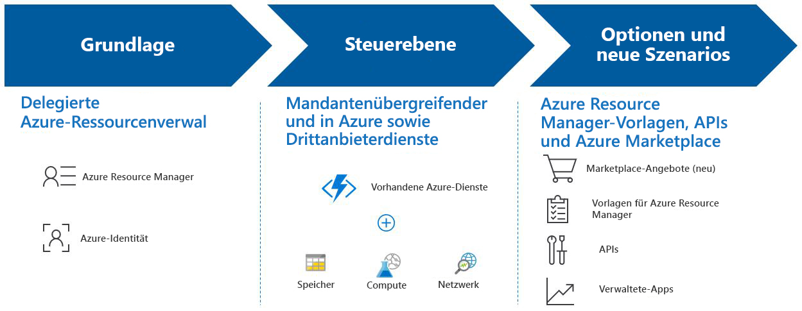

# Was ist Azure Lighthouse?

Azure Lighthouse bietet Dienstanbietern eine zentrale Steuerungsebene, um Azure für alle ihre Kunden mit höherer Automatisierung, Skalierbarkeit und verbesserter Governance anzuzeigen und zu verwalten. Mit Azure Lighthouse können Dienstanbieter verwaltete Dienste mithilfe umfassender und stabiler Verwaltungstools bereitstellen, die in die Azure-Plattform integriert sind. Dieses Angebot kann auch IT-Abteilungen von Unternehmen zugutekommen, die Ressourcen in mehreren Mandanten verwalten.

## Vorteile

Azure Lighthouse hilft Ihnen bei der profitablen und effizienten Erstellung und Bereitstellung verwalteter Dienste für Ihre Kunden. Es ergeben sich folgende Vorteile:

- **Bedarfsorientierte Verwaltung**: Kundenbindungs- und Lebenszyklusvorgänge zur Verwaltung von Kundenressourcen sind einfacher und besser skalierbar.
- **Besserer Einblick und höhere Genauigkeit für Kunden**: Kunden, deren Ressourcen Sie verwalten, haben einen besseren Einblick in Ihre Aktionen und eine genauere Kontrolle über den Bereich, den sie zur Verwaltung delegieren, während Ihre IP-Adresse erhalten bleibt.
- **Umfassende und einheitliche Plattformtools**: Unsere Toolerfahrung ist auf wichtige Dienstanbieterszenarien ausgelegt, einschließlich mehrerer Lizenzierungsmodelle wie EA (Enterprise Agreement), CSP (Cloud-Lösungsanbieter) und nutzungsbasierte Bezahlung. Die neuen Funktionen arbeiten mit vorhandenen Tools und APIs, Lizenzierungsmodellen und Partnerprogrammen wie dem [Programm für Cloud-Lösungsanbieter](https://docs.microsoft.com/partner-center/csp-overview). Die von Ihnen ausgewählten Azure Lighthouse-Optionen lassen sich in Ihre vorhandenen Workflows und Anwendungen integrieren, und Sie können Ihre Wirksamkeit auf die Kundenbindung nachverfolgen, indem Sie [Ihre Partner-ID verknüpfen](https://docs.microsoft.com/azure/billing/billing-partner-admin-link-started).

Es fallen keine zusätzlichen Kosten für die Verwendung von Azure Lighthouse an, um die Azure-Ressourcen ihrer Kunden zu verwalten.

## Funktionen

Azure Lighthouse umfasst mehrere Möglichkeiten zur Optimierung von Kundenbindung und -verwaltung:

- **Delegierte Azure-Ressourcenverwaltung**: Verwalten Sie die Azure-Ressourcen Ihrer Kunden sicher aus Ihrem eigenen Mandanten heraus, ohne den Kontext oder Steuerungsebenen wechseln zu müssen. Weitere Informationen finden Sie unter [Delegierte Azure-Ressourcenverwaltung](./concepts/azure-delegated-resource-management.md).
- **Neue Azure-Portalerfahrung**: Zeigen Sie mandantenübergreifende Informationen auf der neuen Seite **Meine Kunden** im [Azure-Portal](https://portal.azure.com) an. Auf einem entsprechenden Blatt **Dienstanbieter** können Ihre Kunden den Dienstanbieterzugriff anzeigen und verwalten. Weitere Informationen finden Sie unter [Anzeigen und Verwalten von Kunden](./how-to/view-manage-customers.md) und [Anzeigen und Verwalten von Dienstanbietern](./how-to/view-manage-service-providers.md).
- **Azure Resource Manager-Vorlagen**: Führen Sie Verwaltungsaufgaben leichter durch, einschließlich Onboarding von Kunden für die delegierte Azure-Ressourcenverwaltung. Weitere Informationen finden Sie in unserem [Beispielrepository](https://github.com/Azure/Azure-Lighthouse-samples/tree/master/Azure-Delegated-Resource-Management/templates) und unter [Onboarding eines Kunden für die delegierte Azure-Ressourcenverwaltung](how-to/onboard-customer.md).
- **Angebote für verwaltete Dienste in Azure Marketplace**: Bieten Sie Ihre Dienste Kunden durch private oder öffentliche Angebote an, und lassen Sie diese automatisch in die delegierte Azure-Ressourcenverwaltung integrieren, als Alternative zum Onboarding mithilfe von Azure Resource Manager-Vorlagen. Weiter Informationen finden Sie unter [Angebote für verwaltete Dienste in Azure Marketplace](./concepts/managed-services-offers.md).
- **Verwaltete Azure-Anwendungen**: Packen und versenden Sie Anwendungen, die von Ihren Kunden einfach bereitgestellt und in ihren eigenen Abonnements verwendet werden können. Die Anwendung wird in einer Ressourcengruppe bereitgestellt, auf die Sie von Ihrem Mandanten aus zugreifen, sodass Sie den Dienst im Rahmen der gesamten Azure Lighthouse-Erfahrung verwalten können. Weitere Informationen finden Sie unter [Übersicht über verwaltete Azure-Anwendungen](https://docs.microsoft.com/azure/managed-applications/overview).

## Nächste Schritte

- Informationen zur [delegierten Azure-Ressourcenverwaltung](concepts/azure-delegated-resource-management.md)
- Erfahren Sie über [Mandantenübergreifende Verwaltungsmöglichkeiten](concepts/cross-tenant-management-experience.md).
