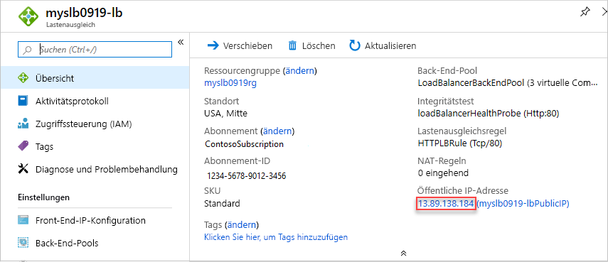

# <a name="quickstart-create-a-standard-load-balancer-to-load-balance-vms-by-using-azure-resource-manager-template"></a>Schnellstart: Erstellen einer Load Balancer Standard-Instanz für den Lastenausgleich virtueller Computer mithilfe einer Azure Resource Manager-Vorlage

Durch die Verteilung der eingehenden Anforderungen auf mehrere virtuelle Computer (VMs) bietet ein Lastenausgleich ein höheres Maß an Verfügbarkeit und Skalierbarkeit. Dieser Schnellstart zeigt Ihnen, wie Sie eine Azure Resource Manager-Vorlage bereitstellen, die einen Lastenausgleich im Tarif „Standard“ für VMs erstellt. Bei Verwendung der Resource Manager-Vorlage werden im Vergleich zu anderen Bereitstellungsmethoden weniger Schritte benötigt.

Die [Resource Manager-Vorlage](../azure-resource-manager/template-deployment-overview.md) ist eine JSON-Datei (JavaScript Object Notation), in der die Infrastruktur und die Konfiguration für Ihr Projekt definiert sind. Für die Vorlage wird deklarative Syntax verwendet. Hiermit können Sie angeben, was Sie bereitstellen möchten, ohne dass Sie die Folge der Programmierbefehle für die Erstellung schreiben müssen. Weitere Informationen zur Entwicklung von Resource Manager-Vorlagen finden Sie in der [Resource Manager-Dokumentation](/azure/azure-resource-manager/) und der [Vorlagenreferenz](/azure/templates/microsoft.network/loadbalancers).

Wenn Sie kein Azure-Abonnement besitzen, können Sie ein [kostenloses Konto](https://azure.microsoft.com/free/?WT.mc_id=A261C142F) erstellen, bevor Sie beginnen.

## <a name="create-a-standard-load-balancer"></a>Erstellen eines Load Balancers im Tarif „Standard“

Ein Lastenausgleich im Tarif „Standard“ unterstützt nur eine öffentliche Standard-IP-Adresse. Wenn Sie einen Lastenausgleich im Tarif „Standard“ erstellen, müssen Sie auch eine neue öffentliche Standard-IP-Adresse erstellen, die für diesen Lastenausgleich als Front-End konfiguriert ist.

Die in dieser Schnellstartanleitung verwendete Vorlage ist eine [Schnellstartvorlage](https://raw.githubusercontent.com/Azure/azure-quickstart-templates/master/101-load-balancer-standard-create/azuredeploy.json).

[!code-json[<Azure Resource Manager template create standard load balancer>](~/quickstart-templates/101-load-balancer-standard-create/azuredeploy.json)]

In der Vorlage wurden mehrere Azure-Ressourcen definiert:

- **Microsoft.Network/loadBalancers**
- **Microsoft.Network/publicIPAddresses**: Gilt für den Lastenausgleich.
- **Microsoft.Network/networkSecurityGroups**
- **Microsoft.Network/virtualNetworks**
- **Microsoft.Compute/virutalMachines** (3)
- **Microsoft.Network/publicIPAddresses** (3): Eine für jeden der drei virtuellen Computer.
- **Microsoft.Network/networkInterfaces** (3)
- **Microsoft.Compute/virtualMachine/extensions** (3): Dient zur IIS-Konfiguration und für die Webseiten.

Weitere Vorlagen zum Azure Load Balancer finden Sie unter [Azure-Schnellstartvorlagen](https://azure.microsoft.com/resources/templates/?resourceType=Microsoft.Network&pageNumber=1&sort=Popular).

1. Wählen Sie **Try it** (Ausprobieren) im folgenden Codeblock aus, um Azure Cloud Shell zu öffnen. Folgen Sie dann den Anweisungen, um sich bei Azure anzumelden.

   ```azurepowershell-interactive
   $projectName = Read-Host -Prompt "Enter a project name with 12 or less letters or numbers that is used to generate Azure resource names"
   $location = Read-Host -Prompt "Enter the location (i.e. centralus)"
   $adminUserName = Read-Host -Prompt "Enter the virtual machine administrator account name"
   $adminPassword = Read-Host -Prompt "Enter the virtual machine administrator password" -AsSecureString

   $resourceGroupName = "${projectName}rg"
   $templateUri = "https://raw.githubusercontent.com/Azure/azure-quickstart-templates/master/101-load-balancer-standard-create/azuredeploy.json"

   New-AzResourceGroup -Name $resourceGroupName -Location $location
   New-AzResourceGroupDeployment -ResourceGroupName $resourceGroupName -TemplateUri $templateUri -projectName $projectName -location $location -adminUsername $adminUsername -adminPassword $adminPassword

   Write-Host "Press [ENTER] to continue."
   ```

   Warten Sie, bis die Aufforderung in der Konsole angezeigt wird.

1. Wählen Sie **Copy** (Kopieren) im vorherigen Codeblock aus, um das PowerShell-Skript zu kopieren.

1. Klicken Sie mit der rechten Maustaste auf den Shellkonsolenbereich, und wählen Sie **Einfügen** aus.

1. Gehen Sie die Werte ein.

   Die Vorlagenbereitstellung erstellt drei Verfügbarkeitszonen. Verfügbarkeitszonen werden nur in [bestimmten Regionen](../availability-zones/az-overview.md) unterstützt. Verwenden Sie eine der unterstützten Regionen. Wenn Sie nicht sicher sind, geben Sie **centralus** ein.

   Der Ressourcengruppenname ist der Projektname mit dem Zusatz **rg**. Sie benötigen den Ressourcengruppennamen im nächsten Abschnitt.

Das Bereitstellen der Vorlage dauert ungefähr 10 Minuten. Nach Abschluss des Vorgangs sieht die Ausgabe in etwa wie folgt aus:


Azure PowerShell wird verwendet, um die Vorlage bereitzustellen. Neben Azure PowerShell können Sie auch das Azure-Portal, die Azure-CLI und die REST-API verwenden. Informationen zu anderen Bereitstellungsmethoden finden Sie unter [Bereitstellen von Vorlagen](../azure-resource-manager/resource-group-template-deploy-portal.md).

## <a name="test-the-load-balancer"></a>Testen des Lastenausgleichs

1. Melden Sie sich beim [Azure-Portal](https://portal.azure.com) an.

1. Wählen Sie im linken Bereich **Ressourcengruppen** aus.

1. Wählen Sie die Ressourcengruppe aus, die Sie im vorherigen Abschnitt erstellt haben. Der Ressourcengruppenname entspricht standardmäßig dem Projektnamen mit dem Zusatz **rg**.

1. Wählen Sie den Load Balancer aus. Sein Standardname entspricht dem Projektnamen mit dem Zusatz **-lb**.

1. Kopieren Sie nur den IP-Adressteil der öffentlichen IP-Adresse, und fügen Sie ihn in die Adressleiste des Browsers ein.

   

    Der Browser zeigt die Standardseite des Internetinformationsdienste-Webservers (Internet Information Services, IIS) an.

   

Sie können vom Clientcomputer aus eine erzwungene Aktualisierung Ihres Webbrowsers durchführen, um zu verfolgen, wie der Lastenausgleich den Datenverkehr auf alle drei virtuellen Computer verteilt.

## <a name="clean-up-resources"></a>Bereinigen von Ressourcen

Sie können die Ressourcengruppe, den Lastenausgleich und alle dazugehörigen Ressourcen löschen, wenn Sie sie nicht mehr benötigen. Wählen Sie hierzu im Azure-Portal die Ressourcengruppe aus, die den Lastenausgleich enthält, und wählen Sie anschließend **Ressourcengruppe löschen** aus.

## <a name="next-steps"></a>Nächste Schritte

In diesem Schnellstart haben Sie einen Lastenausgleich im Tarif „Standard“ erstellt, virtuelle Computer angefügt, die Datenverkehrsregel für den Lastenausgleich konfiguriert, einen Integritätstest durchgeführt und den Lastenausgleich getestet.

Weitere Informationen zum Lastenausgleich finden Sie in den Tutorials.

> [!div class="nextstepaction"]
> [Azure Load Balancer-Tutorials](tutorial-load-balancer-standard-public-zone-redundant-portal.md)
