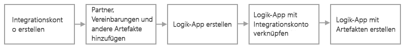

# B2B-Unternehmensintegrationslösungen mit Azure Logic Apps und dem Enterprise Integration Pack

Für Business-to-Business-Lösungen (B2B) und eine nahtlose Kommunikation zwischen Organisationen können Sie mithilfe des Enterprise Integration Pack (EIP) mit [Azure Logic Apps](../logic-apps/logic-apps-overview.md) automatisierte skalierbare Unternehmensintegrationsworkflows erstellen. Organisationen können Nachrichten elektronisch austauschen, auch wenn sie unterschiedliche Protokolle und Formate verwenden. Das EIP wandelt verschiedene Formate in ein Format um, das von den Systemen Ihrer Organisation verarbeitet werden kann, und unterstützt branchenübliche Protokolle wie [AS2](../logic-apps/logic-apps-enterprise-integration-as2.md), [X12](logic-apps-enterprise-integration-x12.md) und [EDIFACT](../logic-apps/logic-apps-enterprise-integration-edifact.md). Sie können Nachrichten auch mit Verschlüsselung und digitalen Signaturen schützen. Das EIP unterstützt diese [Unternehmensintegrationsconnectors](../connectors/apis-list.md#integration-account-connectors) und diese Branchenstandards:

* Electronic Data Interchange (EDI)
* Enterprise Application Integration (EAI)

Wenn Sie mit Microsoft BizTalk Server oder Azure BizTalk Services vertraut sind, sind die Features leicht zu verwenden, da das EIP ähnliche Konzepte befolgt. Ein wesentlicher Unterschied besteht jedoch darin, dass die Architektur des EIP auf Integrationskonten basiert, um die Speicherung und Verwaltung von Artefakten zu vereinfachen, die bei der B2B-Kommunikation verwendet werden. Diese Konten sind cloudbasierte Container, in denen alle Artefakte wie Partner, Vereinbarungen, Schemas, Zuordnungen und Zertifikate gespeichert werden. 

## Gründe für die Verwendung des Enterprise Integration Pack

* Mit dem EIP können Sie alle Ihre Artefakte zentral in Ihrem Integrationskonto speichern.

* Sie können B2B-Workflows erstellen und in Software-as-a-Service-Apps (SaaS) von Drittanbietern, lokalen Apps und benutzerdefinierten Apps integrieren, indem Sie Azure Logic Apps und Connectors nutzen.

* Mit Azure Functions können Sie benutzerdefinierten Code für Ihre Logik-Apps erstellen.

## Wie fange ich an?

Bevor Sie mit dem EIP mit dem Entwickeln von B2B-Logik-App-Workflows beginnen, benötigen Sie Folgendes:

* Ein Azure-Abonnement. Wenn Sie nicht über ein Azure-Abonnement verfügen, können Sie sich [für ein kostenloses Azure-Konto registrieren](https://azure.microsoft.com/free/).

* Ein [Integrationskonto](../logic-apps/logic-apps-enterprise-integration-create-integration-account.md) mit den Artefakten, die Sie verwenden möchten

* Zum Erstellen von Zuordnungen und Schemas können Sie die [Microsoft Azure Logic Apps Enterprise Integration Tools für Visual Studio 2015 2.0](https://aka.ms/vsmapsandschemas) und Visual Studio 2015 verwenden.

Wenn Sie ein Integrationskonto erstellt und Ihre Artefakte hinzugefügt haben, können Sie mithilfe dieser Artefakte B2B-Workflows erstellen, indem Sie eine Logik-App im Azure-Portal erstellen. Wenn Sie mit Logik-Apps noch nicht vertraut sind, [erstellen Sie zunächst eine einfache Logik-App](../logic-apps/quickstart-create-first-logic-app-workflow.md). Damit Sie diese Artefakte verwenden können, müssen Sie zunächst Ihr Integrationskonto mit Ihrer Logik-App verknüpfen. Anschließend kann Ihre Logik-App auf Ihr Integrationskonto zugreifen. Sie können Logik-Apps auch mithilfe von Visual Studio oder [PowerShell](https://docs.microsoft.com/powershell/module/az.logicapp) erstellen, verwalten und bereitstellen.

Im Folgenden finden Sie allgemeine Schritte, um mit dem Erstellen von B2B-Logik-Apps zu beginnen:

  

## Jetzt testen

[Bereitstellen einer voll funktionsfähigen Beispiel-Logik-App, die AS2-Nachrichten sendet und empfängt](https://github.com/Azure/azure-quickstart-templates/tree/master/201-logic-app-as2-send-receive)

## Nächste Schritte

* [Erstellen von Handelspartnern](logic-apps-enterprise-integration-partners.md)
* [Erstellen von Vereinbarungen](../logic-apps/logic-apps-enterprise-integration-agreements.md)
* [Hinzufügen von Schemas](logic-apps-enterprise-integration-schemas.md)
* [Hinzufügen von Zuordnungen](../logic-apps/logic-apps-enterprise-integration-maps.md)
* [Migrieren von BizTalk Services](../logic-apps/logic-apps-move-from-mabs.md)
