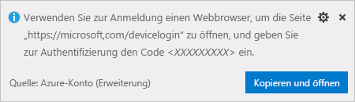
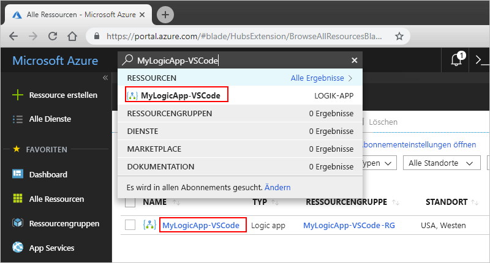

# <a name="quickstart-create-and-manage-logic-app-definitions-by-using-visual-studio-code"></a>Schnellstart: Erstellen und Verwalten von Logik-App-Definitionen mit Visual Studio Code

Mit [Azure Logic Apps](../logic-apps/logic-apps-overview.md) und Visual Studio Code lassen sich Logik-Apps erstellen und verwalten, mit denen Sie Aufgaben, Workflows und Prozessen zum Integrieren von Apps, Daten, Systemen und Diensten in Unternehmen und Organisationen automatisieren können. Dieser Schnellstart zeigt, wie Sie Workflowdefinitionen für Logik-Apps erstellen und bearbeiten, indem Sie in einer codebasierten Umgebung in JavaScript Object Notation (JSON) mit dem Workflow-Definitionsschema arbeiten. Sie können auch vorhandene Logik-Apps bearbeiten, die bereits in Azure bereitgestellt wurden.

Obwohl Sie dieselben Aufgaben im [Azure-Portal](https://portal.azure.com) und in Visual Studio ausführen können, können Sie in Visual Studio Code schneller starten, wenn Sie bereits mit Logik-App-Definitionen vertraut sind und direkt im Code arbeiten möchten. Beispielsweise können Sie bereits erstellte Logik-Apps deaktivieren, aktivieren, löschen und aktualisieren. Sie können zudem auf jeder Entwicklungsplattform, auf der Visual Studio Code ausgeführt wird – z.B. Linux, Windows und Mach, an Logik-Apps und Integrationskonten arbeiten.

Für diesen Artikel können Sie die Logik-App aus [dieser Schnellstartanleitung](../logic-apps/quickstart-create-first-logic-app-workflow.md) erstellen, die sich eher mit den grundlegenden Konzepten befasst. In Visual Studio Code sieht die Logik-App wie in diesem Beispiel aus:


Bevor Sie anfangen, müssen Sie die folgenden Voraussetzungen erfüllen:

* Wenn Sie nicht über ein Azure-Abonnement verfügen, können Sie sich [für ein kostenloses Azure-Konto registrieren](https://azure.microsoft.com/free/).

* Sie benötigen Grundkenntnisse über die [Workflowdefinitionen von Logik-Apps](../logic-apps/logic-apps-workflow-definition-language.md) und deren Struktur, in der JavaScript Object Notation (JSON) verwendet wird.

  Wenn Sie noch nicht mit Logik-Apps vertraut sind, probieren Sie [diese Schnellstartanleitung](../logic-apps/quickstart-create-first-logic-app-workflow.md) aus, in der Sie Ihre erste Logik-App im Azure-Portal erstellen und die sich eher mit den grundlegenden Konzepten befasst.

* Sie benötigen Zugriff auf das Web zum Anmelden bei Azure und in Ihrem Azure-Abonnement.

* Laden Sie diese Tools herunter, und installieren Sie sie, falls sie noch nicht vorhanden sind:

  * [Visual Studio Code, Version 1.25.1 oder höher](https://code.visualstudio.com/) (kostenlos)

  * Visual Studio Code-Erweiterung für Azure Logic Apps

    Sie können diese Erweiterung im [Visual Studio Marketplace](https://marketplace.visualstudio.com/items?itemName=ms-azuretools.vscode-logicapps) oder direkt in Visual Studio Code herunterladen und installieren. Laden Sie Visual Studio Code nach der Installation unbedingt neu.

    

    Wählen Sie das Azure-Symbol auf der Visual Studio Code-Symbolleiste aus, um zu überprüfen, ob die Erweiterung ordnungsgemäß installiert wurde.

    

    Weitere Informationen finden Sie im [Marketplace für Erweiterungen](https://code.visualstudio.com/docs/editor/extension-gallery). Unter [Azure Logic Apps-Erweiterung für Visual Studio Code auf GitHub](https://github.com/Microsoft/vscode-azurelogicapps) können Sie Beiträge zur Open-Source-Version dieser Erweiterung einreichen.

<a name="sign-in-azure"></a>

## <a name="sign-in-to-azure"></a>Anmelden bei Azure

1. Öffnen Sie Visual Studio Code. Wählen Sie in der Visual Studio Code-Symbolleiste das Azure-Symbol aus.

   

1. Wählen Sie im Azure-Fenster unter **Logik-Apps** die Option **Bei Azure anmelden** aus.

   

   Sie werden nun aufgefordert, sich mit dem bereitgestellten Authentifizierungscode anzumelden.

1. Kopieren Sie den Authentifizierungscode, und wählen Sie dann **Kopieren und öffnen** aus. Daraufhin wird ein neues Browserfenster geöffnet.

   

1. Geben Sie Ihren Authentifizierungscode ein. Wählen Sie bei entsprechender Aufforderung **Weiter** aus.

   

1. Wählen Sie Ihr Azure-Konto aus. Nach dem Anmelden können Sie den Browser schließen und zu Visual Studio Code zurückkehren.

   Im Azure-Fenster zeigen die Bereiche „Logik-Apps“ und „Integrationskonten“ nun die Azure-Abonnements in Ihrem Konto an.

   

   Wenn die erwarteten Abonnements nicht angezeigt werden, wählen Sie neben der Bezeichnung **Logik-Apps** die Option **Abonnements auswählen** (Filtersymbol) aus. Suchen Sie nach den gewünschten Abonnements, und wählen Sie sie aus.

1. Um alle vorhandenen Logik-Apps oder Integrationskonten in Ihrem Azure-Abonnement anzuzeigen, erweitern Sie Ihr Abonnement.

   

<a name="create-logic-app"></a>

## <a name="create-logic-app"></a>Erstellen einer Logik-App

1. Wenn Sie sich nicht über Visual Studio Code in Ihrem Azure-Abonnement angemeldet haben, befolgen Sie die Anleitung in diesem Artikel, um sich [jetzt anzumelden](#sign-in-azure).

1. Wählen Sie im Kontextmenü Ihres Abonnements **Erstellen** aus.

   

1. Wählen Sie aus der Liste mit den Azure-Ressourcengruppen in Ihrem Abonnement eine vorhandene Ressourcengruppe aus, oder **erstellen Sie eine neue Ressourcengruppe**.

   In diesem Beispiel wird eine neue Ressourcengruppe erstellt:

   

1. Geben Sie einen Namen für Ihre Azure-Ressourcengruppe ein, und drücken Sie dann die EINGABETASTE.

   

1. Wählen Sie den Standort des Rechenzentrums zum Speichern der Metadaten Ihrer Logik-App aus.

   

1. Geben Sie einen Namen für Ihre Logik-App ein, und drücken Sie dann die EINGABETASTE.

   

   Ihre neue Logik-App wird nun im Azure-Fenster unter Ihrem Azure-Abonnement angezeigt. Nun können Sie die Workflowdefinition Ihrer Logik-App erstellen.

1. Wählen Sie im Kontextmenü der Logik-App **In Editor öffnen** aus.

   

   Visual Studio Code öffnet eine Vorlage für die Logik-App-Workflowdefinition (Datei „.logicapp.json“), damit Sie mit dem Erstellen des Logik-App-Workflows beginnen können.

   

1. Beginnen Sie in der Vorlagendatei, die Workflowdefinition Ihrer Logik-App zu erstellen.
Weitere Informationen finden Sie in der [Schemareferenz zur Definitionssprache für Workflows in Azure Logic Apps](../logic-apps/logic-apps-workflow-definition-language.md).

   Hier sehen Sie eine beispielhafte Logik-App-Definition. JSON-Elemente werden in der Regel alphabetisch in jedem Abschnitt angezeigt. In diesem Beispiel werden diese Elemente jedoch ungefähr in der Reihenfolge angezeigt, in dem die Schritte der Logik-App im Designer aufgeführt sind.

   ```json
   {
      "$schema": "https://schema.management.azure.com/providers/Microsoft.Logic/schemas/2016-06-01/workflowdefinition.json#",
      "contentVersion": "1.0.0.0",
      "parameters": {
         "$connections": {
            "defaultValue": {},
            "type": "Object"
         }
      },
      "triggers": {
         "When_a_feed_item_is_published": {
            "recurrence": {
               "frequency": "Minute",
               "interval": 1
            },
            "splitOn": "@triggerBody()?['value']",
            "type": "ApiConnection",
            "inputs": {
               "host": {
                  "connection": {
                     "name": "@parameters('$connections')['rss']['connectionId']"
                  }
               },
               "method": "get",
               "path": "/OnNewFeed",
               "queries": {
                  "feedUrl": "http://feeds.reuters.com/reuters/topNews"
               }
            }
         }
      },
      "actions": {
         "Send_an_email": {
            "runAfter": {},
            "type": "ApiConnection",
            "inputs": {
               "body": {
                  "Body": "Title: @{triggerBody()?['title']}\n\nDate published: @{triggerBody()?['publishDate']}\n\nLink: @{triggerBody()?['primaryLink']}",
                  "Subject": "New RSS item: @{triggerBody()?['title']}",
                  "To": "Sophie.Owen@contoso.com"
               },
               "host": {
                  "connection": {
                     "name": "@parameters('$connections')['outlook']['connectionId']"
                  }
               },
               "method": "post",
               "path": "/Mail"
            }
         }
      },
      "outputs": {}
   }
   ```

1. Wenn Sie fertig sind, speichern Sie die Definitionsdatei Ihrer Logik-App. Wenn Visual Studio Code Sie auffordert, das Hochladen der Definition Ihrer Logik-App in Ihr Azure-Abonnement zu bestätigen, wählen Sie **Hochladen** aus.

   

   Nachdem Visual Studio Code Ihre Logik-App in Azure veröffentlicht hat, ist Ihre App live und wird im Azure-Portal ausgeführt.

   

<a name="edit-logic-app"></a>

## <a name="edit-logic-app"></a>Bearbeiten einer Logik-App

Wenn Sie eine Logik-App bearbeiten möchten, die in Azure veröffentlicht wurde, öffnen Sie die Definition der entsprechenden Logik-App mithilfe von Visual Studio Code.

1. Wenn Sie sich nicht über Visual Studio Code in Ihrem Azure-Abonnement angemeldet haben, befolgen Sie die Anleitung in diesem Artikel, um sich [jetzt anzumelden](#sign-in-azure).

1. Erweitern Sie im Azure-Fenster unter **Logik-Apps** Ihr Azure-Abonnement, und wählen Sie die gewünschte Logik-App aus.

1. Wählen Sie im Menü der Logik-App **In Editor öffnen** aus. Alternativ können Sie neben dem Namen Ihrer Logik-App das Bearbeitungssymbol auswählen.

   

   Visual Studio Code öffnet die Datei „.logicapp.json“ für die Workflowdefinition Ihrer Logik-App.

   

1. Nehmen Sie die gewünschten Änderungen an der Definition Ihrer Logik-App vor.

1. Speichern Sie Ihre Änderungen, wenn Sie fertig sind.

1. Wenn Visual Studio Code Sie auffordert, die Definition Ihrer Logik-App in Ihrem Azure-Abonnement zu aktualisieren, wählen Sie **Hochladen** aus.

   

## <a name="next-steps"></a>Nächste Schritte

> [!div class="nextstepaction"]
> * [Erstellen von Logik-Apps mit Visual Studio](../logic-apps/quickstart-create-logic-apps-with-visual-studio.md)