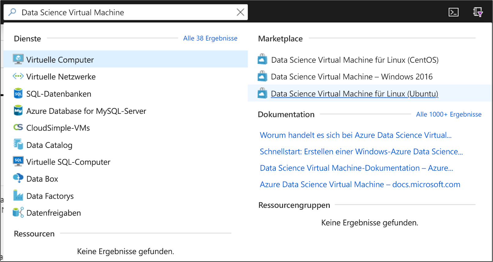
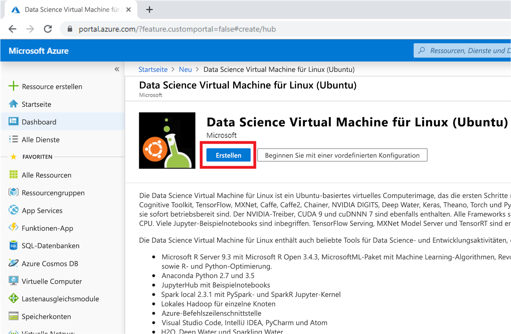
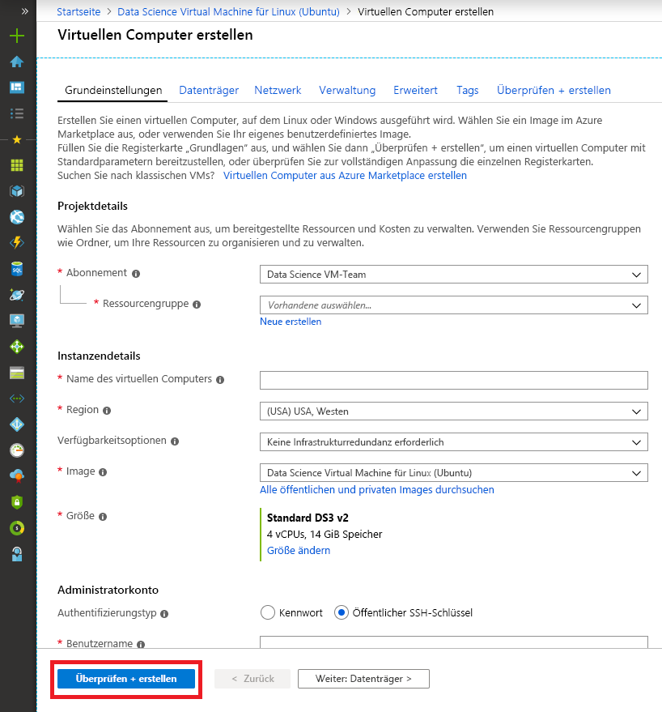
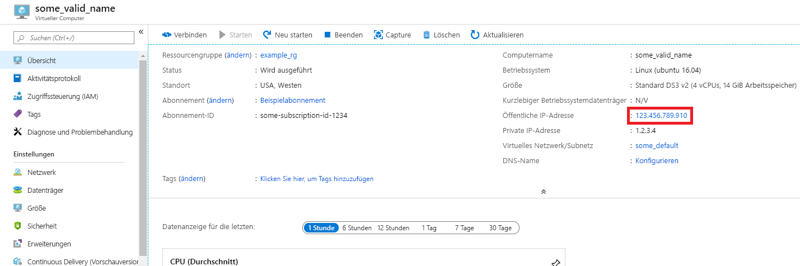
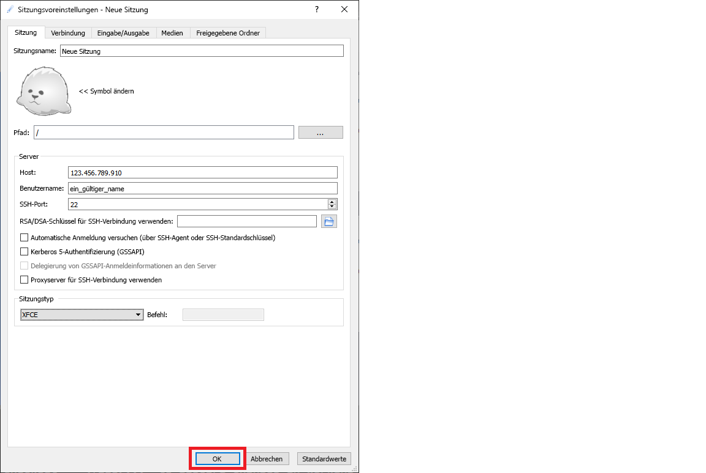

# <a name="quickstart-set-up-the-data-science-virtual-machine-for-linux-ubuntu"></a>Schnellstart: Einrichten von Data Science Virtual Machine für Linux (Ubuntu)

Schnelle Betriebsbereitschaft mit einer Data Science Virtual Machine-Instanz unter Ubuntu

## <a name="prerequisites"></a>Voraussetzungen

Zum Erstellen einer Data Science VM-Instanz unter Windows benötigen Sie ein Azure-Abonnement. [Testen Sie Azure kostenlos](https://azure.com/free).

## <a name="create-your-data-science-virtual-machine-for-linux"></a>Erstellen Ihrer Data Science Virtual Machine für Linux

Mit den folgenden Schritten erstellen Sie eine Instanz der Data Science Virtual Machine für Linux:

1. Rufen Sie das [Azure-Portal](https://portal.azure.com) auf. Falls Sie sich noch nicht bei Ihrem Azure-Konto angemeldet haben, erhalten Sie ggf. eine entsprechende Aufforderung.
1. Suchen Sie die Liste der virtuellen Computer, indem Sie „Data Science Virtual Machine“ eingeben und „Data Science Virtual Machine für Linux (Ubuntu)“ auswählen.
    
    

1. Wählen Sie im nachfolgenden Fenster die Option **Erstellen** aus.

   [](media/dsvm-ubuntu-intro/create-linux-expanded.png#lightbox)

1. Sie sollten auf das Blatt „Virtuellen Computer erstellen“ umgeleitet werden.
   
   

1. Geben Sie die folgenden Informationen ein, um die einzelnen Schritte des Assistenten zu konfigurieren:

    1. **Grundlagen**:
    
       * **Abonnement**: Falls Sie über mehrere Abonnements verfügen, müssen Sie das Abonnement auswählen, unter dem der Computer erstellt und abgerechnet werden soll. Sie müssen für dieses Abonnement über Berechtigungen zum Erstellen von Ressourcen verfügen.
       * **Ressourcengruppe**: Erstellen Sie eine neue Gruppe, oder verwenden Sie eine bereits vorhandene.
       * **Name des virtuellen Computers**: Geben Sie den Namen des virtuellen Computers ein. So wird er im Azure-Portal angezeigt.
       * **Region**: Wählen Sie das am besten geeignete Rechenzentrum aus. Den schnellsten Netzwerkzugriff erreichen Sie mit dem Datencenter, in dem der größte Teil Ihrer Daten gespeichert ist oder das Ihrem physischen Standort am nächsten ist. Weitere Informationen zu [Azure-Regionen](https://azure.microsoft.com/global-infrastructure/regions/).
       * **Image**: Behalten Sie den Standardwert bei.
       * **Größe**: Dies sollte automatisch mit einer Größe ausgefüllt werden, die für allgemeine Workloads geeignet ist. Lesen Sie mehr zu [Linux-VM-Größen in Azure](../../virtual-machines/linux/sizes.md).
       * **Authentifizierungstyp:** Wählen Sie für eine schnellere Einrichtung die Option „Kennwort“ aus. 
         
         > [!NOTE]
         > Wenn Sie JupyterHub verwenden möchten, achten Sie darauf, dass „Kennwort“ ausgewählt ist, da JupyterHub *nicht* für die Verwendung von öffentlichen SSH-Schlüsseln konfiguriert ist.

       * **Benutzername**: Geben Sie den Benutzernamen des Administrators ein. Dies ist der Benutzername, den Sie für die Anmeldung bei Ihrem virtuellen Computer verwenden. Er muss nicht mit Ihrem Azure-Benutzernamen identisch sein. Verwenden Sie *keine* Großbuchstaben.
         
         > [!NOTE]
         > Wenn Sie in Ihrem Benutzernamen Großbuchstaben verwenden, funktioniert JupyterHub nicht, und die Meldung „500 – Interner Serverfehler“ wird angezeigt.

       * **Kennwort**: Geben Sie das Kennwort ein, das Sie für die Anmeldung bei Ihrem virtuellen Computer verwenden.    
    
   1. Klicken Sie auf **Überprüfen + erstellen**.
   1. **Überprüfen + erstellen**
      * Stellen Sie sicher, dass alle eingegebenen Informationen richtig sind. 
      * Klicken Sie auf **Erstellen**.
    
    Die Bereitstellung sollte ungefähr 5 Minuten dauern. Der Status wird im Azure-Portal angezeigt.

## <a name="how-to-access-the-ubuntu-data-science-virtual-machine"></a>Zugreifen auf die Data Science VM-Instanz unter Ubuntu

Es gibt drei Methoden für den Zugriff auf die DSVM-Instanz unter Ubuntu:

  * SSH für Terminalsitzungen
  * X2Go für grafische Sitzungen
  * JupyterHub und JupyterLab für Jupyter-Notebooks

Sie können Azure Notebooks auch eine Data Science Virtual Machine zuordnen, um Jupyter-Notebooks auf der VM auszuführen und die Einschränkungen der kostenlosen Dienstebene zu umgehen. Weitere Informationen finden Sie unter [Verwalten und Konfigurieren von Projekten: Computeebene](../../notebooks/configure-manage-azure-notebooks-projects.md#compute-tier).

### <a name="ssh"></a>SSH

Nachdem der virtuelle Computer erstellt wurde, können Sie sich mit SSH anmelden, sofern er mit SSH-Zugriff konfiguriert wurde. Verwenden Sie dabei die Kontoanmeldeinformationen, die Sie im Abschnitt **Grundlagen** von Schritt 3 für die Textshell-Schnittstelle erstellt haben. Unter Windows können Sie ein SSH-Clienttool, z. B. [PuTTY](https://www.putty.org), herunterladen. Falls Sie einen grafischen Desktop bevorzugen (X Window System), können Sie die X11-Weiterleitung unter PuTTY verwenden.

> [!NOTE]
> Der X2Go-Client hat bei Tests besser abgeschnitten als die X11-Weiterleitung. Es wird empfohlen, den X2Go-Client als grafische Desktop-Benutzeroberfläche zu nutzen.

### <a name="x2go"></a>X2Go

Die Linux-VM ist schon in der Bereitstellung von X2Go-Server enthalten und zum Akzeptieren von Clientverbindungen bereit. Führen Sie auf dem Client die folgenden Schritte aus, um eine Verbindung mit dem grafischen Desktop des virtuellen Linux-Computers herzustellen:

1. Laden Sie den X2Go-Client für Ihre Clientplattform von [X2Go](https://wiki.x2go.org/doku.php/doc:installation:x2goclient)herunter, und installieren Sie ihn.
1. Notieren Sie sich die öffentliche IP-Adresse des virtuellen Computers. Diese finden Sie im Azure-Portal, indem Sie den soeben erstellten virtuellen Computer öffnen.

   

1. Führen Sie den X2Go-Client aus. Wenn das Fenster „Neue Sitzung“ nicht automatisch angezeigt wird, wechseln Sie zu „Sitzung“ > „Neue Sitzung“.

1. Geben Sie im daraufhin angezeigten Konfigurationsfenster die folgenden Konfigurationsparameter ein:
   * **Registerkarte „Sitzung“:**
     * **Host**: Geben Sie die IP-Adresse Ihres virtuellen Computers ein, die Sie zuvor notiert haben.
     * **Anmeldung**: Geben Sie den Benutzernamen für die Linux-VM ein.
     * **SSH-Port**: Übernehmen Sie den Standardwert 22.
     * **Sitzungstyp**: Ändern Sie den Wert in **XFCE**. Derzeit unterstützt die Linux-VM nur den XFCE-Desktop.
   * **Registerkarte „Medien“** : Sie können die Soundunterstützung und die Clientausgabe deaktivieren, wenn Sie diese Funktionen nicht benötigen.
   * **Freigegebene Ordner**: Wenn Verzeichnisse von Ihren Clientcomputern auf der Linux-VM bereitgestellt werden sollen, fügen Sie auf dieser Registerkarte die Clientcomputerverzeichnisse hinzu, die Sie für die VM freigeben möchten.

   
1. Klicken Sie auf **OK**.
1. Klicken Sie im rechten Bereich des X2Go-Fensters auf das Feld, um den Anmeldebildschirm für Ihren virtuellen Computer anzuzeigen.
1. Geben Sie das Kennwort für Ihren virtuellen Computer ein.
1. Klicken Sie auf **OK**.
1. Möglicherweise müssen Sie X2Go die Berechtigung zum Umgehen Ihrer Firewall erteilen, um den Verbindungsvorgang abzuschließen.
1. Nun sollte die grafische Benutzeroberfläche für Ihre Ubuntu-DSVM-Instanz angezeigt werden. 


### <a name="jupyterhub-and-jupyterlab"></a>JupyterHub und JupyterLab

Die Ubuntu-DSVM führt [JupyterHub](https://github.com/jupyterhub/jupyterhub), einen Jupyter-Server für mehrere Benutzer, aus. Führen Sie die folgenden Schritte aus, um eine Verbindung herzustellen:

   1. Notieren Sie sich die öffentliche IP-Adresse für Ihren virtuellen Computer, indem Sie im Azure-Portal nach ihrem virtuellen Computer suchen und ihn auswählen.
      

   1. Öffnen Sie auf Ihrem lokalen Computer einen Webbrowser, und navigieren Sie zu „https:\//IP-Ihrer-VM:8000“. Ersetzen Sie dabei „IP-Ihrer-VM“ durch die IP-Adresse, die Sie zuvor notiert haben.
   1. Geben Sie den Benutzernamen mit dem zugehörigen Kennwort ein, den Sie zum Erstellen des virtuellen Computers verwendet haben, und melden Sie sich an. 

      

   1. Durchsuchen Sie die zahlreichen verfügbaren Beispielnotebooks.

JupyterLab, die nächste Generation von Jupyter-Notebooks, und JupyterHub, sind ebenfalls verfügbar. Für den Zugriff darauf melden Sie sich bei JupyterHub an, und navigieren Sie dann zu der URL „https:\//IP-Ihrer-VM:8000/Benutzer/Ihr-Benutzername/lab“. Ersetzen Sie dabei „Ihr-Benutzername“ durch den Benutzernamen, den Sie beim Konfigurieren des virtuellen Computers gewählt haben.

Sie können JupyterLab als Standard-Notebookserver festlegen, indem Sie `/etc/jupyterhub/jupyterhub_config.py` die folgende Zeile hinzufügen:

```python
c.Spawner.default_url = '/lab'
```

## <a name="next-steps"></a>Nächste Schritte

Informieren Sie sich weiter:

* In der exemplarischen Vorgehensweise [Data Science mit einer Linux Data Science Virtual Machine in Azure](linux-dsvm-walkthrough.md) wird veranschaulicht, wie Sie mehrere allgemeine Data Science-Aufgaben mit der hier bereitgestellten Linux-DSVM ausführen. 
* Entdecken Sie die unterschiedlichen Data Science-Tools auf der DSVM, indem Sie die in diesem Artikel beschriebenen Tools ausprobieren. Sie können auch `dsvm-more-info` in der Shell auf dem virtuellen Computer ausführen, um eine grundlegende Einführung und Hinweise auf weitere Informationen zu den Tools auf der VM zu erhalten.  
* Erfahren Sie, wie Sie mithilfe des [Team Data Science-Prozesses](https://aka.ms/tdsp)systematisch vollständige Analyselösungen erstellen.
* Besuchen Sie die [Azure AI Gallery](https://gallery.azure.ai/), um Beispiele zu Machine Learning und zur Datenanalyse zu erhalten, in denen Azure-KI-Dienste verwendet werden.
* Gehen Sie anhand der entsprechenden [Referenzdokumentation](./reference-ubuntu-vm.md) für diesen virtuellen Computer vor.
