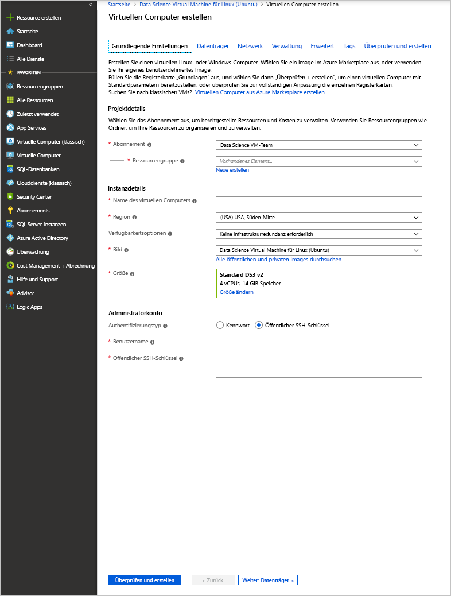

# <a name="provision-the-data-science-virtual-machine-for-linux-ubuntu"></a>Bereitstellen der Data Science Virtual Machine für Linux (Ubuntu)

Die Data Science Virtual Machine (DSVM) für Linux ist ein Ubuntu-basiertes VM-Image, das den Einstieg in das maschinelle Lernen, z. B. Deep Learning, in Azure erleichtert. Deep Learning-Tools:

* [Caffe](https://caffe.berkeleyvision.org/): Deep Learning-Framework mit Fokus auf Geschwindigkeit, Ausdrucksfähigkeit und Modularität.
* [Caffe2](https://github.com/caffe2/caffe2): Plattformübergreifende Version von Caffe.
* [Microsoft Cognitive Toolkit](https://github.com/Microsoft/CNTK): Deep Learning-Softwaretoolkit von Microsoft Research.
* [H2O](https://www.h2o.ai/): Open-Source-Plattform und grafische Benutzeroberfläche für Big Data.
* [Keras](https://keras.io/): Allgemeine API für neuronale Netze in Python für TensorFlow, Microsoft Cognitive Toolkit und Theano.
* [MXNet](https://mxnet.io/): Flexible, effiziente Deep Learning-Bibliothek mit vielen Sprachbindungen.
* [NVIDIA DIGITS](https://developer.nvidia.com/digits): Grafisches System, das häufige Deep Learning-Aufgaben vereinfacht.
* [PyTorch](https://pytorch.org/): Eine allgemeine Python-Bibliothek mit Unterstützung für dynamische Netzwerke.
* [TensorFlow](https://www.tensorflow.org/): Open-Source-Bibliothek für Computerintelligenz von Google.
* [Theano](http://deeplearning.net/software/theano/): Python-Bibliothek zum Definieren, Optimieren und effizienten Auswerten mathematischer Ausdrücke mit mehrdimensionalen Arrays.
* [Torch](http://torch.ch/): Framework für wissenschaftliche Berechnungen mit weit reichender Unterstützung für Machine Learning-Algorithmen.
* CUDA, cuDNN und der NVIDIA-Treiber.
* Viele Jupyter-Beispielnotebooks.

Bei den Bibliotheken handelt es sich zwar um die GPU-Versionen, diese können jedoch auch über die CPU ausgeführt werden.

Die Data Science Virtual Machine für Linux enthält auch beliebte Tools für Data Science- und Entwicklungsaktivitäten, wie z.B.:

* Microsoft Machine Learning Server mit Microsoft R Open.
* Anaconda Python-Distribution (Versionen 2.7 und 3.5), einschließlich gängiger Bibliotheken für die Datenanalyse.
* JuliaPro, eine betreute Distribution der Sprache Julia mit gängigen wissenschaftlichen und Datenanalyse-Bibliotheken.
* Eigenständige Spark-Instanz und Hadoop für einen einzelnen Knoten (HDFS, Yarn).
* JupyterHub, ein Jupyter Notebook-Server für mehrere Benutzer mit Unterstützung von R-, Python-, PySpark- und Julia-Kernels.
* Azure Storage-Explorer.
* Azure CLI für die Verwaltung von Azure-Ressourcen.
* Tools für maschinelles Lernen:
  * [Vowpal Wabbit](https://github.com/JohnLangford/vowpal_wabbit): Ein schnelles Machine Learning-System, das verschiedene Verfahren unterstützt, z. B. Online, Hashing, Allreduce, Reductions, Learning2Search, Active und Interactive Learning.
  * [XGBoost](https://xgboost.readthedocs.org/en/latest/): Ein Tool, das eine schnelle und präzise Boosted Tree-Implementierung ermöglicht.
  * [Rattle](https://togaware.com/rattle/): Ein grafisches Tool, das den Einstieg in Datenanalysen und Machine Learning in R vereinfacht.
  * [LightGBM](https://github.com/Microsoft/LightGBM): Ein schnelles, verteiltes, hochleistungsfähiges Gradient Boosting-Framework.
* Azure SDK in Java, Python, Node.js, Ruby und PHP.
* Bibliotheken in R und Python zur Verwendung in Azure Machine Learning und anderen Azure-Diensten.
* Entwicklungstools und -Editoren (RStudio, PyCharm, IntelliJ, Emacs, Vim).

Die Durchführung des Data Science-Vorgangs umfasst eine Aufgabensequenz:

1. Suchen, Laden und Vorverarbeiten von Daten
1. Erstellen und Testen von Modellen
1. Bereitstellen der Modelle für die Nutzung in intelligenten Anwendungen

Datenanalysten verwenden verschiedene Tools zum Ausführen dieser Aufgaben. Es kann zeitaufwändig sein, die richtigen Versionen der Software zu finden und diese dann herunterzuladen, zu kompilieren und zu installieren.

Mit der Data Science Virtual Machine für Linux können Sie diesen Aufwand erheblich reduzieren. Nutzen Sie sie, um Ihr Analyseprojekt entscheidend voranzubringen. Sie können in verschiedenen Sprachen arbeiten, z.B. R, Python, SQL, Java und C++. Mit dem in die VM integrierten Azure SDK können Sie Ihre Anwendungen mit verschiedenen Diensten unter Linux für die Microsoft-Cloudplattform erstellen. Außerdem haben Sie Zugriff auf andere Sprachen wie Ruby, Perl, PHP und Node.js, die ebenfalls vorinstalliert sind.

Für dieses DSVM-Image fallen keine Softwaregebühren an. Sie zahlen nur die Gebühren für die Azure-Hardwarenutzung, die basierend auf der Größe der VM berechnet werden, die Sie bereitstellen. Weitere Informationen zu Computegebühren finden Sie auf der [Seite mit der VM-Auflistung in Azure Marketplace](https://azure.microsoft.com/marketplace/partners/microsoft-ads/linux-data-science-vm/).

## <a name="other-versions-of-the-data-science-virtual-machine"></a>Andere Versionen der Data Science Virtual Machine

Ein [CentOS](linux-dsvm-intro.md)-Image ist ebenfalls verfügbar, das viele der gleichen Tools bietet wie das Ubuntu-Image. Außerdem ist auch ein [Windows](provision-vm.md)-Image verfügbar.

## <a name="prerequisites"></a>Voraussetzungen

Bevor Sie eine Data Science Virtual Machine für Linux erstellen können, benötigen Sie ein Azure-Abonnement. Sie können auch eine [kostenlose Testversion von Azure](https://azure.microsoft.com/free/) verwenden.

## <a name="create-your-data-science-virtual-machine-for-linux"></a>Erstellen Ihrer Data Science Virtual Machine für Linux

Mit den folgenden Schritten erstellen Sie eine Instanz der Data Science Virtual Machine für Linux:

1. Navigieren Sie im [Azure-Portal](https://portal.azure.com/#create/microsoft-dsvm.linux-data-science-vm-ubuntulinuxdsvmubuntu)zur Auflistung der virtuellen Computer. Falls Sie sich noch nicht bei Ihrem Azure-Konto angemeldet haben, erhalten Sie ggf. eine entsprechende Aufforderung. 
1. Wählen Sie **Erstellen** aus, um den Assistenten aufzurufen.
    
1. Geben Sie die folgenden Informationen ein, um die einzelnen Schritte des Assistenten zu konfigurieren:

    1. **Grundlagen**:
    
       * **Abonnement**: Falls Sie über mehrere Abonnements verfügen, müssen Sie das Abonnement auswählen, unter dem der Computer erstellt und abgerechnet werden soll. Sie müssen für dieses Abonnement über Berechtigungen zum Erstellen von Ressourcen verfügen.
       * **Ressourcengruppe**: Sie können eine neue Gruppe erstellen oder eine vorhandene Gruppe verwenden.
       * **Name des virtuellen Computers**: Geben Sie den Namen des Data Science-Servers ein, den Sie erstellen.
       * **Region**: Wählen Sie das am besten geeignete Rechenzentrum aus. Normalerweise handelt es sich dabei um das Rechenzentrum, in dem der größte Teil Ihrer Daten gespeichert ist oder das Ihrem physischen Standort am nächsten ist, um den schnellstmöglichen Netzwerkzugriff zu erzielen.
       * **Verfügbarkeitsoptionen**: Legen Sie diese Option fest, wenn Sie diese VM in Verfügbarkeitsgruppen oder -zonen nutzen möchten. Übernehmen Sie andernfalls die Standardeinstellung.
       * **Image**: Behalten Sie den Standardwert bei.
       * **Größe**: Wählen Sie den Servertyp aus, der Ihre funktionalen Anforderungen erfüllt und Ihrem Kostenrahmen entspricht. Wählen Sie einen virtuellen Computer der NC- oder ND-Serie für GPU-basierte VM-Instanzen aus. 
       * **Benutzername**: Geben Sie den Benutzernamen des Administrators ein.
       * **Öffentlicher SSH-Schlüssel**: Geben Sie den öffentlichen RSA-Schlüssel im einzeiligen Format ein. (Sie können anstelle eines SSH-Schlüssels auch ein Kennwort verwenden.)
    
    1. **Datenträger**:
    
       * **Typ des Betriebssystemdatenträgers**: Wählen Sie **SSD Premium** aus, wenn Sie ein SSD (Solid State Drive) bevorzugen. Andernfalls wählen Sie **HDD Standard** aus.
    
    1. Für die restlichen Einstellungen können Sie die Standardwerte verwenden. Bewegen Sie den Mauszeiger über den jeweiligen Informationslink, um Hilfe anzuzeigen, falls Sie auch andere Werte als die Standardwerte verwenden möchten. Wählen Sie **Überprüfen und erstellen** aus, wenn Sie fertig sind.
    
    1. Vergewissern Sie sich nach der bestandenen VM-Überprüfung, ob alle eingegebenen Informationen richtig sind. Über einen Link können Sie auf die Nutzungsbedingungen zugreifen. Für den virtuellen Computer fallen über die Computekosten hinaus keine weiteren Kosten für die Servergröße an, die Sie unter **Größe** ausgewählt haben. Wählen Sie **Erstellen** aus, um die Bereitstellung zu starten.
    
    Die Bereitstellung sollte ungefähr 5 Minuten dauern. Der Status wird im Azure-Portal angezeigt.

## <a name="how-to-access-the-data-science-virtual-machine-for-linux"></a>Zugreifen auf die Data Science Virtual Machine für Linux

Es gibt drei Methoden, um auf die Ubuntu-DSVM zuzugreifen:

- SSH für Terminalsitzungen
- X2Go für grafische Sitzungen
- JupyterHub und JupyterLab für Jupyter-Notebooks

Sie können Azure Notebooks auch eine Data Science Virtual Machine zuordnen, um Jupyter-Notebooks auf der VM auszuführen und die Einschränkungen der kostenlosen Dienstebene zu umgehen. Weitere Informationen finden Sie unter [Verwalten und Konfigurieren von Projekten: Computeebene](../../notebooks/configure-manage-azure-notebooks-projects.md#compute-tier).

### <a name="ssh"></a>SSH

Nachdem die VM erstellt wurde, können Sie sich mithilfe von SSH an der VM anmelden. Verwenden Sie dabei die Kontoanmeldeinformationen, die Sie im Abschnitt **Grundlagen** von Schritt 3 für die Textshell-Schnittstelle erstellt haben. Unter Windows können Sie ein SSH-Clienttool, z. B. [PuTTY](https://www.putty.org), herunterladen. Falls Sie einen grafischen Desktop bevorzugen (X Windows System), können Sie die X11-Weiterleitung von PuTTY verwenden oder den X2Go-Client installieren.

> [!NOTE]
> Der X2Go-Client hat bei Tests besser abgeschnitten als die X11-Weiterleitung. Es wird empfohlen, den X2Go-Client als grafische Desktop-Benutzeroberfläche zu nutzen.

### <a name="x2go"></a>X2Go

Die Linux-VM ist schon in der Bereitstellung von X2Go-Server enthalten und zum Akzeptieren von Clientverbindungen bereit. Führen Sie auf dem Client die folgenden Schritte aus, um eine Verbindung mit dem grafischen Desktop des virtuellen Linux-Computers herzustellen:

1. Laden Sie den X2Go-Client für Ihre Clientplattform von [X2Go](https://wiki.x2go.org/doku.php/doc:installation:x2goclient)herunter, und installieren Sie ihn.
1. Führen Sie den X2Go-Client aus, und wählen Sie die Option **Neue Sitzung**aus. Es wird ein Konfigurationsfenster mit mehreren Registerkarten geöffnet. Geben Sie die folgenden Konfigurationsparameter ein:
   * **Registerkarte „Sitzung“:**
     * **Host**: Geben Sie den Hostnamen oder die IP-Adresse Ihrer Linux Data Science Virtual Machine ein.
     * **Anmeldung**: Geben Sie den Benutzernamen für die Linux-VM ein.
     * **SSH-Port**: Übernehmen Sie den Standardwert 22.
     * **Sitzungstyp**: Ändern Sie den Wert in **XFCE**. Derzeit unterstützt die Linux-VM nur den XFCE-Desktop.
   * **Registerkarte „Medien“** : Sie können die Soundunterstützung und die Clientausgabe deaktivieren, wenn Sie diese Funktionen nicht benötigen.
   * **Freigegebene Ordner**: Wenn Verzeichnisse von Ihren Clientcomputern auf der Linux-VM bereitgestellt werden sollen, fügen Sie auf dieser Registerkarte die Clientcomputerverzeichnisse hinzu, die Sie für die VM freigeben möchten.

Nachdem Sie sich bei der VM angemeldet haben, indem Sie entweder den SSH-Client oder den grafischen XFCE-Desktop über den X2Go-Client genutzt haben, können Sie die Tools verwenden, die auf der VM installiert und konfiguriert sind. Auf dem XFCE-Desktop können Sie Anwendungsmenü-Tastenkombinationen und Desktopsymbole für viele Tools anzeigen.

### <a name="jupyterhub-and-jupyterlab"></a>JupyterHub und JupyterLab

Die Ubuntu-DSVM führt [JupyterHub](https://github.com/jupyterhub/jupyterhub), einen Jupyter-Server für mehrere Benutzer, aus. Navigieren Sie auf Ihrem Laptop oder Desktop zu „https:\//your-vm-ip:8000“, um eine Verbindung herzustellen. Geben Sie den Benutzernamen mit dem zugehörigen Kennwort ein, den Sie zum Erstellen des virtuellen Computers verwendet haben, und melden Sie sich an. Zum Stöbern und Ausprobieren stehen Ihnen viele Beispielnotebooks zur Verfügung.

JupyterLab, die nächste Generation von Jupyter-Notebooks, und JupyterHub, sind ebenfalls verfügbar. Melden Sie sich für den Zugriff bei JupyterHub an, und rufen Sie dann die URL „https:\//your-vm-ip:8000/user/your-username/lab“ auf. Sie können JupyterLab als Standard-Notebookserver festlegen, indem Sie `/etc/jupyterhub/jupyterhub_config.py` die folgende Zeile hinzufügen:

```python
c.Spawner.default_url = '/lab'
```

## <a name="tools-installed-on-the-data-science-virtual-machine-for-linux"></a>Auf der Data Science Virtual Machine für Linux installierte Tools

### <a name="deep-learning-libraries"></a>Deep Learning-Bibliotheken

#### <a name="cntk"></a>CNTK

Das Microsoft Cognitive Toolkit ist ein Open-Source-Toolkit für Deep Learning. Python-Bindungen sind in der Stammumgebung und der py35 Conda-Umgebung verfügbar. Es enthält auch ein Befehlszeilentool (CNTK), das sich bereits im Pfad befindet.

Python-Beispiel-Notebooks stehen in JupyterHub zur Verfügung. Verwenden Sie in der Shell die folgenden Befehle, um ein einfaches Beispiel über die Befehlszeile auszuführen:

```bash
cd /home/[USERNAME]/notebooks/CNTK/HelloWorld-LogisticRegression
cntk configFile=lr_bs.cntk makeMode=false command=Train
```

Weitere Informationen finden Sie auf [GitHub](https://github.com/Microsoft/CNTK) im Abschnitt zu CNTK und im [CNTK-Wiki](https://github.com/Microsoft/CNTK/wiki).

#### <a name="caffe"></a>Caffe

Caffe ist ein Deep Learning-Framework des Berkeley Vision and Learning Center. Es ist unter „/opt/caffe“ verfügbar. Beispiele finden Sie unter „/opt/caffe/examples“.

#### <a name="caffe2"></a>Caffe2

Caffe2 ist ein Deep Learning-Framework von Facebook, das auf Caffe basiert. Es ist in Python 2.7 in der Conda-Stammumgebung verfügbar. Führen Sie den folgenden Befehl über die Shell aus, um es zu aktivieren:

```bash
source /anaconda/bin/activate root
```

Einige Beispiel-Notebooks sind in JupyterHub verfügbar.

#### <a name="h2o"></a>H2O

H2O ist eine schnelle, verteilte In-Memory-Plattform für Machine Learning und Predictive Analytics. Ein Python-Paket ist sowohl in der Stammumgebung als auch der py35 Anaconda-Umgebung installiert. Ein R-Paket ist ebenfalls installiert. 

Führen Sie `java -jar /dsvm/tools/h2o/current/h2o.jar` aus, um H2O über die Befehlszeile zu öffnen. Es gibt verschiedene [Befehlszeilenoptionen](http://docs.h2o.ai/h2o/latest-stable/h2o-docs/starting-h2o.html#from-the-command-line), die Sie bei Bedarf konfigurieren können. Sie können zunächst auf die Flow-Webbenutzeroberfläche zugreifen, indem Sie zu http://localhost:54321 navigieren. Beispiel-Notebooks stehen auch in JupyterHub zur Verfügung.

#### <a name="keras"></a>Keras

Keras ist eine allgemeine API für neuronale Netze in Python. Sie kann basierend auf TensorFlow, Microsoft Cognitive Toolkit oder Theano ausgeführt werden. Die API ist in der Stammumgebung und der py35 Python-Umgebung verfügbar.

#### <a name="mxnet"></a>MXNet

MXNet ist ein für Effizienz und Flexibilität konzipiertes Deep Learning-Framework. Es umfasst R- und Python-Bindungen auf der DSVM. Beispiel-Notebook sind in JupyterHub verfügbar, Beispielcode unter „/dsvm/samples/mxnet“.

#### <a name="nvidia-digits"></a>NVIDIA DIGITS

Das NVIDIA Deep Learning GPU Training System, das auch kurz als DIGITS bezeichnet wird, ist ein System zum Vereinfachen von häufigen Deep Learning-Aufgaben. Zu diesen Aufgaben gehört das Verwalten von Daten, das Entwerfen und Trainieren von neuronalen Netzen auf GPU-Systemen und das Überwachen der Leistung in Echtzeit mit erweiterter Visualisierung.

DIGITS ist als Dienst mit der Bezeichnung *digits* verfügbar. Starten Sie den Dienst, und navigieren Sie zu http://localhost:5000, um zu beginnen.

DIGITS ist auch als Python-Modul in der Conda-Stammumgebung installiert.

#### <a name="tensorflow"></a>TensorFlow

TensorFlow ist die Deep Learning-Bibliothek von Google. Es handelt sich dabei um eine Open-Source-Softwarebibliothek für numerische Berechnungen unter Verwendung von Datenflussdiagrammen. TensorFlow ist in der py35 Python-Umgebung verfügbar, JupyterHub enthält einige Beispiel-Notebooks.

#### <a name="theano"></a>Theano

Theano ist eine Python-Bibliothek für effiziente numerische Berechnungen. Die API ist in der Stammumgebung und der py35 Python-Umgebung verfügbar. 

#### <a name="torch"></a>Torch

Torch ist ein Framework für wissenschaftliche Berechnungen mit weit reichender Unterstützung für Machine Learning-Algorithmen. Es ist unter „/dsvm/tools/torch“ verfügbar, und die interaktive Sitzung **th** und der LuaRocks-Paket-Manager stehen an der Befehlszeile zur Verfügung. Beispiele sind unter „/dsvm/samples/torch“ verfügbar.

PyTorch ist auch in der Anaconda-Stammumgebung verfügbar. Beispiele sind unter „/dsvm/samples/pytorch“ verfügbar.

### <a name="microsoft-machine-learning-server"></a>Microsoft Machine Learning Server

R ist eine der beliebtesten Sprachen für Datenanalyse und Machine Learning. Wenn Sie R für Ihre Analysen verwenden möchten, können Sie Microsoft Machine Learning Server mit Microsoft R Open und Math Kernel Library auf der VM verwenden. Math Kernel Library dient zur Optimierung mathematischer Vorgänge, die häufig in Analysealgorithmen vorkommen. Microsoft R Open ist vollständig kompatibel mit CRAN R, und alle in CRAN veröffentlichten R-Bibliotheken können unter Microsoft R Open installiert werden. 

Machine Learning Server ermöglicht die Skalierung und Operationalisierung von R-Modellen in Webdiensten. Sie können Ihre R-Programme in einem Standard-Editor wie RStudio, vi oder Emacs bearbeiten. Der Emacs-Editor ist bereits vorinstalliert. Das Emacs ESS-Paket (Emacs Speaks Statistics) vereinfacht die Verwendung von R-Dateien innerhalb des Emacs-Editors.

Geben Sie zum Öffnen der R-Konsole in der Shell **R** ein. Über diesen Befehl gelangen Sie zu einer interaktiven Umgebung. Um Ihr R-Programm zu entwickeln, verwenden Sie normalerweise einen Editor wie Emacs oder vi und führen dann die Skripts in R aus. Mit RStudio verfügen Sie über eine vollständige grafische IDE zum Entwickeln Ihres R-Programms.

Es ist auch ein R-Skript vorhanden, mit dem Sie bei Bedarf die [20 beliebtesten R-Pakete](https://www.kdnuggets.com/2015/06/top-20-r-packages.html) installieren können. Sie können dieses Skript ausführen, wenn Sie sich in der interaktiven R-Oberfläche befinden. Wie bereits erwähnt, können Sie diese Schnittstelle öffnen, indem Sie in der Shell **R** eingeben.  

### <a name="python"></a>Python

Anaconda Python wird mit Python 2.7- und 3.5-Umgebungen installiert. Die 2.7-Umgebung wird als _root_ bezeichnet, und die 3.5-Umgebung als _py35_. Diese Distribution enthält die Python-Basisversion sowie etwa 300 der beliebtesten Pakete für Mathematik, Entwicklung und Datenanalysen.

Standardmäßig wird die py35-Umgebung verwendet. Sie können die root-Umgebung (2.7) mit dem folgenden Befehl aktivieren:

```bash
source activate root
```

Verwenden Sie den folgenden Befehl zum erneuten Aktivieren der py35-Umgebung:

```bash
source activate py35
```

Geben Sie zum Aufrufen einer interaktiven Python-Sitzung in der Shell **python** ein. 

Installieren Sie mithilfe von Conda oder PIP weitere Python-Bibliotheken. Aktivieren Sie für PIP zuerst die richtige Umgebung, wenn Sie die Standardeinstellung nicht verwenden möchten:

```bash
source activate root
pip install <package>
```

Oder geben Sie den vollständigen Pfad zu PIP an:

```bash
/anaconda/bin/pip install <package>
```

Für Conda müssen Sie immer den Umgebungsnamen angeben (py35 oder root):

```bash
conda install <package> -n py35
```

Wenn Sie sich in einer grafischen Benutzeroberfläche befinden oder die X11-Weiterleitung eingerichtet haben, können Sie **pycharm** eingeben, um die PyCharm Python-IDE zu starten. Sie können die standardmäßigen Text-Editoren verwenden. Außerdem können Sie Spyder nutzen, eine Python-IDE, die als Bündel mit Anaconda Python-Distributionen bereitgestellt wird. Für Spyder wird ein grafischer Desktop oder die X11-Weiterleitung benötigt. Auf dem grafischen Desktop befindet sich eine Verknüpfung mit Spyder.

### <a name="jupyter-notebook"></a>Jupyter Notebook

Zur Anaconda-Distribution gehört außerdem Jupyter Notebook, eine Umgebung zum Freigeben von Code und Analysen. Auf Jupyter Notebook wird über JupyterHub zugegriffen. Melden Sie sich mit Ihrem lokalen Linux-Benutzernamen und dem dazugehörigen Kennwort an.

Der Jupyter Notebook-Server wurde bereits mit Python 2-, Python 3- und R-Kernels vorkonfiguriert. Verwenden Sie das Desktopsymbol für **Jupyter Notebook**, um den Browser zu öffnen und auf den Notebook-Server zuzugreifen. Wenn Sie per SSH oder X2Go-Client auf die VM zugegriffen haben, erreichen Sie den Jupyter Notebook-Server auch über [https://localhost:8000/](https://localhost:8000/).

> [!NOTE]
> Fahren Sie fort, falls Sie Zertifikatwarnungen erhalten.

Sie können von jedem Host aus auf den Jupyter Notebook-Server zugreifen. Geben Sie **https://\<VM-DNS-Name oder -IP-Adresse\>:8000/** ein.

> [!NOTE]
> Port 8000 wird in der Firewall standardmäßig geöffnet, wenn der virtuelle Computer bereitgestellt wird. 

Wir haben einige Beispiel-Notebooks zusammengestellt – eines für Python und eines für R. Der Link zu den Beispielen wird Ihnen auf der Startseite für die Notebooks angezeigt, nachdem Sie sich mit Ihrem lokalen Linux-Benutzernamen und dem dazugehörigen Kennwort beim Jupyter Notebook authentifiziert haben. Sie können ein neues Notebook erstellen, indem Sie **Neu** und dann den entsprechenden Sprachkernel auswählen. Wenn die Schaltfläche **New** (Neu) nicht angezeigt wird, wählen Sie oben links das **Jupyter**-Symbol aus, um die Startseite des Notebook-Servers zu öffnen.

### <a name="apache-spark-standalone"></a>Apache Spark – eigenständige Instanz

Eine eigenständige Instanz von Apache Spark ist auf der Linux-DSVM vorinstalliert, damit Sie Spark-Anwendungen zunächst lokal entwickeln können, bevor Sie sie in großen Clustern testen und bereitstellen. 

Sie können PySpark-Programme über den Jupyter-Kernel ausführen. Wenn Sie Jupyter öffnen und die Schaltfläche **New** (Neu) auswählen, wird eine Liste mit verfügbaren Kernels angezeigt. **Spark – Python** ist der PySpark-Kernel, mit dem Sie Spark-Anwendungen in der Sprache Python erstellen können. Sie können auch eine Python-IDE wie PyCharm oder Spyder verwenden, um Spark-Programme zu erstellen. 

In dieser eigenständigen Instanz wird der Spark-Stapel im aufrufenden Clientprogramm ausgeführt. Dieses Feature führt dazu, dass sich Probleme schneller und einfacher als beim Entwickeln in einem Spark-Cluster beheben lassen.

Jupyter stellt ein PySpark-Beispielnotebook bereit. Sie finden dieses Notebook im Basisverzeichnis von Jupyter im Verzeichnis „SparkML“ ($HOME/Notebooks/SparkML/PySpark). 

Wenn Sie in R für Spark programmieren, können Sie Microsoft Machine Learning Server, SparkR oder sparklyr verwenden. 

Vor dem Ausführen im Spark-Kontext in Microsoft Machine Learning Server müssen Sie einen einmaligen Schritt zur Einrichtung ausführen, um eine lokale Hadoop HDFS- und YARN-Instanz für einen Knoten zu aktivieren. Standardmäßig gilt, dass die Hadoop-Dienste installiert, aber auf der DSVM deaktiviert sind. Um sie zu aktivieren, müssen Sie die folgenden Befehle beim ersten Mal als „root“ ausführen:

```bash
echo -e 'y\n' | ssh-keygen -t rsa -P '' -f ~hadoop/.ssh/id_rsa
cat ~hadoop/.ssh/id_rsa.pub >> ~hadoop/.ssh/authorized_keys
chmod 0600 ~hadoop/.ssh/authorized_keys
chown hadoop:hadoop ~hadoop/.ssh/id_rsa
chown hadoop:hadoop ~hadoop/.ssh/id_rsa.pub
chown hadoop:hadoop ~hadoop/.ssh/authorized_keys
systemctl start hadoop-namenode hadoop-datanode hadoop-yarn
```

Sie können die Hadoop-bezogenen Dienste anhalten, wenn Sie sie nicht benötigen, indem Sie ```systemctl stop hadoop-namenode hadoop-datanode hadoop-yarn``` ausführen.

Das Verzeichnis „/dsvm/samples/MRS“ enthält ein Beispiel, mit dem veranschaulicht wird, wie Microsoft Machine Learning Server in einem Remote-Spark-Kontext (dies ist die eigenständige Spark-Instanz auf der DSVM) entwickelt und getestet wird.

### <a name="ides-and-editors"></a>IDEs und Editoren

Sie haben die Wahl zwischen mehreren Code-Editoren, z. B. vi/Vim, Emacs, PyCharm, RStudio und IntelliJ. 

PyCharm, RStudio und IntelliJ sind grafische Editoren. Sie müssen bei einem grafischen Desktop angemeldet sein, um sie verwenden zu können. Verwenden Sie zum Öffnen die Desktop- und Anwendungsmenüverknüpfungen.

Vim und Emacs sind textbasierte Editoren. Bei Emacs erleichtert das ESS-Add-On-Paket die Arbeit mit R im Emacs-Editor. Weitere Informationen finden Sie auf der [ESS-Website](https://ess.r-project.org/).

LaTeX wird über das texlive-Paket zusammen mit einem Emacs-Add-On-Paket namens [AUCTeX](https://www.gnu.org/software/auctex/manual/auctex/auctex.html) installiert. Dieses Paket vereinfacht das Erstellen von LaTeX-Dokumenten in Emacs.  

### <a name="databases"></a>Datenbanken

#### <a name="graphical-sql-client"></a>Grafischer SQL-Client

SQuirreL SQL, ein grafischer SQL-Client, kann eine Verbindung mit mehreren Datenbanken herstellen (z. B. Microsoft SQL Server und MySQL) und SQL-Abfragen ausführen. Sie können SQuirreL SQL in einer grafischen Desktopsitzung (z. B. mithilfe des X2Go-Clients) über ein Desktopsymbol ausführen. Alternativ können Sie den Client mit dem folgenden Befehl in der Shell ausführen:

```bash
/usr/local/squirrel-sql-3.7/squirrel-sql.sh
```

Vor der ersten Verwendung müssen Sie Ihre Treiber und Datenbankaliase einrichten. Die JDBC-Treiber befinden sich unter „/usr/share/Java/jdbcdrivers“.

Weitere Informationen finden Sie unter [SQuirrel SQL](http://squirrel-sql.sourceforge.net/index.php?page=screenshots).

#### <a name="command-line-tools-for-accessing-microsoft-sql-server"></a>Befehlszeilentools für den Zugriff auf Microsoft SQL Server

Das ODBC-Treiberpaket für SQL Server verfügt auch über zwei Befehlszeilentools:

- **bcp**: Mit dem Tool bcp werden Daten per Massenkopiervorgang zwischen einer Instanz von Microsoft SQL Server und einer Datendatei in einem vom Benutzer angegebenen Format kopiert. Das Tool bcp kann zum Importieren großer Mengen von neuen Zeilen in SQL Server-Tabellen oder zum Exportieren von Daten aus Tabellen in Datendateien verwendet werden. Zum Importieren von Daten in eine Tabelle müssen Sie eine für diese Tabelle erstellte Formatdatei verwenden. Alternativ müssen Sie mit der Struktur der Tabelle und den Datentypen, die für ihre Spalten gelten, vertraut sein.

  Weitere Informationen finden Sie unter [Herstellen einer Verbindung mit bcp](https://msdn.microsoft.com/library/hh568446.aspx).

- **sqlcmd**: Sie können Transact-SQL-Anweisungen mit dem Tool sqlcmd eingeben. Sie haben auch die Möglichkeit, Systemprozeduren und Skriptdateien an der Eingabeaufforderung einzugeben. Bei diesem Tool wird ODBC genutzt, um Transact-SQL-Batches auszuführen.

  Weitere Informationen finden Sie unter [Herstellen einer Verbindung mit sqlcmd](https://msdn.microsoft.com/library/hh568447.aspx).

  > [!NOTE]
  > Für dieses Tool gelten einige Unterschiede zwischen Linux- und Windows-Plattformen. Ausführliche Informationen dazu finden Sie in der -Dokumentation.

#### <a name="database-access-libraries"></a>Bibliotheken für den Datenbankzugriff

Bibliotheken für den Datenbankzugriff sind in R und Python verfügbar:

* In R können Sie mit den Paketen RODBC oder dplyr SQL-Anweisungen auf dem Datenbankserver abfragen oder ausführen.
* In Python ermöglicht die Bibliothek pyodbc den Datenbankzugriff mit ODBC als zugrunde liegender Schicht.  

### <a name="azure-tools"></a>Azure-Tools

Die folgenden Azure-Tools werden auf dem virtuellen Computer installiert:

* **Azure CLI**: Mit der Befehlszeilenschnittstelle in Azure können Sie Azure-Ressourcen über Shellbefehle erstellen und verwalten. Geben Sie **azure help** ein, um die Azure-Tools zu öffnen. Weitere Informationen finden Sie auf der [Dokumentationsseite zur Azure-Befehlszeilenschnittstelle](https://docs.microsoft.com/cli/azure/get-started-with-az-cli2).
* **Azure Storage-Explorer**: Azure Storage-Explorer ist ein grafisches Tool zum Navigieren durch die Objekte, die Sie in Ihrem Azure-Speicherkonto gespeichert haben, sowie zum Hoch- und Herunterladen von Daten in und aus Azure-Blobs. Sie können über das Symbol der Desktopverknüpfung auf den Storage-Explorer zugreifen. Sie können ihn auch über eine Eingabeaufforderung der Shell öffnen, indem Sie **StorageExplorer** eingeben. Sie müssen über einen X2Go-Client angemeldet sein oder die X11-Weiterleitung eingerichtet haben.
* **Azure-Bibliotheken**: Im Folgenden finden Sie einige der vorinstallierten Bibliotheken.
  
  * **Python**: Die zu Azure gehörenden Bibliotheken in Python sind *azure*, *azureml*, *pydocumentdb* und *pyodbc*. Mit den ersten drei Bibliotheken können Sie auf Azure-Speicherdienste, Azure Machine Learning und Azure Cosmos DB (eine NoSQL-Datenbank in Azure) zugreifen. Mit der vierten Bibliothek, pyodbc (zusammen mit dem Microsoft ODBC-Treiber für SQL Server), können Sie unter Verwendung einer ODBC-Schnittstelle über Python auf SQL Server, Azure SQL-Datenbank und Azure SQL Data Warehouse zugreifen. Geben Sie **pip list** ein, um alle aufgeführten Bibliotheken anzuzeigen. Achten Sie darauf, dass dieser Befehl sowohl in der Python 2.7- als auch in der Python 3.5-Umgebung ausgeführt wird.
  * **R**: Die zu Azure gehörenden Bibliotheken in R sind AzureML und RODBC.
  * **Java**: Sie finden die Liste mit den Azure Java-Bibliotheken im Verzeichnis „/dsvm/sdk/AzureSDKJava“ auf der VM. Die wichtigsten Bibliotheken sind Azure-Speicher- und -Verwaltungs-APIs, Azure Cosmos DB und JDBC-Treiber für SQL Server.  

Sie können über den vorinstallierten Firefox-Browser auf das [Azure-Portal](https://portal.azure.com) zugreifen. Im Azure-Portal können Sie Azure-Ressourcen erstellen, verwalten und überwachen.

### <a name="azure-machine-learning"></a>Azure Machine Learning

Azure Machine Learning ist ein vollständig verwalteter Clouddienst, mit dem Sie Predictive Analytics-Lösungen erstellen, bereitstellen und freigeben können. Sie erstellen Ihre Experimente und Modelle mit Azure Machine Learning Studio. Sie können mit einem Webbrowser auf der Data Science Virtual Machine darauf zugreifen, indem Sie [Microsoft Azure Machine Learning](https://studio.azureml.net) nutzen.

Nachdem Sie sich bei Azure Machine Learning Studio angemeldet haben, haben Sie Zugriff auf einen Zeichenbereich zum Experimentieren, in dem Sie einen logischen Ablauf für die Machine Learning-Algorithmen erstellen können. Außerdem haben Sie Zugriff auf ein Jupyter Notebook, das in Azure Machine Learning gehostet wird und nahtlos für die Experimente in Machine Learning Studio genutzt werden kann. 

Operationalisieren Sie die von Ihnen erstellten Machine Learning-Modelle, indem Sie sie mit einer Webdienst-Schnittstelle umschließen. Durch das Operationalisieren von Machine Learning-Modellen können Clients, die in einer beliebigen Sprache geschrieben sind, Vorhersagen aus diesen Modellen aufrufen. Weitere Informationen finden Sie in der [Dokumentation zu Machine Learning](https://azure.microsoft.com/documentation/services/machine-learning/).

Sie können Ihre Modelle auch in R oder Python auf der VM erstellen und diese dann in der Produktion in Azure Machine Learning bereitstellen. Wir haben Bibliotheken in R (**AzureML**) und Python (**azureml**) installiert, um diese Funktionalität zu ermöglichen.

Informationen zum Bereitstellen von Modellen in R und Python für Azure Machine Learning finden Sie unter [Zehn Dinge, die Sie mit der Windows Data Science Virtual Machine machen können](vm-do-ten-things.md).

> [!NOTE]
> Diese Anweisungen wurden für die Windows-Version von Data Science Virtual Machine geschrieben. Die Informationen zum Bereitstellen von Modellen für Azure Machine Learning gelten allerdings für die Linux-VM.

### <a name="machine-learning-tools"></a>Machine Learning-Tools

Die VM enthält Machine Learning-Tools und -Algorithmen, die vorkompiliert und lokal vorinstalliert wurden. Das umfasst:

* **Vowpal Wabbit**: Ein Algorithmus für schnelles Onlinelernen.
* **xgboost**: Ein Tool, das optimierte Boosted Tree-Algorithmen bereitstellt.
* **Rattle**: R-basiertes grafisches Tool zum einfachen Durchsuchen und Modellieren von Daten.
* **Python**: Anaconda Python wird als Paket mit Machine Learning-Algorithmen für Bibliotheken wie Scikit-learn bereitgestellt. Sie können andere Bibliotheken installieren, indem Sie den `pip install` -Befehl verwenden.
* **LightGBM**: Ein schnelles, verteiltes Gradient-Boosted-Hochleistungsframework auf der Grundlage von Entscheidungsstrukturalgorithmen.
* **R**: Für R ist eine umfassende Bibliothek mit Machine Learning-Funktionen verfügbar. Zu den vorinstallierten Bibliotheken zählen u. a. lm, glm, randomForest und rpart. Sie können andere Bibliotheken installieren, indem Sie diesen Befehl ausführen:
  
        install.packages(<lib name>)

Im Folgenden finden Sie einige zusätzliche Informationen zu den ersten drei Machine Learning-Tools in der Liste.

#### <a name="vowpal-wabbit"></a>Vowpal Wabbit

Vowpal Wabbit ist ein Machine Learning-System, das verschiedene Verfahren einsetzt, wie z.B. Online, Hashing, Allreduce, Reductions, Learning2Search, Active und Interactive Learning.

Verwenden Sie die folgenden Befehle, um das Tool für ein einfaches Beispiel auszuführen:

```bash
cp -r /dsvm/tools/VowpalWabbit/demo vwdemo
cd vwdemo
vw house_dataset
```

In diesem Verzeichnis sind noch weitere, größere Demos enthalten. Informationen zu Vowpal Wabbit finden Sie in [diesem Abschnitt auf GitHub](https://github.com/JohnLangford/vowpal_wabbit) und im [Vowpal Wabbit-Wiki](https://github.com/JohnLangford/vowpal_wabbit/wiki).

#### <a name="xgboost"></a>XGBoost

Die xgboost-Bibliothek wurde für Boosted (Tree)-Algorithmen entworfen und optimiert. Das Ziel dieser Bibliothek besteht darin, die Rechenleistung von Computern erheblich zu verbessern, um Struktur-Boosting-Vorgänge in großem Umfang zu ermöglichen, die skalierbar, portabel und präzise sind.

Sie wird per Befehlszeile und als R-Bibliothek bereitgestellt. Um diese Bibliothek in R zu verwenden, können Sie eine interaktive R-Sitzung starten (indem Sie in der Shell **R** eingeben) und die Bibliothek laden.

Hier ist ein einfaches Beispiel angegeben, das Sie an einer R-Eingabeaufforderung ausführen können:

```R
library(xgboost)

data(agaricus.train, package='xgboost')
data(agaricus.test, package='xgboost')
train <- agaricus.train
test <- agaricus.test
bst <- xgboost(data = train$data, label = train$label, max.depth = 2,
                eta = 1, nthread = 2, nround = 2, objective = "binary:logistic")
pred <- predict(bst, test$data)
```

Hier sind die Befehle für die Shell zum Ausführen der xgboost-Befehlszeile angegeben:

```bash
cp -r /dsvm/tools/xgboost/demo/binary_classification/ xgboostdemo
cd xgboostdemo
xgboost mushroom.conf
```

Eine MODEL-Datei wird in das angegebene Verzeichnis geschrieben. Informationen zu diesem Demonstrationsbeispiel finden Sie [auf GitHub](https://github.com/dmlc/xgboost/tree/master/demo/binary_classification).

Weitere Informationen zu xgboost finden Sie auf der [xgboost-Dokumentationsseite](https://xgboost.readthedocs.org/en/latest/) und im zugehörigen [GitHub-Repository](https://github.com/dmlc/xgboost).

#### <a name="rattle"></a>Rattle

Rattle (**R** **A**nalytical **T**ool **T**o **L**earn **E**asily) verwendet GUI-basierte Durchsuchungs- und Modellierungsvorgänge für Daten. Mit dem Tool werden statistische und visuelle Zusammenfassungen von Daten dargestellt, Daten transformiert, die leicht modelliert werden können, nicht überwachte und überwachte Modelle aus den Daten erstellt, Leistungsdaten von Modellen grafisch dargestellt und neue Datasets bewertet. Außerdem wird R-Code generiert, mit dem die Vorgänge in der UI repliziert werden, die direkt in R ausgeführt oder als Ausgangspunkt für weitere Analysen verwendet werden können.

Um Rattle ausführen zu können, müssen Sie in einer grafischen Desktopsitzung angemeldet sein. Geben Sie im Terminal **R** ein, um die R-Umgebung zu öffnen. Geben Sie an der R-Eingabeaufforderung die folgenden Befehle ein:

```R
library(rattle)
rattle()
```

Eine grafische Benutzeroberfläche mit einer Reihe von Registerkarten wird geöffnet. Verwenden Sie die folgenden Schnellstartschritte in Rattle, um ein Beispiel-Wetterdataset zu verwenden und ein Modell zu erstellen. In einigen Schritten werden Sie zum automatischen Installieren und Laden einiger erforderlicher R-Pakete aufgefordert, die sich nicht bereits im System befinden.

> [!NOTE]
> Falls Sie für die Installation des Pakets im Systemverzeichnis (Standardeinstellung) keinen Zugriff haben, wird unter Umständen in Ihrem R-Konsolenfenster eine Aufforderung mit der Frage angezeigt, ob Pakete in Ihrer persönlichen Bibliothek installiert werden sollen. Wählen Sie **y** , wenn diese Aufforderungen angezeigt werden.

1. Wählen Sie **Execute**(Ausführen).
1. Es wird ein Dialogfeld mit der Frage angezeigt, ob Sie das Beispiel-Wetterdataset verwenden möchten. Wählen Sie **Yes** (Ja) aus, um das Beispiel zu laden.
1. Wählen Sie die Registerkarte **Model** (Modell) aus.
1. Wählen Sie **Execute** (Ausführen) aus, um eine Entscheidungsstruktur zu erstellen.
1. Wählen Sie **Draw** (Zeichnen) aus, um die Entscheidungsstruktur anzuzeigen.
1. Wählen Sie die Option **Forest** (Gesamtstruktur) und **Execute** (Ausführen) aus, um eine zufällige Gesamtstruktur zu erstellen.
1. Wählen Sie die Registerkarte **Evaluate** (Auswerten) aus.
1. Wählen Sie die Option **Risk** (Risiko) und **Execute** (Ausführen) aus, um zwei Leistungsdarstellungen zu **Risk (Cumulative)** (Risiko (Kumulativ)) anzuzeigen.
1. Klicken Sie auf die Registerkarte **Log** (Protokoll), um den generierten R-Code für die obigen Vorgänge anzuzeigen.
   (Aufgrund eines Fehlers in der aktuellen Version von Rattle müssen Sie im Text des Protokolls vor **Export this log** (Protokoll exportieren) das Zeichen **#** eingeben.)
1. Klicken Sie auf die Schaltfläche **Export** (Exportieren), um die R-Skriptdatei *weather_script.R* im Basisordner zu speichern.

Sie können Rattle und R beenden. Nun können Sie das generierte R-Skript bearbeiten. Sie können das Skript auch unverändert verwenden und es jederzeit ausführen, um alle Aktionen auf der Rattle-Benutzeroberfläche zu wiederholen. Dies ist besonders für Einsteiger in R eine Möglichkeit, auf einer einfachen grafischen Benutzeroberfläche schnell Analysen und maschinelles Lernen durchzuführen, während in R automatisch Code zum Ändern bzw. Lernen generiert wird.

## <a name="next-steps"></a>Nächste Schritte

Informieren Sie sich weiter:

* In der exemplarischen Vorgehensweise [Data Science mit einer Linux Data Science Virtual Machine in Azure](linux-dsvm-walkthrough.md) wird veranschaulicht, wie Sie mehrere allgemeine Data Science-Aufgaben mit der hier bereitgestellten Linux-DSVM ausführen. 
* Entdecken Sie die unterschiedlichen Data Science-Tools auf der DSVM, indem Sie die in diesem Artikel beschriebenen Tools ausprobieren. Sie können auch `dsvm-more-info` in der Shell auf dem virtuellen Computer ausführen, um eine grundlegende Einführung und Hinweise auf weitere Informationen zu den Tools auf der VM zu erhalten.  
* Erfahren Sie, wie Sie mithilfe des [Team Data Science-Prozesses](https://aka.ms/tdsp)systematisch vollständige Analyselösungen erstellen.
* Besuchen Sie die [Azure AI Gallery](https://gallery.azure.ai/), um Beispiele zu Machine Learning und zur Datenanalyse zu erhalten, in denen Azure-KI-Dienste verwendet werden.
