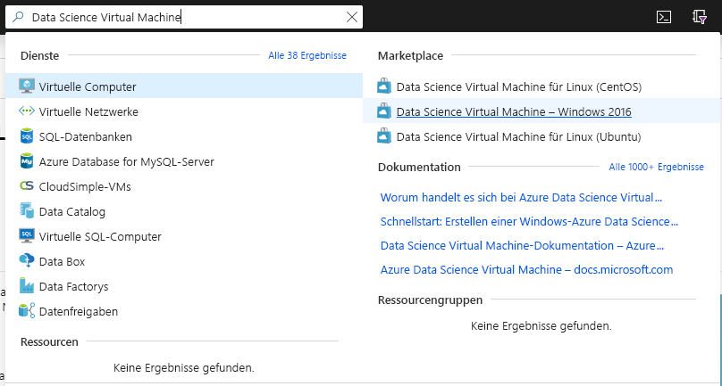
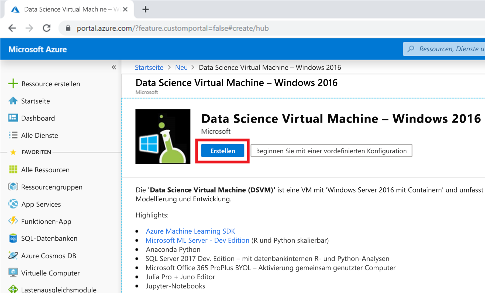
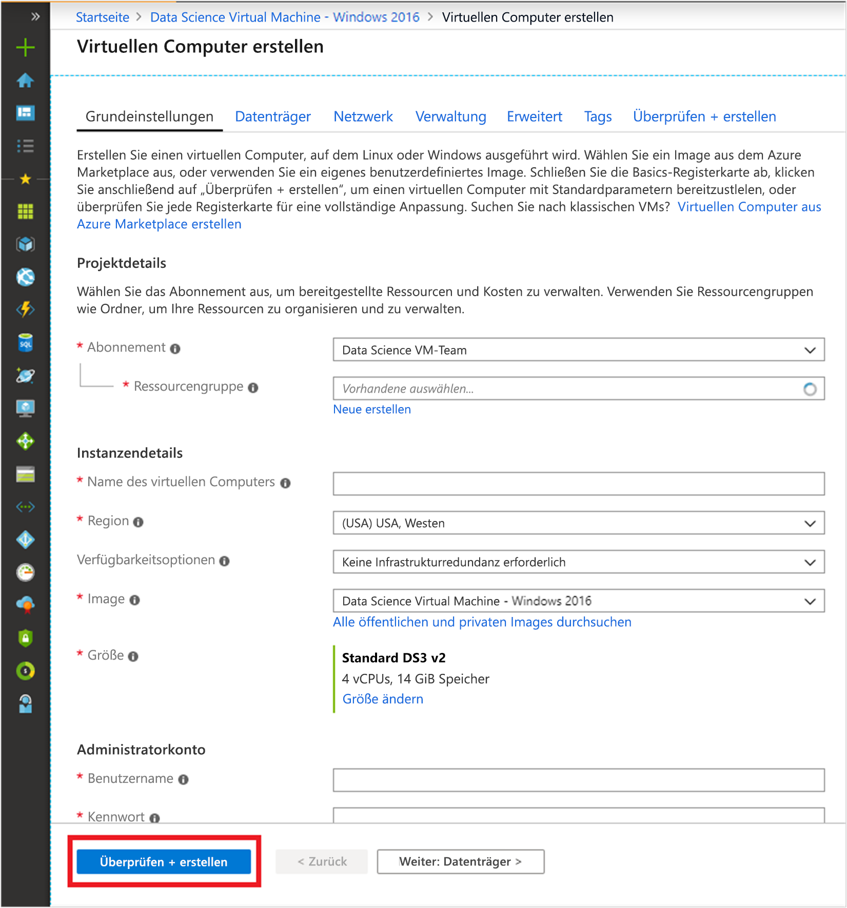

# Schnellstart: Einrichten der Data Science Virtual Machine für Windows

Es wird beschrieben, wie Sie die Betriebsbereitschaft mit einer Data Science Virtual Machine-Instanz unter Windows erreichen.

## Voraussetzung

Zum Erstellen einer Data Science VM-Instanz unter Windows benötigen Sie ein Azure-Abonnement. [Testen Sie Azure kostenlos](https://azure.com/free).
Beachten Sie, dass kostenlose Azure-Konten keine GPU-fähigen VM-SKUs unterstützen.

## Erstellen Ihrer DSVM

So erstellen Sie eine DSVM-Instanz:

1. Rufen Sie das [Azure-Portal](https://portal.azure.com) auf. Falls Sie sich noch nicht bei Ihrem Azure-Konto angemeldet haben, erhalten Sie ggf. eine entsprechende Aufforderung.
1. Suchen Sie nach der Liste mit den virtuellen Computern, indem Sie „Data Science Virtual Machine“ eingeben und „Data Science Virtual Machine – Windows 2016“ auswählen.

    

1. Wählen Sie unten auf dem Bildschirm die Option **Erstellen**.

    

1. Sie sollten auf das Blatt „Virtuellen Computer erstellen“ umgeleitet werden.
   

1. Geben Sie auf der Registerkarte **Grundlagen** die Informationen ein:
      * **Abonnement**: Falls Sie über mehrere Abonnements verfügen, müssen Sie das Abonnement auswählen, unter dem der Computer erstellt und abgerechnet werden soll. Sie müssen für dieses Abonnement über Berechtigungen zum Erstellen von Ressourcen verfügen.
      * **Ressourcengruppe**: Erstellen Sie eine neue Gruppe, oder verwenden Sie eine bereits vorhandene.
      * **Name des virtuellen Computers**: Geben Sie den Namen des virtuellen Computers ein. Unter diesem Namen wird er im Azure-Portal angezeigt.
      * **Standort**: Wählen Sie das am besten geeignete Datencenter aus. Den schnellsten Netzwerkzugriff erreichen Sie mit dem Datencenter, in dem der größte Teil Ihrer Daten gespeichert ist oder das Ihrem physischen Standort am nächsten ist. Informieren Sie sich über die [Azure-Regionen](https://azure.microsoft.com/global-infrastructure/regions/).
      * **Image**: Behalten Sie den Standardwert bei.
      * **Größe**: Diese Option sollte automatisch mit einer Größe ausgefüllt werden, die für allgemeine Workloads geeignet ist. Weitere Informationen finden Sie unter [Windows-VM-Größen in Azure](../../virtual-machines/windows/sizes.md).
      * **Benutzername**: Geben Sie den Benutzernamen des Administrators ein. Dies ist der Benutzername, den Sie für die Anmeldung bei Ihrem virtuellen Computer verwenden. Er muss nicht mit Ihrem Azure-Benutzernamen identisch sein.
      * **Kennwort**: Geben Sie das Kennwort ein, das Sie für die Anmeldung bei Ihrem virtuellen Computer verwenden.    
1. Klicken Sie auf **Überprüfen + erstellen**.
1. **Überprüfen + erstellen**
   * Stellen Sie sicher, dass alle eingegebenen Informationen richtig sind. 
   * Klicken Sie auf **Erstellen**.

> [!NOTE]
> * Sie zahlen keine Lizenzgebühren für die Software, die auf dem virtuellen Computer bereits vorab geladen wird. Sie zahlen die Computekosten für die Servergröße, die Sie im Schritt **Größe** auswählen.
> * Die Bereitstellung dauert zwischen 10 und 20 Minuten. Den Status Ihrer VM können Sie über das Azure-Portal einsehen.

## Zugreifen auf die DSVM-Instanz

Führen Sie nach der Erstellung und Bereitstellung der VM die Schritte für die [Verbindungsherstellung mit Ihrem Azure-basierten virtuellen Computer](../../marketplace/cloud-partner-portal/virtual-machine/cpp-connect-vm.md) aus. Verwenden Sie die Administratorkonto-Anmeldeinformationen, die Sie bei der VM-Erstellung im Schritt **Grundlagen** konfiguriert haben. 

Sie können nun beginnen, die auf der VM installierten und konfigurierten Tools zu verwenden. Auf viele der Tools kann über Kacheln im Menü **Start** sowie über Desktopsymbole zugegriffen werden.

Sie können eine DSVM-Instanz auch an Azure Notebooks anfügen, um Jupyter-Notebooks auf dem virtuellen Computer auszuführen und die Einschränkungen der kostenlosen Dienstebene zu umgehen. Weitere Informationen finden Sie unter [Computeebene](../../notebooks/configure-manage-azure-notebooks-projects.md#manage-and-configure-projects).

## Nächste Schritte

* Erkunden Sie die Tools in der DSVM-Instanz über das Menü **Start**.
* Machen Sie sich mit Azure Machine Learning Service vertraut. Lesen Sie hierzu [Was ist Azure Machine Learning Service?](../service/overview-what-is-azure-ml.md), und probieren Sie die [Tutorials](../index.yml) aus.
* Navigieren Sie im Explorer zu „C:\Programme\Microsoft\ML Server\R_SERVER\library\RevoScaleR\demoScripts“, um Beispiele für die RevoScaleR-Bibliothek in R zu finden, die Datenanalysen auf Unternehmensebene unterstützt. 
* Lesen Sie den Artikel [Zehn Dinge, die Sie mit der Data Science Virtual Machine machen können](https://aka.ms/dsvmtenthings).
* Erfahren Sie, wie Sie mithilfe des [Team Data Science-Prozesses](../team-data-science-process/index.yml)systematisch vollständige Analyselösungen erstellen.
* Besuchen Sie den [Azure KI-Katalog](https://gallery.cortanaintelligence.com), um Beispiele zu Machine Learning und zur Datenanalyse zu erhalten, in denen Azure Machine Learning und dazugehörige Datendienste in Azure verwendet werden. Wir haben auch ein Symbol für diese Galerie im **Startmenü** und auf dem Desktop der virtuellen Maschine bereitgestellt.

