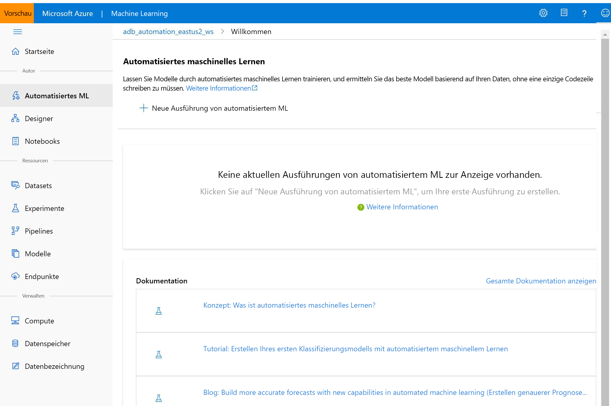

# Was ist Azure Machine Learning?

In diesem Artikel wird Azure Machine Learning beschrieben. Hierbei handelt es sich um eine cloudbasierte Umgebung, die Sie zum Trainieren, Bereitstellen, Automatisieren, Verwalten und Nachverfolgen von ML-Modellen verwenden können. 

Azure Machine Learning kann für alle Arten von maschinellem Lernen verwendet werden – von klassischem Machine Learning bis zu Deep Learning und für überwachtes und nicht überwachtes Lernen. Unabhängig davon, ob Sie das Schreiben von Python- oder R-Code oder die Nutzung von Optionen ohne bzw. mit nur wenig Code (z. B. per [Designer](ui-tutorial-automobile-price-train-score.md)) bevorzugen, können Sie in einem Azure Machine Learning-Arbeitsbereich hochpräzise Machine Learning- und Deep Learning-Modelle erstellen, trainieren und nachverfolgen. 

Beginnen Sie auf Ihrem lokalen Computer mit dem Training, und führen Sie dann eine horizontale Hochskalierung auf die Cloud durch. 

Der Dienst kann auch zusammen mit beliebten Open-Source-Tools, z. B. PyTorch, TensorFlow und scikit-learn, genutzt werden.

> [!VIDEO https://channel9.msdn.com/Events/Connect/Microsoft-Connect--2018/D240/player]

> [!Tip]
> **Kostenlose Testversion!**  Wenn Sie kein Azure-Abonnement besitzen, können Sie ein kostenloses Konto erstellen, bevor Sie beginnen. Probieren Sie die [kostenlose oder kostenpflichtige Version von Azure Machine Learning](https://aka.ms/AMLFree) noch heute aus. Sie erhalten dann eine Gutschrift, die Sie für Azure-Dienste einlösen können. Wenn das Guthaben aufgebraucht ist, können Sie das Konto behalten und weiterhin [kostenlose Azure-Dienste](https://azure.microsoft.com/free/) nutzen. Ihre Kreditkarte wird nur dann belastet, wenn Sie Ihre Einstellungen explizit ändern und mit der Berechnung von Gebühren einverstanden sind.

## Was ist Machine Learning?

Machine Learning ist ein Data Science-Verfahren, mit dem Computer aus vorhandenen Daten lernen können, um zukünftiges Verhalten, Ergebnisse und Trends vorherzusagen. Durch den Einsatz von maschinellem Lernen können Computer lernen, ohne konkret programmiert worden zu sein.

Dank solcher Vorhersagen oder Prognosen aus Machine Learning können Apps und Geräte „intelligenter“ werden. Wenn Sie beispielsweise online einkaufen, trägt maschinelles Lernen dazu bei, dass Ihnen anhand der gekauften Produkte weitere Produkte empfohlen werden, die Ihnen gefallen könnten. Ein weiteres Beispiel ist die Nutzung Ihrer Kreditkarte. Dabei wird mithilfe von maschinellem Lernen die Transaktion mit einer Transaktionsdatenbank verglichen, wodurch Betrugsfälle erkannt werden können. Auch wenn ein automatischer Staubsauger ein Zimmer saugt, wird mit maschinellem Lernen entschieden, ob die Arbeit erledigt ist.

## Passende Machine Learning-Tools für alle Aufgaben 

Azure Machine Learning verfügt über alle Tools, die Entwickler und Data Scientists für ihre Machine Learning-Workflows benötigen, z. B.:
+ [Azure Machine Learning-Designer](ui-tutorial-automobile-price-train-score.md) (Vorschauversion): Fügen Sie Module per Drag & Drop ein, um Ihre Experimente zu erstellen, und stellen Sie anschließend Pipelines bereit.

+ Jupyter-Notebooks: Verwenden Sie unsere [Beispielnotebooks](https://aka.ms/aml-notebooks), oder erstellen Sie Ihre eigenen Notebooks, um unsere <a href="https://docs.microsoft.com/python/api/overview/azure/ml/intro?view=azure-ml-py" target="_blank">SDK für Python</a>-Beispiele für Ihre Machine Learning-Zwecke zu nutzen. 

+ R-Skripts oder Notebooks, in denen Sie das <a href="https://azure.github.io/azureml-sdk-for-r/reference/index.html on" target="_blank">SDK für R</a> zum Schreiben Ihres eigenen Codes verwenden (oder die R-Module im Designer).

+ [Visual Studio Code-Erweiterung](how-to-vscode-tools.md)

+ [Machine Learning-CLI](reference-azure-machine-learning-cli.md)

+ Open-Source-Frameworks, z. B. PyTorch, TensorFlow, scikit-learn und viele mehr

Sie können sogar [MLflow zum Nachverfolgen von Metriken und Bereitstellen von Modellen](how-to-use-mlflow.md) oder Kubeflow zum [Erstellen von End-to-End-Workflowpipelines](https://www.kubeflow.org/docs/azure/) verwenden.

## Erstellen von ML-Modellen in Python oder R

Beginnen Sie auf Ihrem lokalen Computer mit dem Azure Machine Learning <a href="https://docs.microsoft.com/python/api/overview/azure/ml/intro?view=azure-ml-py" target="_blank">Python SDK</a> oder dem <a href="https://azure.github.io/azureml-sdk-for-r/reference/index.html" target="_blank">R SDK</a> mit dem Training. Anschließend können Sie horizontal in die Cloud hochskalieren. 

Dank zahlreicher verfügbarer [Compute-Ziele](how-to-set-up-training-targets.md) wie Azure Machine Learning Compute und [Azure Databricks](/azure/azure-databricks/what-is-azure-databricks) sowie [Diensten für die erweiterte Hyperparameteroptimierung](how-to-tune-hyperparameters.md) können Sie mithilfe der Cloud schneller bessere Modelle erstellen.

Mit dem SDK können Sie auch [Modelltraining und -optimierung](tutorial-auto-train-models.md) automatisieren.

## Erstellen von ML-Modellen mit Tools ohne Code

Optionen für Training und Bereitstellung ohne oder mit nur wenig Code:

+ **Azure Machine Learning-Designer (Vorschauversion)**

  Verwenden Sie den Designer zum Aufbereiten von Daten, Trainieren, Testen, Bereitstellen, Verwalten und Nachverfolgen von Machine Learning-Modellen, ohne Code schreiben zu müssen. Für das Erstellen Ihres Modells ist keine Programmierung erforderlich, sondern einfach nur das visuelle Verbinden von Datasets und Modulen.   Probieren Sie das [Tutorial zum Designer](tutorial-designer-automobile-price-train-score.md) aus.

  Weitere Informationen finden Sie im [Artikel mit der Übersicht über den Azure Machine Learning-Designer](concept-designer.md). 

  

+ **Benutzeroberfläche für automatisiertes maschinelles Lernen**

  Informieren Sie sich, wie Sie auf der benutzerfreundlichen Oberfläche [automatisierte ML-Experimente](tutorial-first-experiment-automated-ml.md) erstellen. 

  

## MLOps: Bereitstellung und Lebenszyklusverwaltung
Wenn Sie das richtige Modell haben, können Sie es ganz einfach in einem Webdienst, auf einem IoT-Gerät oder in Power BI verwenden. Weitere Informationen finden Sie im Artikel [Bereitstellen: wie und wo](how-to-deploy-and-where.md).

Anschließend können Sie Ihre bereitgestellten Modelle verwalten, indem Sie das [Azure Machine Learning SDK für Python](https://aka.ms/aml-sdk), [Azure Machine Learning Studio](https://ml.azure.com) oder die [Machine Learning-CLI](reference-azure-machine-learning-cli.md) verwenden.

Diese Modelle können genutzt werden und Prognosen [in Echtzeit](how-to-consume-web-service.md) oder [asynchron](how-to-run-batch-predictions.md) (für große Datenmengen) zurückgeben.

Und dank fortschrittlicher[Machine Learning-Pipelines](concept-ml-pipelines.md) können Sie bei jedem einzelnen Schritt – von der Datenaufbereitung über Training und Bewertung von Modellen bis hin zur Bereitstellung – zusammenarbeiten. Pipelines ermöglichen Folgendes:

* Automatisieren des End-to-End-Prozesses für maschinelles Lernen in der Cloud
* Wiederverwenden von Komponenten und Wiederholen von Schritten nur bei Bedarf
* Verwenden verschiedener Computeressourcen in jedem Schritt
* Ausführen von Batchbewertungsaufgaben

Falls Sie Skripts zum Automatisieren Ihres Machine Learning-Workflows nutzen möchten, helfen Ihnen die Befehlszeilentools der [Machine Learning-CLI](reference-azure-machine-learning-cli.md) weiter. Hiermit können häufige Aufgaben erledigt werden, z. B. das Übermitteln einer Trainingsausführung oder das Bereitstellen eines Modells.

Informationen zu den ersten Schritten mit Azure Machine Learning finden Sie [hier](#next-steps).

## Basic- und Enterprise-Edition

Azure Machine Learning verfügt über zwei Editionen für Ihre Machine Learning-Anforderungen:
+ Basic (allgemein verfügbar)
+ Enterprise (Vorschauversion)

Mit diesen Editionen wird ermittelt, welche Machine Learning-Tools für Entwickler und Data Scientists in ihrem Arbeitsbereich verfügbar sind.   

Mit Basic-Arbeitsbereichen können Sie mit der Nutzung von Azure Machine Learning fortfahren und zahlen dann nur für die Azure-Ressourcen, die während des Machine Learning-Prozesses genutzt werden. Für Arbeitsbereiche der Enterprise-Edition wird der Azure-Verbrauch nur berechnet, solange sich die Edition in der Vorschauphase befindet. Weitere Informationen zu den verfügbaren Optionen von Azure Machine Learning finden Sie auf der [Seite mit der Übersicht über die Editionen und Preise](https://azure.microsoft.com/pricing/details/machine-learning/). 

Sie weisen die Edition jeweils zu, wenn Sie einen Arbeitsbereich erstellen. Bereits vorhandene Arbeitsbereiche werden für Sie auf die Basic-Edition umgestellt. Die Basic-Edition umfasst alle Features, die im Oktober 2019 bereits allgemein verfügbar waren. Alle Experimente in diesen Arbeitsbereichen, die mit Features der Enterprise-Edition erstellt wurden, stehen Ihnen schreibgeschützt weiter zur Verfügung, bis Sie das Upgrade auf Enterprise durchführen. Informieren Sie sich über das [Durchführen eines Upgrades eines Basic-Arbeitsbereichs auf die Enterprise-Edition](how-to-manage-workspace.md#upgrade). 

Kunden sind während dieses Zeitraums für Kosten für Computevorgänge und für andere Azure-Ressourcen verantwortlich.

## Nächste Schritte

- Erstellen Sie Ihr erstes Experiment mit Ihrer bevorzugten Methode:
  + [Verwenden von Python-Notebooks zum Trainieren und Bereitstellen von ML-Modellen](tutorial-1st-experiment-sdk-setup.md)
  + [Verwenden von R Markdown zum Trainieren und Bereitstellen von ML-Modellen](tutorial-1st-r-experiment.md) 
  + [Verwenden von automatisiertem Machine Learning zum Trainieren und Bereitstellen von ML-Modellen](  tutorial-first-experiment-automated-ml.md) 
  + [Verwenden der Drag & Drop-Funktionen des Designers zum Trainieren und Bereitstellen](tutorial-designer-automobile-price-train-score.md) 
  + [Verwenden der Machine Learning-CLI zum Trainieren und Bereitstellen eines Modells](tutorial-train-deploy-model-cli.md)

- Erfahren Sie mehr über [Machine Learning-Pipelines](/azure/machine-learning/service/concept-ml-pipelines) zum Erstellen, Optimieren und Verwalten Ihrer Machine Learning-Szenarien.

- Lesen Sie den ausführlichen Artikel [Funktionsweise von Azure Machine Learning: Architektur und Konzepte](concept-azure-machine-learning-architecture.md).
