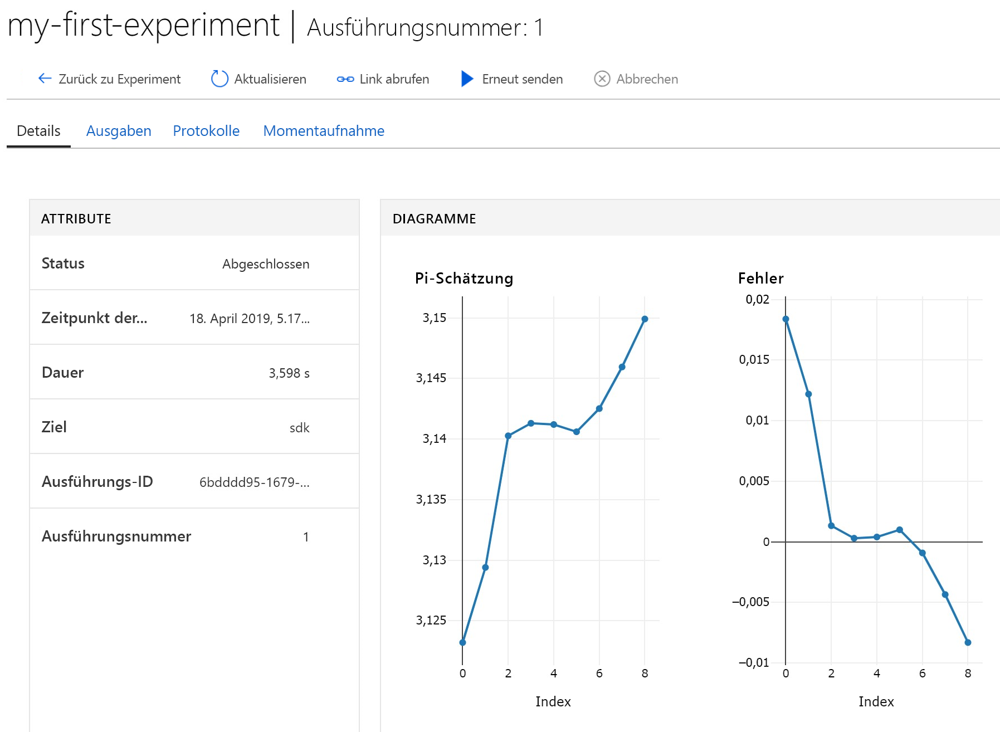

# <a name="quickstart-use-a-cloud-based-notebook-server-to-get-started-with-azure-machine-learning"></a>Schnellstart: Verwenden eines cloudbasierten Notebook-Servers für die ersten Schritte mit Azure Machine Learning

In dieser Schnellstartanleitung erhalten Sie Informationen zu den ersten Schritten mit dem Azure Machine Learning Service, indem Sie einen verwalteten Notebookserver in der Cloud verwenden. Es ist keine Installation erforderlich. Wenn Sie stattdessen das SDK in Ihrer eigenen Python-Umgebung installieren möchten, finden Sie weitere Informationen unter [Schnellstart: Verwenden Ihres eigenen Notebook-Servers für die ersten Schritte mit Azure Machine Learning](quickstart-run-local-notebook.md).

In diesem Schnellstart erfahren Sie, wie Sie den [Arbeitsbereich für Azure Machine Learning Service](concept-azure-machine-learning-architecture.md) zum Nachverfolgen Ihrer Experimente mit maschinellem Lernen verwenden können. Dazu erstellen Sie eine [Notebook-VM (Vorschauversion)](how-to-configure-environment.md#notebookvm): Eine sichere, cloudbasierte Azure-Arbeitsstation, die einen Jupyter Notebook-Server, JupyterLab und eine vollständig vorbereitete Machine Learning-Umgebung bereitstellt. Anschließend führen Sie ein Python-Notebook auf diesem virtuellen Computer (VM) aus, das Werte im Arbeitsbereich protokolliert.

Führen Sie dazu die folgenden Aktionen aus:

* Erstellen Sie einen Arbeitsbereich.
* Erstellen Sie in Ihrem Arbeitsbereich eine Notebook-VM.
* Öffnen Sie die Jupyter-Weboberfläche.
* Öffnen eines Notebooks, das Code zum Schätzen des Pi-Werts enthält und Fehler bei jeder Iteration protokolliert.
* Ausführen des Notebooks.
* Anzeigen der protokollierten Fehlerwerte in Ihrem Arbeitsbereich Das folgende Beispiel zeigt, wie der Arbeitsbereich Sie bei der Nachverfolgung der in einem Skript generierten Informationen unterstützt.

Wenn Sie kein Azure-Abonnement besitzen, können Sie ein kostenloses Konto erstellen, bevor Sie beginnen. Probieren Sie die [kostenlose oder kostenpflichtige Version von Azure Machine Learning Service](https://aka.ms/AMLFree) aus.

## <a name="create-a-workspace"></a>Erstellen eines Arbeitsbereichs

Wenn Sie über einen Azure Machine Learning Service-Arbeitsbereich verfügen, fahren Sie mit dem [nächsten Abschnitt](#create-notebook) fort. Andernfalls erstellen Sie jetzt einen Arbeitsbereich.

[!INCLUDE [aml-create-portal](../../../includes/aml-create-in-portal.md)]

## <a name="create-notebook"></a>Erstellen einer Notebook-VM

 Erstellen Sie in Ihrem Arbeitsbereich eine Cloudressource, um mit der Verwendung von Jupyter-Notebooks zu beginnen. Diese Ressource ist eine cloudbasierte Plattform, die mit allen Funktionen vorkonfiguriert ist, die Sie für die Ausführung von Azure Machine Learning Service benötigen.

1. Öffnen Sie Ihren Arbeitsbereich im [Azure-Portal](https://portal.azure.com/). Wenn Sie sich nicht sicher sind, wie Sie Ihren Arbeitsbereich im Portal finden können, lesen Sie [Anzeigen Ihres Arbeitsbereichs](how-to-manage-workspace.md#view).

1. Wählen Sie auf der Arbeitsbereichsseite links **Notebook-VMs** aus.

1. Wählen Sie **+Neu** aus, um eine Notebook-VM zu erstellen.  

     

1. Geben Sie einen Namen für Ihre VM an. Klicken Sie anschließend auf **Erstellen**.

    > [!NOTE]
    > Der Notebook-VM-Name muss zwischen 2 und 16 Zeichen lang sein. Buchstaben, Ziffern und Bindestriche sind zulässige Zeichen. Der Name muss im Azure-Abonnement eindeutig sein.

    

1. Warten Sie ungefähr vier bis fünf Minuten, bis sich der Status in **Wird ausgeführt** ändert.


## <a name="open-the-jupyter-web-interface"></a>Öffnen der Jupyter-Weboberfläche

Nachdem Ihre VM ausgeführt wird, verwenden Sie den Abschnitt **Notebook-VMs**, um die Jupyter-Webbenutzeroberfläche zu öffnen.

1. Wählen Sie **Jupyter** in der Spalte **URI** für Ihre VM aus.  

    

    Der Link startet Ihren Notebook-Server und öffnet die Jupyter Notebook-Webseite im Browser auf einer neuen Registerkarte.  Dieser Link funktioniert nur für die Person, die die VM erstellt.  Jeder Benutzer des Arbeitsbereichs muss seinen eigenen virtuellen Computer erstellen.

1. Auf der Jupyter Notebook-Webseite ist der Name des obersten Ordners Ihr Benutzername. Wählen Sie diesen Ordner aus.

    > [!TIP]
    > Dieser Ordner befindet sich auf dem [Speichercontainer](concept-workspace.md#resources) in Ihrem Arbeitsbereich und nicht auf der Notebook-VM selbst.  Sie können die Notebook-VM löschen und dennoch Ihre gesamte Arbeit behalten.  Wenn Sie später eine neue Notebook-VM erstellen, lädt sie diesen Ordner.  Wenn Sie Ihren Arbeitsbereich mit anderen teilen, werden Ihr Ordner und die Ordner der anderen Benutzer angezeigt. 

1. Der Beispielordnername enthält eine Versionsnummer (z. B. **samples-1.0.33.1**). Wählen Sie den Beispielordner aus.

1. Wählen Sie den Ordner **Schnellstart** aus.

## <a name="run-the-notebook"></a>Ausführen des Notebooks

Führen Sie ein Notebook aus, das den Wert von Pi schätzt und den Fehler in Ihrem Arbeitsbereich protokolliert.

1. Wählen Sie **01.run-experiment.ipynb**, um das Notebook zu öffnen.

1. Wenn Sie eine Warnung „Kernel nicht gefunden“ sehen, wählen Sie den Kernel **Python 3.6 – AzureML** (ungefähr in der Mitte der Liste) aus, und legen Sie ihn fest.

1. Wählen Sie die erste Codezelle und dann **Ausführen** aus.

    > [!NOTE]
    > Codezellen sind eckige Klammern vorangestellt. Wenn die eckigen Klammern leer sind ( __[  ]__ ), wurde der Code nicht ausgeführt. Während der Code ausgeführt wird, wird ein Sternchen ( __[*]__ ) angezeigt. Nachdem der Code abgeschlossen wurde, wird die Zahl **[1]** angezeigt.  Die Zahl informiert Sie über die Reihenfolge, in der die Zellen ausgeführt wurden.
    >
    > Verwenden Sie **UMSCHALT+EINGABETASTE** als Tastenkombination zum Ausführen einer Zelle.

    

1. Führen Sie die zweite Codezelle aus. Wenn Anweisungen zur Authentifizierung angezeigt werden, kopieren Sie den Code, und folgen Sie dem Link, um sich anzumelden. Nachdem Sie sich anmeldet haben, speichert Ihr Browser diese Einstellung.  

    

1. Wenn die Ausführung der Codezelle erfolgreich durchgeführt wurde, wird die Zellennummer __[2]__ angezeigt. Wenn Sie sich anmelden mussten, wird eine Statusmeldung zur erfolgreichen Authentifizierung angezeigt.   Wenn Sie sich nicht anmelden mussten, wird keine Ausgabe für diese Zelle angezeigt. Es wird nur die Nummer angezeigt, die auf die erfolgreiche Ausführung der Zelle hinweist.

    

1. Führen Sie die restlichen Codezellen aus. Nach der Ausführung der einzelnen Zellen wird deren Zellennummer angezeigt. Nur die letzte Zelle zeigt eine andere Ausgabe an.  

    In der größten Codezelle wird `run.log` an mehreren Stellen angezeigt. Jedes `run.log` fügt Ihrem Arbeitsbereich seinen Wert hinzu.

## <a name="view-logged-values"></a>Anzeigen protokollierter Werte

1. Die Ausgabe der Zelle `run` enthält einen Link zum Azure-Portal, in dem Sie die Experimentergebnisse in Ihrem Arbeitsbereich anzeigen können.

    

1. Wählen Sie den **Link zum Azure-Portal** aus, um Informationen zur Ausführung in Ihrem Arbeitsbereich anzuzeigen. Über diesen Link wird Ihr Arbeitsbereich im Azure-Portal geöffnet.

1. Die angezeigten Plots protokollierter Werte wurden automatisch im Arbeitsbereich erstellt. Wenn Sie mehrere Werte mit dem gleichen Namensparameter protokollieren, wird für Sie automatisch ein Plot generiert. Beispiel:

   

Da der Code für die Pi-Annäherung willkürliche Werte verwendet, könnten Ihre Plots anders aussehen.  

## <a name="clean-up-resources"></a>Bereinigen von Ressourcen

### <a name="stop-the-notebook-vm"></a>Beenden der Notebook-VM

Beenden Sie die Notebook-VM, wenn Sie sie nicht mehr verwenden, um Kosten zu sparen.  

1. Wählen Sie in Ihrem Arbeitsbereich **Notebook-VMs** aus.

   

1. Wählen Sie den virtuellen Computer in der Liste aus.

1. Wählen Sie **Stop** (Beenden) aus.

1. Wenn Sie bereit sind, den Server erneut zu verwenden, wählen Sie **Starten** aus.

### <a name="delete-everything"></a>Alles löschen

[!INCLUDE [aml-delete-resource-group](../../../includes/aml-delete-resource-group.md)]

Sie können die Ressourcengruppe auch behalten und einen einzelnen Arbeitsbereich löschen. Zeigen Sie die Eigenschaften des Arbeitsbereichs an, und klicken Sie auf **Löschen**.

## <a name="next-steps"></a>Nächste Schritte

Nachdem Sie diese Aufgaben abgeschlossen haben, wechseln Sie auf die Jupyter Notebook-Webseite. Öffnen und starten Sie im Ordner **Schnellstart** das Notebook **02.deploy-web-service.ipynb**, um zu erfahren, wie ein Webdienst bereitgestellt wird.

Wenn Sie andere Python-Pakete in Ihrer Jupyter-Umgebung installieren möchten, verwenden Sie diesen Code in einem Notebook:

```
!source activate py36 && pip install <packagename>
```

Durchsuchen Sie auch auf der Jupyter Notebook-Webseite andere Notebooks im Beispielordner, um mehr über Azure Machine Learning Service zu erfahren.

Führen Sie Machine Learning-Tutorials zum Trainieren und Bereitstellen eines Modells aus, um sich ausführlicher mit dem Workflow zu beschäftigen:  

> [!div class="nextstepaction"]
> [Tutorial: Trainieren eines Bildklassifizierungsmodells](tutorial-train-models-with-aml.md)
