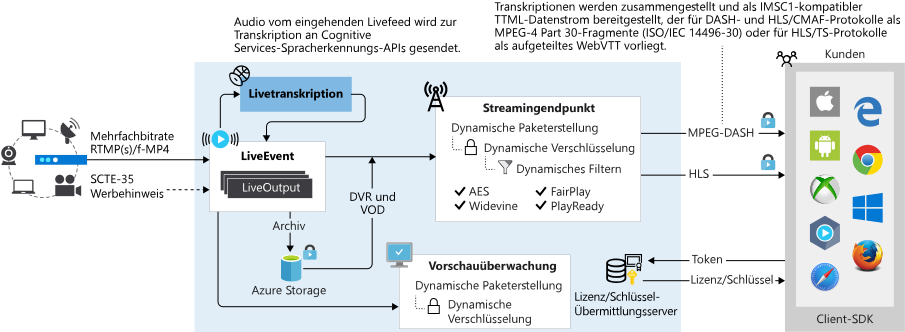

# Liveereignisse und Liveausgaben

Mit Azure Media Services können Sie Ihren Kunden Liveereignisse in der Azure Cloud anbieten. Um Ihre Livestreamingereignisse in Media Services v3 zu konfigurieren, müssen Sie die in diesem Artikel besprochenen Konzepte verstehen.

> [!TIP]
> Für Kunden, die von Media Services v2-APIs migrieren, ersetzt die **Liveereignis**-Entität **Channel** in v2, und **Liveausgabe** ersetzt**Programm**.

## Liveereignisse

[Liveereignisse](https://docs.microsoft.com/rest/api/media/liveevents) sorgen für das Erfassen und Verarbeiten von Livevideofeeds. Wenn Sie ein Liveereignis erstellen, wird ein primärer und ein sekundärer Eingabeendpunkt erstellt, mit dem Sie ein Livesignal von einem Remoteencoder senden können. Der Remoteliveencoder sendet den Beitragsfeed an diesen Eingabeendpunkt, entweder über [RTMP](https://www.adobe.com/devnet/rtmp.html) oder über das [Smooth Streaming](https://msdn.microsoft.com/library/ff469518.aspx)-Eingabeprotokoll (fragmentiertes MP4). Der Inhalt für das RTMP-Erfassungsprotokoll kann ohne Verschlüsselung (`rtmp://`) oder sicher verschlüsselt über das Netzwerk (`rtmps://`) gesendet werden. Für das Smooth Streaming-Erfassungsprotokoll werden die URL-Schemas `http://` und `https://` unterstützt.  

## Liveereignistypen

Für ein [Liveereignis](https://docs.microsoft.com/rest/api/media/liveevents) ist einer von zwei Typen möglich: Pass-Through und Livecodierung. Die Typen werden während der Erstellung mit [LiveEventEncodingType](https://docs.microsoft.com/rest/api/media/liveevents/create#liveeventencodingtype) festgelegt:

* **LiveEventEncodingType.None**: Ein lokaler Liveencoder sendet einen Datenstrom mit mehreren Bitraten. Der erfasste Datenstrom durchläuft das Liveereignis ohne weitere Verarbeitung. 
* **LiveEventEncodingType.Standard**: Ein lokaler Liveencoder sendet einen Datenstrom mit einer einzigen Bitrate an das Liveereignis, und Media Services erstellt Datenströme mit mehreren Bitraten. Wenn der Beitragsfeed eine Auflösung von 720p oder höher hat, bewirkt die Voreinstellung **Default720p**, dass eine Reihe von 6 Auflösungs-/Bitrate-Paaren codiert wird.
* **LiveEventEncodingType.Premium1080p**: Ein lokaler Liveencoder sendet einen Datenstrom mit einer einzigen Bitrate an das Liveereignis, und Media Services erstellt Datenströme mit mehreren Bitraten. Die Voreinstellung „Default1080p“ gibt den Ausgabesatz von Auflösungs-/Bitrate-Paaren an. 

### Pass-Through

Wenn Sie das **Liveereignis** vom Typ „Pass-Through“ verwenden, stützen Sie sich auf Ihren lokalen Liveencoder, um einen Videostream mit mehreren Bitraten zu erzeugen und als Beitragsfeed an das Liveereignis zu senden (über RTMP oder das Protokoll für fragmentiertes MP4). Das Liveereignis leitet dann die eingehenden Videostreams ohne weitere Bearbeitung weiter. Ein Liveereignis vom Typ „Pass-Through“ ist für Liveereignisse mit langer Laufzeit oder für ein lineares 24x365-Livestreaming optimiert. Geben Sie beim Erstellen dieses Liveereignistyps „None“ (LiveEventEncodingType.None) an.

Sie können den Beitragsfeed mit einer Auflösung von bis zu 4K und einer Bildrate von 60 Bildern/Sekunde senden, entweder mit H.264/AVC- oder H.265/HEVC-Videocodecs und AAC-Audiocodec (AAC-LC, HE-AACv1 oder HE-AACv2).  Weitere Informationen finden Sie im Artikel [Vergleich von Liveereignistypen](live-event-types-comparison.md).

> [!NOTE]
> Die Verwendung der Pass-Through-Methode ist die wirtschaftlichste Form des Livestreamings, wenn mehrere Ereignisse über einen längeren Zeitraum gestreamt werden und Sie bereits in lokale Encoder investiert haben. Preisdetails finden Sie [hier](https://azure.microsoft.com/pricing/details/media-services/) .
> 

Ein .NET-Codebeispiel finden Sie in [MediaV3LiveApp](https://github.com/Azure-Samples/media-services-v3-dotnet-core-tutorials/blob/master/NETCore/Live/MediaV3LiveApp/Program.cs#L126).

### Live Encoding  

Wenn Sie die Livecodierung mit Media Services verwenden, konfigurieren Sie Ihren lokalen Liveencoder so, dass er ein Video mit einer einzelnen Bitrate als Beitragsfeed an das Liveereignis sendet (über RTMP oder das Protokoll für fragmentiertes MP4). Sie richten danach ein Liveereignis ein, das den eingehenden Datenstrom mit einer einzelnen Bitrate in einen [Videostream mit mehreren Bitraten](https://en.wikipedia.org/wiki/Adaptive_bitrate_streaming) codiert und die Ausgabe über Protokolle wie MPEG-DASH, HLS und Smooth Streaming für Wiedergabegeräte zur Verfügung stellt.

Bei Verwendung der Livecodierung können Sie den Beitragsfeed nur mit einer Auflösung von bis zu 1080p und einer Bildfrequenz von 30 Bildern/Sekunde senden (mit den H.264/AVC-Videocodecs und dem AAC-Audiocodec (AAC-LC, HE-AACv1 oder HE-AACv2)). Beachten Sie, dass Pass-Through-Liveereignisse Auflösungen von bis zu 4K und 60 Bildern/Sekunde unterstützen. Weitere Informationen finden Sie im Artikel [Vergleich von Liveereignistypen](live-event-types-comparison.md).

Die Auflösungen und Bitraten, die in der Ausgabe vom Liveencoder enthalten sind, werden durch die Voreinstellung bestimmt. Wird ein **Standard**-Liveencoder (LiveEventEncodingType.Standard) verwendet, gibt die Voreinstellung *Default720p* 6 Auflösungs-/Bitrate-Paare an, die von 720p und 3,5 MBit/s bis 192p und 200 Kbit/s reichen. Bei Verwendung eines **Premium1080p**-Liveencoders (LiveEventEncodingType.Premium1080p) gibt die Voreinstellung *Default1080p* allerdings 6 Auflösungs-/Bitrate-Paare an, die von 1080p und 3,5 MBit/s bis 180p und 200 KBit/s reichen. Weitere Informationen finden Sie auf der Seite mit den [Systemvoreinstellungen](live-event-types-comparison.md#system-presets).

> [!NOTE]
> Öffnen Sie ein Supportticket über das Azure-Portal, wenn Sie die Voreinstellung für Livecodierung anpassen müssen. Geben Sie hierbei die gewünschte Tabelle mit den Angaben zur Auflösung und zu den Bitraten an. Vergewissern Sie sich, dass nur eine Ebene mit 720p (bei Anforderung einer Voreinstellung für einen „Standard“-Liveencoder) oder mit 1080p (bei Anforderung einer Voreinstellung für einen „Premium1080p“-Liveencoder) und maximal sechs Ebenen vorhanden sind.

## Erstellen von Liveereignissen 

### Optionen

Beim Erstellen eines Liveereignisses können Sie die folgenden Optionen angeben:

* Streamingprotokoll für das Liveereignis (momentan unterstützte Protokolle: RTMP und Smooth Streaming). Die Protokolloption kann nicht geändert werden, während das Liveereignis oder die zugehörigen Liveausgaben aktiv sind. Sollten Sie verschiedene Protokolle benötigen, können Sie für jedes Streamingprotokoll ein separates Liveereignis erstellen.  
* Bei der Ereigniserstellung können Sie angeben, dass das Ereignis automatisch gestartet werden soll.  Wenn für den automatischen Start „true“ festgelegt ist, wird das Liveereignis nach der Erstellung gestartet. Die Abrechnung beginnt, sobald das Liveereignis startet. Sie müssen für die Liveereignisressource explizit „Beenden“ auswählen, damit keine Gebühren mehr anfallen. Starten Sie alternativ das Ereignis, wenn Sie zum Starten des Streamings bereit sind. 

    Weitere Informationen finden Sie im Abschnitt [LiveEvent-Zustandswerte und Abrechnung](live-event-states-billing.md).
* IP-Einschränkungen für Erfassung und Vorschau. Sie können die IP-Adressen definieren, die ein Video für dieses Liveereignis erfassen dürfen. Zulässige IP-Adressen können als einzelne IP-Adresse (Beispiel: 10.0.0.1), als IP-Adressbereiche mit einer IP-Adresse und einer CIDR-Subnetzmaske (Beispiel: 10.0.0.1/22) oder als IP-Adressbereiche mit einer IP-Adresse und einer Subnetzmaske in Punkt-Dezimalschreibweise (Beispiel: 10.0.0.1(255.255.252.0)) angegeben werden. Wenn keine IP-Adressen angegeben sind und es keine Regeldefinition gibt, sind keine IP-Adressen zulässig. Um alle IP-Adressen zuzulassen, erstellen Sie eine Regel und legen 0.0.0.0/0 fest. Die IP-Adressen müssen in einem der folgenden Formate vorliegen: IPv4-Adresse mit vier Ziffern, CIDR-Adressbereich.

    Wenn Sie bestimmte IP-Adressen für Ihre eigenen Firewalls aktivieren oder Eingaben für Ihre Liveereignisse auf Azure-IP-Adressen einschränken möchten, laden Sie eine JSON-Datei von [Azure Datacenter IP address ranges](https://www.microsoft.com/download/details.aspx?id=41653) (IP-Adressbereiche für Azure Datacenter) herunter. Um Details zu dieser Datei zu erfahren, klicken Sie auf den Bereich **Details** auf der Seite.
        
### Benennungsregeln

* Die maximale Länge des Namens von Liveereignissen beträgt 32 Zeichen.
* Der Name sollte diesem [regex](https://docs.microsoft.com/dotnet/standard/base-types/regular-expression-language-quick-reference)-Muster folgen: `^[a-zA-Z0-9]+(-*[a-zA-Z0-9])*$`.

Mehr dazu erfahren Sie unter [Benennungskonventionen für Streamingendpunkte](streaming-endpoint-concept.md#naming-convention).

> [!TIP]
> Um die Eindeutigkeit des Namens Ihres Liveereignisses sicherzustellen, können Sie eine GUID generieren und dann alle Bindestriche und runden Klammern entfernen (falls vorhanden). Die Zeichenfolge ist dann unter allen Liveereignissen eindeutig und ihre Länge beträgt garantiert 32 Zeichen.

## Erfassungs-URLs für Liveereignisse

Wenn das Liveereignis erstellt wurde, können Sie Erfassungs-URLs abrufen, die Sie dem lokalen Liveencoder bereitstellen. Diese URLs werden vom Liveencoder zur Eingabe eines Livestreams verwendet. Weitere Informationen finden Sie unter [Empfohlene lokale Liveencoder](recommended-on-premises-live-encoders.md). 

Sie können Nicht-Vanity-URLs oder Vanity-URLs verwenden. 

> [!NOTE] 
> Damit eine Erfassungs-URL vorhersagbar ist, legen Sie den Vanitymodus fest.

* Nicht-Vanity-URL

    Die Nicht-Vanity-URL ist der Standardmodus in Media Services v3. Sie erhalten das Liveereignis potenziell schnell, aber die Erfassungs-URL ist erst bekannt, wenn das Liveereignis gestartet wurde. Die URL ändert sich, wenn Sie das Liveereignis starten/beenden.  Nicht-Vanity-URLs sind in Szenarien nützlich, in denen ein Endbenutzer das Streaming mithilfe einer App durchführen möchte, die App auf ein Liveereignis wartet und eine dynamische Erfassungs-URL kein Problem darstellt.
    
    Sie können Media Services das Zugriffstoken für das Liveereignis automatisch generieren lassen, wenn eine Clientanwendung vor dem Erstellen des Liveereignisses keine Erfassungs-URL generieren muss.
* Vanity-URL

    Der Vanitymodus wird von großen Medienanstalten bevorzugt, die Hardware-Rundfunkencoder verwenden und diese nicht beim Starten des Liveereignisses neu konfigurieren möchten. Dabei wird eine vorhersagbare Erfassungs-URL gewünscht, die sich nicht im Lauf der Zeit ändert.
    
    Zum Festlegen dieses Modus setzen Sie `vanityUrl` zum Zeitpunkt der Erstellung auf `true` (der Standardwert ist `false`). Sie müssen zum Zeitpunkt der Erstellung außerdem Ihr eigenes Zugriffstoken (`LiveEventInput.accessToken`) übergeben. Sie geben den Tokenwert an, um ein zufälliges Token in der URL zu vermeiden. Das Zugriffstoken muss eine gültige GUID-Zeichenfolge (mit oder ohne Bindestriche) sein. Sobald der Modus festgelegt ist, kann er nicht aktualisiert werden.

    Das Zugriffstoken muss in Ihrem Rechenzentrum eindeutig sein. Wenn Ihre Anwendung eine Vanity-URL verwenden muss, wird empfohlen, immer eine neue GUID-Instanz für das Zugriffstoken zu erstellen (statt vorhandene GUIDs wiederzuverwenden). 

    Verwenden Sie die folgenden APIs, um die Vanity-URL zu aktivieren, und legen Sie für das Zugriffstoken eine gültige GUID-Zeichenfolge fest (beispielsweise `"accessToken": "1fce2e4b-fb15-4718-8adc-68c6eb4c26a7"`).  
    
    |Sprache|Aktivieren der Vanity-URL|Festlegen des Zugriffstokens|
    |---|---|---|
    |REST|[properties.vanityUrl](https://docs.microsoft.com/rest/api/media/liveevents/create#liveevent)|[LiveEventInput.accessToken](https://docs.microsoft.com/rest/api/media/liveevents/create#liveeventinput)|
    |Befehlszeilenschnittstelle (CLI)|[--vanity-url](https://docs.microsoft.com/cli/azure/ams/live-event?view=azure-cli-latest#az-ams-live-event-create)|[--access-token](https://docs.microsoft.com/cli/azure/ams/live-event?view=azure-cli-latest#optional-parameters)|
    |.NET|[LiveEvent.VanityUrl](https://docs.microsoft.com/dotnet/api/microsoft.azure.management.media.models.liveevent.vanityurl?view=azure-dotnet#Microsoft_Azure_Management_Media_Models_LiveEvent_VanityUrl)|[LiveEventInput.AccessToken](https://docs.microsoft.com/dotnet/api/microsoft.azure.management.media.models.liveeventinput.accesstoken?view=azure-dotnet#Microsoft_Azure_Management_Media_Models_LiveEventInput_AccessToken)|
    
### Benennungsregeln für Liveerfassungs-URLs

* Die nachstehende *zufällige* Zeichenfolge ist eine 128-Bit-Hexadezimalzahl (sie umfasst 32 Zeichen von 0 bis 9 und a bis f).
* *your access token*: Die von Ihnen festgelegte gültige GUID-Zeichenfolge bei Verwendung des Vanity-Modus. Beispiel: `"1fce2e4b-fb15-4718-8adc-68c6eb4c26a7"`.
* *Datenstromname:* Gibt den Datenstromnamen für eine bestimmte Verbindung an. Der Wert des Datenstromnamens wird in der Regel von dem von Ihnen verwendeten Liveencoder hinzugefügt. Sie können den Liveencoder so konfigurieren, dass Sie zum Beschreiben der Verbindung einen beliebigen Namen (z. B. „video1_audio1“, „video2_audio1“ oder „stream“) verwenden können.

#### Nicht-Vanity-URL

##### RTMP

`rtmp://<random 128bit hex string>.channel.media.azure.net:1935/live/<auto-generated access token>/<stream name>` 
`rtmp://<random 128bit hex string>.channel.media.azure.net:1936/live/<auto-generated access token>/<stream name>` 
`rtmps://<random 128bit hex string>.channel.media.azure.net:2935/live/<auto-generated access token>/<stream name>` 
`rtmps://<random 128bit hex string>.channel.media.azure.net:2936/live/<auto-generated access token>/<stream name>` 

##### Smooth Streaming

`http://<random 128bit hex string>.channel.media.azure.net/<auto-generated access token>/ingest.isml/streams(<stream name>)` 
`https://<random 128bit hex string>.channel.media.azure.net/<auto-generated access token>/ingest.isml/streams(<stream name>)` 

#### Vanity-URL

##### RTMP

`rtmp://<live event name>-<ams account name>-<region abbrev name>.channel.media.azure.net:1935/live/<your access token>/<stream name>` 
`rtmp://<live event name>-<ams account name>-<region abbrev name>.channel.media.azure.net:1936/live/<your access token>/<stream name>` 
`rtmps://<live event name>-<ams account name>-<region abbrev name>.channel.media.azure.net:2935/live/<your access token>/<stream name>` 
`rtmps://<live event name>-<ams account name>-<region abbrev name>.channel.media.azure.net:2936/live/<your access token>/<stream name>` 

##### Smooth Streaming

`http://<live event name>-<ams account name>-<region abbrev name>.channel.media.azure.net/<your access token>/ingest.isml/streams(<stream name>)` 
`https://<live event name>-<ams account name>-<region abbrev name>.channel.media.azure.net/<your access token>/ingest.isml/streams(<stream name>)` 

## Vorschau-URL für Liveereignisse

Sobald das Liveereignis Daten aus dem Beitragsfeed empfängt, können Sie über den zugehörigen Vorschauendpunkt eine Vorschau anzeigen und den Empfang des Livestreams bestätigen, bevor Sie mit der Veröffentlichung fortfahren. Nachdem Sie sich von der Qualität des Datenstroms der Vorschauversion überzeugt haben, können Sie das Liveereignis verwenden, um den Livestream durch (vorab erstellte) Streamingendpunkte für die Übertragung verfügbar zu machen. Hierzu erstellen Sie eine neue [Liveausgabe](https://docs.microsoft.com/rest/api/media/liveoutputs) für das Liveereignis. 

> [!IMPORTANT]
> Vergewissern Sie sich, dass das Video an die Vorschau-URL übertragen wird, bevor Sie fortfahren.

## Zeitintensive Vorgänge für Liveereignisse

Weitere Informationen finden Sie unter [Zeitintensive Vorgänge](media-services-apis-overview.md#long-running-operations).

## Liveausgaben

Wenn der Stream an das Liveereignis übertragen wird, können Sie das Streamingereignis starten, indem Sie ein [Medienobjekt](https://docs.microsoft.com/rest/api/media/assets), eine [Liveausgabe](https://docs.microsoft.com/rest/api/media/liveoutputs) und einen [Streaminglocator](https://docs.microsoft.com/rest/api/media/streaminglocators) erstellen. Durch die Liveausgabe wird der Datenstrom archiviert und über den [Streamingendpunkt](https://docs.microsoft.com/rest/api/media/streamingendpoints) für die Zuschauer verfügbar gemacht.  

Ausführliche Informationen zu Liveausgaben finden Sie unter [Verwenden eines Cloud-DVR](live-event-cloud-dvr.md).

## Fragen stellen, Feedback geben, Updates abrufen

Im Artikel [Azure Media Services-Community](media-services-community.md) finden Sie verschiedene Möglichkeiten, Fragen zu stellen, Feedback zu geben und Updates zu Media Services zu bekommen.

## Nächste Schritte

[Tutorial zu Livestreaming](stream-live-tutorial-with-api.md)
