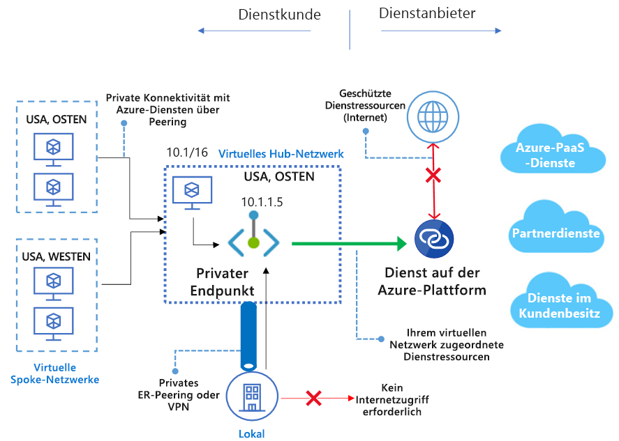

# Was ist Azure Private Link? (Vorschau)
Mit Azure Private Link können Sie über einen [privaten Endpunkt](private-endpoint-overview.md) in Ihrem virtuellen Netzwerk auf Azure-PaaS-Dienste (beispielsweise Azure Storage, Azure Cosmos DB und SQL Database) sowie auf in Azure gehostete Kunden-/Partnerdienste zugreifen. Der Datenverkehr zwischen Ihrem virtuellen Netzwerk und dem Dienst wird über das Microsoft-Backbone-Netzwerk übertragen und dadurch vom öffentlichen Internet isoliert. Sie können auch Ihren eigenen [Private Link-Dienst](private-link-service-overview.md) in Ihrem virtuellen Netzwerk (VNet) erstellen und Ihren Kunden privat zur Verfügung stellen. Die Einrichtung und Nutzung von Azure Private Links ist in Azure-PaaS-, Kunden- und gemeinsamen Partnerdiensten konsistent.

> [!IMPORTANT]
> Diese öffentliche Vorschauversion wird ohne Servicelevelvereinbarung bereitgestellt und sollte nicht für Produktionsworkloads verwendet werden. Unter Umständen werden bestimmte Features nicht unterstützt, verfügen über eingeschränkte Funktionen und sind nicht an allen Azure-Standorten verfügbar. Weitere Informationen finden Sie unter [Ergänzende Nutzungsbedingungen für Microsoft Azure-Vorschauversionen](https://azure.microsoft.com/support/legal/preview-supplemental-terms/). Weitere Informationen zu bekannten Einschränkungen finden Sie unter [Privater Endpunkt](private-endpoint-overview.md#limitations) und [Private Link-Dienst](private-link-service-overview.md#limitations).

## Hauptvorteile
Azure Private Link bietet folgende Vorteile:  
- **Private Zugriffsdienste auf der Azure-Plattform**: Verbinden Sie Ihr virtuelles Netzwerk mit Diensten, die in Azure privat ausgeführt werden, ohne dass Sie eine öffentliche IP-Adresse an der Quelle oder am Ziel benötigen. Dienstanbieter können ihre Dienste privat in ihrem eigenen virtuellen Netzwerk rendern, und Consumer können privat in ihrem lokalen virtuellen Netzwerk auf diese Dienste zugreifen. Die Private Link-Plattform verarbeitet die Konnektivität zwischen dem Consumer und den Diensten über das Azure-Backbone-Netzwerk. 
 
- **Lokale Netzwerke und Peernetzwerke**: Greifen Sie mithilfe privater Endpunkte von einer lokalen Umgebung über privates Peering/VPN-Tunnel (von einer lokalen Umgebung) und virtuelle Netzwerke mit Peering auf Dienste zu, in die Azure ausgeführt werden. Es ist nicht erforderlich, öffentliches Peering einzurichten oder über das Internet auf den Dienst zuzugreifen. Dies ist eine sichere Möglichkeit, um Workloads zu Azure zu migrieren.
 
- **Schutz vor Datenexfiltration**:  Mit Azure Private Link wird der private Endpunkt im VNet einer bestimmten Instanz der PaaS-Ressource des Kunden zugeordnet und nicht dem gesamten Dienst. Mithilfe des privaten Endpunkts können Consumer nur eine Verbindung zu einer bestimmten und keiner anderen Ressource im Dienst herstellen. Dieser integrierte Mechanismus bietet Schutz vor Datenexfiltration. 
 
- **Globale Reichweite**: Stellen Sie private Verbindungen zu Diensten her, die in anderen Regionen ausgeführt werden. Das heißt, dass sich das virtuelle Netzwerk des Consumers beispielsweise in Region A befindet und eine Verbindung mit Diensten hinter Private Link in Region B herstellen kann.  
 
- **Ausweiten auf Ihre eigenen Dienste**: Nutzen Sie die gleichen Funktionen, um Ihren eigenen Dienst privat für Ihre Consumer in Azure zu rendern. Wenn Sie Ihren Dienst hinter einem Load Balancer Standard platzieren, können Sie ihn für Private Link aktivieren. Der Consumer kann dann mithilfe eines privaten Endpunkts in seinem eigenen VNet eine direkte Verbindung mit dem Dienst herstellen. Diese Verbindungsanforderungen können mithilfe eines einfachen Ablaufs für Genehmigungsaufrufe verwaltet werden. Azure Private Link funktioniert auch für Consumer und Dienste, die unterschiedlichen Active Directory-Mandanten angehören. 

## Verfügbarkeit 
 In der folgenden Tabelle sind die Private Link-Dienste und die Regionen, in denen sie verfügbar sind, aufgelistet. 

|Szenario  |Unterstützte Dienste   |Verfügbare Regionen | Status   |
|---------|---------|---------|---------|
|Private Link für Kundendienste|Private Link-Dienste hinter Load Balancer Standard |USA, Westen-Mitte; USA, Westen; USA, Süden-Mitte; USA, Osten; USA, Norden-Mitte  |  Vorschau  |
|Private Link für Azure PaaS-Dienste   | Azure Storage        |  USA, Osten; USA, Westen; USA, Westen-Mitte       | Vorschau         |
|  | Azure Data Lake Storage Gen2        |  USA, Osten; USA, Westen; USA, Westen-Mitte       | Vorschau         |
|  |  Azure SQL-Datenbank         | USA, Westen-Mitte; USA, Westen; USA, Süden-Mitte; USA, Osten; USA, Norden-Mitte      |   Vorschau      |
||Azure SQL Data Warehouse| USA, Westen-Mitte; USA, Westen; USA, Süden-Mitte; USA, Osten; USA, Norden-Mitte |Vorschau|
||Azure Cosmos DB| USA, Westen-Mitte; USA, Westen; USA, Osten; USA, Norden-Mitte; USA, Osten 2; USA, Westen 2 |Vorschau|

Aktuelle Benachrichtigungen finden Sie auf der Seite [Azure Virtual Network-Updates](https://azure.microsoft.com/updates/?product=virtual-network).

## Protokollierung und Überwachung

Azure Private Link ist in Azure Monitor integriert, sodass Sie Protokolle in einem Speicherkonto archivieren, Ereignisse an Ihren Event Hub streamen oder an Azure Monitor-Protokolle senden können. Sie können über Azure Monitor auf die folgenden Informationen zugreifen: 
- **Privater Endpunkt**: Die vom privaten Endpunkt verarbeiteten Daten (ein-/ausgehend)
 
- **Private Link-Dienst**:
    - Die vom Private Link-Dienst verarbeiteten Daten (ein-/ausgehend)
    - NAT-Portverfügbarkeit  
 
## Preise   
Ausführliche Preisinformationen finden Sie unter [Azure Private Link – Preise](https://azure.microsoft.com/pricing/details/private-link/).
 
## Häufig gestellte Fragen  
Häufig gestellte Fragen finden Sie unter [Häufig gestellte Fragen zu Azure Private Link](private-link-faq.md).
 
## Einschränkungen  
Informationen zu Einschränkungen finden Sie unter [Einschränkungen für Azure Private Link](../azure-subscription-service-limits.md#private-link-limits).

## Nächste Schritte
- [Erstellen eines privaten Endpunkts mit dem Azure-Portal](create-private-endpoint-portal.md)
- [Erstellen eines privaten Endpunkts über PowerShell](create-private-endpoint-powershell.md)
- [Erstellen eines privaten Endpunkts über die Azure CLI](create-private-endpoint-cli.md)
- [Erstellen eines privaten Endpunkts für das Speicherkonto im Portal](create-private-endpoint-storage-portal.md)
- [Erstellen eines privaten Endpunkts für das Azure Cosmos-Konto im Portal](../cosmos-db/how-to-configure-private-endpoints.md)
- [Erstellen eines eigenen Private Link-Diensts mit Azure PowerShell](create-private-link-service-powershell.md)

 
