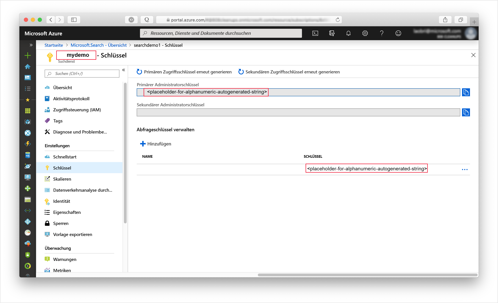

# <a name="tutorial-add-structure-to-unstructured-content-with-ai-enrichment"></a>Tutorial: Strukturieren unstrukturierter Inhalte mit KI-Anreicherung

Wenn Sie über unstrukturierte Text- oder Bildinhalte verfügen, können Sie mithilfe einer [KI-Anreicherungspipeline](cognitive-search-concept-intro.md) Informationen extrahieren und neue Inhalte erstellen, die für die Volltextsuche oder in Knowledge Mining-Szenarien verwendet werden können. Eine Pipeline kann zwar Bilddateien (JPG, PNG, TIFF) verarbeiten, dieses Tutorial konzentriert sich jedoch auf wortbasierte Inhalte, um mithilfe von Spracherkennung und Textanalyse neue Felder und Informationen zu erstellen, die Sie in Abfragen, Facetten und Filtern nutzen können.

> [!div class="checklist"]
> * Beginnen Sie mit vollständigen Dokumenten (unstrukturierter Text, beispielsweise im PDF-, MD-, DOCX- oder PPTX-Format) in Azure Blob Storage.
> * Erstellen Sie eine Pipeline, die Text extrahiert und Sprache, Entitäten sowie Schlüsselbegriffe erkennt.
> * Definieren Sie einen Index zum Speichern der Ausgabe (Rohinhalte sowie von der Pipeline generierte Name/Wert-Paare).
> * Führen Sie die Pipeline aus, um Transformationen und Analysen zu starten und den Index zu erstellen und zu laden.
> * Erkunden Sie Ergebnisse per Volltextsuche und umfangreicher Abfragesyntax.

Für diese exemplarische Vorgehensweise benötigen Sie mehrere Dienste sowie die [Postman-Desktop-App](https://www.getpostman.com/) oder ein anderes Webtesttool zum Ausführen von Rest-API-Aufrufen. 

Sollten Sie über kein Azure-Abonnement verfügen, können Sie ein [kostenloses Konto](https://azure.microsoft.com/free/?WT.mc_id=A261C142F) erstellen, bevor Sie beginnen.

## <a name="download-files"></a>Herunterladen von Dateien

1. Öffnen Sie [diesen OneDrive-Ordner](https://1drv.ms/f/s!As7Oy81M_gVPa-LCb5lC_3hbS-4), und klicken Sie links oben auf **Herunterladen**, um die Dateien auf Ihren Computer zu kopieren. 

1. Klicken Sie mit der rechten Maustaste auf die ZIP-Datei, und wählen Sie **Alle extrahieren** aus. Es stehen 14 Dateien verschiedener Art zur Verfügung. In dieser Übung werden sieben davon verwendet.

## <a name="1---create-services"></a>1\. Erstellen der Dienste

In dieser exemplarischen Vorgehensweise werden Azure Cognitive Search für Indizierungsvorgänge und Abfragen, Cognitive Services für die KI-Anreicherung und Azure Blob Storage für die Datenbereitstellung verwendet. Die drei Dienste sollten nach Möglichkeit in der gleichen Region und Ressourcengruppe erstellt werden, um einen möglichst geringen Abstand zu erreichen und die Verwaltung zu vereinfachen. In der Praxis kann sich Ihr Azure Storage-Konto in einer beliebigen Region befinden.

### <a name="start-with-azure-storage"></a>Azure Storage

1. [Melden Sie sich beim Azure-Portal](https://portal.azure.com/) an, und klicken Sie auf **+ Ressource erstellen**.

1. Suchen Sie nach *Speicherkonto*, und wählen Sie das Speicherkonto-Angebot von Microsoft aus.

   

1. Auf der Registerkarte „Grundlagen“ sind folgende Angaben erforderlich. Übernehmen Sie bei allen anderen Optionen die Standardeinstellungen.

   + **Ressourcengruppe**. Sie können entweder eine vorhandene Ressourcengruppe auswählen oder eine neue Ressourcengruppe erstellen. Verwenden Sie jedoch für alle Dienste die gleiche Gruppe, um die Dienste gemeinsam verwalten zu können.

   + **Speicherkontoname**: Falls Sie über mehrere Ressourcen des gleichen Typs verfügen, geben Sie zur Unterscheidung den Typ und die Region an (Beispiel: *blobstoragewestus*). 

   + **Standort**. Wählen Sie nach Möglichkeit den gleichen Standort aus, der auch für Azure Cognitive Search und Cognitive Services verwendet wird. Bei Verwendung eines einzelnen Standorts fallen keine Bandbreitengebühren an.

   + **Kontoart**: Verwenden Sie die Standardeinstellung *StorageV2 (allgemein, Version 2)* .

1. Klicken Sie zum Erstellen des Diensts auf **Überprüfen + erstellen**.

1. Klicken Sie nach der Erstellung auf **Go to the resource** (Zur Ressource), um die Übersichtsseite zu öffnen.

1. Klicken Sie auf den Dienst **Blobs**.

1. Klicken Sie auf **+ Container**, um einen Container zu erstellen, und nennen Sie ihn *cog-search-demo*.

1. Wählen Sie *cog-search-demo* aus, und klicken Sie auf **Hochladen**, um den Ordner zu öffnen, in dem Sie die Downloaddateien gespeichert haben. Wählen Sie alle Dateien aus, bei denen es sich nicht um Bilddateien handelt. Es müssen sieben Dateien sein. Klicken Sie auf **OK**, um die Dateien hochzuladen.

   

1. Rufen Sie eine Verbindungszeichenfolge ab, bevor Sie Azure Storage verlassen, um in Azure Cognitive Search eine Verbindung herstellen zu können. 

   1. Kehren Sie zur Übersichtsseite Ihres Speicherkontos zurück. (Wir haben *blobstoragewestus* als Beispiel verwendet.) 
   
   1. Wählen Sie im linken Navigationsbereich die Option **Zugriffsschlüssel** aus, und kopieren Sie eine der Verbindungszeichenfolgen. 

   Die Verbindungszeichenfolge ist eine URL, die in etwa wie folgt aussieht:

      ```http
      DefaultEndpointsProtocol=https;AccountName=cogsrchdemostorage;AccountKey=<your account key>;EndpointSuffix=core.windows.net
      ```

1. Speichern Sie die Verbindungszeichenfolge im Editor. Sie wird später bei der Einrichtung der Datenquellenverbindung benötigt.

### <a name="cognitive-services"></a>Cognitive Services

Die KI-Anreicherung basiert auf Cognitive Services (einschließlich Textanalyse und maschinellem Sehen für die Verarbeitung von natürlicher Sprache und Bildern). Bei der Erstellung eines echten Prototyps oder Projekts würden Sie an dieser Stelle Cognitive Services bereitstellen (in der gleichen Region wie Azure Cognitive Search), um eine Verknüpfung mit Indizierungsvorgängen zu ermöglichen.

In dieser Übung können Sie die Ressourcenbereitstellung allerdings überspringen, da Azure Cognitive Search im Hintergrund eine Verbindung mit Cognitive Services herstellen kann und 20 kostenlose Transaktionen pro Indexerausführung ermöglicht. Da in diesem Tutorial sieben Transaktionen verwendet werden, ist die kostenlose Zuteilung ausreichend. Planen Sie bei umfangreicheren Projekten die Bereitstellung von Cognitive Services im S0-Tarif (nutzungsbasierte Bezahlung). Weitere Informationen finden Sie unter [Anfügen einer Cognitive Services-Ressource an eine Qualifikationsgruppe in Azure Search](cognitive-search-attach-cognitive-services.md).

### <a name="azure-cognitive-search"></a>Azure Cognitive Search

Die dritte Komponente, Azure Cognitive Search, können Sie [im Portal erstellen](search-create-service-portal.md). Im Rahmen dieser exemplarischen Vorgehensweise können Sie den Free-Tarif verwenden. 

Erfassen Sie genau wie bei Azure Blob Storage den Zugriffsschlüssel. Wenn Sie später mit der Strukturierung von Anforderungen beginnen, müssen Sie den Endpunkt und den Administrator-API-Schlüssel für die Authentifizierung der jeweiligen Anforderung angeben.

### <a name="get-an-admin-api-key-and-url-for-azure-cognitive-search"></a>Abrufen eines Administrator-API-Schlüssels und einer URL für Azure Cognitive Search

1. [Melden Sie sich beim Azure-Portal an](https://portal.azure.com/), und rufen Sie auf der Seite **Übersicht** Ihres Suchdiensts den Namen Ihres Suchdiensts ab. Sie können den Dienstnamen anhand der Endpunkt-URL überprüfen. Wenn Ihre Endpunkt-URL z.B. `https://mydemo.search.windows.net` lautet, ist der Name des Diensts `mydemo`.

2. Rufen Sie unter **Einstellungen** > **Schlüssel** einen Administratorschlüssel ab, um Vollzugriff auf den Dienst zu erhalten. Es gibt zwei austauschbare Administratorschlüssel – diese wurden zum Zweck der Geschäftskontinuität bereitgestellt, falls Sie einen Rollover für einen Schlüssel durchführen müssen. Für Anforderungen zum Hinzufügen, Ändern und Löschen von Objekten können Sie den primären oder den sekundären Schlüssel verwenden.

    Rufen Sie auch den Abfrageschlüssel ab. Es empfiehlt sich, Abfrageanforderungen mit schreibgeschütztem Zugriff auszugeben.



Für alle an Ihren Dienst gesendeten Anforderungen ist ein API-Schlüssel im Header erforderlich. Ein gültiger Schlüssel stellt anforderungsbasiert eine Vertrauensstellung her zwischen der Anwendung, die die Anforderung sendet, und dem Dienst, der sie verarbeitet.

## <a name="2---set-up-postman"></a>2\. Einrichten von Postman

Starten Sie Postman, und richten Sie eine HTTP-Anforderung ein. Wenn Sie mit diesem Tool nicht vertraut sind, lesen Sie [Untersuchen von Azure Cognitive Search-REST-APIs mit Postman](search-get-started-postman.md).

Die in diesem Tutorial verwendeten Anforderungsmethoden sind **POST**, **PUT** und **GET**. Mithilfe der Methoden werden vier API-Aufrufe an Ihren Suchdienst gerichtet, um eine Datenquelle, ein Skillset, einen Index und einen Indexer zu erstellen.

Legen Sie unter „Header“ den Inhaltstyp (Content-type) auf `application/json` und `api-key` auf den Administrator-API-Schlüssel Ihres Azure Cognitive Search-Diensts fest. Die festgelegten Header können Sie dann für jede Anforderung in dieser Übung verwenden.

  

## <a name="3---create-the-pipeline"></a>3\. Erstellen der Pipeline

In Azure Cognitive Search erfolgt die KI-Verarbeitung während der Indizierung (oder Datenerfassung). In diesem Teil der exemplarischen Vorgehensweise werden vier Objekte erstellt: Datenquelle, Indexdefinition, Skillset und Indexer. 

### <a name="step-1-create-a-data-source"></a>Schritt 1: Erstellen einer Datenquelle

Ein [Datenquellenobjekt](https://docs.microsoft.com/rest/api/searchservice/create-data-source) stellt die Verbindungszeichenfolge für den Blobcontainer mit den Dateien bereit.

1. Verwenden Sie **POST** und die folgende URL, und ersetzen Sie dabei „YOUR-SERVICE-NAME“ durch den tatsächlichen Namen Ihres Diensts.

   ```http
   https://[YOUR-SERVICE-NAME].search.windows.net/datasources?api-version=2019-05-06
   ```

1. Kopieren Sie im **Anforderungstext** die folgende JSON-Definition, und ersetzen Sie dabei `connectionString` durch die tatsächliche Verbindung Ihres Speicherkontos. 

   Vergessen Sie nicht, auch den Containernamen zu bearbeiten. In einem früheren Schritt wurde „cog-search-demo“ als Containername vorgeschlagen.

    ```json
    {
      "name" : "cog-search-demo-ds",
      "description" : "Demo files to demonstrate cognitive search capabilities.",
      "type" : "azureblob",
      "credentials" :
      { "connectionString" :
        "DefaultEndpointsProtocol=https;AccountName=<YOUR-STORAGE-ACCOUNT>;AccountKey=<YOUR-ACCOUNT-KEY>;"
      },
      "container" : { "name" : "<YOUR-BLOB-CONTAINER-NAME>" }
    }
    ```
1. Senden Sie die Anforderung. Daraufhin sollte zur Bestätigung der erfolgreichen Ausführung ein Statuscode vom Typ 201 angezeigt werden. 

Wenn der Fehler 403 oder 404 angezeigt wird, überprüfen Sie die Konstruktion der Anforderung: `api-version=2019-05-06` sollte im Endpunkt vorhanden sein, `api-key` sollte im Header hinter `Content-Type` vorhanden sein, und sein Wert muss für einen Suchdienst gültig sein. Vergewissern Sie sich ggf. mithilfe eines JSON-Onlinevalidierungstools, dass die Syntax des JSON-Dokuments korrekt ist. 

### <a name="step-2-create-a-skillset"></a>Schritt 2: Erstellen eines Skillsets

Bei einem [Skillset-Objekt](https://docs.microsoft.com/rest/api/searchservice/create-skillset) handelt es sich um eine Gruppe von Anreicherungsschritten, die auf Ihre Inhalte angewendet werden. 

1. Verwenden Sie **PUT** und die folgende URL, und ersetzen Sie dabei „YOUR-SERVICE-NAME“ durch den tatsächlichen Namen Ihres Diensts.

    ```http
    https://[YOUR-SERVICE-NAME].search.windows.net/skillsets/cog-search-demo-ss?api-version=2019-05-06
    ```

1. Kopieren Sie im **Anforderungstext** die folgende JSON-Definition. Dieses Skillset umfasst die folgenden integrierten Qualifikationen:

   | Skill                 | BESCHREIBUNG    |
   |-----------------------|----------------|
   | [Entitätserkennung](cognitive-search-skill-entity-recognition.md) | Extrahiert die Namen von Personen, Organisationen und Orten aus Inhalten im Blobcontainer. |
   | [Sprachenerkennung](cognitive-search-skill-language-detection.md) | Erkennt die Sprache des Inhalts. |
   | [Text unterteilen](cognitive-search-skill-textsplit.md)  | Unterteilt große Inhalte vor dem Aufrufen der Schlüsselbegriffserkennung in kleinere Blöcke. Die Schlüsselbegriffserkennung akzeptiert Eingaben von 50.000 Zeichen oder weniger. Für einige der Beispieldateien ist eine Aufteilung erforderlich, um diesen Grenzwert zu erfüllen. |
   | [Schlüsselbegriffserkennung](cognitive-search-skill-keyphrases.md) | Extrahiert die wichtigsten Schlüsselbegriffe. |

   Jede Qualifikation wird auf den Inhalten des Dokuments ausgeführt. Während der Verarbeitung entschlüsselt Azure Cognitive Search jedes Dokument, um die Inhalte aus verschiedenen Dateiformaten zu lesen. Gefundener Text, der aus der Quelldatei stammt, wird in einem generierten Feld ```content``` gespeichert, einem für jedes Dokument. Die Eingabe wird somit zu ```"/document/content"```.

   Da wir hier die Qualifikation „Text unterteilen“ verwenden, um größere Dateien in Seiten zu unterteilen, lautet der Kontext bei der Schlüsselbegriffserkennung nicht ```"/document/content"```, sondern ```"document/pages/*"``` (für jede Seite im Dokument).

    ```json
    {
      "description": "Extract entities, detect language and extract key-phrases",
      "skills":
      [
        {
          "@odata.type": "#Microsoft.Skills.Text.EntityRecognitionSkill",
          "categories": [ "Person", "Organization", "Location" ],
          "defaultLanguageCode": "en",
          "inputs": [
            { "name": "text", "source": "/document/content" }
          ],
          "outputs": [
            { "name": "persons", "targetName": "persons" },
            { "name": "organizations", "targetName": "organizations" },
            { "name": "locations", "targetName": "locations" }
          ]
        },
        {
          "@odata.type": "#Microsoft.Skills.Text.LanguageDetectionSkill",
          "inputs": [
            { "name": "text", "source": "/document/content" }
          ],
          "outputs": [
            { "name": "languageCode", "targetName": "languageCode" }
          ]
        },
        {
          "@odata.type": "#Microsoft.Skills.Text.SplitSkill",
          "textSplitMode" : "pages",
          "maximumPageLength": 4000,
          "inputs": [
            { "name": "text", "source": "/document/content" },
            { "name": "languageCode", "source": "/document/languageCode" }
          ],
          "outputs": [
            { "name": "textItems", "targetName": "pages" }
          ]
        },
        {
          "@odata.type": "#Microsoft.Skills.Text.KeyPhraseExtractionSkill",
          "context": "/document/pages/*",
          "inputs": [
            { "name": "text", "source": "/document/pages/*" },
            { "name":"languageCode", "source": "/document/languageCode" }
          ],
          "outputs": [
            { "name": "keyPhrases", "targetName": "keyPhrases" }
          ]
        }
      ]
    }
    ```
    Unten finden Sie eine grafische Darstellung der Qualifikationsgruppe. 

    

1. Senden Sie die Anforderung. Daraufhin sollte von Postman zur Bestätigung der erfolgreichen Ausführung ein Statuscode vom Typ 201 zurückgegeben werden. 

> [!NOTE]
> Ausgaben können einem Index zugeordnet, als Eingabe einer Downstream-Qualifikation verwendet oder in beider Weise zugleich eingesetzt werden, wie etwa bei Sprachcode. Im Index ist ein Sprachcode zu Filterungszwecken nützlich. Als Eingabe wird ein Sprachcode von Qualifikationen zur Textanalyse verwendet, um die Linguistikregeln über Wörtertrennung zu informieren. Weitere Informationen zu den Grundlagen von Qualifikationsgruppen finden Sie unter [How to define a skillset](cognitive-search-defining-skillset.md) (Definieren von Qualifikationsgruppen).

### <a name="step-3-create-an-index"></a>Schritt 3: Erstellen eines Index

Ein [Index](https://docs.microsoft.com/rest/api/searchservice/create-index) stellt das Schema bereit, das verwendet wird, um den physischen Ausdruck Ihres Inhalts in invertierten Indizes und anderen Konstrukten in Azure Cognitive Search zu erstellen. Die größte Komponente eines Index ist die Feldauflistung, deren Datentyp und Attribute die Inhalte und Verhaltensweisen in Azure Cognitive Search bestimmen.

1. Verwenden Sie **PUT** und die folgende URL, und ersetzen Sie dabei „YOUR-SERVICE-NAME“ durch den tatsächlichen Namen Ihres Diensts, um Ihren Index zu benennen.

   ```http
   https://[YOUR-SERVICE-NAME].search.windows.net/indexes/cog-search-demo-idx?api-version=2019-05-06
   ```

1. Kopieren Sie im **Anforderungstext** die folgende JSON-Definition. Das Feld `content` dient zum Speichern des eigentlichen Dokuments. Zusätzliche Felder für `languageCode`, `keyPhrases` und `organizations` stellen neue Informationen (Felder und Werte) dar, die durch das Skillset erstellt werden.

    ```json
    {
      "fields": [
        {
          "name": "id",
          "type": "Edm.String",
          "key": true,
          "searchable": true,
          "filterable": false,
          "facetable": false,
          "sortable": true
        },
        {
          "name": "metadata_storage_name",
          "type": "Edm.String",
          "searchable": false,
          "filterable": false,
          "facetable": false,
          "sortable": false
        },
        {
          "name": "content",
          "type": "Edm.String",
          "sortable": false,
          "searchable": true,
          "filterable": false,
          "facetable": false
        },
        {
          "name": "languageCode",
          "type": "Edm.String",
          "searchable": true,
          "filterable": false,
          "facetable": false
        },
        {
          "name": "keyPhrases",
          "type": "Collection(Edm.String)",
          "searchable": true,
          "filterable": false,
          "facetable": false
        },
        {
          "name": "persons",
          "type": "Collection(Edm.String)",
          "searchable": true,
          "sortable": false,
          "filterable": true,
          "facetable": true
        },
        {
          "name": "organizations",
          "type": "Collection(Edm.String)",
          "searchable": true,
          "sortable": false,
          "filterable": true,
          "facetable": true
        },
        {
          "name": "locations",
          "type": "Collection(Edm.String)",
          "searchable": true,
          "sortable": false,
          "filterable": true,
          "facetable": true
        }
      ]
    }
    ```

1. Senden Sie die Anforderung. Daraufhin sollte von Postman zur Bestätigung der erfolgreichen Ausführung ein Statuscode vom Typ 201 zurückgegeben werden. 

### <a name="step-4-create-and-run-an-indexer"></a>Schritt 4: Erstellen und Ausführen eines Indexers

Ein [Indexer](https://docs.microsoft.com/rest/api/searchservice/create-indexer) steuert die Pipeline. Die drei bereits erstellten Komponenten (Datenquelle, Skillset und Index) sind Eingaben für einen Indexer. Durch die Erstellung des Indexers in Azure Cognitive Search wird die gesamte Pipeline aktiviert. 

1. Verwenden Sie **PUT** und die folgende URL, und ersetzen Sie dabei „YOUR-SERVICE-NAME“ durch den tatsächlichen Namen Ihres Diensts, um Ihren Indexer zu benennen.

   ```http
   https://[servicename].search.windows.net/indexers/cog-search-demo-idxr?api-version=2019-05-06
   ```

1. Kopieren Sie im **Anforderungstext** die folgende JSON-Definition. Beachten Sie die Feldzuordnungselemente. Diese Zuordnungen sind wichtig, da Sie den Datenfluss definieren. 

   Elemente vom Typ `fieldMappings` werden vor dem Skillset verarbeitet und senden Inhalte aus der Datenquelle an Zielfelder in einem Index. Feldzuordnungen werden verwendet, um bereits vorhandene, unveränderte Inhalte an den Index zu senden. Wenn die Feldnamen und -typen auf beiden Seiten gleich sind, ist keine Zuordnung erforderlich.

   Elemente vom Typ `outputFieldMappings` sind für Felder vorgesehen, die durch Qualifikationen erstellt werden, und werden daher erst nach Ausführung des Skillsets verarbeitet. Die Verweise auf `sourceFieldNames` in `outputFieldMappings` müssen erst durch die Dokumententschlüsselung oder Anreicherung erstellt werden. Bei `targetFieldName` handelt es sich um ein im Indexschema definiertes Feld in einem Index.

    ```json
    {
      "name":"cog-search-demo-idxr",    
      "dataSourceName" : "cog-search-demo-ds",
      "targetIndexName" : "cog-search-demo-idx",
      "skillsetName" : "cog-search-demo-ss",
      "fieldMappings" : [
        {
          "sourceFieldName" : "metadata_storage_path",
          "targetFieldName" : "id",
          "mappingFunction" :
            { "name" : "base64Encode" }
        },
        {
          "sourceFieldName" : "metadata_storage_name",
          "targetFieldName" : "metadata_storage_name",
          "mappingFunction" :
            { "name" : "base64Encode" }
        },
        {
          "sourceFieldName" : "content",
          "targetFieldName" : "content"
        }
      ],
      "outputFieldMappings" :
      [
        {
          "sourceFieldName" : "/document/persons",
          "targetFieldName" : "persons"
        },
        {
          "sourceFieldName" : "/document/organizations",
          "targetFieldName" : "organizations"
        },
        {
          "sourceFieldName" : "/document/locations",
          "targetFieldName" : "locations"
        },
        {
          "sourceFieldName" : "/document/pages/*/keyPhrases/*",
          "targetFieldName" : "keyPhrases"
        },
        {
          "sourceFieldName": "/document/languageCode",
          "targetFieldName": "languageCode"
        }
      ],
      "parameters":
      {
        "maxFailedItems":-1,
        "maxFailedItemsPerBatch":-1,
        "configuration":
        {
          "dataToExtract": "contentAndMetadata",
          "parsingMode": "default",
          "firstLineContainsHeaders": false,
          "delimitedTextDelimiter": ","
        }
      }
    }
    ```

1. Senden Sie die Anforderung. Daraufhin sollte von Postman zur Bestätigung der erfolgreichen Verarbeitung ein Statuscode vom Typ 201 zurückgegeben werden. 

   Sie sollten damit rechnen, dass die Ausführung dieses Schritts mehrere Minuten in Anspruch nimmt. Das Dataset ist zwar klein, Analysequalifikationen sind aber rechenintensiv. 

> [!NOTE]
> Die Pipeline wird durch Erstellen eines Indexers aufgerufen. Wenn beim Zugriff auf die Daten, dem Zuordnen von Ein- und Ausgaben oder der Reihenfolge der Vorgänge Probleme bestehen, äußern sie sich in dieser Phase. Um die Pipeline mit Code- oder Skriptänderungen auszuführen, müssen Sie möglicherweise zuerst Objekte löschen. Weitere Informationen finden Sie unter [Reset and re-run](#reset) (Zurücksetzen und erneut Ausführen).

#### <a name="about-indexer-parameters"></a>Informationen zu Indexerparametern

Das Skript legt ```"maxFailedItems"``` auf -1 fest, was die Indexengine anweist, Fehler beim Datenimport zu ignorieren. Dies ist akzeptabel, da die Demodatenquelle nur einige wenige Dokumente enthält. Für eine größere Datenquelle sollten Sie den Wert größer als 0 festlegen.

Durch die Anweisung ```"dataToExtract":"contentAndMetadata"``` wird der Indexer angewiesen, die Inhalte aus verschiedenen Dateiformaten sowie die den einzelnen Dateien zugeordneten Metadaten automatisch zu extrahieren. 

Wenn die Inhalte extrahiert werden, können Sie ```imageAction``` darauf festlegen, Text aus in der Datenquelle gefundenen Bildern zu extrahieren. Die Konfiguration ```"imageAction":"generateNormalizedImages"``` in Kombination mit der OCR- und der Textzusammenführungsqualifikation weist den Indexer an, Text aus den Bildern zu extrahieren (beispielsweise das Wort „Stop“ aus einem Stoppschild) und ihn als Teil des Inhaltsfelds einzubetten. Dieses Verhalten betrifft sowohl die in den Dokumenten eingebetteten Bilder (denken Sie etwa an Bilder in PDF-Dateien) als auch die in der Datenquelle gefundenen Bilder, z.B. eine JPG-Datei.

## <a name="4---monitor-indexing"></a>4\. Überwachen der Indizierung

Indizierung und Anreicherung beginnen, sobald Sie die Anforderung für die Indexererstellung übermitteln. Abhängig von den kognitiven Qualifikationen, die Sie definiert haben, kann die Indizierung eine Weile dauern. Um herauszufinden, ob der Indexer noch ausgeführt wird, senden Sie die folgende Anforderung, um den Indexerstatus zu überprüfen.

1. Verwenden Sie **GET** und die folgende URL, und ersetzen Sie dabei „YOUR-SERVICE-NAME“ durch den tatsächlichen Namen Ihres Diensts, um Ihren Indexer zu benennen.

   ```http
   https://[YOUR-SERVICE-NAME].search.windows.net/indexers/cog-search-demo-idxr/status?api-version=2019-05-06
   ```

1. Ermitteln Sie anhand der Antwort, ob der Indexer ausgeführt wird, oder sehen Sie sich Fehler- und Warnungsinformationen an.  

Bei Verwendung des Free-Tarifs ist mit folgender Meldung zu rechnen: „Could not extract content or metadata from your document. Truncated extracted text to '32768' characters.“ (Inhalte oder Metadaten konnten nicht aus Ihrem Dokument extrahiert werden. Der extrahierte Text wurde auf 32.768 Zeichen gekürzt.) Diese Meldung wird angezeigt, da die Blobindizierung im Free-Tarif [auf 32.000 extrahierbare Zeichen beschränkt](search-limits-quotas-capacity.md#indexer-limits) ist. Bei höheren Tarifen wird diese Meldung für das Dataset nicht angezeigt. 

> [!NOTE]
> Warnungen sind in bestimmten Szenarien keine Seltenheit, deuten aber nicht immer auf ein Problem hin. Wenn zum Beispiel ein Blobcontainer Bilddateien enthält und die Pipeline keine Bilder verarbeitet, wird eine entsprechende Warnung angezeigt.

## <a name="5---search"></a>5\. Suchen

Nachdem Sie nun neue Felder und Informationen erstellt haben, führen wir als Nächstes einige Abfragen aus, um den Nutzen der kognitiven Suche in einem typischen Suchszenario zu verdeutlichen.

Zur Erinnerung: Wir haben Blobinhalte als Grundlage verwendet, bei denen das gesamte Dokument in ein einzelnes Feld vom Typ `content` gepackt wird. Sie können dieses Feld durchsuchen und nach Übereinstimmungen für Ihre Abfragen suchen.

1. Verwenden Sie **GET** und die folgende URL, und ersetzen Sie dabei „YOUR-SERVICE-NAME“ durch den tatsächlichen Namen Ihres Diensts, um nach Instanzen eines Begriffs oder Ausdrucks zu suchen und das Feld `content` sowie eine Anzahl der übereinstimmenden Dokumente zurückzugeben.

   ```http
   https://[YOUR-SERVICE-NAME].search.windows.net/indexes/cog-search-demo-idx?search=*&$count=true&$select=content?api-version=2019-05-06
   ```
   
   In den Ergebnissen dieser Abfrage werden Dokumentinhalte zurückgegeben. Dabei handelt es sich um das gleiche Ergebnis, das Sie erhalten, wenn Sie den Blobindexer ohne die Pipeline der kognitiven Suche verwenden. Dieses Feld ist zwar durchsuchbar, kann aber nicht für Facetten, Filter oder AutoVervollständigen verwendet werden.

   
   
1. Geben Sie bei der zweiten Abfrage einige der neuen Felder zurück, die von der Pipeline erstellt wurden („persons“, „organizations“, „locations“, „languageCode“). „keyPhrases“ lassen wir der Einfachheit halber weg. Wenn Sie diese Werte sehen möchten, können Sie sie aber mit einschließen.

   ```http
   https://mydemo.search.windows.net/indexes/cog-search-demo-idx/docs?search=*&$count=true&$select=metadata_storage_name,persons,organizations,locations,languageCode&api-version=2019-05-06
   ```
   Die Felder in der Anweisung „$select“ enthalten neue Informationen, die auf der Grundlage der Cognitive Services-Funktionen für die Verarbeitung natürlicher Sprache erstellt wurden. Erwartungsgemäß sind die Ergebnisse nicht ganz frei von Störungen, und es gibt gewisse Abweichungen zwischen Dokumenten, aber in vielen Fällen liefern die analytischen Modelle präzise Ergebnisse.

   Die folgende Abbildung zeigt Ergebnisse für den offenen Brief von Satya Nadella nach der Übernahme des CEO-Postens bei Microsoft.

   

1. Fügen Sie zur Veranschaulichung des Nutzens dieser Felder einen Facettenparameter hinzu, um eine Aggregation übereinstimmender Dokumente nach Standort zurückzugeben.

   ```http
   https://[YOUR-SERVICE-NAME].search.windows.net/indexes/cog-search-demo-idx/docs?search=*&facet=locations&api-version=2019-05-06
   ``` 

   In diesem Beispiel gibt es zwei oder drei Übereinstimmungen für jeden Standort.

   
   

1. Wenden Sie in diesem letzten Beispiel einen Filter auf die Organisationsauflistung an, um zwei Übereinstimmungen für NASDAQ-basierte Filterkriterien zurückzugeben.

   ```http
   cog-search-demo-idx/docs?search=*&$filter=organizations/any(organizations: organizations eq 'NASDAQ')&$select=metadata_storage_name,organizations&$count=true&api-version=2019-05-06
   ```

Diese Abfragen veranschaulichen einige Verwendungsmöglichkeiten für die Abfragesyntax und die Filter für neue Felder, die von der kognitiven Suche erstellt wurden. Weitere Abfragebeispiele finden Sie in den [Beispielen des Artikels „Search Documents (Azure Search Service REST API)“](https://docs.microsoft.com/rest/api/searchservice/search-documents#bkmk_examples) (Durchsuchen von Dokumenten (REST-API für Azure Search-Dienst)) sowie unter [Abfragebeispiele mit „einfacher“ Suchsyntax in Azure Search](search-query-simple-examples.md) und unter [Abfragebeispiele, die „vollständige“ Lucene-Suchsyntax verwenden (erweiterte Abfragen in Azure Search)](search-query-lucene-examples.md).

<a name="reset"></a>

## <a name="reset-and-rerun"></a>Zurücksetzen und erneut ausführen

In den frühen experimentellen Phasen der Pipelineentwicklung besteht der praktikabelste Ansatz für den Übergang von einer Entwurfsphase zur nächsten darin, die Objekte aus Azure Cognitive Search zu löschen und Ihrem Code zu erlauben, sie neu zu erstellen. Ressourcennamen sind eindeutig. Wenn Sie ein Objekt löschen, können Sie es unter dem gleichen Namen neu erstellen.

So indizieren Sie Ihre Dokumente mit den neuen Definitionen erneut:

1. Löschen Sie den Indexer, den Index und das Skillset.
2. Ändern Sie Objekte.
3. Führen Sie auf der Grundlage Ihres Diensts eine Neuerstellung durch, um die Pipeline auszuführen. 

Zum Löschen von Indizes, Indexern und Skillsets können Sie entweder das Portal oder **DELETE** mit URLs für die jeweiligen Objekte verwenden. Der folgende Befehl löscht einen Indexer:

```http
DELETE https://[YOUR-SERVICE-NAME]].search.windows.net/indexers/cog-search-demo-idxr?api-version=2019-05-06
```

Nach erfolgreichem Löschen wird der Statuscode 204 zurückgegeben.

In dem Maß, da Ihr Code reift, kann es sinnvoll sein, die Neuerstellungsstrategie neu zu definieren. Weitere Informationen finden  Sie unter [Neuerstellen eines Indexes](search-howto-reindex.md).

## <a name="takeaways"></a>Wesentliche Punkte

Dieses Tutorial veranschaulicht die grundlegenden Schritte beim Erstellen einer erweiterten Indizierungspipeline durch Erstellung von Komponenten: eine Datenquelle, eine Qualifikationsgruppe, ein Index und ein Indexer.

Es wurden [integrierte Qualifikationen](cognitive-search-predefined-skills.md) im Zusammenhang mit der Skillsetdefinition und den Mechanismen zur Verkettung von Qualifikationen mithilfe von Ein- und Ausgängen vorgestellt. Sie haben darüber hinaus erfahren, dass `outputFieldMappings` in der Indexerdefinition erforderlich ist, um angereicherte Werte aus der Pipeline an einen durchsuchbaren Index in einem Azure Cognitive Search-Dienst weiterzuleiten.

Ferner haben Sie erfahren, wie die Ergebnisse getestet werden und das System für weitere Entwicklungsschritte zurückgesetzt wird. Sie haben gelernt, dass das Ausgeben von Abfragen auf den Index die von der angereicherten Indizierungspipeline erstellte Ausgabe zurückgibt. 

## <a name="clean-up-resources"></a>Bereinigen von Ressourcen

Die schnellste Möglichkeit zur Bereinigung des Systems nach einem Tutorial besteht im Löschen der Ressourcengruppe, die den Azure Cognitive Search-Dienst und den Azure Blob-Dienst enthält. Unter der Annahme, dass Sie beide Dienste in der gleichen Gruppe platziert haben, löschen Sie nun einfach die Ressourcengruppe, um endgültig ihren gesamten Inhalt zu löschen, einschließlich der Dienste und aller gespeicherten Inhalte, die Sie für dieses Tutorial erstellt haben. Im Portal finden Sie den Namen der Ressourcengruppe auf der Seite „Übersicht“ der einzelnen Dienste.

## <a name="next-steps"></a>Nächste Schritte

Anpassen oder Erweitern der Pipeline mit benutzerdefinierten Qualifikationen. Das Erstellen einer benutzerdefinierten Qualifikation die Sie einer Qualifikationsgruppe hinzufügen, ermöglicht Ihnen, eigene, von Ihnen selbst erstellte Text- oder Bildanalysen einzubeziehen. 

> [!div class="nextstepaction"]
> [Beispiel: Erstellen eines benutzerdefinierten Skills für die KI-Anreicherung](cognitive-search-create-custom-skill-example.md)