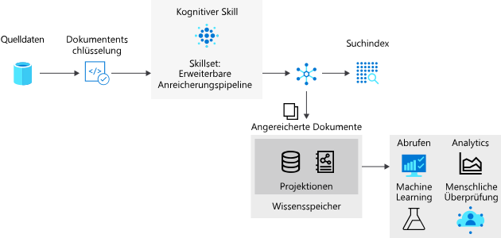

# <a name="introduction-to-knowledge-stores-in-azure-cognitive-search"></a>Einführung in Wissensspeicher in Azure Cognitive Search

> [!Note]
> Wissensspeicher befinden sich in der Vorschau und sind nicht für die Produktion ausgelegt. Dieses Feature wird durch die [REST-API-Version 2019-05-06-Preview](search-api-preview.md) bereitgestellt. Das .NET SDK wird derzeit nicht unterstützt.
>

Der Wissensspeicher ist ein Feature von Azure Cognitive Search, das Ausgaben aus einer [KI-Anreicherungspipeline](cognitive-search-concept-intro.md) zur späteren Analyse oder anderweitigen Downstreamverarbeitung speichert. Ein *angereichertes Dokument* ist eine Pipelineausgabe, die auf der Grundlage von Inhalten erstellt wurde, die mithilfe von KI-Prozessen extrahiert, strukturiert und analysiert wurden. In einer KI-Standardpipeline sind angereicherte Dokumente kurzlebig: Sie werden nur während der Indizierung verwendet und anschließend verworfen. Mit dem Wissensspeicher bleiben erweiterte Dokumente erhalten. 

Wenn Sie schon einmal kognitive Qualifikationen mit Azure Cognitive Search verwendet haben, wissen Sie, dass ein Dokument auf der Grundlage von *Skillsets* eine Reihe von Anreicherungen durchläuft. Bei der Ausgabe kann es sich um einen Suchindex oder (neu in dieser Vorschauversion) um Projektionen in einem Wissensspeicher handeln. Die beiden Ausgaben (Suchindex und Wissensspeicher) haben den gleichen Inhalt, werden aber sehr unterschiedlich gespeichert und verwendet.

Physisch betrachtet handelt es sich bei einem Wissensspeicher um [Azure Storage](https://docs.microsoft.com/azure/storage/common/storage-account-overview) (Azure Table Storage, Azure Blob Storage oder beides). Jedes Tool und jeder Prozess, das bzw. der eine Verbindung mit Azure Storage herstellen kann, kann die Inhalte eines Wissensspeichers nutzen.



Um Wissensspeicher zu verwenden, fügen Sie einer Qualifikationsgruppe ein `knowledgeStore`-Element hinzu, das die Vorgänge in mehreren Schritten in einer Indizierungspipeline definiert. Im Zuge der Ausführung erstellt Azure Cognitive Search einen Bereich in Ihrem Azure-Speicherkonto und projiziert die angereicherten Dokumente je nach Konfiguration als Blobs oder in Tabellen.

## <a name="benefits-of-knowledge-store"></a>Vorteile von Wissensspeichern

Ein Wissensspeicher enthält die Struktur, den Kontext und den eigentlichen Inhalt. Diese Informationen werden aus unstrukturierten und teilweise strukturierten Datendateien wie Blobs und analysierten Bilddateien oder sogar aus strukturierten Daten gewonnen, die umgeformt wurden. In einer [ausführlichen exemplarischen Vorgehensweise](knowledge-store-howto.md) können Sie genau sehen, wie ein komplexes JSON-Dokument in Unterstrukturen partitioniert, in neue Strukturen zusammengesetzt und für nachfolgende Prozesse wie Machine Learning- und Data Science-Workloads verfügbar gemacht wird.

Auch wenn es nützlich ist, zu sehen, was eine KI-Anreicherungspipeline erzeugen kann, liegt die eigentliche Stärke von Wissensspeichern in der Möglichkeit, Daten neu zu strukturieren. Sie können mit einem grundlegenden Skillset beginnen und dieses wiederholt durchlaufen, um weitere Strukturebenen hinzuzufügen. Diese können dann zu neuen Strukturen kombiniert werden, die sowohl in Azure Cognitive Search als auch in anderen Apps verwendet werden können.

Wissensspeicher bieten u. a. folgende Vorteile:

+ Nutzen Sie angereicherte Dokumente auch in anderen [Analyse- und Berichtstools](#tools-and-apps) als Search. Power BI mit Power Query ist eine hervorragende Wahl, aber jedes Tool und jede App, das bzw. die eine Verbindung mit Azure Storage herstellen kann, kann auch Daten aus dem von Ihnen erstellten Wissensspeicher pullen.

+ Optimieren Sie eine KI-basierte Indizierungspipeline während der Debuggingschritte und der Definition von Qualifikationen. Ein Wissensspeicher zeigt das Produkt einer Qualifikationsgruppendefinition in einer KI-Indizierungspipeline. Sie können diese Ergebnisse verwenden, um eine bessere Qualifikationsgruppe zu entwerfen, da Sie genau sehen können, wie die Anreicherungen aussehen. Verwenden Sie [Storage-Explorer](https://docs.microsoft.com/azure/vs-azure-tools-storage-manage-with-storage-explorer?tabs=windows) in Azure Storage, um die Inhalte eines Wissensspeichers anzuzeigen.

+ Formen Sie die Daten um. Die Umgestaltung ist in Qualifikationsgruppen codiert, das Wichtigste ist aber, dass diese Funktion nun von einer Qualifikationsgruppe bereitgestellt werden kann. Die [Qualifikation „Shaper“](cognitive-search-skill-shaper.md) in Azure Cognitive Search wurde erweitert, um genau diese Aufgabe zu ermöglichen. Die Umstrukturierung ermöglicht Ihnen die Definition einer Projektion für die beabsichtigte Verwendung der Daten unter Beibehaltung der Beziehungen.

> [!Note]
> Neu bei KI-Anreicherung und kognitiven Qualifikationen? Azure Cognitive Search arbeitet mit den Bild- und Sprachfeatures von Cognitive Services zusammen, um Quelldaten unter Verwendung der optischen Zeichenerkennung (Optical Character Recognition, OCR) für Bilddateien, der Entitätserkennung, der Extraktion von Schlüsselbegriffen aus Textdateien u. v. m. zu extrahieren und anzureichern. Weitere Informationen finden Sie unter [Was ist die „kognitive Suche“ in Azure Search?](cognitive-search-concept-intro.md).

## <a name="creating-a-knowledge-store"></a>Erstellen eines Wissensspeichers

Ein Wissensspeicher ist Teil eines [Skillsets](cognitive-search-working-with-skillsets.md), das wiederum Teil eines [Indexers](search-indexer-overview.md) ist. 

In dieser Vorschauversion können Sie zur Erstellung eines Wissensspeichers die REST-API und `api-version=2019-05-06-Preview` oder aber den **Datenimport-Assistenten** im Portal verwenden.

### <a name="json-representation-of-a-knowledge-store"></a>JSON-Darstellung eines Wissensspeichers

Der folgende JSON-Code gibt einen `knowledgeStore` an, der Teil einer von einem Indexer (nicht dargestellt) aufgerufenen Qualifikationsgruppe ist. Wenn Sie bereits mit der KI-Anreicherung vertraut sind, wissen Sie, dass Erstellung, Strukturierung und Inhalt der einzelnen angereicherten Dokumente durch ein Skillset bestimmt werden. Ein Skillset muss mindestens eine Qualifikation enthalten. Wenn Sie Datenstrukturen modulieren, handelt es sich dabei höchstwahrscheinlich um eine Shaper-Qualifikation.

Ein Wissensspeicher (`knowledgeStore`) besteht aus einer Verbindung und Projektionen. 

+ Die Verbindung besteht mit einem Speicherkonto in der Region, in der sich auch Azure Cognitive Search befindet. 

+ Projektionen sind Tabellen-Objekt-Paare. `Tables` definiert den physischen Ausdruck angereicherter Dokumente in Azure Table Storage. `Objects` definiert die physischen Objekte in Azure Blob Storage.

```json
{
  "name": "my-new-skillset",
  "description": "Example showing knowledgeStore placement in a skillset.",
  "skills":
  [
    {
    "@odata.type": "#Microsoft.Skills.Util.ShaperSkill",
    "context": "/document/content/phrases/*",
    "inputs": [
        {
        "name": "text",
        "source": "/document/content/phrases/*"
        },
        {
        "name": "sentiment",
        "source": "/document/content/phrases/*/sentiment"
        }
    ],
    "outputs": [
        {
        "name": "output",
        "targetName": "analyzedText"
        }
    ]
    },
  ],
  "cognitiveServices": 
    {
    "@odata.type": "#Microsoft.Azure.Search.CognitiveServicesByKey",
    "description": "mycogsvcs resource in West US 2",
    "key": "<your key goes here>"
    },
  "knowledgeStore": { 
    "storageConnectionString": "<your connection string goes here>", 
    "projections": [ 
        { 
            "tables": [  
            { "tableName": "Reviews", "generatedKeyName": "ReviewId", "source": "/document/Review" , "sourceContext": null, "inputs": []}, 
            { "tableName": "Sentences", "generatedKeyName": "SentenceId", "source": "/document/Review/Sentences/*", "sourceContext": null, "inputs": []}, 
            { "tableName": "KeyPhrases", "generatedKeyName": "KeyPhraseId", "source": "/document/Review/Sentences/*/KeyPhrases", "sourceContext": null, "inputs": []}, 
            { "tableName": "Entities", "generatedKeyName": "EntityId", "source": "/document/Review/Sentences/*/Entities/*" ,"sourceContext": null, "inputs": []} 

            ], 
            "objects": [ 
               
            ]      
        },
        { 
            "tables": [ 
            ], 
            "objects": [ 
                { 
                "storageContainer": "Reviews", 
                "format": "json", 
                "source": "/document/Review", 
                "key": "/document/Review/Id" 
                } 
            ]      
        }        
    ]     
    } 
}
```

### <a name="sources-of-data-for-a-knowledge-store"></a>Datenquellen für einen Wissensspeicher

Wenn es sich bei einem Wissensspeicher um die Ausgabe einer KI-Anreicherungspipeline handelt, was wird dann als Eingabe verwendet? Die ursprünglichen Daten, die Sie extrahieren, anreichern und letztendlich in einem Wissensspeicher speichern möchten, können aus jeder beliebigen Azure-Datenquelle stammen, die von Suchindexern unterstützt wird: 

* [Azure Cosmos DB](search-howto-index-cosmosdb.md)

* [Azure Blob Storage](search-howto-indexing-azure-blob-storage.md)

* [Azure Table Storage](search-howto-indexing-azure-tables.md)

* [Azure SQL](search-howto-connecting-azure-sql-database-to-azure-search-using-indexers.md)

Diese Inhalte werden durch die von Ihnen erstellten Indexer und Skillsets im Rahmen einer Indizierungsworkload extrahiert und angereichert oder transformiert, und die Ergebnisse werden dann in einem Wissensspeicher gespeichert.

### <a name="rest-apis-used-in-creation-of-a-knowledge-store"></a>Bei der Erstellung eines Wissensspeichers verwendete REST-APIs

Nur zwei APIs verfügen über die erforderlichen Erweiterungen für die Erstellung eines Wissensspeichers: „Create Skillset“ (Skillset erstellen) und „Create Indexer“ (Indexer erstellen). Andere APIs werden unverändert verwendet.

| Object | REST-API | BESCHREIBUNG |
|--------|----------|-------------|
| Datenquelle | [Erstellen der Datenquelle](https://docs.microsoft.com/rest/api/searchservice/create-data-source)  | Eine Ressource, die eine externe Azure-Datenquelle identifiziert, welche Quelldaten zum Erstellen angereicherter Dokumente bereitstellt.  |
| Qualifikationsgruppe | [Erstellen einer Qualifikationsgruppe (api-version=2019-05-06-Preview)](https://docs.microsoft.com/rest/api/searchservice/create-skillset)  | Eine Ressource, die die Verwendung von [integrierten Qualifikationen](cognitive-search-predefined-skills.md) und [benutzerdefinierten kognitiven Qualifikationen](cognitive-search-custom-skill-interface.md) in einer Anreicherungspipeline während der Indizierung koordiniert. Ein Skillset besitzt eine Definition vom Typ `knowledgeStore` als untergeordnetes Element. |
| index | [Index erstellen](https://docs.microsoft.com/rest/api/searchservice/create-index)  | Ein Schema, um einen Suchindex auszudrücken. Felder im Index werden Feldern in den Quelldaten zugeordnet oder Feldern, die während der Anreicherungsphase erstellt wurden (z.B. ein von der Entitätserkennung erstelltes Feld für Organisationsnamen). |
| Indexer | [Erstellen eines Indexers (API-Version 2019-05-06)](https://docs.microsoft.com/rest/api/searchservice/create-skillset)  | Eine Ressource, die während der Indizierung verwendete Komponenten definiert: Dazu zählen eine Datenquelle, eine Fähigkeitengruppe, Feldzuordnungen der Quelle, intermediäre Datenstrukturen für den Zielindex und der Index selbst. Die Ausführung des Indexers ist Auslöser für die Datenerfassung und -anreicherung. Die Ausgabe ist ein Suchindex basierend auf dem Indexschema, der mit Quelldaten aufgefüllt wird, die durch Qualifikationsgruppen angereichert werden.  |

### <a name="physical-composition-of-a-knowledge-store"></a>Physische Zusammensetzung eines Wissensspeichers

 Eine *Projektion* (Element einer Definition vom Typ `knowledgeStore`) drückt das Schema und die Struktur der Ausgabe so aus, dass sie dem vorgesehenen Zweck entspricht. Sie können mehrere Projektionen definieren, wenn Sie über Anwendungen verfügen, die die Daten in verschiedenen Formaten und Formen nutzen. 

Projektionen können als Objekte oder Tabellen formuliert werden:

+ Als ein Objekt ist die Projektion Blob Storage zugeordnet. Dort wird die Projektion in einem Container gespeichert, der wiederum die Objekte oder hierarchischen Darstellungen im JSON-Format für Szenarien wie eine Data Science-Pipeline enthält.

+ Als eine Tabelle ist die Projektion Table Storage zugeordnet. Eine tabellarische Darstellung behält die Beziehungen für Szenarien wie Datenanalysen oder das Exportieren als Datenrahmen für das maschinelle Lernen bei. Die angereicherten Projektionen können dann problemlos in andere Datenspeicher importiert werden. 

Sie können mehrere Projektionen in einem Wissensspeicher erstellen, um verschiedene Bereiche in Ihrer Organisation abzubilden. Ein Entwickler benötigt möglicherweise Zugriff auf die vollständige JSON-Darstellung eines angereicherten Dokuments, während Data Science-Experten oder Analysten abgestimmte oder modulare Datenstrukturen benötigen, die von Ihrer Qualifikationsgruppe strukturiert wurden.

Wenn beispielsweise eines der Ziele der Anreicherung auch das Erstellen eines Datasets zum Trainieren eines Modells ist, wäre eine Möglichkeit zur Nutzung Ihrer Daten in Ihren Data Science-Pipelines das Projizieren der Daten in den Objektspeicher. Wenn Sie alternativ schnell ein Power BI-Dashboard basierend auf den angereicherten Dokumenten erstellen möchten, wäre die tabellarische Projektion gut geeignet.

<a name="tools-and-apps"></a>

## <a name="connecting-with-tools-and-apps"></a>Herstellen einer Verbindung mit Tools und Apps

Wenn die Anreicherungen in Storage gespeichert sind, können Sie beliebige Tools oder Technologien mit einer Verbindung mit Azure Blob Storage oder Azure Table Storage verwenden, um die Inhalte zu untersuchen, zu analysieren oder zu nutzen. Die folgende Liste gibt einen ersten Einblick:

+ Mit [Storage-Explorer](knowledge-store-view-storage-explorer.md) können Sie die Struktur und den Inhalt angereicherter Dokumente anzeigen. Nutzen Sie dies als Ihr Basistool zum Anzeigen des Inhalts von Wissensspeichern.

+ [Power BI](knowledge-store-connect-power-bi.md) bietet Berichts- und Analysetools für numerische Daten.

+ Verwenden Sie [Azure Data Factory](https://docs.microsoft.com/azure/data-factory/) für die weiterführende Bearbeitung.

## <a name="next-steps"></a>Nächste Schritte

Ein Wissensspeicher ermöglicht die Aufbewahrung angereicherter Dokumente, was bei der Entwicklung eines Skillsets hilfreich ist, sowie die Erstellung neuer Strukturen und Inhalte zur Nutzung durch beliebige Clientanwendungen, die auf ein Azure Storage-Konto zugreifen können.

Am einfachsten lassen sich angereicherte Dokumente mit dem **Datenimport-Assistent** erstellen. Sie können aber auch Postman und eine REST-API verwenden. Dies empfiehlt sich, wenn Sie nachvollziehen möchten, wie Objekte erstellt und referenziert werden.

> [!div class="nextstepaction"]
> [Erstellen eines Azure Search-Wissensspeichers im Azure-Portal](knowledge-store-create-portal.md)
> [Erstellen eines Azure Search-Wissensspeichers mit REST](knowledge-store-create-rest.md)
