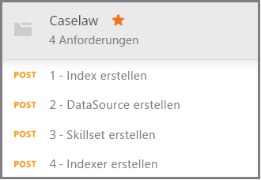

# <a name="how-to-get-started-with-knowledge-mining-in-azure-search"></a>Erste Schritte mit Knowledge Mining in Azure Search

> [!Note]
> Wissensspeicher befinden sich in der Vorschau und sind nicht für die Produktion ausgelegt. Dieses Feature wird durch die [REST-API-Version 2019-05-06-Preview](search-api-preview.md) bereitgestellt. Das .NET SDK wird derzeit nicht unterstützt.
>
In [Wissensspeichern](knowledge-store-concept-intro.md) werden mit KI angereicherte Dokumente gespeichert, die bei der Indizierung in Ihrem Azure Storage-Konto für Knowledge Mining in nachgeschalteten anderen Apps erstellt werden. Sie können auch gespeicherte Anreicherungen verwenden, um eine Azure Search-Indizierungspipeline zu verstehen und zu optimieren. 

Ein Wissensspeicher wird durch ein *Skillset* definiert und von einem *Indexer* erstellt. Der physische Ausdruck eines Wissensspeichers wird durch *Projektionen* angegeben, die die Datenstrukturen im Speicher bestimmen. Nach Abschluss dieser exemplarischen Vorgehensweise haben Sie alle diese Objekte erstellt und wissen, wie sie alle zusammenpassen. 

Sie beginnen in dieser Übung mit Beispieldaten, -diensten und -tools, um den grundlegenden Workflow zum Erstellen und Verwenden Ihres ersten Wissensspeichers und dabei insbesondere die Bedeutung von Qualifikationsgruppendefinitionen kennenzulernen.

## <a name="prerequisites"></a>Voraussetzungen

Der Wissensspeicher steht im Mittelpunkt mehrerer Dienste, wobei Azure Blob Storage und Azure Table Storage physischen Speicher bereitstellen, und Azure Search and Cognitive Services zur Erstellung und Aktualisierung von Objekten dienen. Vertrautheit mit der [grundlegenden Architektur](knowledge-store-concept-intro.md) ist eine Voraussetzung für diese exemplarische Vorgehensweise.

In diesem Schnellstart werden die folgenden Dienste und Tools verwendet. 

+ [Laden Sie die Postman-Desktop-App herunter](https://www.getpostman.com/), die zum Senden von HTTP-Anforderungen an Azure Search verwendet wird.

+ [Erstellen Sie ein Azure-Speicherkonto](https://docs.microsoft.com/azure/storage/common/storage-quickstart-create-account) zum Speichern der Beispieldaten und des Wissensspeichers. Ihr Wissensspeicher wird in Azure Storage gespeichert.

+ [Erstellen Sie eine Cognitive Services-Ressource](https://docs.microsoft.com/azure/cognitive-services/cognitive-services-apis-create-account) im S0-Tarif mit nutzungsbasierter Bezahlung, um umfassenden Zugriff auf das gesamte Spektrum der Qualifikationen für KI-Anreicherungen zu erhalten. Cognitive Services und Ihr Azure Search-Dienst müssen sich in der gleichen Region befinden.

+ [Erstellen Sie einen Azure Search-Dienst](search-create-service-portal.md), oder suchen Sie in Ihrem aktuellen Abonnement [nach einem vorhandenen Dienst](https://ms.portal.azure.com/#blade/HubsExtension/BrowseResourceBlade/resourceType/Microsoft.Search%2FsearchServices). In diesem Tutorial können Sie einen kostenlosen Dienst verwenden. 

JSON-Beispieldokumente und eine Postman-Sammlungsdatei sind ebenfalls erforderlich. Anweisungen zum Finden und Laden von zusätzlichen Dateien finden Sie im Abschnitt [Vorbereiten der Beispieldaten](#prepare-sample-data).

## <a name="get-a-key-and-url"></a>Abrufen eines Schlüssels und einer URL

Für REST-Aufrufe sind die Dienst-URL und ein Zugriffsschlüssel für jede Anforderung erforderlich. Hierfür wird jeweils ein Suchdienst erstellt. Wenn Sie Azure Search also Ihrem Abonnement hinzugefügt haben, können Sie diese Schritte ausführen, um die erforderlichen Informationen zu erhalten:

1. [Melden Sie sich beim Azure-Portal an](https://portal.azure.com/), und rufen Sie auf der Seite **Übersicht** Ihres Suchdiensts die URL ab. Ein Beispiel für einen Endpunkt ist `https://mydemo.search.windows.net`.

1. Rufen Sie unter **Einstellungen** > **Schlüssel** einen Administratorschlüssel ab, um Vollzugriff auf den Dienst zu erhalten. Es gibt zwei austauschbare Administratorschlüssel – diese wurden zum Zweck der Geschäftskontinuität bereitgestellt, falls Sie einen Rollover für einen Schlüssel durchführen müssen. Für Anforderungen zum Hinzufügen, Ändern und Löschen von Objekten können Sie den primären oder den sekundären Schlüssel verwenden.

    

Für alle an Ihren Dienst gesendeten Anforderungen ist ein API-Schlüssel erforderlich. In den folgenden Abschnitten geben Sie den Dienstnamen und den API-Schlüssel in jeder HTTP-Anforderung an.

<a name="prepare-sample-data"></a>

## <a name="prepare-sample-data"></a>Vorbereiten der Beispieldaten

Ein Wissensspeicher enthält die Ausgabe einer Anreicherungspipeline. Eingaben bestehen aus „nicht verwendbaren“ Daten, die schließlich im Laufe der Pipeline „verwendbar“ werden. Beispiele für nicht verwendbare Daten können Bilddateien sein, die auf Text- oder Bildmerkmale analysiert werden müssen, oder dichte Textdateien, die auf Entitäten, Schlüsselwörter oder Stimmung analysiert werden können. 

In dieser Übung werden dichte Textdateien (Fallrechtsinformationen) verwendet, die von der Downloadseite für öffentliche Massendaten des [Caselaw Access Project](https://case.law/bulk/download/) stammen. Wir haben ein Beispiel mit 10 Dokumenten für diese Übung auf GitHub hochgeladen. 

In dieser Aufgabe erstellen Sie einen Azure Blob-Container für diese Dokumente, der als Eingabe für die Pipeline verwendet werden kann. 

1. Laden Sie das Repository [Azure Search Sample Data](https://github.com/Azure-Samples/azure-search-sample-data/tree/master/caselaw) herunter, und extrahieren Sie es, um den [Datensatz „Caselaw“](https://github.com/Azure-Samples/azure-search-sample-data/tree/master/caselaw) zu erhalten. 

1. [Melden Sie sich beim Azure-Portal an](https://portal.azure.com), navigieren Sie zu Ihrem Azure-Speicherkonto, klicken Sie auf **BLOBs** und dann auf **+ Container**.

1. [Erstellen Sie einen Blobcontainer](https://docs.microsoft.com/azure/storage/blobs/storage-quickstart-blobs-portal) für Beispieldaten: 

   1. Geben Sie dem Container den Namen `caselaw-test`. 
   
   1. Legen Sie die öffentliche Zugriffsebene auf beliebige gültige Werte fest.

1. Nachdem der Container erstellt wurde, öffnen Sie ihn, und wählen Sie auf der Befehlsleiste die Option **Hochladen** aus.

   

1. Navigieren Sie zu dem Ordner mit der Beispieldatei **caselaw-sample.json**. Wählen Sie die Datei aus, und klicken Sie dann auf **Hochladen**.

1. Während Sie sich im Azure-Speicher befinden, rufen Sie die Verbindungszeichenfolge und den Containernamen ab.  Sie benötigen beide Zeichenfolgen in [Erstellen einer Datenquelle](#create-data-source):

   1. Klicken Sie auf der Übersichtsseite auf **Zugriffsschlüssel**, und kopieren Sie eine *Verbindungszeichenfolge*. Sie beginnt mit `DefaultEndpointsProtocol=https;` und endet mit `EndpointSuffix=core.windows.net`. Ihr Kontoname und der Schlüssel befinden sich dazwischen. 

   1. Der Containername muss `caselaw-test` oder ein beliebiger Name sein, den Sie zugewiesen haben.


## <a name="set-up-postman"></a>Einrichten von Postman

Postman ist die Client-App, mit der Sie Anforderungen und JSON-Dokumente an Azure Search senden können. Einige der Anforderungen können allein mit den Informationen in diesem Artikel formuliert werden. Zwei der größten Anforderungen (Erstellen eines Index, Erstellen eines Skillsets) beinhalten jedoch ausführlichen JSON-Code, der zu groß ist, um es ihn einen Artikel einzubetten. 

Um alle JSON-Dokumente und -Anforderungen vollständig verfügbar zu machen, haben wir eine Postman-Sammeldatei erstellt. Das Herunterladen und anschließende Importieren dieser Datei ist Ihre erste Aufgabe bei der Einrichtung des Clients.

1. Laden Sie das Repository [Azure Search Postman Samples](https://github.com/Azure-Samples/azure-search-postman-samples) herunter, und entpacken Sie es.

1. Starten Sie Postman, und importieren Sie die Sammlung „Caselaw Postman“:

   1. Klicken Sie auf **Importieren** > **Dateien importieren** > **Dateien auswählen**. 

   1. Navigieren Sie zum Ordner „\azure-search-postman-samples-master\azure-search-postman-samples-master\Caselaw“.

   1. Wählen Sie **Caselaw.postman_collection_v2.json** aus. Sie sollten vier **POST**-Anforderungen in der Sammlung sehen.

   
   

## <a name="create-an-index"></a>Erstellen eines Index
    
Beim ersten Aufruf wird die [API zum Erstellen eines Index](https://docs.microsoft.com/rest/api/searchservice/create-data-source) verwendet, die einen Azure Search-Index mit allen durchsuchbaren Daten erstellt. Ein Index gibt alle Felder, Parameter und Attribute an.

Sie benötigen für das Knowledge Mining nicht unbedingt einen Index, es wird aber nur dann ein Indexer ausgeführt, wenn ein Index angegeben wird. 

1. Ersetzen Sie `YOUR-AZURE-SEARCH-SERVICE-NAME` in der URL `https://YOUR-AZURE-SEARCH-SERVICE-NAME.search.windows.net/indexes?api-version=2019-05-06-Preview` durch den Namen Ihres Suchdiensts. 

1. Ersetzen Sie im Headerabschnitt `<YOUR AZURE SEARCH ADMIN API-KEY>` durch einen Admin-API-Schlüssel für Azure Search.

1. Im Textabschnitt ist das JSON-Dokument ein Indexschema. Die äußere Shell eines Index ist zur besseren Übersichtlichkeit reduziert und besteht aus den folgenden Elementen. Die Feldersammlung entspricht den Feldern im Caselaw-Datensatz.

   ```json
   {
      "name": "caselaw",
      "defaultScoringProfile": null,
      "fields": [],
      "scoringProfiles": [],
      "corsOptions": null,
      "suggesters": [],
      "analyzers": [],
      "tokenizers": [],
      "tokenFilters": [],
      "charFilters": [],
      "encryptionKey": null
   }
   ```

1. Erweitern Sie die `fields`-Sammlung. Sie enthält den größten Teil der Indexdefinition, bestehend aus einfachen Feldern, [komplexen Feldern](search-howto-complex-data-types.md) mit geschachtelten Unterstrukturen und Sammlungen.

   Nehmen Sie sich einen Moment Zeit, um die Felddefinition für das komplexe Feld `casebody` in den Zeilen 302–384 zu überprüfen. Beachten Sie, dass ein komplexes Feld nur dann andere komplexe Felder enthalten kann, wenn hierarchische Darstellungen benötigt werden. Hierarchische Strukturen können sowohl – wie hier gezeigt – in einem Index als auch als Projektion in einem Skillset modelliert werden, wodurch eine geschachtelte Datenstruktur im Wissensspeicher Store entsteht.

   ```json
   {
    "name": "casebody",
    "type": "Edm.ComplexType",
    "fields": [
        {
            "name": "status",
            "type": "Edm.String",
            "searchable": true,
            "filterable": true,
            "retrievable": true,
            "sortable": true,
            "facetable": true,
            "key": false,
            "indexAnalyzer": null,
            "searchAnalyzer": null,
            "analyzer": null,
            "synonymMaps": []
        },
        {
            "name": "data",
            "type": "Edm.ComplexType",
            "fields": [
                {
                    "name": "head_matter",
                    "type": "Edm.String",
                    "searchable": true,
                    "filterable": false,
                    "retrievable": true,
                    "sortable": false,
                    "facetable": false,
                    "key": false,
                    "indexAnalyzer": null,
                    "searchAnalyzer": null,
                    "analyzer": null,
                    "synonymMaps": []
                },
                {
                    "name": "opinions",
                    "type": "Collection(Edm.ComplexType)",
                    "fields": [
                        {
                            "name": "author",
                            "type": "Edm.String",
                            "searchable": true,
                            "filterable": true,
                            "retrievable": true,
                            "sortable": false,
                            "facetable": true,
                            "key": false,
                            "indexAnalyzer": null,
                            "searchAnalyzer": null,
                            "analyzer": null,
                            "synonymMaps": []
                        },
                        {
                            "name": "text",
                            "type": "Edm.String",
                            "searchable": true,
                            "filterable": false,
                            "retrievable": true,
                            "sortable": false,
                            "facetable": false,
                            "key": false,
                            "indexAnalyzer": null,
                            "searchAnalyzer": null,
                            "analyzer": null,
                            "synonymMaps": []
                        },
                        {
                            "name": "type",
                            "type": "Edm.String",
                            "searchable": true,
                            "filterable": true,
                            "retrievable": true,
                            "sortable": false,
                            "facetable": true,
                            "key": false,
                            "indexAnalyzer": null,
                            "searchAnalyzer": null,
                            "analyzer": null,
                            "synonymMaps": []
                        }
                    ]
                },
    . . .
   ```

1. Klicken Sie auf **Senden**, um die Anforderung zu auszuführen.  Sie sollten die Meldung **Status: 201 – Erstellt** als Antwort erhalten.

<a name="create-data-source"></a>

## <a name="create-a-data-source"></a>Erstellen einer Datenquelle

Die zweite Anforderung verwendet die [API zum Erstellen einer Datenquelle](https://docs.microsoft.com/rest/api/searchservice/create-data-source), um eine Verbindung mit Azure Blob-Speicher herzustellen. 

1. Ersetzen Sie `YOUR-AZURE-SEARCH-SERVICE-NAME` in der URL `https://YOUR-AZURE-SEARCH-SERVICE-NAME.search.windows.net/datasources?api-version=2019-05-06-Preview` durch den Namen Ihres Suchdiensts. 

1. Ersetzen Sie im Headerabschnitt `<YOUR AZURE SEARCH ADMIN API-KEY>` durch einen Admin-API-Schlüssel für Azure Search.

1. Im Textabschnitt enthält das JSON-Dokument die Verbindungszeichenfolge Ihres Speicherkontos und den Namen des Blobcontainers. Sie finden die Verbindungszeichenfolge im Azure-Portal unter den **Zugriffsschlüsseln** Ihres Speicherkontos. 

    ```json
    {
        "name": "caselaw-ds",
        "description": null,
        "type": "azureblob",
        "subtype": null,
        "credentials": {
            "connectionString": "DefaultEndpointsProtocol=https;AccountName=<YOUR-STORAGE-ACCOUNT>;AccountKey=<YOUR-STORAGE-KEY>;EndpointSuffix=core.windows.net"
        },
        "container": {
            "name": "<YOUR-BLOB-CONTAINER-NAME>",
            "query": null
        },
        "dataChangeDetectionPolicy": null,
        "dataDeletionDetectionPolicy": null
    }
    ```

1. Klicken Sie auf **Senden**, um die Anforderung zu auszuführen.  Sie sollten die Meldung **Status: 201 – Erstellt** als Antwort erhalten.


<a name="create-skillset"></a>

## <a name="create-a-skillset-and-knowledge-store"></a>Erstellen von Qualifikationsgruppen und Wissensspeichern

Die dritte Anforderung verwendet die [API zum Erstellen eines Skillsets](https://docs.microsoft.com/rest/api/searchservice/create-skillset). Diese erstellt ein Azure Search-Objekt, das angibt, welche kognitiven Qualifikationen aufgerufen werden sollen, wie die Qualifikationen verkettet werden sollen, und wie ein Wissensspeicher angegeben wird (für diese exemplarische Vorgehensweise besonders wichtig).

1. Ersetzen Sie `YOUR-AZURE-SEARCH-SERVICE-NAME` in der URL `https://YOUR-AZURE-SEARCH-SERVICE-NAME.search.windows.net/skillsets?api-version=2019-05-06-Preview` durch den Namen Ihres Suchdiensts. 

1. Ersetzen Sie im Headerabschnitt `<YOUR AZURE SEARCH ADMIN API-KEY>` durch einen Admin-API-Schlüssel für Azure Search.

1. Im Textabschnitt ist das JSON-Dokument eine Skillset-Definition. Die äußere Shell eines Skillsets ist zur besseren Übersichtlichkeit reduziert und besteht aus den folgenden Elementen. Die Sammlung `skills` definiert die speicherinternen Anreicherungen, während die `knowledgeStore`-Definition angibt, wie die Ausgabe gespeichert wird. Die `cognitiveServices`-Definition ist Ihre Verbindung mit den Engines zur KI-Anreicherung.

   ```json
   {
    "name": "caselaw-ss",
    "description": null,
    "skills": [],
    "cognitiveServices": [],
    "knowledgeStore": []
   }
   ```

1. Erweitern Sie `cognitiveServices` und `knowledgeStore`, damit Sie Verbindungsinformationen bereitstellen können. In diesem Beispiel stehen diese Zeichenfolgen hinter der Definition der Qualifikationsgruppe am Ende des Anforderungstexts. 

   Stellen Sie für `cognitiveServices` eine Ressource auf der Dienstebene S0 bereit, die sich in der gleichen Region wie Azure Search befindet. Sie können den Cognitive Services-Namen und -Schlüssel von der gleichen Seite im Azure-Portal abrufen. 
   
   Für `knowledgeStore` können Sie die gleiche Verbindungszeichenfolge wie für den Caselaw-Blobcontainer verwenden.

    ```json
    "cognitiveServices": {
        "@odata.type": "#Microsoft.Azure.Search.CognitiveServicesByKey",
        "description": "YOUR-SAME-REGION-S0-COGNITIVE-SERVICES-RESOURCE",
        "key": "YOUR-COGNITIVE-SERVICES-KEY"
    },
    "knowledgeStore": {
        "storageConnectionString": "YOUR-STORAGE-ACCOUNT-CONNECTION-STRING",
    ```

1. Erweitern Sie die Qualifikationssammlung, insbesondere die Shaper-Qualifikationen in den Zeilen 85 und 179. Die Qualifikation „Shaper“ ist wichtig, da sie die Datenstrukturen für das Knowledge Mining umfasst. Während der Ausführung der Qualifikationsgruppe befinden sich diese Strukturen ausschließlich im Arbeitsspeicher. Sie werden aber im nächsten Schritt sehen, dass diese Ausgabe für die weitere Untersuchung in einem Wissensspeicher gespeichert werden kann.

   Der folgende Codeausschnitt stammt aus Zeile 217. 

    ```json
    "name": "Opinions",
    "source": null,
    "sourceContext": "/document/casebody/data/opinions/*",
    "inputs": [
        {
            "name": "Text",
            "source": "/document/casebody/data/opinions/*/text"
        },
        {
            "name": "Author",
            "source": "/document/casebody/data/opinions/*/author"
        },
        {
            "name": "Entities",
            "source": null,
            "sourceContext": "/document/casebody/data/opinions/*/text/pages/*/entities/*",
            "inputs": [
                {
                    "name": "Entity",
                    "source": "/document/casebody/data/opinions/*/text/pages/*/entities/*/value"
                },
                {
                    "name": "EntityType",
                    "source": "/document/casebody/data/opinions/*/text/pages/*/entities/*/category"
                }
            ]
        }
    ]
   . . .
   ```

1. Erweitern Sie das `projections`-Element in `knowledgeStore` an, das ab Zeile 262 beginnt. Projektionen geben die Zusammensetzung des Wissensspeichers an. Projektionen werden in Tabelle-Objekt-Paaren angegeben – derzeit jedoch nur einzeln. Wie Sie in der ersten Projektion sehen können, ist `tables` angegeben, `objects` aber nicht. Im zweiten Fall ist es umgekehrt.

   In Azure Storage werden die von Ihnen erstellten Tabellen im Tabellenspeicher gespeichert, und jedes Objekt erhält einen Container in Blob Storage.

   Blobobjekte enthalten in der Regel den vollständigen Ausdruck einer Anreicherung. Tabellen enthalten in der Regel teilweise Anreicherungen in Kombinationen, die Sie für bestimmte Zwecke festlegen. Dieses Beispiel zeigt die Tabellen „Cases“ und „Opinions“, nicht gezeigt werden jedoch andere Tabellen wie „Entities“, „Attorneys“ „Judges“ und „Parties“.

    ```json
    "projections": [
        {
            "tables": [
                {
                    "tableName": "Cases",
                    "generatedKeyName": "CaseId",
                    "source": "/document/Case"
                },
                {
                    "tableName": "Opinions",
                    "generatedKeyName": "OpinionId",
                    "source": "/document/Case/OpinionsSnippets/*"
                }
            ],
            "objects": []
        },
        {
            "tables": [],
            "objects": [
                {
                    "storageContainer": "enrichedcases",
                    
                    "source": "/document/CaseFull"
                }
            ]
        }
    ]
    ```

1. Klicken Sie auf **Senden**, um die Anforderung zu auszuführen. Die Antwort sollte **201** lauten und dem folgenden Beispiel ähneln, in dem der erste Teil der Antwort gezeigt wird:

    ```json
    {
    "name": "caselaw-ss",
    "description": null,
    "skills": [
        {
            "@odata.type": "#Microsoft.Skills.Text.SplitSkill",
            "name": "SplitSkill#1",
            "description": null,
            "context": "/document/casebody/data/opinions/*/text",
            "defaultLanguageCode": "en",
            "textSplitMode": "pages",
            "maximumPageLength": 5000,
            "inputs": [
                {
                    "name": "text",
                    "source": "/document/casebody/data/opinions/*/text
                }
            ],
            "outputs": [
                {
                    "name": "textItems",
                    "targetName": "pages"
                }
            ]
        },
        . . .
    ```

## <a name="create-and-run-an-indexer"></a>Erstellen und Ausführen eines Indexers

Die vierte Anforderung verwendet die [API zum Erstellen eines Indexers](https://docs.microsoft.com/rest/api/searchservice/create-indexer) und erstellt einen Azure Search-Indexer. Ein Indexer ist das Ausführungsmodul der Indizierungspipeline. Alle Definitionen, die Sie bisher erstellt haben, werden in diesem Schritt gestartet.

1. Ersetzen Sie `YOUR-AZURE-SEARCH-SERVICE-NAME` in der URL `https://YOUR-AZURE-SEARCH-SERVICE-NAME.search.windows.net/indexers?api-version=2019-05-06-Preview` durch den Namen Ihres Suchdiensts. 

1. Ersetzen Sie im Headerabschnitt `<YOUR AZURE SEARCH ADMIN API-KEY>` durch einen Admin-API-Schlüssel für Azure Search.

1. Das JSON-Dokument im Textabschnitt gibt den Namen des Indexers an. Für den Indexer sind eine Datenquelle und ein Index erforderlich. Eine Qualifikationsgruppe ist für einen Indexer optional, bei KI-Anreicherungen aber erforderlich.

    ```json
    {
        "name": "caselaw-idxr",
        "description": null,
        "dataSourceName": "caselaw-ds",
        "skillsetName": "caselaw-ss",
        "targetIndexName": "caselaw",
        "disabled": null,
        "schedule": null,
        "parameters": { },
        "fieldMappings": [],
        "outputFieldMappings": [ ]
    ```

1. Erweitern Sie „outputFieldMappings“. Im Gegensatz zu fieldMappings-Elementen, die für die benutzerdefinierte Zuordnung zwischen Feldern in einer Datenquelle und Feldern in einem Index verwendet werden, werden die outputFieldMappings-Elemente für die Zuordnung von angereicherten Feldern, die von der Pipeline erstellt und ausgefüllt werden, zu Ausgabefeldern in einem Index oder einer Projektion verwendet.

    ```json
    "outputFieldMappings": [
        {
            "sourceFieldName": "/document/casebody/data/opinions/*/text/pages/*/people/*",
            "targetFieldName": "people",
            "mappingFunction": null
        },
        {
            "sourceFieldName": "/document/casebody/data/opinions/*/text/pages/*/organizations/*",
            "targetFieldName": "orginizations",
            "mappingFunction": null
        },
        {
            "sourceFieldName": "/document/casebody/data/opinions/*/text/pages/*/locations/*",
            "targetFieldName": "locations",
            "mappingFunction": null
        },
        {
            "sourceFieldName": "/document/Case/OpinionsSnippets/*/Entities/*",
            "targetFieldName": "entities",
            "mappingFunction": null
        },
        {
            "sourceFieldName": "/document/casebody/data/opinions/*/text/pages/*/keyPhrases/*",
            "targetFieldName": "keyPhrases",
            "mappingFunction": null
        }
    ]
    ```

1. Klicken Sie auf **Senden**, um die Anforderung zu auszuführen. Die Antwort sollte **201** lauten, und der Antworttext sollte mit der von Ihnen angegebenen Anforderungsnutzlast nahezu identisch sein (der Übersichtlichkeit halber gekürzt).

    ```json
    {
        "name": "caselaw-idxr",
        "description": null,
        "dataSourceName": "caselaw-ds",
        "skillsetName": "caselaw-ss",
        "targetIndexName": "caselaw",
        "disabled": null,
        "schedule": null,
        "parameters": { },
        "fieldMappings": [],
        "outputFieldMappings": [ ]
    }
    ```

## <a name="explore-knowledge-store"></a>Erkunden von Wissensspeichern

Sie können mit dem Erkunden beginnen, sobald das erste Dokument importiert wurde. Verwenden Sie für diese Aufgabe den [**Storage-Explorer**](https://docs.microsoft.com/azure/storage/blobs/storage-quickstart-blobs-storage-explorer) im Portal.

Es ist wichtig zu wissen, dass ein Wissensspeicher vollständig von Azure Search unabhängig ist. Sowohl der Azure Search-Index als auch der Wissensspeicher enthalten die Datendarstellung und die Inhalte, aber bei allem anderen unterscheiden sie sich. Verwenden Sie den Index für Volltextsuchen, gefilterte Suchen und alle Szenarien, die in Azure Search unterstützt werden. Oder arbeiten Sie im Weiteren ausschließlich mit Ihrem Wissensspeicher, und fügen Sie andere zum Analysieren von Inhalten an.

## <a name="takeaways"></a>Wesentliche Punkte

Sie haben nun Ihren ersten Wissensspeicher in Azure Storage erstellt und mit Storage-Explorer die Anreicherungen angezeigt. Dies sind die grundlegenden Schritte für die Arbeit mit gespeicherten Anreicherungen. 

## <a name="next-steps"></a>Nächste Schritte

Die Qualifikation „Shaper“ erledigt die meisten Aufgaben für das Erstellen von granularen Datenformen, die in neuen Formen kombiniert werden können. Sehen Sie sich als Nächstes die Referenzseite für diese Qualifikation an, um Einzelheiten zu ihrer Verwendung zu erfahren.

> [!div class="nextstepaction"]
> [Referenz der Qualifikation „Shaper“](cognitive-search-skill-shaper.md)


<!---
## Keep This

How to convert unformatted JSON into an indented JSON document structure that allows you to quickly identify nested structures. Useful for creating an index that includes complex types.

1. Use Visual Studio Code.
2. Open data.jsonl
--->
