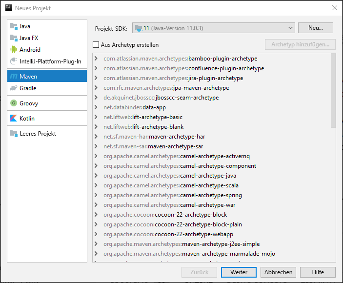
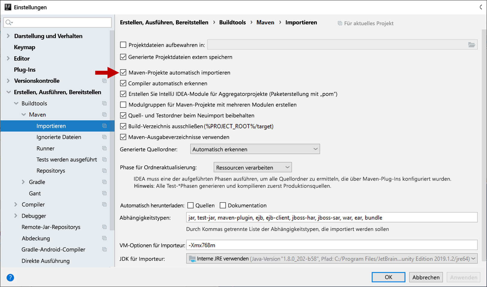
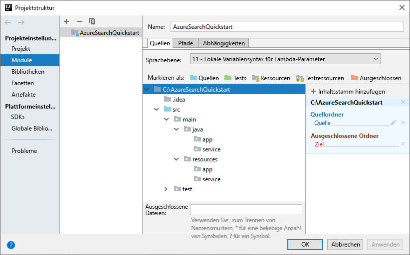

# <a name="quickstart-create-an-azure-cognitive-search-index-in-java-using-rest-apis"></a>Schnellstart: Erstellen eines Azure Cognitive Search-Index in Java mit REST-APIs
> [!div class="op_single_selector"]
> * [JavaScript](search-get-started-nodejs.md)
> * [C#](search-get-started-dotnet.md)
> * [Java](search-get-started-java.md)
> * [Portal](search-get-started-portal.md)
> * [PowerShell](search-create-index-rest-api.md)
> * [Python](search-get-started-python.md)
> * [Postman](search-get-started-postman.md)

Erstellen Sie eine Java-Konsolenanwendung, mit der unter Verwendung von [IntelliJ](https://www.jetbrains.com/idea/), des [Java 11 SDK](/java/azure/jdk/?view=azure-java-stable) und der [REST-API für Azure Cognitive Search](/rest/api/searchservice/) ein Azure Cognitive Search-Index erstellt, geladen und abgefragt wird. Dieser Artikel enthält eine Schritt-für-Schritt-Anleitung zum Erstellen der Anwendung. Alternativ können Sie [die vollständige Anwendung herunterladen und ausführen](/samples/azure-samples/azure-search-java-samples/java-sample-quickstart/).

Wenn Sie kein Azure-Abonnement besitzen, können Sie ein [kostenloses Konto](https://azure.microsoft.com/free/?WT.mc_id=A261C142F) erstellen, bevor Sie beginnen.

## <a name="prerequisites"></a>Voraussetzungen

Zum Erstellen und Testen dieses Beispiels wurden die folgenden Softwareprodukte und Dienste verwendet:

+ [IntelliJ IDEA](https://www.jetbrains.com/idea/)

+ [Java 11 SDK](/java/azure/jdk/?view=azure-java-stable)

+ [Erstellen Sie einen Azure Cognitive Search-Dienst](search-create-service-portal.md), oder suchen Sie in Ihrem aktuellen Abonnement [nach einem vorhandenen Dienst](https://ms.portal.azure.com/#blade/HubsExtension/BrowseResourceBlade/resourceType/Microsoft.Search%2FsearchServices). Für diesen Schnellstart können Sie einen kostenlosen Dienst verwenden.

<a name="get-service-info"></a>

## <a name="get-a-key-and-url"></a>Abrufen eines Schlüssels und einer URL

Aufrufe, die an den Dienst gerichtet werden, erfordern jeweils einen URL-Endpunkt und einen Zugriffsschlüssel. Ein Suchdienst wird mit beidem erstellt. Gehen Sie daher wie folgt vor, um die erforderlichen Informationen zu erhalten, falls Sie Azure Cognitive Search Ihrem Abonnement hinzugefügt haben:

1. [Melden Sie sich beim Azure-Portal an](https://portal.azure.com/), und rufen Sie auf der Seite **Übersicht** Ihres Suchdiensts die URL ab. Ein Beispiel für einen Endpunkt ist `https://mydemo.search.windows.net`.

2. Rufen Sie unter **Einstellungen** > **Schlüssel** einen Administratorschlüssel ab, um Vollzugriff auf den Dienst zu erhalten. Es gibt zwei austauschbare Administratorschlüssel – diese wurden zum Zweck der Geschäftskontinuität bereitgestellt, falls Sie einen Rollover für einen Schlüssel durchführen müssen. Für Anforderungen zum Hinzufügen, Ändern und Löschen von Objekten können Sie den primären oder den sekundären Schlüssel verwenden.

   Erstellen Sie auch einen Abfrageschlüssel. Es empfiehlt sich, Abfrageanforderungen mit schreibgeschütztem Zugriff auszugeben.


Für jede Anforderung, die an Ihren Dienst gesendet wird, ist ein API-Schlüssel erforderlich. Ein gültiger Schlüssel stellt anforderungsbasiert eine Vertrauensstellung her zwischen der Anwendung, die die Anforderung versendet, und dem Dienst, der sie verarbeitet.

## <a name="set-up-your-environment"></a>Einrichten der Umgebung

Beginnen Sie, indem Sie IntelliJ IDEA öffnen und ein neues Projekt einrichten.

### <a name="create-the-project"></a>Erstellen des Projekts

1. Öffnen Sie IntelliJ IDEA, und wählen Sie **Neues Projekt erstellen** aus.
1. Wählen Sie **Maven** aus.
1. Wählen Sie in der Liste **Project SDK** (Projekt-SDK) die Option „Java 11 SDK“ aus.

     

1. Geben Sie unter **GroupId** und **ArtifactId** die Zeichenfolge `AzureSearchQuickstart` ein.
1. Übernehmen Sie die restlichen Standardeinstellungen, um das Projekt zu öffnen.

### <a name="specify-maven-dependencies"></a>Angeben von Maven-Abhängigkeiten

1. Wählen Sie **File** > **Settings** (Datei > Einstellungen) aus.
1. Wählen Sie im Fenster **Settings** (Einstellungen) **Build, Execution, Deployment** > **Build Tools** > **Maven** > **Importing** („Erstellung, Ausführung, Bereitstellung“ > „Buildtools“ > „Maven“ > „Importieren“) aus.
1. Aktivieren Sie das Kontrollkästchen **Import Maven projects automatically** (Maven-Projekte automatisch importieren), und klicken Sie auf **OK**, um das Fenster zu schließen. Maven-Plug-Ins und andere Abhängigkeiten werden jetzt automatisch synchronisiert, wenn Sie die Datei „pom.xml“ im nächsten Schritt aktualisieren.

    

1. Öffnen Sie die Datei „pom.xml“, und ersetzen Sie den Inhalt durch die folgenden Maven-Konfigurationsdetails. Hierin sind Verweise auf das [Exec Maven-Plug-In](https://www.mojohaus.org/exec-maven-plugin/) und eine [JSON-Schnittstellen-API](https://javadoc.io/doc/org.glassfish/javax.json/1.0.2) enthalten.

    ```xml
    <?xml version="1.0" encoding="UTF-8"?>
    <project xmlns="http://maven.apache.org/POM/4.0.0"
             xmlns:xsi="http://www.w3.org/2001/XMLSchema-instance"
             xsi:schemaLocation="http://maven.apache.org/POM/4.0.0 http://maven.apache.org/xsd/maven-4.0.0.xsd">
        <modelVersion>4.0.0</modelVersion>
    
        <groupId>AzureSearchQuickstart</groupId>
        <artifactId>AzureSearchQuickstart</artifactId>
        <version>1.0-SNAPSHOT</version>
        <build>
            <sourceDirectory>src</sourceDirectory>
            <plugins>
                <plugin>
                    <artifactId>maven-compiler-plugin</artifactId>
                    <version>3.1</version>
                    <configuration>
                        <source>11</source>
                        <target>11</target>
                    </configuration>
                </plugin>
                <plugin>
                    <groupId>org.codehaus.mojo</groupId>
                    <artifactId>exec-maven-plugin</artifactId>
                    <version>1.6.0</version>
                    <executions>
                        <execution>
                            <goals>
                                <goal>exec</goal>
                            </goals>
                        </execution>
                    </executions>
                    <configuration>
                        <mainClass>main.java.app.App</mainClass>
                        <cleanupDaemonThreads>false</cleanupDaemonThreads>
                    </configuration>
                </plugin>
            </plugins>
        </build>
        <dependencies>
            <dependency>
                <groupId>org.glassfish</groupId>
                <artifactId>javax.json</artifactId>
                <version>1.0.2</version>
            </dependency>
        </dependencies>   
    </project>
    ```

### <a name="set-up-the-project-structure"></a>Einrichten der Projektstruktur

1. Wählen Sie **Datei** > **Projektstruktur** aus.
1. Wählen Sie **Module** aus, und erweitern Sie die Quellstruktur, um auf den Inhalt des Ordners `src` >  `main` zuzugreifen.
1. Fügen Sie im Ordner `src` >  `main` > `java` die Ordner `app` und `service` hinzu. Wählen Sie hierzu den Ordner `java` aus, drücken Sie ALT+EINFG, und geben Sie dann den Ordnernamen ein.
1. Fügen Sie im Ordner `src` >  `main` >`resources` die Ordner `app` und `service` hinzu.

    Wenn Sie fertig sind, sollte die Projektstruktur wie in der folgenden Abbildung aussehen.

    

1. Klicken Sie auf **OK** , um das Fenster zu schließen.

### <a name="add-azure-cognitive-search-service-information"></a>Hinzufügen von Azure Cognitive Search-Dienstinformationen

1. Erweitern Sie im Fenster **Projekt** die Quellstruktur, um auf den Ordner `src` >  `main` >`resources` > `app` zuzugreifen und eine `config.properties`-Datei hinzuzufügen. Wählen Sie hierzu den Ordner `app` aus, drücken Sie ALT+EINFG, wählen Sie **Datei** aus, und geben Sie dann den Dateinamen ein.

1. Kopieren Sie die folgenden Einstellungen in die neue Datei, und ersetzen Sie `<YOUR-SEARCH-SERVICE-NAME>`, `<YOUR-ADMIN-KEY>` und `<YOUR-QUERY-KEY>` durch Ihren Dienstnamen und die Schlüssel. Ist Ihr Dienstendpunkt also beispielsweise `https://mydemo.search.windows.net`, lautet der Dienstname „mydemo“.

    ```java
        SearchServiceName=<YOUR-SEARCH-SERVICE-NAME>
        SearchServiceAdminKey=<YOUR-ADMIN-KEY>
        SearchServiceQueryKey=<YOUR-QUERY-KEY>
        IndexName=hotels-quickstart
        ApiVersion=2019-05-06
    ```

### <a name="add-the-main-method"></a>Hinzufügen der main-Methode

1. Fügen Sie im Ordner `src` >  `main` > `java` > `app` eine `App`-Klasse hinzu. Wählen Sie hierzu den Ordner `app` aus, drücken Sie ALT+EINFG, wählen Sie **Java-Klasse** aus, und geben Sie dann den Klassennamen ein.
1. Öffnen Sie die `App`-Klasse, und ersetzen Sie den Inhalt durch den folgenden Code. Dieser Code enthält die `main`-Methode. 

    Der Code mit aufgehobener Auskommentierung liest die Suchdienstparameter und verwendet sie, um eine Instanz des Suchdienstclients zu erstellen. Der Suchdienstclient-Code wird im nächsten Abschnitt hinzugefügt.

    Die Auskommentierung des Codes in dieser Klasse wird in einem späteren Abschnitt dieser Schnellstartanleitung aufgehoben.

    ```java
    package main.java.app;
    
    import main.java.service.SearchServiceClient;
    import java.io.IOException;
    import java.util.Properties;
    
    public class App {
    
        private static Properties loadPropertiesFromResource(String resourcePath) throws IOException {
            var inputStream = App.class.getResourceAsStream(resourcePath);
            var configProperties = new Properties();
            configProperties.load(inputStream);
            return configProperties;
        }
    
        public static void main(String[] args) {
            try {
                var config = loadPropertiesFromResource("/app/config.properties");
                var client = new SearchServiceClient(
                        config.getProperty("SearchServiceName"),
                        config.getProperty("SearchServiceAdminKey"),
                        config.getProperty("SearchServiceQueryKey"),
                        config.getProperty("ApiVersion"),
                        config.getProperty("IndexName")
                );
    
    
    //Uncomment the next 3 lines in the 1 - Create Index section of the quickstart
    //            if(client.indexExists()){ client.deleteIndex();}
    //            client.createIndex("/service/index.json");
    //            Thread.sleep(1000L); // wait a second to create the index
    
    //Uncomment the next 2 lines in the 2 - Load Documents section of the quickstart
    //            client.uploadDocuments("/service/hotels.json");
    //            Thread.sleep(2000L); // wait 2 seconds for data to upload
    
    //Uncomment the following 5 search queries in the 3 - Search an index section of the quickstart
    //            // Query 1
    //            client.logMessage("\n*QUERY 1****************************************************************");
    //            client.logMessage("Search for: Atlanta'");
    //            client.logMessage("Return: All fields'");
    //            client.searchPlus("Atlanta");
    //
    //            // Query 2
    //            client.logMessage("\n*QUERY 2****************************************************************");
    //            client.logMessage("Search for: Atlanta");
    //            client.logMessage("Return: HotelName, Tags, Address");
    //            SearchServiceClient.SearchOptions options2 = client.createSearchOptions();
    //            options2.select = "HotelName,Tags,Address";
    //            client.searchPlus("Atlanta", options2);
    //
    //            //Query 3
    //            client.logMessage("\n*QUERY 3****************************************************************");
    //            client.logMessage("Search for: wifi & restaurant");
    //            client.logMessage("Return: HotelName, Description, Tags");
    //            SearchServiceClient.SearchOptions options3 = client.createSearchOptions();
    //            options3.select = "HotelName,Description,Tags";
    //            client.searchPlus("wifi,restaurant", options3);
    //
    //            // Query 4 -filtered query
    //            client.logMessage("\n*QUERY 4****************************************************************");
    //            client.logMessage("Search for: all");
    //            client.logMessage("Filter: Ratings greater than 4");
    //            client.logMessage("Return: HotelName, Rating");
    //            SearchServiceClient.SearchOptions options4 = client.createSearchOptions();
    //            options4.filter="Rating%20gt%204";
    //            options4.select = "HotelName,Rating";
    //            client.searchPlus("*",options4);
    //
    //            // Query 5 - top 2 results, ordered by
    //            client.logMessage("\n*QUERY 5****************************************************************");
    //            client.logMessage("Search for: boutique");
    //            client.logMessage("Get: Top 2 results");
    //            client.logMessage("Order by: Rating in descending order");
    //            client.logMessage("Return: HotelId, HotelName, Category, Rating");
    //            SearchServiceClient.SearchOptions options5 = client.createSearchOptions();
    //            options5.top=2;
    //            options5.orderby = "Rating%20desc";
    //            options5.select = "HotelId,HotelName,Category,Rating";
    //            client.searchPlus("boutique", options5);
    
            } catch (Exception e) {
                System.err.println("Exception:" + e.getMessage());
                e.printStackTrace();
            }
        }
    }
    ```

### <a name="add-the-http-operations"></a>Hinzufügen der HTTP-Vorgänge

1. Fügen Sie im Ordner `src` >  `main` > `java` > `service` eine `SearchServiceClient`-Klasse hinzu. Wählen Sie hierfür den Ordner `service` aus, drücken Sie ALT+EINFG, wählen Sie **Java-Klasse** aus, und geben Sie dann den Klassennamen ein.
1. Öffnen Sie die `SearchServiceClient`-Klasse, und ersetzen Sie den Inhalt durch den folgenden Code. Mit diesem Code werden die HTTP-Vorgänge bereitgestellt, die für die Verwendung der Azure Cognitive Search-REST-API erforderlich sind. Weitere Methoden zum Erstellen eines Index, Hochladen von Dokumenten und Abfragen des Index werden in einem späteren Abschnitt hinzugefügt.

    ```java
    package main.java.service;

    import javax.json.Json;
    import javax.net.ssl.HttpsURLConnection;
    import java.io.IOException;
    import java.io.StringReader;
    import java.net.HttpURLConnection;
    import java.net.URI;
    import java.net.http.HttpClient;
    import java.net.http.HttpRequest;
    import java.net.http.HttpResponse;
    import java.nio.charset.StandardCharsets;
    import java.util.Formatter;
    import java.util.function.Consumer;
    
        /* This class is responsible for implementing HTTP operations for creating the index, uploading documents and searching the data*/
        public class SearchServiceClient {
            private final String _adminKey;
            private final String _queryKey;
            private final String _apiVersion;
            private final String _serviceName;
            private final String _indexName;
            private final static HttpClient client = HttpClient.newHttpClient();
    
        public SearchServiceClient(String serviceName, String adminKey, String queryKey, String apiVersion, String indexName) {
            this._serviceName = serviceName;
            this._adminKey = adminKey;
            this._queryKey = queryKey;
            this._apiVersion = apiVersion;
            this._indexName = indexName;
        }

        private static HttpResponse<String> sendRequest(HttpRequest request) throws IOException, InterruptedException {
            logMessage(String.format("%s: %s", request.method(), request.uri()));
            return client.send(request, HttpResponse.BodyHandlers.ofString());
        }

        private static URI buildURI(Consumer<Formatter> fmtFn)
                {
                    Formatter strFormatter = new Formatter();
                    fmtFn.accept(strFormatter);
                    String url = strFormatter.out().toString();
                    strFormatter.close();
                    return URI.create(url);
        }
    
        public static void logMessage(String message) {
            System.out.println(message);
        }
    
        public static boolean isSuccessResponse(HttpResponse<String> response) {
            try {
                int responseCode = response.statusCode();
    
                logMessage("\n Response code = " + responseCode);
    
                if (responseCode == HttpURLConnection.HTTP_OK || responseCode == HttpURLConnection.HTTP_ACCEPTED
                        || responseCode == HttpURLConnection.HTTP_NO_CONTENT || responseCode == HttpsURLConnection.HTTP_CREATED) {
                    return true;
                }
    
                // We got an error
                var msg = response.body();
                if (msg != null) {
                    logMessage(String.format("\n MESSAGE: %s", msg));
                }
    
            } catch (Exception e) {
                e.printStackTrace();
            }
    
            return false;
        }
    
        public static HttpRequest httpRequest(URI uri, String key, String method, String contents) {
            contents = contents == null ? "" : contents;
            var builder = HttpRequest.newBuilder();
            builder.uri(uri);
            builder.setHeader("content-type", "application/json");
            builder.setHeader("api-key", key);
    
            switch (method) {
                case "GET":
                    builder = builder.GET();
                    break;
                case "HEAD":
                    builder = builder.GET();
                    break;
                case "DELETE":
                    builder = builder.DELETE();
                    break;
                case "PUT":
                    builder = builder.PUT(HttpRequest.BodyPublishers.ofString(contents));
                    break;
                case "POST":
                    builder = builder.POST(HttpRequest.BodyPublishers.ofString(contents));
                    break;
                default:
                    throw new IllegalArgumentException(String.format("Can't create request for method '%s'", method));
            }
            return builder.build();
        }
    }
    
    ```

### <a name="build-the-project"></a>Erstellen des Projekts

1. Stellen Sie sicher, dass Ihr Projekt über die folgende Struktur verfügt.

    

1. Öffnen Sie das Fenster mit dem Tool **Maven**, und führen Sie das folgende Maven-Ziel aus: `verify exec:java`


Suchen Sie nach Abschluss der Verarbeitung nach der Meldung „BUILD SUCCESS“ (BUILD ERFOLGREICH), gefolgt vom Exitcode „0“.

## <a name="1---create-index"></a>1\. Erstellen des Index

Die Indexdefinition „hotels“ enthält einfache Felder und ein komplexes Feld. Beispiele für ein einfaches Feld sind „Hotelname“ oder „Beschreibung“. Das Feld „Adresse“ ist ein komplexes Feld, weil es über Unterfelder verfügt, z. B. „Anschrift“ und „Ort“. In dieser Schnellstartanleitung wird die Indexdefinition per JSON angegeben.

1. Erweitern Sie im Fenster **Projekt** die Quellstruktur, um auf den Ordner `src` >  `main` >`resources` > `service` zuzugreifen und eine `index.json`-Datei hinzuzufügen. Wählen Sie hierzu den Ordner `app` aus, drücken Sie ALT+EINFG, wählen Sie **Datei** aus, und geben Sie dann den Dateinamen ein.

1. Öffnen Sie die Datei `index.json`, und fügen Sie die folgende Indexdefinition ein.

    ```json
    {
      "name": "hotels-quickstart",
      "fields": [
        {
          "name": "HotelId",
          "type": "Edm.String",
          "key": true,
          "filterable": true
        },
        {
          "name": "HotelName",
          "type": "Edm.String",
          "searchable": true,
          "filterable": false,
          "sortable": true,
          "facetable": false
        },
        {
          "name": "Description",
          "type": "Edm.String",
          "searchable": true,
          "filterable": false,
          "sortable": false,
          "facetable": false,
          "analyzer": "en.lucene"
        },
        {
          "name": "Description_fr",
          "type": "Edm.String",
          "searchable": true,
          "filterable": false,
          "sortable": false,
          "facetable": false,
          "analyzer": "fr.lucene"
        },
        {
          "name": "Category",
          "type": "Edm.String",
          "searchable": true,
          "filterable": true,
          "sortable": true,
          "facetable": true
        },
        {
          "name": "Tags",
          "type": "Collection(Edm.String)",
          "searchable": true,
          "filterable": true,
          "sortable": false,
          "facetable": true
        },
        {
          "name": "ParkingIncluded",
          "type": "Edm.Boolean",
          "filterable": true,
          "sortable": true,
          "facetable": true
        },
        {
          "name": "LastRenovationDate",
          "type": "Edm.DateTimeOffset",
          "filterable": true,
          "sortable": true,
          "facetable": true
        },
        {
          "name": "Rating",
          "type": "Edm.Double",
          "filterable": true,
          "sortable": true,
          "facetable": true
        },
        {
          "name": "Address",
          "type": "Edm.ComplexType",
          "fields": [
            {
              "name": "StreetAddress",
              "type": "Edm.String",
              "filterable": false,
              "sortable": false,
              "facetable": false,
              "searchable": true
            },
            {
              "name": "City",
              "type": "Edm.String",
              "searchable": true,
              "filterable": true,
              "sortable": true,
              "facetable": true
            },
            {
              "name": "StateProvince",
              "type": "Edm.String",
              "searchable": true,
              "filterable": true,
              "sortable": true,
              "facetable": true
            },
            {
              "name": "PostalCode",
              "type": "Edm.String",
              "searchable": true,
              "filterable": true,
              "sortable": true,
              "facetable": true
            },
            {
              "name": "Country",
              "type": "Edm.String",
              "searchable": true,
              "filterable": true,
              "sortable": true,
              "facetable": true
            }
          ]
        }
      ]
    }
    ```

    Der Indexname lautet „hotels-quickstart“. Mit Attributen in den Indexfeldern wird bestimmt, wie in einer Anwendung nach den indizierten Daten gesucht werden kann. So muss beispielsweise jedem Feld, das in eine Volltextsuche einbezogen werden soll, das Attribut `IsSearchable` zugewiesen werden. Weitere Informationen zu Attributen finden Sie unter [Feldersammlung und Feldattribute](search-what-is-an-index.md#fields-collection).
    
    Im Feld `Description` dieses Index wird die optionale `analyzer`-Eigenschaft verwendet, um das Lucene-Standard-Sprachanalysetool außer Kraft zu setzen. Für das Feld `Description_fr` wird das französische Lucene-Analysetool (`fr.lucene`) verwendet, da in diesem Feld französischer Text gespeichert wird. Für `Description` wird die optionale Sprachanalyse von Microsoft (en.lucene) verwendet. Weitere Informationen zu Analysetools finden Sie unter [Analysetools für Textverarbeitung in Azure Cognitive Search](search-analyzers.md).

1. Fügen Sie der `SearchServiceClient` -Klasse den folgenden Code hinzu. Mit diesen Methoden werden Azure Cognitive Search-REST-Dienst-URLs erstellt, mit denen ein Index erstellt und gelöscht wird. Außerdem wird hiermit ermittelt, ob ein Index vorhanden ist. Mit den Methoden wird auch die HTTP-Anforderung durchgeführt.

    ```java
    public boolean indexExists() throws IOException, InterruptedException {
        logMessage("\n Checking if index exists...");
        var uri = buildURI(strFormatter -> strFormatter.format(
                "https://%s.search.windows.net/indexes/%s/docs?api-version=%s&search=*",
                _serviceName,_indexName,_apiVersion));
        var request = httpRequest(uri, _adminKey, "HEAD", "");
        var response = sendRequest(request);
        return isSuccessResponse(response);
    }
    
    public boolean deleteIndex() throws IOException, InterruptedException {
        logMessage("\n Deleting index...");
        var uri = buildURI(strFormatter -> strFormatter.format(
                "https://%s.search.windows.net/indexes/%s?api-version=%s",
                _serviceName,_indexName,_apiVersion));
        var request = httpRequest(uri, _adminKey, "DELETE", "*");
        var response = sendRequest(request);
        return isSuccessResponse(response);
    }
    
    
    public boolean createIndex(String indexDefinitionFile) throws IOException, InterruptedException {
        logMessage("\n Creating index...");
        //Build the search service URL
        var uri = buildURI(strFormatter -> strFormatter.format(
                "https://%s.search.windows.net/indexes/%s?api-version=%s",
                _serviceName,_indexName,_apiVersion));
        //Read in index definition file
        var inputStream = SearchServiceClient.class.getResourceAsStream(indexDefinitionFile);
        var indexDef = new String(inputStream.readAllBytes(), StandardCharsets.UTF_8);
        //Send HTTP PUT request to create the index in the search service
        var request = httpRequest(uri, _adminKey, "PUT", indexDef);
        var response = sendRequest(request);
        return isSuccessResponse(response);
    }
    ```

1. Heben Sie für den folgenden Code die Auskommentierung in der `App`-Klasse auf. Mit diesem Code wird der Index „hotels-quickstart“ gelöscht, sofern er vorhanden ist, und basierend auf der Indexdefinition in der Datei „index.json“ wird ein neuer Index erstellt. 

    Nach der Anforderung zur Indexerstellung wird eine Pause von einer Sekunde eingefügt. Mit dieser Pause wird sichergestellt, dass der Index erstellt wird, bevor Sie Dokumente hochladen.

    ```java
        if (client.indexExists()) { client.deleteIndex();}
          client.createIndex("/service/index.json");
          Thread.sleep(1000L); // wait a second to create the index
    ```

1. Öffnen Sie das Fenster mit dem Tool **Maven**, und führen Sie das folgende Maven-Ziel aus: `verify exec:java`

    Achten Sie während der Ausführung des Codes auf die Meldung „Creating index“ (Index wird erstellt), gefolgt vom Antwortcode 201. Mit diesem Antwortcode wird bestätigt, dass der Index erstellt wurde. Die Ausführung sollte mit der Meldung BUILD SUCCESS (BUILD ERFOLGREICH) und dem Exitcode „0“ enden.
    
## <a name="2---load-documents"></a>2\. Laden von Dokumenten

1. Erweitern Sie im Fenster **Projekt** die Quellstruktur, um auf den Ordner `src` >  `main` >`resources` > `service` zuzugreifen und eine `hotels.json`-Datei hinzuzufügen. Wählen Sie hierfür den Ordner `app` aus, drücken Sie ALT+EINFG, wählen Sie **Datei** aus, und geben Sie dann den Dateinamen ein.
1. Fügen Sie die folgenden Hoteldokumente in die Datei ein.

    ```json
    {
      "value": [
        {
          "@search.action": "upload",
          "HotelId": "1",
          "HotelName": "Secret Point Motel",
          "Description": "The hotel is ideally located on the main commercial artery of the city in the heart of New York. A few minutes away is Time's Square and the historic centre of the city, as well as other places of interest that make New York one of America's most attractive and cosmopolitan cities.",
          "Description_fr": "L'hôtel est idéalement situé sur la principale artère commerciale de la ville en plein cœur de New York. A quelques minutes se trouve la place du temps et le centre historique de la ville, ainsi que d'autres lieux d'intérêt qui font de New York l'une des villes les plus attractives et cosmopolites de l'Amérique.",
          "Category": "Boutique",
          "Tags": [ "pool", "air conditioning", "concierge" ],
          "ParkingIncluded": "false",
          "LastRenovationDate": "1970-01-18T00:00:00Z",
          "Rating": 3.60,
          "Address": {
            "StreetAddress": "677 5th Ave",
            "City": "New York",
            "StateProvince": "NY",
            "PostalCode": "10022",
            "Country": "USA"
          }
        },
        {
          "@search.action": "upload",
          "HotelId": "2",
          "HotelName": "Twin Dome Motel",
          "Description": "The hotel is situated in a  nineteenth century plaza, which has been expanded and renovated to the highest architectural standards to create a modern, functional and first-class hotel in which art and unique historical elements coexist with the most modern comforts.",
          "Description_fr": "L'hôtel est situé dans une place du XIXe siècle, qui a été agrandie et rénovée aux plus hautes normes architecturales pour créer un hôtel moderne, fonctionnel et de première classe dans lequel l'art et les éléments historiques uniques coexistent avec le confort le plus moderne.",
          "Category": "Boutique",
          "Tags": [ "pool", "free wifi", "concierge" ],
          "ParkingIncluded": "false",
          "LastRenovationDate": "1979-02-18T00:00:00Z",
          "Rating": 3.60,
          "Address": {
            "StreetAddress": "140 University Town Center Dr",
            "City": "Sarasota",
            "StateProvince": "FL",
            "PostalCode": "34243",
            "Country": "USA"
          }
        },
        {
          "@search.action": "upload",
          "HotelId": "3",
          "HotelName": "Triple Landscape Hotel",
          "Description": "The Hotel stands out for its gastronomic excellence under the management of William Dough, who advises on and oversees all of the Hotel’s restaurant services.",
          "Description_fr": "L'hôtel est situé dans une place du XIXe siècle, qui a été agrandie et rénovée aux plus hautes normes architecturales pour créer un hôtel moderne, fonctionnel et de première classe dans lequel l'art et les éléments historiques uniques coexistent avec le confort le plus moderne.",
          "Category": "Resort and Spa",
          "Tags": [ "air conditioning", "bar", "continental breakfast" ],
          "ParkingIncluded": "true",
          "LastRenovationDate": "2015-09-20T00:00:00Z",
          "Rating": 4.80,
          "Address": {
            "StreetAddress": "3393 Peachtree Rd",
            "City": "Atlanta",
            "StateProvince": "GA",
            "PostalCode": "30326",
            "Country": "USA"
          }
        },
        {
          "@search.action": "upload",
          "HotelId": "4",
          "HotelName": "Sublime Cliff Hotel",
          "Description": "Sublime Cliff Hotel is located in the heart of the historic center of Sublime in an extremely vibrant and lively area within short walking distance to the sites and landmarks of the city and is surrounded by the extraordinary beauty of churches, buildings, shops and monuments. Sublime Cliff is part of a lovingly restored 1800 palace.",
          "Description_fr": "Le sublime Cliff Hotel est situé au coeur du centre historique de sublime dans un quartier extrêmement animé et vivant, à courte distance de marche des sites et monuments de la ville et est entouré par l'extraordinaire beauté des églises, des bâtiments, des commerces et Monuments. Sublime Cliff fait partie d'un Palace 1800 restauré avec amour.",
          "Category": "Boutique",
          "Tags": [ "concierge", "view", "24-hour front desk service" ],
          "ParkingIncluded": "true",
          "LastRenovationDate": "1960-02-06T00:00:00Z",
          "Rating": 4.60,
          "Address": {
            "StreetAddress": "7400 San Pedro Ave",
            "City": "San Antonio",
            "StateProvince": "TX",
            "PostalCode": "78216",
            "Country": "USA"
          }
        }
      ]
    }
    ```

1. Fügen Sie den folgenden Code in die `SearchServiceClient`-Klasse ein. Mit diesem Code wird die REST-Dienst-URL zum Hochladen der Hoteldokumente in den Index erstellt, und anschließend wird die HTTP POST-Anforderung durchgeführt.

    ```java
    public boolean uploadDocuments(String documentsFile) throws IOException, InterruptedException {
        logMessage("\n Uploading documents...");
        //Build the search service URL
        var endpoint = buildURI(strFormatter -> strFormatter.format(
                "https://%s.search.windows.net/indexes/%s/docs/index?api-version=%s",
                _serviceName,_indexName,_apiVersion));
        //Read in the data to index
        var inputStream = SearchServiceClient.class.getResourceAsStream(documentsFile);
        var documents = new String(inputStream.readAllBytes(), StandardCharsets.UTF_8);
        //Send HTTP POST request to upload and index the data
        var request = httpRequest(endpoint, _adminKey, "POST", documents);
        var response = sendRequest(request);
        return isSuccessResponse(response);
    }
    ```

1. Heben Sie für den folgenden Code die Auskommentierung in der `App`-Klasse auf. Mit diesem Code werden die in „hotels.json“ enthaltenen Dokumente in den Index hochgeladen.

    ```java
    client.uploadDocuments("/service/hotels.json");
    Thread.sleep(2000L); // wait 2 seconds for data to upload
    ```

    Nach der Uploadanforderung wird eine Pause von zwei Sekunden eingefügt, um sicherzustellen, dass der Prozess zum Laden der Dokumente abgeschlossen ist, bevor Sie den Index abfragen.

1. Öffnen Sie das Fenster mit dem Tool **Maven**, und führen Sie das folgende Maven-Ziel aus: `verify exec:java`

    Da Sie im vorherigen Schritt den Index „hotels-quickstart“ erstellt haben, wird er vom Code jetzt gelöscht und neu erstellt, bevor die Hoteldokumente geladen werden.

    Suchen Sie während der Ausführung des Codes nach der Meldung „Uploading documents“ (Dokumente werden hochgeladen), gefolgt vom Antwortcode 200. Mit diesem Antwortcode wird bestätigt, dass die Dokumente in den Index hochgeladen wurden. Die Ausführung sollte mit der Meldung BUILD SUCCESS (BUILD ERFOLGREICH) und dem Exitcode „0“ enden.

## <a name="3---search-an-index"></a>3\. Durchsuchen eines Index

Nachdem Sie die Hoteldokumente geladen haben, können Sie Suchabfragen erstellen, um auf die Hoteldaten zuzugreifen.

1. Fügen Sie der `SearchServiceClient` -Klasse den folgenden Code hinzu. Mit diesem Code werden Azure Cognitive Search-REST-Dienst-URLs erstellt, um nach den indizierten Daten zu suchen und die Suchergebnisse auszugeben.

    Bei der `SearchOptions`-Klasse und der `createSearchOptions`-Methode können Sie eine Teilmenge der verfügbaren Azure Cognitive Search-REST-API-Abfrageoptionen angeben. Weitere Informationen zu den REST-API-Abfrageoptionen finden Sie unter [Durchsuchen von Dokumenten (Azure Cognitive Search-REST-API)](/rest/api/searchservice/search-documents).

    Mit der `SearchPlus`-Methode wird die Suchabfragen-URL erstellt und die Suchanforderung durchgeführt. Anschließend werden die Ergebnisse in der Konsole ausgegeben. 

    ```java
    public SearchOptions createSearchOptions() { return new SearchOptions();}

    //Defines available search parameters that can be set
    public static class SearchOptions {

        public String select = "";
        public String filter = "";
        public int top = 0;
        public String orderby= "";
    }

    //Concatenates search parameters to append to the search request
    private String createOptionsString(SearchOptions options)
    {
        String optionsString = "";
        if (options != null) {
            if (options.select != "")
                optionsString = optionsString + "&$select=" + options.select;
            if (options.filter != "")
                optionsString = optionsString + "&$filter=" + options.filter;
            if (options.top != 0)
                optionsString = optionsString + "&$top=" + options.top;
            if (options.orderby != "")
                optionsString = optionsString + "&$orderby=" +options.orderby;
        }
        return optionsString;
    }
    
    public void searchPlus(String queryString)
    {
        searchPlus( queryString, null);
    }
    
    public void searchPlus(String queryString, SearchOptions options) {
    
        try {
            String optionsString = createOptionsString(options);
            var uri = buildURI(strFormatter -> strFormatter.format(
                    "https://%s.search.windows.net/indexes/%s/docs?api-version=%s&search=%s%s",
                    _serviceName, _indexName, _apiVersion, queryString, optionsString));
            var request = httpRequest(uri, _queryKey, "GET", null);
            var response = sendRequest(request);
            var jsonReader = Json.createReader(new StringReader(response.body()));
            var jsonArray = jsonReader.readObject().getJsonArray("value");
            var resultsCount = jsonArray.size();
            logMessage("Results:\nCount: " + resultsCount);
            for (int i = 0; i <= resultsCount - 1; i++) {
                logMessage(jsonArray.get(i).toString());
            }
    
            jsonReader.close();
    
        }
        catch (Exception e) {
            e.printStackTrace();
        }
    
    }
    ```

1. Kommentieren Sie in der `App`-Klasse den folgenden Code aus. Mit diesem Code werden fünf unterschiedliche Abfragen eingerichtet, z. B. der Suchtext, Abfrageparameter und zurückzugebende Datenfelder. 

    ```java
    // Query 1
    client.logMessage("\n*QUERY 1****************************************************************");
    client.logMessage("Search for: Atlanta");
    client.logMessage("Return: All fields'");
    client.searchPlus("Atlanta");

    // Query 2
    client.logMessage("\n*QUERY 2****************************************************************");
    client.logMessage("Search for: Atlanta");
    client.logMessage("Return: HotelName, Tags, Address");
    SearchServiceClient.SearchOptions options2 = client.createSearchOptions();
    options2.select = "HotelName,Tags,Address";
    client.searchPlus("Atlanta", options2);

    //Query 3
    client.logMessage("\n*QUERY 3****************************************************************");
    client.logMessage("Search for: wifi & restaurant");
    client.logMessage("Return: HotelName, Description, Tags");
    SearchServiceClient.SearchOptions options3 = client.createSearchOptions();
    options3.select = "HotelName,Description,Tags";
    client.searchPlus("wifi,restaurant", options3);

    // Query 4 -filtered query
    client.logMessage("\n*QUERY 4****************************************************************");
    client.logMessage("Search for: all");
    client.logMessage("Filter: Ratings greater than 4");
    client.logMessage("Return: HotelName, Rating");
    SearchServiceClient.SearchOptions options4 = client.createSearchOptions();
    options4.filter="Rating%20gt%204";
    options4.select = "HotelName,Rating";
    client.searchPlus("*",options4);

    // Query 5 - top 2 results, ordered by
    client.logMessage("\n*QUERY 5****************************************************************");
    client.logMessage("Search for: boutique");
    client.logMessage("Get: Top 2 results");
    client.logMessage("Order by: Rating in descending order");
    client.logMessage("Return: HotelId, HotelName, Category, Rating");
    SearchServiceClient.SearchOptions options5 = client.createSearchOptions();
    options5.top=2;
    options5.orderby = "Rating%20desc";
    options5.select = "HotelId,HotelName,Category,Rating";
    client.searchPlus("boutique", options5);
    ```


    Es gibt zwei [Abgleichsmethoden für Begriffe in einer Abfrage](search-query-overview.md#types-of-queries): Volltextsuche und Filter. Bei der Volltextsuche werden Felder vom Typ `IsSearchable` in Ihrem Index nach einem oder mehreren Begriffen durchsucht. Ein Filter ist ein boolescher Ausdruck, der für Felder vom Typ `IsFilterable` in einem Index ausgewertet wird. Volltextsuche und Filter können separat oder zusammen verwendet werden.

1. Öffnen Sie das Fenster mit dem Tool **Maven**, und führen Sie das folgende Maven-Ziel aus: `verify exec:java`

    Suchen Sie nach einer Zusammenfassung der einzelnen Abfragen und der zugehörigen Ergebnisse. Die Ausführung sollte mit der Meldung BUILD SUCCESS (BUILD ERFOLGREICH) und dem Exitcode „0“ abgeschlossen werden.

## <a name="clean-up"></a>Bereinigen

Wenn Sie in Ihrem eigenen Abonnement arbeiten, ist es ratsam, nach Abschluss eines Projekts die nicht mehr benötigten Ressourcen zu entfernen. Ressourcen, die weiterhin ausgeführt werden, können Sie Geld kosten. Sie können entweder einzelne Ressourcen oder aber die Ressourcengruppe löschen, um den gesamten Ressourcensatz zu entfernen.

Ressourcen können im Portal über den Link **Alle Ressourcen** oder **Ressourcengruppen** im linken Navigationsbereich gesucht und verwaltet werden.

Denken Sie bei Verwendung eines kostenlosen Diensts an die Beschränkung auf maximal drei Indizes, Indexer und Datenquellen. Sie können einzelne Elemente über das Portal löschen, um unter dem Limit zu bleiben. 

## <a name="next-steps"></a>Nächste Schritte

In dieser Java-Schnellstartanleitung haben Sie eine Reihe von Aufgaben ausgeführt, um einen Index zu erstellen, Dokumente in den Index zu laden und Abfragen auszuführen. Wenn Sie mit den grundlegenden Konzepten vertraut sind, empfehlen wir Ihnen, Ihr Wissen mit den folgenden Artikeln zu vertiefen.

+ [Indexvorgänge](/rest/api/searchservice/index-operations)

+ [Dokumentvorgänge](/rest/api/searchservice/document-operations)

+ [Indexer-Vorgänge](/rest/api/searchservice/indexer-operations)
