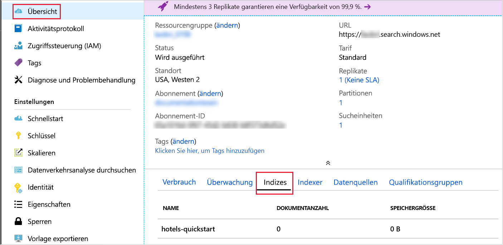

# <a name="quickstart-create-an-azure-cognitive-search-index-in-nodejs-using-rest-apis"></a>Schnellstart: Erstellen eines Azure Cognitive Search-Index in Node.js mit REST-APIs
> [!div class="op_single_selector"]
> * [JavaScript](search-get-started-nodejs.md)
> * [C#](search-get-started-dotnet.md)
> * [Portal](search-get-started-portal.md)
> * [PowerShell](search-create-index-rest-api.md)
> * [Python](search-get-started-python.md)
> * [Postman](search-get-started-postman.md)

Erstellen Sie eine Node.js-Anwendung, die einen Azure Cognitive Search-Index erstellt, Daten in den Index lädt und den Index abfragt. Dieser Artikel veranschaulicht Schritt für Schritt, wie Sie die Anwendung erstellen. Alternativ dazu können Sie [den Quellcode und die Daten herunterladen](https://github.com/Azure-Samples/azure-search-javascript-samples/tree/master/quickstart/) und die Anwendung von der Befehlszeile ausführen.

Wenn Sie kein Azure-Abonnement besitzen, können Sie ein [kostenloses Konto](https://azure.microsoft.com/free/?WT.mc_id=A261C142F) erstellen, bevor Sie beginnen.

## <a name="prerequisites"></a>Voraussetzungen

In diesem Schnellstart werden die folgenden Dienste, Tools und Daten verwendet.

+ [Node.js](https://nodejs.org).
+ [NPM](https://www.npmjs.com) sollte von Node.js installiert worden sein.
+ Eine Beispielstruktur für den Index sowie zugehörige Dokumente werden in diesem Artikel bereitgestellt. Sie können die Struktur und die Dokumente auch aus dem [Verzeichnis **quickstart** des Repositorys](https://github.com/Azure-Samples/azure-search-javascript-samples/) abrufen.
+ [Erstellen Sie einen Azure Cognitive Search-Dienst](search-create-service-portal.md), oder suchen Sie in Ihrem aktuellen Abonnement [nach einem vorhandenen Dienst](https://ms.portal.azure.com/#blade/HubsExtension/BrowseResourceBlade/resourceType/Microsoft.Search%2FsearchServices). Für diesen Schnellstart können Sie einen kostenlosen Dienst verwenden.

Empfohlen:

* [Visual Studio Code](https://code.visualstudio.com).
* Die Erweiterungen [Prettier](https://marketplace.visualstudio.com/items?itemName=esbenp.prettier-vscode) und [ESLint](https://marketplace.visualstudio.com/items?itemName=dbaeumer.vscode-eslint) für VS Code.

<a name="get-service-info"></a>
## <a name="get-keys-and-urls"></a>Abrufen von Schlüsseln und URLs

Aufrufe, die an den Dienst gerichtet werden, erfordern jeweils einen URL-Endpunkt und einen Zugriffsschlüssel. Ein Suchdienst wird mit beidem erstellt. Gehen Sie daher wie folgt vor, um die erforderlichen Informationen zu erhalten, falls Sie Azure Cognitive Search Ihrem Abonnement hinzugefügt haben:

1. [Melden Sie sich beim Azure-Portal an](https://portal.azure.com/), und rufen Sie auf der Seite **Übersicht** Ihres Suchdiensts den Namen Ihres Suchdiensts ab. Sie können den Dienstnamen anhand der Endpunkt-URL überprüfen. Wenn Ihre Endpunkt-URL z.B. `https://mydemo.search.windows.net` lautet, ist der Name des Diensts `mydemo`.

2. Rufen Sie unter **Einstellungen** > **Schlüssel** einen Administratorschlüssel ab, um Vollzugriff auf den Dienst zu erhalten. Es gibt zwei austauschbare Administratorschlüssel – diese wurden zum Zweck der Geschäftskontinuität bereitgestellt, falls Sie einen Rollover für einen Schlüssel durchführen müssen. Für Anforderungen zum Hinzufügen, Ändern und Löschen von Objekten können Sie den primären oder den sekundären Schlüssel verwenden.

    Rufen Sie auch den Abfrageschlüssel ab. Es empfiehlt sich, Abfrageanforderungen mit schreibgeschütztem Zugriff auszugeben.


Für alle an Ihren Dienst gesendeten Anforderungen ist ein API-Schlüssel im Header erforderlich. Ein gültiger Schlüssel stellt anforderungsbasiert eine Vertrauensstellung her zwischen der Anwendung, die die Anforderung sendet, und dem Dienst, der sie verarbeitet.

## <a name="set-up-your-environment"></a>Einrichten der Umgebung

Öffnen Sie zunächst eine PowerShell-Konsole oder eine andere Umgebung, in der Sie Node.js installiert haben.

1. Erstellen Sie ein Entwicklungsverzeichnis mit dem Namen `quickstart`:

    ```powershell
    mkdir quickstart
    cd quickstart
    ```

2. Initialisieren Sie mit NPM ein leeres Projekt, indem Sie `npm init` ausführen. Übernehmen Sie die Standardwerte, außer für die Lizenz, die Sie auf „MIT“ festlegen sollten. 

1. Fügen Sie Pakete hinzu, die vom Code benötigt werden und bei der Entwicklung helfen:

    ```powershell
    npm install nconf node-fetch
    npm install --save-dev eslint eslint-config-prettier eslint-config-airbnb-base eslint-plugin-import prettier
    ```

4. Um sicherzustellen, dass die Projekte und ihre Abhängigkeiten ordnungsgemäß konfiguriert wurden, überprüfen Sie, ob Ihre **package.json**-Datei wie folgt aussieht:

    ```json
    {
      "name": "quickstart",
      "version": "1.0.0",
      "description": "Azure Cognitive Search Quickstart",
      "main": "index.js",
      "scripts": {
        "test": "echo \"Error: no test specified\" && exit 1"
      },
      "keywords": [
        "Azure",
        "Azure_Search"
      ],
      "author": "Your Name",
      "license": "MIT",
      "dependencies": {
        "nconf": "^0.10.0",
        "node-fetch": "^2.6.0"
      },
      "devDependencies": {
        "eslint": "^6.1.0",
        "eslint-config-airbnb-base": "^13.2.0",
        "eslint-config-prettier": "^6.0.0",
        "eslint-plugin-import": "^2.18.2",
        "prettier": "^1.18.2"
      }
    }
    ```
Erstellen Sie die Datei **azure_search_config.json**, in der die Daten Ihres Suchdiensts gespeichert werden sollen:

```json
{
    "serviceName" : "[SERVICE_NAME]",
    "adminKey" : "[ADMIN_KEY]",
    "queryKey" : "[QUERY_KEY]",
    "indexName" : "hotels-quickstart"
}
```

Ersetzen Sie den Wert `[SERVICE_NAME]` durch den Namen Ihres Suchdiensts. Ersetzen Sie `[ADMIN_KEY]` und `[QUERY_KEY]` durch die zuvor notierten Schlüsselwerte. 

## <a name="1---create-index"></a>1\. Erstellen des Index 

Erstellen Sie die Datei **hotels_quickstart_index.json**.  Diese Datei definiert, wie Azure Cognitive Search mit den Dokumenten verfährt, die Sie im nächsten Schritt laden. Jedes Feld wird durch einen `name` identifiziert und weist einen bestimmten `type` auf. Jedes Feld verfügt zudem über eine Reihe von Indexattributen, die angeben, ob Azure Cognitive Search das Feld durchsuchen, filtern, sortieren und facettieren kann. Bei den meisten Feldern handelt es sich um einfache Datentypen, einige wie z.B. `AddressType` sind aber komplexe Typen, die es Ihnen ermöglichen, umfangreiche Datenstrukturen in Ihrem Index zu erstellen.  Informieren Sie sich über [unterstützte Datentypen](https://docs.microsoft.com/rest/api/searchservice/supported-data-types) und [Indexattribute](https://docs.microsoft.com/azure/search/search-what-is-an-index#index-attributes). 

Fügen Sie der Datei **hotels_quickstart_index.json** folgenden Code hinzu, oder [laden Sie die Datei herunter](https://github.com/Azure-Samples/azure-search-javascript-samples/blob/master/quickstart/hotels_quickstart_index.json). 

```json
{
    "name": "hotels-quickstart",
    "fields": [
        {
            "name": "HotelId",
            "type": "Edm.String",
            "key": true,
            "filterable": true
        },
        {
            "name": "HotelName",
            "type": "Edm.String",
            "searchable": true,
            "filterable": false,
            "sortable": true,
            "facetable": false
        },
        {
            "name": "Description",
            "type": "Edm.String",
            "searchable": true,
            "filterable": false,
            "sortable": false,
            "facetable": false,
            "analyzer": "en.lucene"
        },
        {
            "name": "Description_fr",
            "type": "Edm.String",
            "searchable": true,
            "filterable": false,
            "sortable": false,
            "facetable": false,
            "analyzer": "fr.lucene"
        },
        {
            "name": "Category",
            "type": "Edm.String",
            "searchable": true,
            "filterable": true,
            "sortable": true,
            "facetable": true
        },
        {
            "name": "Tags",
            "type": "Collection(Edm.String)",
            "searchable": true,
            "filterable": true,
            "sortable": false,
            "facetable": true
        },
        {
            "name": "ParkingIncluded",
            "type": "Edm.Boolean",
            "filterable": true,
            "sortable": true,
            "facetable": true
        },
        {
            "name": "LastRenovationDate",
            "type": "Edm.DateTimeOffset",
            "filterable": true,
            "sortable": true,
            "facetable": true
        },
        {
            "name": "Rating",
            "type": "Edm.Double",
            "filterable": true,
            "sortable": true,
            "facetable": true
        },
        {
            "name": "Address",
            "type": "Edm.ComplexType",
            "fields": [
                {
                    "name": "StreetAddress",
                    "type": "Edm.String",
                    "filterable": false,
                    "sortable": false,
                    "facetable": false,
                    "searchable": true
                },
                {
                    "name": "City",
                    "type": "Edm.String",
                    "searchable": true,
                    "filterable": true,
                    "sortable": true,
                    "facetable": true
                },
                {
                    "name": "StateProvince",
                    "type": "Edm.String",
                    "searchable": true,
                    "filterable": true,
                    "sortable": true,
                    "facetable": true
                },
                {
                    "name": "PostalCode",
                    "type": "Edm.String",
                    "searchable": true,
                    "filterable": true,
                    "sortable": true,
                    "facetable": true
                },
                {
                    "name": "Country",
                    "type": "Edm.String",
                    "searchable": true,
                    "filterable": true,
                    "sortable": true,
                    "facetable": true
                }
            ]
        }
    ],
    "suggesters": [
        {
            "name": "sg",
            "searchMode": "analyzingInfixMatching",
            "sourceFields": [
                "HotelName"
            ]
        }
    ]
}
```
    

Es empfiehlt sich, die Besonderheiten eines bestimmten Szenarios von dem Code zu trennen, der allgemein anwendbar ist. Die in der Datei **AzureSearchClient.js** definierte `AzureSearchClient`-Klasse kann Anforderungs-URLs erstellen, mithilfe der Fetch-API eine Anforderung übermitteln und auf den Statuscode der Antwort reagieren.

Importieren Sie als Erstes das Paket **node-fetch** in die Datei **AzureSearchClient.js**, und erstellen Sie eine einfache Klasse. Isolieren Sie die änderbaren Teile der `AzureSearchClient`-Klasse, indem Sie die verschiedenen Konfigurationswerte an den Konstruktor übergeben:

```javascript
const fetch = require('node-fetch');

class AzureSearchClient {
    constructor(searchServiceName, adminKey, queryKey, indexName) {
        this.searchServiceName = searchServiceName;
        this.adminKey = adminKey;
        // The query key is used for read-only requests and so can be distributed with less risk of abuse.
        this.queryKey = queryKey;
        this.indexName = indexName;
        this.apiVersion = '2019-05-06';
    }

    // All methods go inside class body here!
}

module.exports = AzureSearchClient;
```

Die Hauptaufgabe der Klasse besteht darin, URLs zu erstellen, an die die verschiedenen Anforderungen gesendet werden sollen. Erstellen Sie diese URLs mit Instanzmethoden, die die an den Klassenkonstruktor übergebenen Konfigurationsdaten verwenden. Beachten Sie, dass die konstruierte URL speziell für eine API-Version gilt und über ein Argument verfügen muss, das diese Version angibt (in dieser Anwendung: `2019-05-06`). 

Die erste dieser Methode gibt die URL für den Index selbst zurück. Fügen Sie die folgende Methode im Hauptteil der Klasse hinzu:

```javascript
getIndexUrl() { return `https://${this.searchServiceName}.search.windows.net/indexes/${this.indexName}?api-version=${this.apiVersion}`; }

```

Die nächste Aufgabe von `AzureSearchClient` besteht darin, eine asynchrone Anforderung für die Fetch-API zu erstellen. Die asynchrone statische Methode `request` akzeptiert eine URL, eine Zeichenfolge, die die HTTP-Methode („GET“, „PUT“, „POST“, „DELETE“) angibt, den in der Anforderung zu verwendenden Schlüssel und ein optionales JSON-Objekt. Die Variable `headers` ordnet den `queryKey` (unabhängig davon, ob es sich um den Administratorschlüssel oder den schreibgeschützten Abfrageschlüssel handelt) dem HTTP-Anforderungsheader „api-key“ zu. Die Anforderungsoptionen enthalten immer die zu verwendende `method` und die `headers`. Wenn `bodyJson` nicht `null` ist, wird der Text der HTTP-Anforderung auf die Zeichenfolgendarstellung von `bodyJson` festgelegt. Die `request`-Methode gibt die Zusage der Fetch-API zurück, die HTTP-Anforderung auszuführen.

```javascript
static async request(url, method, apiKey, bodyJson = null) {
    // Uncomment the following for request details:
    /*
    console.log(`\n${method} ${url}`);
    console.log(`\nKey ${apiKey}`);
    if (bodyJson !== null) {
        console.log(`\ncontent: ${JSON.stringify(bodyJson, null, 4)}`);
    }
    */

    const headers = {
        'content-type' : 'application/json',
        'api-key' : apiKey
    };
    const init = bodyJson === null ?
        { 
            method, 
            headers
        }
        : 
        {
            method, 
            headers,
            body : JSON.stringify(bodyJson)
        };
    return fetch(url, init);
}
```

Lösen Sie zu Demonstrationszwecken einfach eine Ausnahme aus, wenn die HTTP-Anforderung nicht erfolgreich ist. In einer realen Anwendung würden Sie wahrscheinlich eine Protokollierung und Diagnose des HTTP-Statuscodes in der `response` der Suchdienstanforderung durchführen. 
    
```javascript
static throwOnHttpError(response) {
    const statusCode = response.status;
    if (statusCode >= 300){
        console.log(`Request failed: ${JSON.stringify(response, null, 4)}`);
        throw new Error(`Failure in request. HTTP Status was ${statusCode}`);
    }
}
```

Fügen Sie zum Schluss die Methoden zum Erkennen, Löschen und Erstellen des Azure Cognitive Search-Indexes hinzu. All diese Methoden weisen die gleiche Struktur auf:

* Abrufen des Endpunkts, an den die Anforderung gerichtet wird.
* Generieren der Anforderung mit geeigneten Werten für Endpunkt, HTTP-Verb, API-Schlüssel und ggf. einen JSON-Text. `indexExistsAsync()` und `deleteIndexAsync()` weisen keinen JSON-Text auf, `createIndexAsync(definition)` jedoch schon.
* Warten mit `await` auf die Antwort auf die Anforderung.  
* Reagieren auf den Statuscode der Antwort.
* Zurückgeben der Zusage eines geeigneten Werts (boolescher Wert, `this` oder Abfrageergebnisse). 

```javascript
async indexExistsAsync() { 
    console.log("\n Checking if index exists...");
    const endpoint = this.getIndexUrl();
    const response = await AzureSearchClient.request(endpoint, "GET", this.adminKey);
    // Success has a few likely status codes: 200 or 204 (No Content), but accept all in 200 range...
    const exists = response.status >= 200 && response.status < 300;
    return exists;
}

async deleteIndexAsync() {
    console.log("\n Deleting existing index...");
    const endpoint = this.getIndexUrl();
    const response = await AzureSearchClient.request(endpoint, "DELETE", this.adminKey);
    AzureSearchClient.throwOnHttpError(response);
    return this;
}

async createIndexAsync(definition) {
    console.log("\n Creating index...");
    const endpoint = this.getIndexUrl();
    const response = await AzureSearchClient.request(endpoint, "PUT", this.adminKey, definition);
    AzureSearchClient.throwOnHttpError(response);
    return this;
}
```

Vergewissern Sie sich, dass sich Ihre Methoden innerhalb der Klasse befinden und dass Sie die Klasse exportieren. Der äußerste Bereich von **AzureSearchClient.js** sollte folgendermaßen aussehen:

```javascript
const fetch = require('node-fetch');

class AzureSearchClient {
    // ... code here ...
}

module.exports = AzureSearchClient;
```

Eine objektorientierte Klasse war eine gute Wahl für das potenziell wiederverwendbare **AzureSearchClient.js**-Modul, ist aber für das Hauptprogramm nicht erforderlich. Dieses sollten Sie in eine Datei namens **index.js** platzieren. 

Erstellen Sie **index.js**, und fügen Sie folgende Elemente ein:

* Das **nconf**-Paket, das Ihnen Flexibilität bietet, um die Konfiguration mit JSON, Umgebungsvariablen oder Befehlszeilenargumenten anzugeben.
* Die Daten aus der Datei **hotels_quickstart_index.json**.
* Das Modul `AzureSearchClient`.

```javascript
const nconf = require('nconf');

const indexDefinition = require('./hotels_quickstart_index.json');
const AzureSearchClient = require('./AzureSearchClient.js');
```

Das [**nconf**-Paket](https://github.com/indexzero/nconf) ermöglicht Ihnen das Angeben von Konfigurationsdaten in einer Vielzahl von Formaten, z.B. als Umgebungsvariablen oder auf der Befehlszeile. Dieses Beispiel verwendet **nconf** auf ganz einfache Weise, um die Datei **azure_search_config.json** zu lesen und die Inhalte der Datei als Wörterbuch zurückzugeben. Mit der Funktion von `get(key)`-Funktion von **nconf** können Sie schnell überprüfen, ob die Konfigurationsinformationen ordnungsgemäß angepasst wurden. Schließlich gibt die Funktion die Konfiguration zurück:

```javascript
function getAzureConfiguration() {
    const config = nconf.file({ file: 'azure_search_config.json' });
    if (config.get('serviceName') === '[SEARCH_SERVICE_NAME' ) {
        throw new Error("You have not set the values in your azure_search_config.json file. Change them to match your search service's values.");
    }
    return config;
}
```

Die `sleep`-Funktion erstellt eine `Promise`, die nach einer bestimmten Zeitspanne aufgelöst wird. Dank dieser Funktion kann die App angehalten werden, während darauf gewartet wird, dass asynchrone Indexvorgänge abgeschlossen und verfügbar werden. Das Hinzufügen einer solchen Verzögerung ist in der Regel nur für Demo-, Test- und Beispielanwendungen erforderlich.

```javascript
function sleep(ms) {
    return(
        new Promise(function(resolve, reject) {
            setTimeout(function() { resolve(); }, ms);
        })
    );
}
```

Zum Schluss geben Sie die asynchrone Hauptfunktion `run` an und rufen sie auf. Diese Funktion ruft die anderen Funktionen in der richtigen Reihenfolge auf und wartet ggf. auf die Auflösung von `Promise`-Elementen.

* Abrufen der Konfiguration mit der zuvor geschriebenen `getAzureConfiguration()`-Funktion
* Erstellen einer neuen `AzureSearchClient`-Instanz und Übergeben von Werten aus Ihrer Konfiguration an diese Instanz
* Überprüfen, ob der Index vorhanden ist, und Löschen des Indexes, falls er vorhanden ist
* Erstellen eines Indexes mithilfe der aus **hotels_quickstart_index.json** geladenen `indexDefinition`

```javascript
const run = async () => {
    try {
        const cfg = getAzureConfiguration();
        const client = new AzureSearchClient(cfg.get("serviceName"), cfg.get("adminKey"), cfg.get("queryKey"), cfg.get["serviceName"]);
        
        const exists = await client.indexExistsAsync();
        await exists ? client.deleteIndexAsync() : Promise.resolve();
        // Deleting index can take a few seconds
        await sleep(2000);
        await client.createIndexAsync(indexDefinition);
    } catch (x) {
        console.log(x);
    }
}

run();
```

Vergessen Sie nicht den abschließenden Aufruf von `run()`! Dies ist der Einstiegspunkt für Ihr Programm, wenn Sie im nächsten Schritt `node index.js` ausführen.

Beachten Sie, dass `AzureSearchClient.indexExistsAsync()` und `AzureSearchClient.deleteIndexAsync()` keine Parameter akzeptieren. Diese Funktionen rufen `AzureSearchClient.request()` ohne `bodyJson`-Argument auf. Da `bodyJson === null` den Wert `true` aufweist, wird die `init`-Struktur innerhalb von `AzureSearchClient.request()` nur auf das HTTP-Verb („GET“ für `indexExistsAsync()` und „DELETE“ für `deleteIndexAsync()`) und die Header festgelegt, die den Anforderungsschlüssel angeben.  

Im Gegensatz dazu _akzeptiert_ die `AzureSearchClient.createIndexAsync(indexDefinition)`-Methode einen Parameter. Die `run`-Funktion in `index.js` übergibt den Inhalt der Datei **hotels_quickstart_index.json** an die `AzureSearchClient.createIndexAsync(indexDefinition)`-Methode. Die `createIndexAsync()`-Methode übergibt diese Definition an `AzureSearchClient.request()`. Da `bodyJson === null` jetzt `false` lautet enthält die `init`-Struktur in `AzureSearchClient.request()` nicht nur das HTTP-Verb („PUT“) und die Header, sondern legt den `body` auf die Indexdefinitionsdaten fest.

### <a name="prepare-and-run-the-sample"></a>Vorbereiten und Ausführen des Beispiels

Verwenden Sie für die folgenden Befehle ein Terminalfenster.

1. Navigieren Sie zu dem Ordner, der die **package.json**-Datei und den Rest Ihres Codes enthält.
1. Installieren Sie mit `npm install` die Pakete für das Beispiel.  Dieser Befehl lädt die Pakete herunter, von denen der Code abhängig ist.
1. Führen Sie Ihr Programm mit `node index.js` aus.

Es wird eine Reihe von Meldungen angezeigt, die die vom Programm ausgeführten Aktionen beschreiben. Wenn Sie weitere Details der Anforderungen anzeigen möchten, können Sie die Auskommentierung der [Zeilen am Anfang der `AzureSearchClient.request()`-Methode]https://github.com/Azure-Samples/azure-search-javascript-samples/blob/master/quickstart/AzureSearchClient.js#L21-L27) in **AzureSearchClient.js** aufheben. 

Öffnen Sie die **Übersicht** Ihres Suchdiensts im Azure-Portal. Wählen Sie die Registerkarte **Indizes** aus. Folgendes sollte angezeigt werden:



Im nächsten Schritt fügen Sie Daten zum Index hinzu. 

## <a name="2---load-documents"></a>2\. Laden von Dokumenten 

In Azure Cognitive Search sind Dokumente Datenstrukturen, bei denen es sich sowohl um Eingaben für die Indizierung als auch um Ausgaben von Abfragen handeln kann. Sie müssen solche Daten per POST-Anforderung an den Index senden. Dieser Vorgang verwendet einen anderen Endpunkt als die Vorgänge im vorherigen Schritt. Öffnen Sie **AzureSearchClient.js**, und fügen Sie hinter `getIndexUrl()` folgende Methode hinzu:

```javascript
 getPostDataUrl() { return `https://${this.searchServiceName}.search.windows.net/indexes/${this.indexName}/docs/index?api-version=${this.apiVersion}`;  }
```

Ebenso wie bei `AzureSearchClient.createIndexAsync(definition)` benötigen Sie eine Funktion, die `AzureSearchClient.request()` aufruft und die Hoteldaten als Textkörper übergibt. Fügen Sie in **AzureSearchClient.js** `postDataAsync(hotelsData)` hinter `createIndexAsync(definition)` hinzu:

```javascript
async postDataAsync(hotelsData) {
    console.log("\n Adding hotel data...");
    const endpoint = this.getPostDataUrl();
    const response = await AzureSearchClient.request(endpoint,"POST", this.adminKey, hotelsData);
    AzureSearchClient.throwOnHttpError(response);
    return this;
}
```

 Dokumenteingaben können Zeilen in einer Datenbank, Blobs in einem Blobspeicher oder JSON-Dokumente auf einem Datenträger sein. Sie können entweder [hotels.json](https://github.com/Azure-Samples/azure-search-javascript-samples/blob/master/quickstart/hotels.json) herunterladen oder selbst eine **hotels.json**-Datei mit folgendem Inhalt erstellen:

```json
{
    "value": [
        {
            "HotelId": "1",
            "HotelName": "Secret Point Motel",
            "Description": "The hotel is ideally located on the main commercial artery of the city in the heart of New York. A few minutes away is Time's Square and the historic centre of the city, as well as other places of interest that make New York one of America's most attractive and cosmopolitan cities.",
            "Description_fr": "L'hôtel est idéalement situé sur la principale artère commerciale de la ville en plein cœur de New York. A quelques minutes se trouve la place du temps et le centre historique de la ville, ainsi que d'autres lieux d'intérêt qui font de New York l'une des villes les plus attractives et cosmopolites de l'Amérique.",
            "Category": "Boutique",
            "Tags": ["pool", "air conditioning", "concierge"],
            "ParkingIncluded": false,
            "LastRenovationDate": "1970-01-18T00:00:00Z",
            "Rating": 3.6,
            "Address": {
                "StreetAddress": "677 5th Ave",
                "City": "New York",
                "StateProvince": "NY",
                "PostalCode": "10022"
            }
        },
        {
            "HotelId": "2",
            "HotelName": "Twin Dome Motel",
            "Description": "The hotel is situated in a  nineteenth century plaza, which has been expanded and renovated to the highest architectural standards to create a modern, functional and first-class hotel in which art and unique historical elements coexist with the most modern comforts.",
            "Description_fr": "L'hôtel est situé dans une place du XIXe siècle, qui a été agrandie et rénovée aux plus hautes normes architecturales pour créer un hôtel moderne, fonctionnel et de première classe dans lequel l'art et les éléments historiques uniques coexistent avec le confort le plus moderne.",
            "Category": "Boutique",
            "Tags": ["pool", "free wifi", "concierge"],
            "ParkingIncluded": "false",
            "LastRenovationDate": "1979-02-18T00:00:00Z",
            "Rating": 3.6,
            "Address": {
                "StreetAddress": "140 University Town Center Dr",
                "City": "Sarasota",
                "StateProvince": "FL",
                "PostalCode": "34243"
            }
        },
        {
            "HotelId": "3",
            "HotelName": "Triple Landscape Hotel",
            "Description": "The Hotel stands out for its gastronomic excellence under the management of William Dough, who advises on and oversees all of the Hotel’s restaurant services.",
            "Description_fr": "L'hôtel est situé dans une place du XIXe siècle, qui a été agrandie et rénovée aux plus hautes normes architecturales pour créer un hôtel moderne, fonctionnel et de première classe dans lequel l'art et les éléments historiques uniques coexistent avec le confort le plus moderne.",
            "Category": "Resort and Spa",
            "Tags": ["air conditioning", "bar", "continental breakfast"],
            "ParkingIncluded": "true",
            "LastRenovationDate": "2015-09-20T00:00:00Z",
            "Rating": 4.8,
            "Address": {
                "StreetAddress": "3393 Peachtree Rd",
                "City": "Atlanta",
                "StateProvince": "GA",
                "PostalCode": "30326"
            }
        },
        {
            "HotelId": "4",
            "HotelName": "Sublime Cliff Hotel",
            "Description": "Sublime Cliff Hotel is located in the heart of the historic center of Sublime in an extremely vibrant and lively area within short walking distance to the sites and landmarks of the city and is surrounded by the extraordinary beauty of churches, buildings, shops and monuments. Sublime Cliff is part of a lovingly restored 1800 palace.",
            "Description_fr": "Le sublime Cliff Hotel est situé au coeur du centre historique de sublime dans un quartier extrêmement animé et vivant, à courte distance de marche des sites et monuments de la ville et est entouré par l'extraordinaire beauté des églises, des bâtiments, des commerces et Monuments. Sublime Cliff fait partie d'un Palace 1800 restauré avec amour.",
            "Category": "Boutique",
            "Tags": ["concierge", "view", "24-hour front desk service"],
            "ParkingIncluded": true,
            "LastRenovationDate": "1960-02-06T00:00:00Z",
            "Rating": 4.6,
            "Address": {
                "StreetAddress": "7400 San Pedro Ave",
                "City": "San Antonio",
                "StateProvince": "TX",
                "PostalCode": "78216"
            }
        }
    ]
}

```

Um diese Daten in Ihr Programm zu laden, ändern Sie **index.js**, indem Sie die Zeile mit `hotelData` nahe des Anfangs hinzufügen:

```javascript
const nconf = require('nconf');

const hotelData = require('./hotels.json');
const indexDefinition = require('./hotels_quickstart_index.json');
```

Ändern Sie jetzt die `run()`-Funktion in **index.js**. Es kann einige Sekunden dauern, bis der Index verfügbar ist. Fügen Sie daher vor dem Aufruf von `AzureSearchClient.postDataAsync(hotelData)` eine Pause von 2 Sekunden ein:

```javascript
const run = async () => {
    try {
        const cfg = getAzureConfiguration();
        const client = new AzureSearchClient(cfg.get("serviceName"), cfg.get("adminKey"), cfg.get("queryKey"), cfg.get("indexName"));
        
        const exists = await client.indexExistsAsync();
        await exists ? client.deleteIndexAsync() : Promise.resolve();
        // Deleting index can take a few seconds
        await sleep(2000);
        await client.createIndexAsync(indexDefinition);
        // Index availability can take a few seconds
        await sleep(2000);
        await client.postDataAsync(hotelData);
    } catch (x) {
        console.log(x);
    }
}
```

Führen Sie das Programm erneut mit `node index.js` aus. Jetzt werden etwas andere Meldungen angezeigt als in Schritt 1. Dieses Mal ist der Index _vorhanden_, und Sie sollten eine Meldung dazu sehen, dass dieser gelöscht wird, bevor die App den neuen Index erstellt und dort Daten einfügt. 

## <a name="3---search-an-index"></a>3\. Durchsuchen eines Index

Kehren Sie zur Registerkarte **Indizes** in der **Übersicht** Ihres Suchdiensts im Azure-Portal zurück. Ihr Index enthält jetzt vier Dokumente und belegt eine bestimmte Menge an Speicherplatz (möglicherweise dauert es einige Minuten, bis die Benutzeroberfläche den zugrunde liegenden Status des Index ordnungsgemäß widerspiegelt). Klicken Sie auf den Indexnamen, um zum **Such-Explorer** zu gelangen. Auf dieser Seite können Sie mit Datenabfragen experimentieren. Versuchen Sie, einen Suchlauf mit der Abfragezeichenfolge `*&$count=true` auszuführen – es sollten alle Dokumente und die Anzahl der Ergebnisse zurückgegeben werden. Probieren Sie die Abfragezeichenfolge `historic&highlight=Description&$filter=Rating gt 4` aus – damit sollten Sie ein einzelnes Dokument erhalten, in dem das Word „historic“ mit `<em></em>`-Tags umschlossen ist. Informieren Sie sich über das [Erstellen einer Abfrage in Azure Cognitive Search](https://docs.microsoft.com/azure/search/search-query-overview). 

Reproduzieren Sie diese Abfragen im Code, indem Sie **index.js** öffnen und diesen Code nahe des Anfangs einfügen:

```javascript
const queries = [
    "*&$count=true",
    "historic&highlight=Description&$filter=Rating gt 4&"
];
```

Schreiben Sie die unten gezeigte `doQueriesAsync()`-Funktion in die gleiche **index.js**-Datei. Diese Funktion akzeptiert ein `AzureSearchClient`-Objekt und wendet die `AzureSearchClient.queryAsync`-Methode auf die Werte im `queries`-Array an. Sie verwendet die Funktion `Promise.all()`, um eine einzelne `Promise` zurückzugeben, die nur aufgelöst wird, wenn alle Abfragen aufgelöst wurden. Der Aufruf von `JSON.stringify(body, null, 4)` formatiert das Abfrageergebnis, sodass es besser lesbar ist.

```javascript
async function doQueriesAsync(client) {
    return Promise.all(
        queries.map( async query => {
            const result = await client.queryAsync(query);
            const body = await result.json();
            const str = JSON.stringify( body, null, 4);
            console.log(`Query: ${query} \n ${str}`);
        })
    );
}
```

Ändern Sie die `run()`-Funktion so, dass sie lange genug angehalten wird, damit der Indexer seine Aufgabe ausführen und dann die `doQueriesAsync(client)`-Funktion aufrufen kann:

```javascript
const run = async () => {
    try {
        const cfg = getAzureConfiguration();
        const client = new AzureSearchClient(cfg.get("serviceName"), cfg.get("adminKey"), cfg.get("queryKey"), cfg.get("indexName"));
        
        const exists = await client.indexExistsAsync();
        await exists ? client.deleteIndexAsync() : Promise.resolve();
        // Deleting index can take a few seconds
        await sleep(2000);
        await client.createIndexAsync(indexDefinition);
        // Index availability can take a few seconds
        await sleep(2000);
        await client.postDataAsync(hotelData);
        // Data availability can take a few seconds
        await sleep(5000);
        await doQueriesAsync(client);
    } catch (x) {
        console.log(x);
    }
}
```

Um `AzureSearchClient.queryAsync(query)` zu implementieren, bearbeiten Sie die Datei **AzureSearchClient.js**. Die Suche erfordert einen anderen Endpunkt, und die Suchbegriffe werden zu URL-Argumenten. Fügen Sie daher die Funktion `getSearchUrl(searchTerm)` zusätzlich zu den `getIndexUrl()`- und `getPostDataUrl()`-Methoden hinzu, die Sie bereits geschrieben haben.

```javascript
getSearchUrl(searchTerm) { return `https://${this.searchServiceName}.search.windows.net/indexes/${this.indexName}/docs?api-version=${this.apiVersion}&search=${searchTerm}&searchMode=all`; }
 ```

Die `queryAsync(searchTerm)`-Funktion muss **AzureSearchClient.js** ebenfalls hinzugefügt werden und folgt der gleichen Struktur wie `postDataAsync(data)` und die weiteren Abfragefunktionen: 

```javascript
async queryAsync(searchTerm) {
    console.log("\n Querying...")
    const endpoint = this.getSearchUrl(searchTerm);
    const response = await AzureSearchClient.request(endpoint, "GET", this.queryKey);
    AzureSearchClient.throwOnHttpError(response);
    return response;
}
```

Die Suche erfolgt mit dem Verb „GET“ und ohne Text, da der Suchbegriff Teil der URL ist. Beachten Sie die Verwendung von `queryAsync(searchTerm)` durch `this.queryKey` – dies steht im Gegensatz zu den anderen Funktionen, die den Administratorschlüssel verwendet haben. Abfrageschlüssel können, wie der Name schon sagt, nur zum Abfragen des Indexes verwendet werden, nicht dazu, den Index auf irgendeine Weise zu bearbeiten. Es ist daher sicherer, Abfrageschlüssel an Clientanwendungen zu verteilen.

Führen Sie das Programm mit `node index.js` aus. Jetzt werden zusätzlich zu den vorherigen Schritten die Abfragen gesendet, und die Ergebnisse werden in die Konsole geschrieben.

### <a name="about-the-sample"></a>Über das Beispiel

Das Beispiel verwendet eine kleine Menge von Hoteldaten – diese sind ausreichend, um die Grundlagen der Erstellung und Abfrage eines Azure Cognitive Search-Indexes zu veranschaulichen.

Die **AzureSearchClient**-Klasse kapselt die Konfiguration, URLs und grundlegenden HTTP-Anforderungen für den Suchdienst. Die Datei **index.js** lädt die Konfigurationsdaten für den Azure Cognitive Search-Dienst sowie die Hoteldaten, die zur Indizierung hochgeladen werden. Außerdem fordert die Datei in der `run`-Funktion die verschiedenen Vorgänge an und führt diese aus.

Das Gesamtverhalten der `run`-Funktion lässt sich so zusammenfassen: Löschen des Azure Cognitive Search-Index (falls ein solcher vorhanden ist), Erstellen des Indexes, Hinzufügen einiger Daten und Ausführen einiger Abfragen.  

## <a name="clean-up"></a>Bereinigen 

Wenn Sie in Ihrem eigenen Abonnement arbeiten, sollten Sie sich am Ende eines Projekts überlegen, ob Sie die erstellten Ressourcen noch benötigen. Ressourcen, die weiterhin ausgeführt werden, können Sie Geld kosten. Sie können entweder einzelne Ressourcen oder aber die Ressourcengruppe löschen, um den gesamten Ressourcensatz zu entfernen.

Ressourcen können im Portal über den Link **Alle Ressourcen** oder **Ressourcengruppen** im linken Navigationsbereich gesucht und verwaltet werden.
Denken Sie bei Verwendung eines kostenlosen Diensts an die Beschränkung auf maximal drei Indizes, Indexer und Datenquellen. Sie können einzelne Elemente über das Portal löschen, um unter dem Limit zu bleiben. 

## <a name="next-steps"></a>Nächste Schritte

In dieser Node.js-Schnellstartanleitung haben Sie eine Reihe von Aufgaben ausgeführt, um einen Index zu erstellen, Dokumente in den Index zu laden und Abfragen auszuführen. Dabei wurden Schritte wie das Lesen der Konfiguration und Definieren der Abfragen auf möglichst einfache Weise ausgeführt. In einer realen Anwendung sollten Sie diese Aspekte in separaten Modulen platzieren, um für Flexibilität und Kapselung zu sorgen. 
 
Wenn Sie bereits über Erfahrungen mit Azure Cognitive Search verfügen, können Sie dieses Beispiel als Ausgangspunkt für das Testen von Vorschlägen (Typ-ahead- oder AutoVervollständigen-Abfragen), Filtern und Facettennavigation verwenden. Wenn Sie mit Azure Cognitive Search noch nicht vertraut sind, empfiehlt es sich, weitere Tutorials zu bearbeiten, um ein Verständnis dafür zu entwickeln, was Sie erstellen können. Besuchen Sie unsere [Dokumentationsseite](https://azure.microsoft.com/documentation/services/search/) , um weitere Ressourcen zu finden. 

> [!div class="nextstepaction"]
> [Aufrufen von Azure Cognitive Search von einer Webseite mithilfe von JavaScript](https://github.com/liamca/azure-search-javascript-samples)
