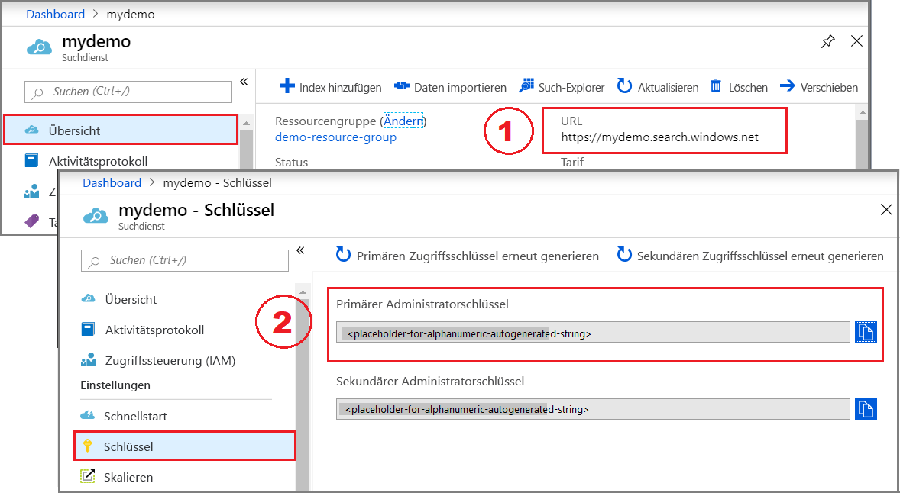
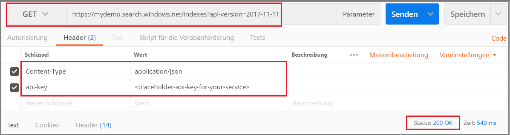
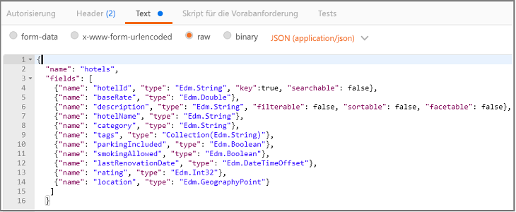
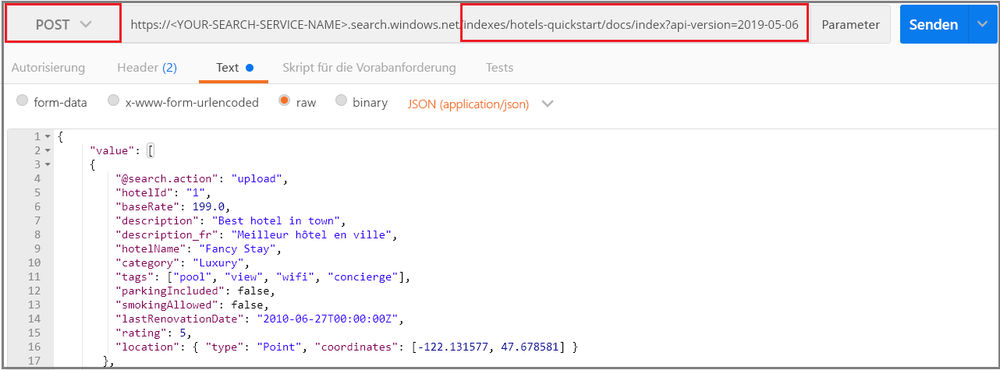
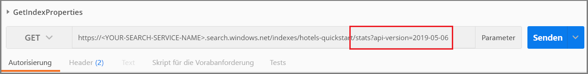

# <a name="quickstart-create-an-azure-cognitive-search-index-in-postman-using-rest-apis"></a>Schnellstart: Erstellen eines Azure Cognitive Search-Index in Postman mit REST-APIs
> [!div class="op_single_selector"]
> * [Postman](search-get-started-postman.md)
> * [C#](search-create-index-dotnet.md)
> * [Python](search-get-started-python.md)
> * [Portal](search-get-started-portal.md)
> * [PowerShell](search-howto-dotnet-sdk.md)
>*

Eine der einfachsten Möglichkeiten zum Erkunden der [Azure Cognitive Search-REST-APIs](https://docs.microsoft.com/rest/api/searchservice) besteht darin, mithilfe von Postman oder eines anderen Webtesttools HTTP-Anforderungen zu formulieren und die Antworten zu untersuchen. Mit den richtigen Tools und dieser Anleitung können Sie vor dem Schreiben von Code Anforderungen senden und Antworten anzeigen.

In diesem Artikel wird erläutert, wie Anforderungen interaktiv formuliert werden. Alternativ können [Sie eine Postman-Sammlung](https://github.com/Azure-Samples/azure-search-postman-samples/tree/master/Quickstart) herunterladen und importieren, um vordefinierte Anforderungen zu verwenden.

Wenn Sie kein Azure-Abonnement besitzen, können Sie ein [kostenloses Konto](https://azure.microsoft.com/free/?WT.mc_id=A261C142F) erstellen, bevor Sie beginnen.

## <a name="prerequisites"></a>Voraussetzungen

Für diesen Schnellstart sind die folgenden Dienste und Tools erforderlich. 

+ Die [Postman-Desktop-App](https://www.getpostman.com/) wird zum Senden von Anforderungen an Azure Cognitive Search verwendet.

+ [Erstellen Sie einen Azure Cognitive Search-Dienst](search-create-service-portal.md), oder suchen Sie in Ihrem aktuellen Abonnement [nach einem vorhandenen Dienst](https://ms.portal.azure.com/#blade/HubsExtension/BrowseResourceBlade/resourceType/Microsoft.Search%2FsearchServices). Für diesen Schnellstart können Sie einen kostenlosen Dienst verwenden. 

## <a name="get-a-key-and-url"></a>Abrufen eines Schlüssels und einer URL

Für REST-Aufrufe sind die Dienst-URL und ein Zugriffsschlüssel für jede Anforderung erforderlich. Ein Suchdienst wird mit beidem erstellt. Gehen Sie daher wie folgt vor, um die erforderlichen Informationen zu erhalten, falls Sie Azure Cognitive Search Ihrem Abonnement hinzugefügt haben:

1. [Melden Sie sich beim Azure-Portal an](https://portal.azure.com/), und rufen Sie auf der Seite **Übersicht** Ihres Suchdiensts die URL ab. Ein Beispiel für einen Endpunkt ist `https://mydemo.search.windows.net`.

1. Rufen Sie unter **Einstellungen** > **Schlüssel** einen Administratorschlüssel ab, um Vollzugriff auf den Dienst zu erhalten. Es gibt zwei austauschbare Administratorschlüssel – diese wurden zum Zweck der Geschäftskontinuität bereitgestellt, falls Sie einen Rollover für einen Schlüssel durchführen müssen. Für Anforderungen zum Hinzufügen, Ändern und Löschen von Objekten können Sie den primären oder den sekundären Schlüssel verwenden.



Für alle an Ihren Dienst gesendeten Anforderungen ist ein API-Schlüssel erforderlich. Ein gültiger Schlüssel stellt anforderungsbasiert eine Vertrauensstellung her zwischen der Anwendung, die die Anforderung versendet, und dem Dienst, der sie verarbeitet.

## <a name="connect-to-azure-cognitive-search"></a>Herstellen einer Verbindung mit Azure Cognitive Search

Verwenden Sie in diesem Abschnitt das Webtool Ihrer Wahl, um Verbindungen mit Azure Cognitive Search einzurichten. Jedes Tool behält Anforderungsheaderinformationen für die Sitzung bei, sodass Sie den API-Schlüssel und den Inhaltstyp nur einmal eingeben müssen.

Bei beiden Tools müssen Sie einen Befehl auswählen (GET, POST, PUT usw.) und einen URL-Endpunkt angeben. Für bestimmte Aufgaben muss im Text der Anforderung auch JSON-Code angegeben werden. Setzen Sie für den Namen des Suchdiensts (YOUR-SEARCH-SERVICE-NAME) einen gültigen Wert ein. Fügen `$select=name` Sie hinzu, um nur den Namen des jeweiligen Index zurückzugeben. 

    https://<YOUR-SEARCH-SERVICE-NAME>.search.windows.net/indexes?api-version=2019-05-06&$select=name

Beachten Sie, das HTTPS-Präfix, den Namen des Diensts, den Namen eines Objekts (in diesem Fall: die Indexsammlung) und die [API-Version](search-api-versions.md). Die API-Version ist eine erforderliche Zeichenfolge in Kleinbuchstaben und wird für die aktuelle Version als `?api-version=2019-05-06` angegeben. API-Versionen werden regelmäßig aktualisiert. Wenn Sie die API-Version in jede Anforderung einfügen, haben Sie die vollständige Kontrolle darüber, welche jeweils verwendet wird.  

Der Anforderungsheader setzt sich aus dem Inhaltstyp (content-type) sowie dem API-Schlüssel (api-key) für die Authentifizierung bei Azure Cognitive Search zusammen. Ersetzen Sie den Administrator-API-Schlüssel (YOUR-AZURE-SEARCH-ADMIN-API-KEY) durch einen gültigen Wert. 

    api-key: <YOUR-AZURE-SEARCH-ADMIN-API-KEY>
    Content-Type: application/json

Formulieren Sie in Postman eine Anforderung, die wie auf dem folgenden Screenshot aussieht. Wählen Sie **GET** als Verb aus, geben Sie die URL an, und klicken Sie auf **Senden**. Dieser Befehl stellt eine Verbindung mit Azure Cognitive Search her, liest die Indexsammlung und gibt nach erfolgreicher Verbindungsherstellung den HTTP-Statuscode 200 zurück. Falls Ihr Dienst bereits über Indizes verfügt, enthält die Antwort auch Indexdefinitionen.



## <a name="1---create-an-index"></a>1\. Erstellen eines Index

In Azure Cognitive Search wird der Index für gewöhnlich vor dem Laden von Daten erstellt. Für diese Aufgabe wird die [REST-API für die Indexerstellung](https://docs.microsoft.com/rest/api/searchservice/create-index) verwendet. 

Die URL wird um den Indexnamen `hotels` erweitert.

Gehen Sie dazu in Postman wie folgt vor:

1. Ändern Sie das Verb in **PUT**.

2. Fügen Sie diese URL ein: `https://<YOUR-SEARCH-SERVICE-NAME>.search.windows.net/indexes/hotels-quickstart?api-version=2019-05-06`.

3. Geben Sie im Text der Anforderung die Indexdefinition an (den kopierbereiten Code finden Sie unten).

4. Klicken Sie auf **Send**.



### <a name="index-definition"></a>Indexdefinition

Die Feldsammlung definiert die Dokumentstruktur. Jedes Dokument muss über diese Felder verfügen, und jedes Feld muss einen Datentyp besitzen. Da Zeichenfolgenfelder in der Volltextsuche verwendet werden, kann es ratsam sein, numerische Daten in Zeichenfolgen umzuwandeln, wenn dieser Inhalt durchsuchbar sein soll.

Die Attribute im Feld bestimmen die zulässige Aktion. Die REST-APIs ermöglichen standardmäßig viele Aktionen. Beispielsweise sind alle Zeichenfolgen durchsuchbar, abrufbar, filterbar und facettierbar. Häufig müssen Sie Attribute nur festlegen, wenn Sie ein Verhalten deaktivieren möchten.

```json
{
    "name": "hotels-quickstart",  
    "fields": [
        {"name": "HotelId", "type": "Edm.String", "key": true, "filterable": true},
        {"name": "HotelName", "type": "Edm.String", "searchable": true, "filterable": false, "sortable": true, "facetable": false},
        {"name": "Description", "type": "Edm.String", "searchable": true, "filterable": false, "sortable": false, "facetable": false, "analyzer": "en.lucene"},
        {"name": "Category", "type": "Edm.String", "searchable": true, "filterable": true, "sortable": true, "facetable": true},
        {"name": "Tags", "type": "Collection(Edm.String)", "searchable": true, "filterable": true, "sortable": false, "facetable": true},
        {"name": "ParkingIncluded", "type": "Edm.Boolean", "filterable": true, "sortable": true, "facetable": true},
        {"name": "LastRenovationDate", "type": "Edm.DateTimeOffset", "filterable": true, "sortable": true, "facetable": true},
        {"name": "Rating", "type": "Edm.Double", "filterable": true, "sortable": true, "facetable": true},
        {"name": "Address", "type": "Edm.ComplexType", 
        "fields": [
        {"name": "StreetAddress", "type": "Edm.String", "filterable": false, "sortable": false, "facetable": false, "searchable": true},
        {"name": "City", "type": "Edm.String", "searchable": true, "filterable": true, "sortable": true, "facetable": true},
        {"name": "StateProvince", "type": "Edm.String", "searchable": true, "filterable": true, "sortable": true, "facetable": true},
        {"name": "PostalCode", "type": "Edm.String", "searchable": true, "filterable": true, "sortable": true, "facetable": true},
        {"name": "Country", "type": "Edm.String", "searchable": true, "filterable": true, "sortable": true, "facetable": true}
        ]
     }
  ]
}
```

Wenn Sie diese Anforderung senden, sollten Sie die Antwort „HTTP 201“ erhalten, mit der angezeigt wird, dass die Erstellung des Index erfolgreich war. Sie können diese Aktion im Portal überprüfen, aber Sie sollten berücksichtigen, dass für die Portalseite bestimmte Aktualisierungsintervalle gelten. Es kann also ein oder zwei Minuten dauern, bis alles angezeigt wird.

> [!TIP]
> Falls Sie eine "HTTP 504"-Antwort erhalten, prüfen Sie, ob die URL mit HTTPS beginnt. Wenn Sie eine "HTTP 400"- oder "HTTP 404"-Antwort erhalten, prüfen Sie den Hauptteil der Anforderung auf Fehler, die durch Kopieren und Einfügen entstanden sind. "HTTP 403" deutet in der Regel auf ein Problem mit dem api-key hin (entweder ein ungültiger Schlüssel oder ein Syntaxproblem bei der Angabe des API-Schlüssels).

## <a name="2---load-documents"></a>2\. Laden von Dokumenten

Das Erstellen und das Auffüllen des Index sind separate Schritte. In Azure Cognitive Search enthält der Index alle durchsuchbaren Daten, die Sie als JSON-Dokumente bereitstellen können. Für diese Aufgabe wird die [REST-API zum Hinzufügen, Aktualisieren oder Löschen von Dokumenten](https://docs.microsoft.com/rest/api/searchservice/addupdate-or-delete-documents) verwendet. 

Die URL wird um die Sammlungen vom Typ `docs` sowie um den Vorgang `index` erweitert.

Gehen Sie dazu in Postman wie folgt vor:

1. Ändern Sie das Verb in **POST**.

2. Fügen Sie diese URL ein: `https://<YOUR-SEARCH-SERVICE-NAME>.search.windows.net/indexes/hotels-quickstart/docs/index?api-version=2019-05-06`.

3. Geben Sie die JSON-Dokumente im Text der Anforderung an (kopierbereiten Code finden Sie unten).

4. Klicken Sie auf **Send**.



### <a name="json-documents-to-load-into-the-index"></a>JSON-Dokumente, die in den Index geladen werden sollen

Der Anforderungstext enthält vier Dokumente, die zum Index "hotels" hinzugefügt werden sollen.

```json
{
    "value": [
    {
    "@search.action": "upload",
    "HotelId": "1",
    "HotelName": "Secret Point Motel",
    "Description": "The hotel is ideally located on the main commercial artery of the city in the heart of New York. A few minutes away is Time's Square and the historic centre of the city, as well as other places of interest that make New York one of America's most attractive and cosmopolitan cities.",
    "Category": "Boutique",
    "Tags": [ "pool", "air conditioning", "concierge" ],
    "ParkingIncluded": false,
    "LastRenovationDate": "1970-01-18T00:00:00Z",
    "Rating": 3.60,
    "Address": 
        {
        "StreetAddress": "677 5th Ave",
        "City": "New York",
        "StateProvince": "NY",
        "PostalCode": "10022",
        "Country": "USA"
        } 
    },
    {
    "@search.action": "upload",
    "HotelId": "2",
    "HotelName": "Twin Dome Motel",
    "Description": "The hotel is situated in a  nineteenth century plaza, which has been expanded and renovated to the highest architectural standards to create a modern, functional and first-class hotel in which art and unique historical elements coexist with the most modern comforts.",
    "Category": "Boutique",
    "Tags": [ "pool", "free wifi", "concierge" ],
    "ParkingIncluded": false,
    "LastRenovationDate": "1979-02-18T00:00:00Z",
    "Rating": 3.60,
    "Address": 
        {
        "StreetAddress": "140 University Town Center Dr",
        "City": "Sarasota",
        "StateProvince": "FL",
        "PostalCode": "34243",
        "Country": "USA"
        } 
    },
    {
    "@search.action": "upload",
    "HotelId": "3",
    "HotelName": "Triple Landscape Hotel",
    "Description": "The Hotel stands out for its gastronomic excellence under the management of William Dough, who advises on and oversees all of the Hotel’s restaurant services.",
    "Category": "Resort and Spa",
    "Tags": [ "air conditioning", "bar", "continental breakfast" ],
    "ParkingIncluded": true,
    "LastRenovationDate": "2015-09-20T00:00:00Z",
    "Rating": 4.80,
    "Address": 
        {
        "StreetAddress": "3393 Peachtree Rd",
        "City": "Atlanta",
        "StateProvince": "GA",
        "PostalCode": "30326",
        "Country": "USA"
        } 
    },
    {
    "@search.action": "upload",
    "HotelId": "4",
    "HotelName": "Sublime Cliff Hotel",
    "Description": "Sublime Cliff Hotel is located in the heart of the historic center of Sublime in an extremely vibrant and lively area within short walking distance to the sites and landmarks of the city and is surrounded by the extraordinary beauty of churches, buildings, shops and monuments. Sublime Cliff is part of a lovingly restored 1800 palace.",
    "Category": "Boutique",
    "Tags": [ "concierge", "view", "24-hour front desk service" ],
    "ParkingIncluded": true,
    "LastRenovationDate": "1960-02-06T00:00:00Z",
    "Rating": 4.60,
    "Address": 
        {
        "StreetAddress": "7400 San Pedro Ave",
        "City": "San Antonio",
        "StateProvince": "TX",
        "PostalCode": "78216",
        "Country": "USA"
        }
    }
  ]
}
```

Innerhalb weniger Sekunden sollten Sie eine HTTP 201-Antwort in der Sitzungsliste sehen. Dies bedeutet, dass die Dokumente erfolgreich erstellt wurden. 

Falls Sie eine 207-Antwort erhalten, ist der Upload von mindestens einem Dokument fehlgeschlagen. Wenn Sie eine 404-Antwort erhalten, ist entweder im Header oder im Text der Anforderung ein Syntaxfehler enthalten: Vergewissern Sie sich, dass Sie den Endpunkt so geändert haben, dass er `/docs/index` enthält.

> [!Tip]
> Für ausgewählte Datenquellen können Sie als Alternative auch den *Indexer*-Ansatz verwenden, bei dem die für die Indizierung erforderliche Menge an Code vereinfacht und reduziert wird. Weitere Informationen finden Sie unter [Indexer operations](https://docs.microsoft.com/rest/api/searchservice/indexer-operations) (Indexer-Vorgänge).


## <a name="3---search-an-index"></a>3\. Durchsuchen eines Index

Nachdem Sie einen Index erstellt und Dokumente geladen haben, können Sie nun über die [Search Documents-REST-API](https://docs.microsoft.com/rest/api/searchservice/search-documents) Abfragen ausführen.

Die URL wird um einen Abfrageausdruck erweitert, der unter Verwendung des Suchoperators angegeben wird.

Gehen Sie dazu in Postman wie folgt vor:

1. Ändern Sie das Verb in **GET**.

2. Fügen Sie diese URL ein: `https://<YOUR-SEARCH-SERVICE-NAME>.search.windows.net/indexes/hotels-quickstart/docs?search=*&$count=true&api-version=2019-05-06`.

3. Klicken Sie auf **Send**.

Diese Abfrage ist leer und gibt die Anzahl der Dokumente in den Suchergebnissen zurück. Die Anforderung und die Antwort sollten für Postman in etwa wie im folgenden Screenshot aussehen, nachdem Sie auf **Send** (Senden) geklickt haben. Der Statuscode sollte 200 lauten.

 

Probieren Sie einige andere Abfragebeispiele aus, um ein Gefühl für die Syntax zu bekommen. Sie können eine Zeichenfolgensuche oder wörtliche $filter-Abfragen durchführen, die Ergebnisse eingrenzen, den Bereich auf bestimmte Felder beschränken usw.

Ersetzen Sie die aktuelle URL durch die folgenden URLs, und klicken Sie jedes Mal auf **Senden**, um die Ergebnisse anzuzeigen.

```
# Query example 1 - Search on restaurant and wifi
# Return only the HotelName, Description, and Tags fields
https://<YOUR-SEARCH-SERVICE>.search.windows.net/indexes/hotels-quickstart/docs?search=restaurant wifi&$count=true&$select=HotelName,Description,Tags&api-version=2019-05-06

# Query example 2 - Apply a filter to the index to find hotels rated 4 or highter
# Returns the HotelName and Rating. Two documents match
https://<YOUR-SEARCH-SERVICE>.search.windows.net/indexes/hotels-quickstart/docs?search=*&$filter=Rating gt 4&$select=HotelName,Rating&api-version=2019-05-06

# Query example 3 - Take the top two results, and show only HotelName and Category in the results
https://<YOUR-SEARCH-SERVICE>.search.windows.net/indexes/hotels-quickstart/docs?search=boutique&$top=2&$select=HotelName,Category&api-version=2019-05-06

# Query example 4 - Sort by a specific field (Address/City) in ascending order
https://<YOUR-SEARCH-SERVICE>.search.windows.net/indexes/hotels-quickstart/docs?search=pool&$orderby=Address/City asc&$select=HotelName, Address/City, Tags, Rating&api-version=2019-05-06
```

## <a name="get-index-properties"></a>Abfragen von Indexeigenschaften
Sie können auch [Statistik abrufen](https://docs.microsoft.com/rest/api/searchservice/get-index-statistics) verwenden, um die Anzahl der Dokumente und die Indexgröße abzufragen: 

```
https://<YOUR-SEARCH-SERVICE-NAME>.search.windows.net/indexes/hotels-quickstart/stats?api-version=2019-05-06
```

Wenn Sie Ihrer URL `/stats` hinzufügen, werden Indexinformationen zurückgegeben. In Postman sollte Ihre Anforderung in etwa wie folgt aussehen, und die Antwort enthält dann eine Anzahl von Dokumenten und den belegten Speicher in Byte.

 

Beachten Sie, dass die Syntax für die API-Version hier anders ist. Verwenden Sie für diese Anforderung `?`, um die API-Version anzufügen. `?` trennt den URL-Pfad von der Abfragezeichenfolge; „&“ trennt die einzelnen Name-Wert-Paare in der Abfragezeichenfolge. Für diese Abfrage ist die API-Version das erste und einzige Element in der Abfragezeichenfolge.

## <a name="clean-up"></a>Bereinigen

Wenn Sie in Ihrem eigenen Abonnement arbeiten, sollten Sie sich am Ende eines Projekts überlegen, ob Sie die erstellten Ressourcen noch benötigen. Ressourcen, die weiterhin ausgeführt werden, können Sie Geld kosten. Sie können entweder einzelne Ressourcen oder aber die Ressourcengruppe löschen, um den gesamten Ressourcensatz zu entfernen.

Ressourcen können im Portal über den Link **Alle Ressourcen** oder **Ressourcengruppen** im linken Navigationsbereich gesucht und verwaltet werden.

Denken Sie bei Verwendung eines kostenlosen Diensts an die Beschränkung auf maximal drei Indizes, Indexer und Datenquellen. Sie können einzelne Elemente über das Portal löschen, um unter dem Limit zu bleiben. 

## <a name="next-steps"></a>Nächste Schritte

Nun wissen Sie, wie Sie grundlegende Aufgaben ausführen, und können mit weiteren REST-API-Aufrufen fortfahren, um sich komplexere Features wie Indexer anzusehen oder [eine Cognitive Search-Pipeline einzurichten](cognitive-search-tutorial-blob.md). Als nächsten Schritt empfehlen wir den folgenden Link:

> [!div class="nextstepaction"]
> [REST-Tutorial: Indizieren und Durchsuchen von teilweise strukturierten Daten (JSON-Blobs) in Azure Cognitive Search](search-semi-structured-data.md)
