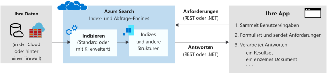

# Was ist Azure Cognitive Search?

Azure Cognitive Search ([ehemals „Azure Search“](whats-new.md#new-service-name)) ist eine Search-as-a-Service-Cloudlösung, die Entwicklern APIs und Tools zum Hinzufügen von umfangreichen Suchfunktionen für private, heterogene Inhalte in Web- und Unternehmensanwendungen sowie in mobilen Anwendungen bietet. Ihr Code oder ein Tool ruft die Datenerfassung (Indizierung) auf, um einen Index zu erstellen und zu laden. Optional können Sie kognitive Qualifikationen zum Anwenden von KI-Prozessen während der Indizierung hinzufügen. Dadurch können neue Informationen und Strukturen hinzugefügt werden, die nützlich für die Suche und andere Szenarien sind.

Auf der anderen Seite des Diensts gibt Ihr Anwendungscode Abfrageanforderungen aus und verarbeitet Antworten. Das Suchverhalten ist mit Funktionen aus Azure Cognitive Search in Ihrem Client definiert, und Abfragen werden in einem permanenten Index ausgeführt, den Sie erstellen, besitzen und in Ihrem Dienst speichern.

Die Funktionalität wird über eine einfache [REST-API](/rest/api/searchservice/) oder ein [.NET SDK](search-howto-dotnet-sdk.md) bereitgestellt, sodass die inhärente Komplexität des Informationsabrufs verborgen bleibt. Zusätzlich zu den APIs bietet das Azure-Portal mit Tools für die Prototyperstellung und Indexabfrage Unterstützung für Administration und Inhaltsverwaltung. Da der Dienst in der Cloud ausgeführt wird, werden die Infrastruktur und Verfügbarkeit von Microsoft verwaltet.

## Einsatzgebiete von Azure Cognitive Search

Azure Cognitive Search eignet sich sehr gut für die folgenden Anwendungsszenarien:

+ Konsolidierung von heterogenen Inhaltstypen in einem einzelnen privaten, durchsuchbaren Index. Abfragen erfolgen immer in einem Index, den Sie erstellen und in den Sie Dokumente laden. Der Index befindet sich immer in der Cloud in Ihrem Azure Cognitive Search-Dienst. Sie können einen Index mit Streams aus JSON-Dokumenten aus jeder beliebigen Quelle und von jeder beliebigen Plattform auffüllen. Bei Inhalten, die aus Azure stammen, können Sie alternativ dazu einen *Indexer* verwenden, um Daten per Pull in einen Index abzurufen. Die Definition sowie die Verwaltung bzw. der Besitz eines Index sind die Hauptgründe für die Verwendung von Azure Cognitive Search.

+ Bei unformatiertem Inhalt handelt es sich um große Mengen von undifferenziertem Text oder um Bild- und Anwendungsdateien, etwa Office-Inhaltstypen in einer Azure-Datenquelle wie Azure Blob Storage oder Cosmos DB. Sie können während der Indizierung kognitive Qualifikationen anwenden, um Struktur hinzuzufügen oder aussagekräftige Informationen aus Image- und Anwendungsdateien zu gewinnen.

+ Einfache Implementierung von Features in Zusammenhang mit der Suche. Azure Cognitive Search-APIs vereinfachen Abfrageerstellung, Facettennavigation, Filter (einschließlich geografisch-räumlicher Suche), Synonymzuordnung, Abfragen mit automatischer Vervollständigung sowie die Optimierung der Relevanz. Mithilfe von integrierten Features können Sie die Erwartungen von Endbenutzern an einen Suchdienst erfüllen, der der Funktionalität von kommerziellen Suchmaschinen in nichts nachsteht.

+ Indizieren unstrukturierter Texte oder Extrahieren von Text und anderen Informationen aus Bilddateien. Das Feature für die [KI-Anreicherung](cognitive-search-concept-intro.md) von Azure Cognitive Search ergänzt die Indizierungspipeline um die Verarbeitung von KI-Funktionen. Einige häufige Anwendungsfälle: OCR in gescannten Dokumenten, Erkennen von Entitäten und Extrahieren von Schlüsselbegriffen in großen Dokumenten, Spracherkennung und Textübersetzung sowie Stimmungsanalyse.

+ Erfüllen von linguistischen Anforderungen dank der benutzerdefinierten Sprachanalysefunktionen von Azure Cognitive Search. Bei nicht englischsprachigen Inhalten unterstützt Azure Cognitive Search sowohl Lucene-Analysetools als auch die Microsoft-Prozessoren für die Verarbeitung natürlicher Sprache. Sie können Analysetools auch so konfigurieren, dass Rohdaten einer speziellen Verarbeitung unterzogen werden, um z.B. diakritische Zeichen herauszufiltern.

## Beschreibung der Funktionen

| Kernsuche&nbsp;&nbsp;&nbsp;&nbsp;&nbsp;&nbsp;&nbsp;&nbsp;&nbsp;&nbsp;&nbsp;&nbsp;&nbsp;&nbsp;&nbsp;&nbsp;&nbsp;&nbsp;&nbsp;&nbsp;&nbsp;&nbsp;&nbsp;&nbsp;&nbsp;  | Features |
|-------------------|----------|
|Freiform-Textsuche | [**Volltextsuche**](search-lucene-query-architecture.md) ist für die meisten Apps auf Suchbasis ein primärer Anwendungsfall. Abfragen können mit einer unterstützten Syntax formuliert werden.   Die [**einfache Abfragesyntax**](query-simple-syntax.md) bietet die logischen Operatoren, Operatoren für die Suche von Ausdrücken, Suffixoperatoren und Rangfolgenoperatoren.  Die [**Lucene-Abfragesyntax**](query-lucene-syntax.md) enthält alle Vorgänge in einfacher Syntax mit Erweiterungen für Fuzzysuche, NEAR-Suche, Term Boosting und reguläre Ausdrücke.|
| Relevance | Ein zentraler Vorteil von Azure Cognitive Search ist die [**einfache Bewertung**](index-add-scoring-profiles.md). Anhand von Bewertungsprofilen kann die Relevanz als Funktion der Werte in den Dokumenten selbst modelliert werden. Beispielsweise kann es wünschenswert sein, dass neuere Produkte oder herabgesetzte Produkte in den Suchergebnissen weiter oben angezeigt werden. Sie können Bewertungsprofile auch mithilfe von Tags für eine personalisierte Bewertung erstellen, die auf den Sucheinstellungen der Kunden basiert, die Sie nachverfolgt und separat gespeichert haben. |
| Geografische Suche | Azure Cognitive Search bietet Verarbeitung, Filterung und Anzeige geografischer Standorte. Mit Azure Search können die Benutzer Daten auf der Grundlage der Nähe eines Suchergebnisses zu einem physischen Ort untersuchen. [In diesem Video](https://channel9.msdn.com/Shows/Data-Exposed/Azure-Search-and-Geospatial-Data) oder [in diesem Beispiel](https://github.com/Azure-Samples/search-dotnet-asp-net-mvc-jobs) erfahren Sie mehr. |
| Filter und Facets | Die [**Facettennavigation**](search-faceted-navigation.md) wird über einen einzigen Abfrageparameter aktiviert. Azure Cognitive Search gibt eine Struktur für die Facettennavigation zurück, die Sie als Code hinter einer Kategorieliste für eine selbstgesteuerte Filterung nutzen können (etwa, um Katalogartikel nach Preisbereich oder Marke zu filtern).    [**Filter**](query-odata-filter-orderby-syntax.md) ermöglichen die Integration einer Facettennavigation in die Benutzeroberfläche Ihrer Anwendung, die Erweiterung von Abfrageformulierungen sowie die Filterung auf der Grundlage von Kriterien von Benutzern oder Entwicklern. Erstellen Sie Filter mithilfe der OData-Syntax. |
| Funktionen der Benutzeroberfläche | [**AutoVervollständigen**](search-autocomplete-tutorial.md) kann für Abfragen mit Textvervollständigung auf einer Suchleiste aktiviert werden.   [**Suchvorschläge**](https://docs.microsoft.com/rest/api/searchservice/suggesters) funktioniert auch mit Eingaben von Textteilen in eine Suchleiste, jedoch werden die Ergebnisse als tatsächliche Dokumente in Ihrem Index dargestellt und nicht als Abfragebegriffe.   [**Synonyme**](search-synonyms.md) ordnen entsprechende Begriffe zu, die den Bereich einer Abfrage implizit erweitern, ohne dass der Benutzer die alternativen Begriffe bereitstellen muss.   Mit der [**Treffermarkierung**](https://docs.microsoft.com/rest/api/searchservice/Search-Documents) wird eine Textformatierung auf ein übereinstimmendes Schlüsselwort in den Suchergebnissen angewendet. Sie können auswählen, für welche Felder hervorgehobene Ausschnitte zurückgegeben werden sollen.  Eine [**Sortierung**](https://docs.microsoft.com/rest/api/searchservice/Search-Documents) wird über das Indexschema für mehrere Felder bereitgestellt und dann zur Abfragezeit mit einem einzelnen Suchparameter umgeschaltet.   Dank der fein abgestimmten Steuerung, die Azure Cognitive Search für Ihre Suchergebnisse bietet, sind [**Paginierung**](search-pagination-page-layout.md) und Drosselung Ihrer Suchergebnisse kein Problem.    |

| KI-Anreicherung&nbsp;&nbsp;&nbsp;&nbsp;&nbsp;&nbsp;&nbsp;&nbsp;&nbsp;&nbsp;&nbsp;&nbsp;       | Features |
|-------------------|----------|
|Durch KI angereicherte Dokumente | [**KI-Anreicherung**](cognitive-search-concept-intro.md) für Bild- und Textanalyse kann auf eine Indizierungspipeline angewandt werden, um Textinformationen aus Rohdateninhalten zu extrahieren. Zu den [integrierten Skills](cognitive-search-predefined-skills.md) zählen beispielsweise die optische Zeichenerkennung (ermöglicht das Durchsuchen gescannter JPEG-Dateien), die Entitätserkennung (Ermitteln einer Organisation, eines Namens oder eines Standorts) und die Schlüsselbegriffserkennung. Sie können auch [benutzerdefinierte Skills codieren](cognitive-search-create-custom-skill-example.md) und sie an die Pipeline anfügen. |
| Gespeicherte Anreicherungen für Analyse und Nutzung| [**Wissensspeicher (Vorschauversion)** ](knowledge-store-concept-intro.md) ist eine Erweiterung zur KI-basierten Indizierung. Mit Azure Storage als Back-End können Sie Anreicherungen speichern, die während der Indizierung erstellt werden. Mithilfe dieser Artefakte können Sie bessere Qualifikationsgruppen entwerfen oder Formen und Strukturen aus formlosen oder nicht eindeutigen Daten erstellen. Sie können Projektionen dieser Strukturen für bestimmte Workloads oder Benutzer erstellen. Sie können die extrahierten Daten zudem direkt analysieren oder in andere Apps laden.   |

| Datenimport&nbsp; und -indizierung | Features |
|----------------------------------|----------|
| Datenquellen | Azure Cognitive Search-Indizes akzeptieren Daten aus beliebigen Quellen, sofern sie als JSON-Datenstruktur gesendet werden.    [**Indexer**](search-indexer-overview.md) automatisieren die Datenerfassung für unterstützte Azure-Datenquellen und verarbeiten die JSON-Serialisierung. Stellen Sie eine Verbindung mit [Azure SQL-Datenbank](search-howto-connecting-azure-sql-database-to-azure-search-using-indexers.md), [Azure Cosmos DB](search-howto-index-cosmosdb.md) oder [Azure Blob Storage](search-howto-indexing-azure-blob-storage.md) her, um durchsuchbare Inhalte in primären Datenspeichern zu extrahieren. Azure Blob-Indexer können zum [Extrahieren von Text aus gängigen Dateiformaten](search-howto-indexing-azure-blob-storage.md), wie z.B. Microsoft Office-, PDF- und HTML-Dokumente, eine *Funktion zum Knacken von Dokumenten* ausführen. |
| Hierarchische und geschachtelte Datenstrukturen | Mit [**komplexen Typen**](search-howto-complex-data-types.md) und Sammlungen können Sie praktisch jede Art von JSON-Struktur als Azure Cognitive Search-Index modellieren. Die Eins-zu-viele- und Viele-zu-viele-Kardinalität kann über Sammlungen, komplexe Typen und Sammlungen von komplexen Typen nativ ausgedrückt werden.|
| Linguistische Analyse | Analysemodule sind Komponenten, die für die Textverarbeitung während Indizierungs- und Suchvorgängen eingesetzt werden. Es gibt zwei Arten.   [**Benutzerdefinierte lexikalische Analysen**](index-add-custom-analyzers.md) werden für komplexe Suchabfragen mit phonetischem Abgleich und regulären Ausdrücken verwendet.   [**Sprachanalysen**](index-add-language-analyzers.md) von Lucene oder Microsoft werden verwendet, um sprachspezifische linguistische Probleme intelligent lösen zu können, z.B. Zeiten von Verben, Geschlecht, unregelmäßiger Plural von Substantiven (z.B. in Englisch: mouse/mice), Auflösen von zusammengesetzten Wörtern, Worttrennung (für Sprachen ohne Leerstellen) und vieles mehr.   |

| Plattformebene&nbsp;&nbsp;&nbsp;&nbsp;&nbsp;&nbsp;&nbsp;&nbsp;&nbsp;&nbsp;&nbsp;&nbsp;&nbsp;&nbsp;| Features |
|-------------------|----------|
| Tools für Prototyperstellung und Überprüfung | Im Portal können Sie den [**Datenimport-Assistenten**](search-import-data-portal.md) zum Konfigurieren von Indexern, den Index-Designer zum Einrichten eines Index und den [**Suchexplorer**](search-explorer.md) zum Testen von Abfragen und Optimieren von Bewertungsprofilen verwenden. Sie können außerdem einen beliebigen Index öffnen, um sein Schema anzuzeigen. |
| Überwachung und Diagnose | Durch [**Aktivieren der Überwachungsfunktionen**](search-monitor-usage.md) können neben den Metriken, die im Portal immer angezeigt werden, zusätzliche Metriken verwendet werden. Metriken zu Abfragen pro Sekunde, Latenz und Drosselung werden erfasst und in Portalseiten protokolliert, ohne dass hierzu eine zusätzliche Konfiguration erforderlich ist.|
| Serverseitige Verschlüsselung | Die [**von Microsoft verwaltete Verschlüsselung ruhender Daten**](search-security-overview.md#encrypted-transmission-and-storage) ist in der internen Speicherebene integriert und unwiderruflich. Optional können Sie die Standardverschlüsselung durch [**von Kunden verwaltete Verschlüsselungsschlüssel (Vorschauversion)** ](search-security-manage-encryption-keys.md) ergänzen. Mithilfe von Schlüsseln, die Sie in Azure Key Vault erstellen und verwalten, können Indizes und Synonymzuordnungen in Azure Cognitive Search verschlüsselt werden. |
| Infrastruktur | Die **hoch verfügbare Plattform** macht den Suchdienst äußerst zuverlässig. [Azure Cognitive Search bietet eine SLA von 99,9 Prozent](https://azure.microsoft.com/support/legal/sla/search/v1_0/) (bei ordnungsgemäßer Skalierung).   Azure Cognitive Search ist eine **vollständig verwaltete und skalierbare** End-to-End-Lösung, für die keinerlei Infrastrukturverwaltungsaufwand anfällt. Eine zweidimensionale Skalierung ermöglicht die Anpassung des Diensts an Ihre Anforderungen, um mehr Dokumentspeicher, ein höheres Abfrageaufkommen oder beides zu bewältigen.  |

## Verwendung von Azure Cognitive Search
### Schritt 1: Bereitstellen des Diensts
Einen Azure Cognitive Search-Dienst können Sie entweder über das [Azure-Portal](https://portal.azure.com/) oder die [Azure-Ressourcenverwaltungs-API](/rest/api/searchmanagement/) bereitstellen. Sie können entweder den gemeinsam mit anderen Abonnenten genutzten kostenlosen Dienst auswählen oder eine [kostenpflichtige Ebene](https://azure.microsoft.com/pricing/details/search/), die Ressourcen zur ausschließlichen Nutzung für Ihren Dienst reserviert. Für kostenpflichtige Ebenen können Sie einen Dienst in zwei Dimensionen skalieren: 

- Fügen Sie Replikate hinzu, um Ihre Kapazität zum Verarbeiten intensiver Abfragelasten zu erweitern.   
- Fügen Sie Partitionen hinzu, um den Speicher für weitere Dokumente zu vergrößern. 

Durch getrenntes Verarbeiten von Dokumentspeicherung und Abfragedurchsatz können Sie Ressourcen auf Produktionsanforderungen basierend kalibrieren.

### Schritt 2: Erstellen des Index
Bevor Sie durchsuchbaren Inhalt hochladen können, müssen Sie einen Azure Cognitive Search-Index definieren. Einen Index können Sie sich wie eine Datenbanktabelle vorstellen, die Ihre Daten enthält und Suchabfragen entgegennimmt. Sie definieren das zuzuordnende Indexschema, um die Struktur der Dokumente widerzuspiegeln, die Sie durchsuchen möchten (ähnlich wie bei Feldern in einer Datenbank).

Ein Schema kann im Azure-Portal oder programmgesteuert mithilfe des [.NET SDK](search-howto-dotnet-sdk.md) oder der [REST-API](/rest/api/searchservice/) erstellt werden.

### Schritt 3: Laden von Daten
Nachdem Sie einen Index definiert haben, können Sie Inhalte hochladen. Sie können entweder ein Push- oder Pullmodell verwenden.

Das Pullmodell ruft Daten aus externen Datenquellen ab. Es wird durch *Indexer* unterstützt, die Aspekte der Erfassung von Daten, z.B. Herstellen einer Verbindung mit Daten, Lesen und Serialisieren von Daten optimieren und automatisieren. [Indexer](/rest/api/searchservice/Indexer-operations) stehen für Azure Cosmos DB, Azure SQL-Datenbank, Azure Blob Storage und von SQL Server gehosteten Instanzen auf einem Azure-VM zur Verfügung. Sie können einen Indexer für bedarfsgesteuerte oder geplante Datenaktualisierung konfigurieren.

Das Pushmodell wird über das SDK oder die REST-APIs bereitgestellt, die zum Senden von aktualisierten Dokumenten an einen Index verwendet werden. Sie können Daten aus praktisch jedem Dataset mit JSON-Format übertragen. Anleitungen zum Laden von Daten finden Sie unter [Hinzufügen, Aktualisieren oder Löschen von Dokumenten](/rest/api/searchservice/addupdate-or-delete-documents) oder [Verwenden des .NET SDK](search-howto-dotnet-sdk.md).

### Schritt 4: Suchen,
Nach dem Füllen eines Indexes können Sie über einfache HTTP-Anforderungen mit der [REST-API](/rest/api/searchservice/Search-Documents) oder dem [.NET-SDK](https://docs.microsoft.com/dotnet/api/microsoft.azure.search.idocumentsoperations) [Suchabfragen](search-query-overview.md) an Ihren Dienstendpunkt richten.

Führen Sie die Schritte zum [Erstellen Ihrer ersten Such-App](tutorial-csharp-create-first-app.md) aus, um eine Webseite zu erstellen und anschließend zu erweitern, die Benutzereingaben sammelt und Ergebnisse verarbeitet. Sie können auch [Postman für interaktive REST-Aufrufe](search-get-started-postman.md) oder den integrierten [Suchexplorer](search-explorer.md) im Azure-Portal verwenden, um einen vorhandenen Index abzufragen.

## Im Vergleich

Kunden interessieren sich häufig für einen Vergleich von Azure Cognitive Search mit anderen Suchlösungen. Die wesentlichen Unterschiede sind in der folgenden Tabelle zusammengefasst.

| Im Vergleich zu | Wesentliche Unterschiede |
|-------------|-----------------|
|Bing | Die [Bing-Websuche-API](https://docs.microsoft.com/azure/cognitive-services/bing-web-search/) durchsucht die Indizes auf „Bing.com“ nach Übereinstimmungen mit Begriffen, die Sie übermitteln. Die Indizes werden auf der Basis von HTML- und XML-Seiten sowie anderer Webinhalte aus öffentlich zugänglichen Websites erstellt. Die [benutzerdefinierte Bing-Suche](https://docs.microsoft.com/azure/cognitive-services/bing-custom-search/) basiert auf der gleichen Grundlage und bietet die gleiche Crawlertechnologie für Webinhaltstypen beschränkt auf einzelne Websites.  Azure Cognitive Search durchsucht einen von Ihnen definierten Index, der mit Ihren Daten und Dokumenten (häufig aus verschiedenen Quellen) gefüllt ist. Azure Cognitive Search verfügt über Crawlerfunktionen für einige Datenquellen über [Indexer](search-indexer-overview.md), aber Sie können jedes JSON-Dokument, das Ihrem Indexschema entspricht, mittels Pushübertragung in eine einzelne, konsolidierte durchsuchbare Ressource übertragen. |
|Datenbanksuche | Zahlreiche Systemplattformen umfassen eine integrierte Suchfunktion. SQL Server verfügt über eine [Volltextsuche](https://docs.microsoft.com/sql/relational-databases/search/full-text-search). Cosmos DB und ähnliche Technologien verfügen über abfragbare Indizes. Bei der Beurteilung von Produkten, die Suche und Speicher kombinieren, kann die Entscheidung eine Herausforderung darstellen. Viele Lösungen verwenden beides: DBMS als Speicher und Azure Cognitive Search für spezialisierte Suchfunktionen.  Im Vergleich zur DBMS-Suche speichert Azure Cognitive Search Inhalt aus heterogenen Quellen und bietet spezialisierte Textverarbeitungsfunktionen wie z. B. linguistikbasierte Textverarbeitung (Wortstammerkennung, Lemmatisierung, Wortformen) in [56 Sprachen](https://docs.microsoft.com/rest/api/searchservice/language-support). Der Dienst unterstützt auch die Autokorrektur falsch geschriebener Wörter, [Synonyme](https://docs.microsoft.com/rest/api/searchservice/synonym-map-operations), [Vorschläge](https://docs.microsoft.com/rest/api/searchservice/suggestions), [Bewertungssteuerelemente](https://docs.microsoft.com/rest/api/searchservice/add-scoring-profiles-to-a-search-index), [Facets](https://docs.microsoft.com/azure/search/search-filters-facets) und [benutzerdefinierte Tokenisierung](https://docs.microsoft.com/rest/api/searchservice/custom-analyzers-in-azure-search). Das [Volltext-Suchmodul](search-lucene-query-architecture.md) in Azure Cognitive Search basiert auf Apache Lucene, einem Branchenstandard für den Informationsabruf. Azure Cognitive Search speichert Daten zwar in Form eines invertierten Index, ist jedoch nur selten ein Ersatz für echte Datenspeicher. Weitere Informationen finden Sie in diesem [Forumsbeitrag](https://stackoverflow.com/questions/40101159/can-azure-search-be-used-as-a-primary-database-for-some-data).   Die Ressourcenverwendung ist ein weiterer Wendepunkt in dieser Kategorie. Die Indizierung und einige Abfragevorgänge sind häufig rechenintensiv. Die Abladung der Suche vom DBMS auf eine dedizierte Lösung in der Cloud hält Systemressourcen für die Verarbeitung von Transaktionen frei. Wenn Sie die Suche nach außen verlagern, können Sie außerdem problemlos Ihrem Abfragevolumen gemäß skalieren.|
|Dedizierte Suchlösung | Wenn Sie sich für eine dedizierte Suche mit voller Funktionalität entschieden haben, erfolgt der endgültige Vergleich letztendlich zwischen einer lokalen Lösung und einem Cloud-Dienst. Viele Suchtechnologien bieten Kontrolle über Indizierungs- und Abfragepipelines, Zugriff auf umfangreichere Abfrage- und Filtersyntax, Kontrolle über Rangfolge und Relevanz sowie Funktionen für selbstgesteuerte und intelligente Suche.   Ein Clouddienst ist die richtige Wahl, wenn Sie eine sofort einsetzbare Lösung mit minimalem Aufwand, minimaler Wartung und anpassbarer Skalierung wünschen.   Innerhalb des Cloudparadigmas bieten einige Anbieter vergleichbare Basisfunktionen mit Volltextsuche, geografischer Suche und der Möglichkeit zur Verarbeitung einer gewissen Ungenauigkeit bei der Sucheingabe. Das passende Suchmodul ergibt sich in der Regel durch ein [spezialisiertes Feature](#feature-drilldown) oder durch die Benutzerfreundlichkeit und Einfachheit von APIs, Tools und Verwaltungsfunktionen. |

Unter den Cloudanbietern eignet Azure Cognitive Search sich am besten für die Volltextsuche in Inhaltsspeichern und Datenbanken in Azure, für Apps, bei denen Informationsabruf und Inhaltsnavigation primär auf der Suche basieren. 

Wichtige Vorteile umfassen:

+ Azure-Datenintegration (Crawler) auf Indexebene
+ Azure-Portal für eine zentrale Verwaltung
+ Skalierung, Zuverlässigkeit und erstklassige Verfügbarkeit von Azure
+ Dank der Verarbeitung von Rohdaten durch KI-Funktionen lassen sich die Daten besser durchsuchen – es kann beispielsweise nach Text in Bildern oder nach Mustern in unstrukturierten Inhalten gesucht werden.
+ Linguistische und benutzerdefinierte Analyse, mit Analysemodulen für eine robuste Volltextsuche in 56 Sprachen
+ [Kernfeatures für auf die Suche ausgerichtete Apps](#feature-drilldown): Bewertung, Facettennavigation, Vorschläge, Synonyme, geografische Suche und mehr.

> [!Note]
> Datenquellen, die nicht aus Azure stammen, werden vollständig unterstützt, unterliegen jedoch statt Indexern einer codeintensiveren Pushmethode. Mit APIs können Sie eine beliebige JSON-Dokumentsammlung an einen Azure Cognitive Search-Index weiterreichen.

Unter unseren Kunden zählen diejenigen mit Onlinekatalogen, Branchenprogrammen und Anwendungen zur Dokumentermittlung zu denen, die am meisten von den umfassenden Features in Azure Cognitive Search profitieren.

## REST-API | .NET SDK

Auch wenn im Portal viele Aufgaben ausgeführt werden können, ist Azure Cognitive Search in erster Linie für Entwickler konzipiert, die Suchfunktionalität in vorhandene Anwendungen integrieren möchten. Folgende Programmierschnittstellen stehen zur Verfügung:

|Plattform |BESCHREIBUNG |
|-----|------------|
|[REST](/rest/api/searchservice/) | Durch eine beliebige Programmierplattform und -sprache (darunter Xamarin, Java und JavaScript) unterstützte HTTP-Befehle.|
|[.NET SDK](search-howto-dotnet-sdk.md) | Der .NET-Wrapper für die REST-API ermöglicht eine effiziente Codierung in C# und andere Sprachen für verwalteten Code, die auf das .NET Framework ausgerichtet sind. |

## Kostenlose Testversion
Azure-Abonnenten können [einen Dienst im Free-Tarif bereitstellen](search-create-service-portal.md).

Wenn Sie kein Abonnent sind, können Sie [ein kostenloses Azure-Konto eröffnen](https://azure.microsoft.com/pricing/free-trial/?WT.mc_id=A261C142F). Sie erhalten Gutschriften zum Testen kostenpflichtiger Azure-Dienste. Wenn das Guthaben aufgebraucht ist, können Sie das Konto behalten und weiterhin [kostenlose Azure-Dienste](https://azure.microsoft.com/free/) nutzen. Ihre Kreditkarte wird nur dann belastet, wenn Sie Ihre Einstellungen explizit ändern und mit der Berechnung von Gebühren einverstanden sind.

Alternativ dazu können Sie Ihre [Vorteile für MSDN-Abonnenten aktivieren](https://azure.microsoft.com/pricing/member-offers/msdn-benefits-details/?WT.mc_id=A261C142F): Ihr MSDN-Abonnement beinhaltet ein monatliches Guthaben, das Sie für zahlungspflichtige Azure-Dienste verwenden können. 

## Erste Schritte

1. Erstellen Sie einen [kostenlosen Dienst](search-create-service-portal.md). Alle Schnellstartanleitungen und Tutorials können mit dem kostenlosen Dienst abgeschlossen werden.

2. Gehen Sie das [Tutorial zum Verwenden von integrierten Tools für Indizierung und Abfragen](search-get-started-portal.md) durch. Lernen Sie wichtige Konzepte kennen, und machen Sie sich mit den im Portal bereitgestellten Informationen vertraut.

3. Verwenden Sie den Code entweder mit der .NET- oder der REST-API:

   + [Verwenden von Azure Search aus einer .NET-Anwendung](search-howto-dotnet-sdk.md) veranschaulicht den Hauptworkflow in verwaltetem Code.  
   + [Erste Schritte mit der REST-API](https://github.com/Azure-Samples/search-rest-api-getting-started) zeigt die gleichen Schritte in der REST-API. Sie können auch mit der folgenden Schnellstartanleitung REST-APIs aus Postman oder Fiddler aufrufen: [Schnellstart: Erstellen eines Azure Search-Indexes in Postman mit REST-APIs](search-get-started-postman.md).

## Video ansehen

Suchmodule sind die wichtigsten Komponenten für den Informationsabruf in mobilen Apps, im Web und in Unternehmensdatenspeichern. Azure Cognitive Search bietet Tools zum Erstellen einer Suchoberfläche, die denen großer kommerzieller Websites ähnelt.

In diesem 9-Minuten-Video von Programm-Manager Liam Cavanagh erfahren Sie, wie Ihre App von der Integration einer Suchmaschine profitieren kann. Kurze Demos behandeln Schlüsselfeatures in Azure Cognitive Search und zeigen, wie ein typischer Workflow aussieht. 

>[!VIDEO https://channel9.msdn.com/Events/Connect/2016/138/player]
 
+ Minute 0–3: Vorstellung der wichtigste Features und Anwendungsfälle.
+ Minute 3–4: Erläuterung der Dienstbereitstellung. 
+ Minute 4–6: Vorstellung des Datenimport-Assistenten zum Erstellen eines Index mithilfe des integrierten Immobilien-Beispieldatasets.
+ Minute 6–9: Vorstellung des Search-Explorers und verschiedener Abfragen.
