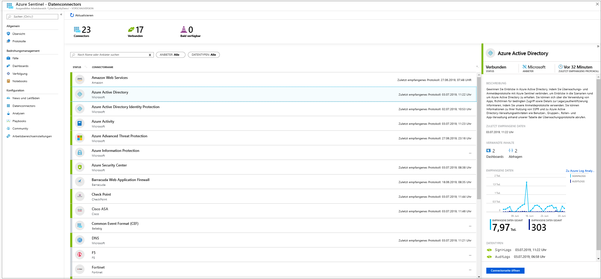
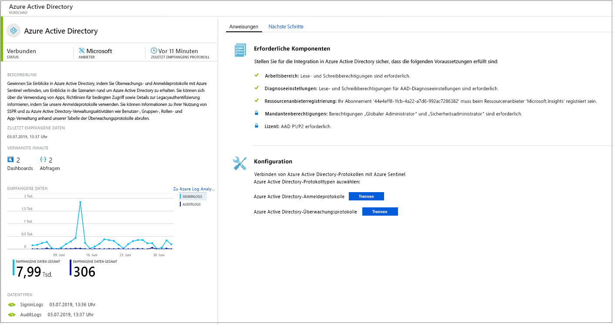
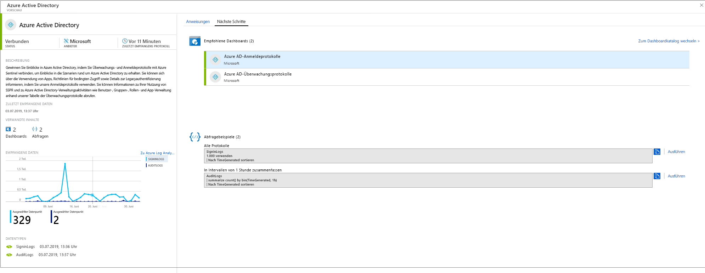

# Herstellen einer Verbindung mit Datenquellen

Zum Integrieren von Azure Sentinel müssen Sie zuerst eine Verbindung mit Ihren Datenquellen herstellen. Azure Sentinel enthält eine Reihe von Connectors für Microsoft-Lösungen, die vorkonfiguriert verfügbar sind und Echtzeitintegration bieten, u. a. für Microsoft Threat Protection-Lösungen und Microsoft 365-Quellen (darunter Office 365, Azure AD, Azure ATP, Microsoft Cloud App Security usw.). Außerdem stehen integrierte Connectors für Sicherheitslösungen von anderen Anbietern als Microsoft zur Verfügung. Sie können auch Common Event Format (CEF), Syslog oder eine REST-API verwenden, um Ihre Datenquellen mit Azure Sentinel zu verbinden.  

1. Wählen Sie im Menü die Option **Data connectors** (Datenconnectors) aus. Auf dieser Seite können Sie die gesamte Liste der von Azure Sentinel bereitstellten Connectors sowie deren Status anzeigen. Wählen Sie den gewünschten Connector für die Verbindungsherstellung und anschließend **Open connector page** (Connectorseite öffnen) aus. 

   

1. Vergewissern Sie sich auf der Seite des spezifischen Connectors, dass alle Voraussetzungen erfüllt sind, und folgen Sie anschließend der Anleitung, um die Daten mit Azure Sentinel zu verbinden. Möglicherweise dauert es etwas, bis die Protokollsynchronisierung mit Azure Sentinel beginnt. Nach erfolgreicher Verbindungsherstellung werden eine Zusammenfassung der Daten im Diagramm **Empfangene Daten** sowie der Konnektivitätsstatus der Datentypen angezeigt.

   
  
1. Klicken Sie auf die Registerkarte **Nächste Schritte**, um eine Liste mit vorgefertigten Inhalten anzuzeigen, die von Azure Sentinel für den spezifischen Datentyp bereitgestellt wird.

   
 

## Datenverbindungsmethoden

Die folgenden Datenverbindungsmethoden werden von Azure Sentinel unterstützt:

- **Microsoft-Dienste**:  Microsoft-Dienste werden nativ verbunden und nutzen die Azure-Basiskomponenten für die sofortige Integration. Die folgenden Lösungen können mit wenigen Klicks verbunden werden:
    - [Office 365](connect-office-365.md)
    - [Azure AD-Überwachungsprotokolle und -Anmeldungen](connect-azure-active-directory.md)
    - [Azure-Aktivität](connect-azure-activity.md)
    - [Azure AD Identity Protection](connect-azure-ad-Identity-protection.md)
    - [Azure Security Center](connect-azure-security-center.md)
    - [Azure Information Protection](connect-azure-information-protection.md)
    - [Azure Advanced Threat Protection](connect-azure-atp.md)
    - [Cloud App Security](connect-cloud-app-security.md)
    - [Windows-Sicherheitsereignisse](connect-windows-security-events.md) 
    - [Windows-Firewall](connect-windows-firewall.md)

- **Externe Lösungen per API**: Einige Datenquellen werden mit APIs verbunden, die von der verbundenen Datenquelle bereitgestellt werden. Normalerweise werden bei den meisten Sicherheitstechnologien verschiedene APIs bereitgestellt, über die Ereignisprotokolle abgerufen werden können. Mit den APIs wird eine Verbindung mit Azure Sentinel hergestellt, und es werden bestimmte Datentypen erfasst und an Azure Log Analytics gesendet. Per API verbundene Appliances sind:
    - [Barracuda](connect-barracuda.md)
    - [Symantec](connect-symantec.md)
- **Externe Lösungen per Agent**: Azure Sentinel kann mit allen anderen Datenquellen verbunden werden, über die Echtzeit-Protokollstreaming per Syslog-Protokoll durchgeführt werden kann, indem ein Agent verwendet wird.  Für die meisten Appliances wird das Syslog-Protokoll zum Senden von Nachrichten genutzt, die das eigentliche Protokoll und die Daten zum Protokoll enthalten. Das Format der Protokolle variiert, aber die meisten Appliances unterstützen den CEF-Standard (Common Event Format).  Der Azure Sentinel-Agent, der auf dem Log Analytics-Agent basiert, konvertiert Protokolle im CEF-Format in ein Format, das von Log Analytics erfasst werden kann. Je nach Appliancetyp wird der Agent entweder direkt auf der Appliance oder auf einem dedizierten Linux-Server installiert. Der Agent für Linux empfängt Ereignisse vom Syslog-Daemon per UDP. Falls für einen Linux-Computer aber die Erfassung einer großen Menge von Syslog-Ereignissen erwartet wird, werden diese per TCP über den Syslog-Daemon an den Agent und von dort an Log Analytics gesendet.
    - Firewalls, Proxys und Endpunkte:
        - [F5](connect-f5.md)
        - [Check Point](connect-checkpoint.md)
        - [Cisco ASA](connect-cisco.md)
        - [Fortinet](connect-fortinet.md)
        - [Palo Alto](connect-paloalto.md)
        - [Andere CEF-Appliances](connect-common-event-format.md)
        - [Andere Syslog-Appliances](connect-syslog.md)
    - DLP-Lösungen
    - [Threat Intelligence-Anbieter](connect-threat-intelligence.md)
    - [DNS-Computer](connect-dns.md): Der Agent wird direkt auf dem DNS-Computer installiert.
    - Linux-Server
    - Andere Clouds
    
## Agent-Verbindungsoptionen

Zum Verbinden Ihrer externen Appliance mit Azure Sentinel muss der Agent auf einem dedizierten Computer (VM oder lokal) bereitgestellt werden, um die Kommunikation zwischen der Appliance und Azure Sentinel zu unterstützen. Sie können den Agent automatisch oder manuell bereitstellen. Die automatische Bereitstellung ist nur verfügbar, wenn es sich bei Ihrem dedizierten Computer um einen neuen virtuellen Computer handelt, den Sie in Azure erstellen. 

Alternativ hierzu können Sie den Agent manuell auf einem vorhandenen virtuellen Azure-Computer, einem virtuellen Computer in einer anderen Cloud oder einem lokalen Computer bereitstellen.

## Zuordnen von Datentypen mit Azure Sentinel-Verbindungsoptionen

| **Datentyp** | **Herstellen einer Verbindung** | **Datenconnector** | **Kommentare** |
|------|---------|-------------|------|
| AWSCloudTrail | [Herstellen einer Verbindung mit AWS](connect-aws.md) | V | |
| AzureActivity | [Herstellen einer Verbindung mit Azure-Aktivitäten](connect-azure-activity.md) und [Übersicht über Aktivitätsprotokolle](../azure-monitor/platform/activity-logs-overview.md)| V | |
| AuditLogs | [Herstellen einer Verbindung mit Azure AD](connect-azure-active-directory.md)  | V | |
| SigninLogs | [Herstellen einer Verbindung mit Azure AD](connect-azure-active-directory.md)  | V | |
| AzureFirewall |[Azure-Diagnose](../firewall/tutorial-diagnostics.md) | V | |
| InformationProtectionLogs_CL  | [Azure Information Protection-Berichte](https://docs.microsoft.com/azure/information-protection/reports-aip) [Herstellen einer Verbindung mit Azure Information Protection](connect-azure-information-protection.md)  | V | Dabei wird in der Regel die Funktion **InformationProtectionEvents** zusätzlich zum Datentyp verwendet. Weitere Informationen finden Sie unter [Ändern der Berichte und Erstellen von benutzerdefinierten Abfragen](https://docs.microsoft.com/azure/information-protection/reports-aip#how-to-modify-the-reports-and-create-custom-queries).|
| AzureNetworkAnalytics_CL  | [Schema der Datenverkehrsanalyse](../network-watcher/traffic-analytics.md) [Datenverkehrsanalyse](../network-watcher/traffic-analytics.md)  | | |
| CommonSecurityLog  | [Herstellen einer Verbindung mit CEF](connect-common-event-format.md)  | V | |
| OfficeActivity | [Herstellen einer Verbindung mit Office 365](connect-office-365.md) | V | |
| SecurityEvents | [Herstellen einer Verbindung mit Windows-Sicherheitsereignissen](connect-windows-security-events.md)  | V | Informationen zu den Arbeitsmappen für unsichere Protokolle finden Sie unter [Einrichten einer Arbeitsmappe für unsichere Protokolle](https://blogs.technet.microsoft.com/jonsh/azure-sentinel-insecure-protocols-dashboard-setup/).  |
| syslog | [Herstellen einer Verbindung mit Syslog](connect-syslog.md) | V | |
| Microsoft Web Application Firewall (WAF) – (AzureDiagnostics) |[Herstellen einer Verbindung mit Microsoft Web Application Firewall](connect-microsoft-waf.md) | V | |
| SymantecICDx_CL | [Herstellen einer Verbindung mit Symantec](connect-symantec.md) | V | |
| ThreatIntelligenceIndicator  | [Herstellen einer Verbindung mit Threat Intelligence](connect-threat-intelligence.md)  | V | |
| VMConnection   ServiceMapComputer_CL  ServiceMapProcess_CL|  [Azure Monitor-Dienstzuordnung](../azure-monitor/insights/service-map.md) [Onboarding von Azure Monitor-VM-Insights](../azure-monitor/insights/vminsights-onboard.md)   [Aktivieren von Azure Monitor-VM-Insights](../azure-monitor/insights/vminsights-enable-overview.md)   [Verwenden von Onboarding für einen einzelnen virtuellen Computer](../azure-monitor/insights/vminsights-enable-single-vm.md)   [Verwenden von Onboarding per Richtlinie](../azure-monitor/insights/vminsights-enable-at-scale-policy.md)| X | VM Insights-Arbeitsmappe  |
| DnsEvents | [Herstellen einer Verbindung mit DNS](connect-dns.md) | V | |
| W3CIISLog | [Herstellen einer Verbindung mit IIS-Protokollen](../azure-monitor/platform/data-sources-iis-logs.md)  | X | |
| WireData | [Herstellen einer Verbindung mit Wire Data](../azure-monitor/insights/wire-data.md) | X | |
| WindowsFirewall | [Herstellen einer Verbindung mit der Windows-Firewall](connect-windows-firewall.md) | V | |
| AADIP SecurityAlert  | [Herstellen einer Verbindung mit Azure AD Identity Protection](connect-azure-ad-identity-protection.md)  | V | |
| AATP SecurityAlert  | [Herstellen einer Verbindung mit Azure ATP](connect-azure-atp.md) | V | |
| ASC SecurityAlert  | [Herstellen einer Verbindung mit Azure Security Center](connect-azure-security-center.md)  | V | |
| MCAS SecurityAlert  | [Herstellen einer Verbindung mit Microsoft Cloud App Security](connect-cloud-app-security.md)  | V | |
| SecurityAlert | | | |
| Sysmon (Ereignis) | [Herstellen einer Verbindung mit Sysmon](https://azure.microsoft.com/blog/detecting-in-memory-attacks-with-sysmon-and-azure-security-center)  [Herstellen einer Verbindung mit Windows-Ereignissen](../azure-monitor/platform/data-sources-windows-events.md)   [Sysmon-Parser herunterladen](https://github.com/Azure/Azure-Sentinel/blob/master/Parsers/SysmonParser.txt)| X | Die Sysmon-Sammlung wird auf virtuellen Computern standardmäßig nicht installiert. Weitere Informationen zum Installieren des Sysmon-Agents finden Sie unter [Sysmon](https://docs.microsoft.com/sysinternals/downloads/sysmon). |
| ConfigurationData  | [Automatisieren des VM-Bestands](../automation/automation-vm-inventory.md)| X | |
| ConfigurationChange  | [Automatisieren der VM-Nachverfolgung](../automation/change-tracking.md) | X | |
| F5 BIG-IP | [Herstellen einer Verbindung mit F5 BIG-IP](https://devcentral.f5.com/s/articles/Integrating-the-F5-BIGIP-with-Azure-Sentinel.md)  | X | |
| McasShadowItReporting  |  | X | |
| Barracuda_CL | [Herstellen einer Verbindung mit Barracuda](connect-barracuda.md) | V | |

## Nächste Schritte

- Für den Einstieg in Azure Sentinel benötigen Sie ein Microsoft Azure-Abonnement. Wenn Sie nicht über ein Abonnement verfügen, können Sie sich für ein [kostenloses Testabonnement](https://azure.microsoft.com/free/)registrieren.
- Hier erfahren Sie, wie Sie [Ihre Daten in Azure Sentinel integrieren](quickstart-onboard.md) und [Einblicke in Daten und potenzielle Bedrohungen erhalten](quickstart-get-visibility.md).
