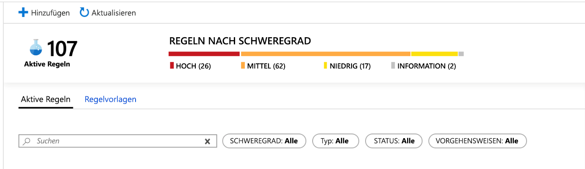
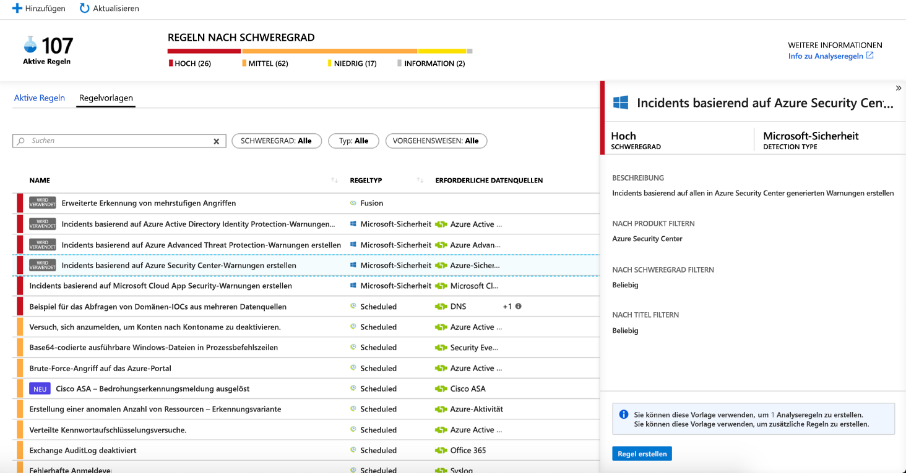
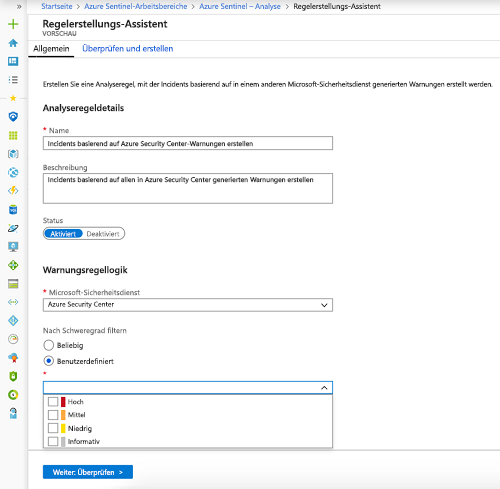
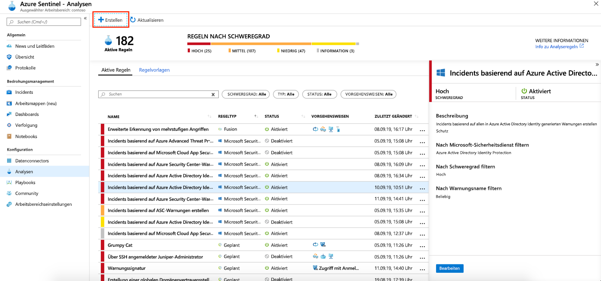
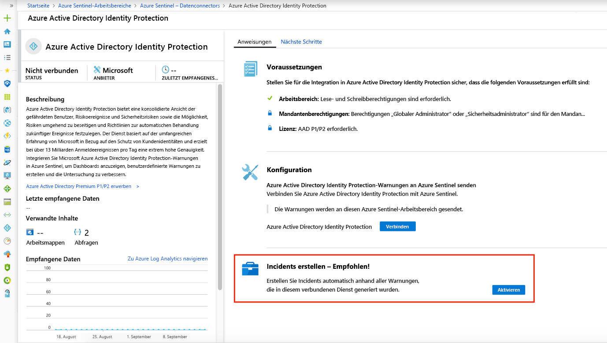

# Automatisches Erstellen von Incidents aus Microsoft-Sicherheitswarnungen

Mit Azure Sentinel in Zusammenhang stehende Warnungen, die in Microsoft-Sicherheitslösungen (z. B. Microsoft Cloud App Security und Azure Advanced Threat Protection) ausgelöst werden, erstellen nicht automatisch Incidents in Azure Sentinel. Bei der Verbindung einer Microsoft-Lösung mit Azure Sentinel werden alle in diesem Dienst generierten Warnungen standardmäßig als Rohdaten in Azure Sentinel in der Tabelle mit den Sicherheitswarnungen in Ihrem Azure Sentinel-Arbeitsbereich gespeichert. Sie können diese Daten dann wie alle anderen Rohdaten verwenden, die Sie mit Sentinel verbinden.

Sie können Azure Sentinel ganz einfach so konfigurieren, dass Incidents immer automatisch erstellt werden, wenn eine Warnung in einer verbundenen Microsoft-Sicherheitslösung ausgelöst wird. Befolgen Sie hierzu die Anweisungen in diesem Artikel.

## Voraussetzungen
Sie müssen [Microsoft-Sicherheitslösungen verbinden](connect-data-sources.md#data-connection-methods), um die Erstellung von Incidents aus Sicherheitsdienstwarnungen zu aktivieren.

## Verwenden von Analyseregeln zur Erstellung von Microsoft-Sicherheitsincidents

Verwenden Sie die in Azure Sentinel integrierten Regeln, um auszuwählen, welche verbundenen Microsoft-Sicherheitslösungen automatisch Azure Sentinel-Incidents in Echtzeit erstellen sollen. Sie können mithilfe der Regeln auch spezifischere Filteroptionen definieren und somit festlegen, welche der durch die Microsoft-Sicherheitslösung generierten Warnungen automatisch Incidents in Azure Sentinel erstellen sollen. Sie können beispielsweise festlegen, dass Azure Sentinel-Incidents automatisch nur aus Azure Security Center-Benachrichtigungen mit hohem Schweregrad erstellt werden.

1. Wählen Sie im Azure-Portal unter „Azure Sentinel“ die Option **Analytics** aus.

1. Wählen Sie die Registerkarte **Rule templates** (Regelvorlagen) aus, um alle integrierten Analyseregeln anzuzeigen.

    

1. Wählen Sie die gewünschte Regelvorlage für **Microsoft-Sicherheitsanalysen** aus, und klicken Sie auf **Regel erstellen**.

    

1. Sie können die Regeldetails ändern und die Warnungen, die Incidents erstellen, nach dem Schweregrad der Warnung oder nach Text im Namen der Warnung filtern.  
      
    Wenn Sie beispielsweise im Feld **Microsoft-Sicherheitsdienst** die Option **Azure Security Center** und im Feld  **Nach Schweregrad filtern** die Option **Hoch** auswählen, erzeugen nur Azure Security Center-Warnungen mit hohem Schweregrad automatisch Incidents in Azure Sentinel.  

    

1. Sie können ebenso eine neue **Microsoft-Sicherheitsregel** erstellen, mit der Warnungen von verschiedenen Microsoft-Sicherheitsdiensten gefiltert werden, indem Sie auf **+Erstellen** klicken und **Microsoft Incident Creation Rule** (Regel zur Erstellung von Microsoft-Incidents) auswählen.

    

  Sie können mehr als eine **Microsoft-Sicherheitsanalyseregel** pro **Microsoft-Sicherheitsdiensttyp** erstellen. Dadurch werden keine doppelten Incidents erstellt, da jede Regel als Filter verwendet wird. Auch wenn eine Warnung mit mehr als einer **Microsoft-Sicherheitsanalyseregel** übereinstimmt, wird nur ein Azure Sentinel-Incident erstellt.

## Automatisches Aktivieren der Incidentgenerierung während der Verbindung
 Wenn Sie eine Verbindung mit einer Microsoft-Sicherheitslösung herstellen, können Sie auswählen, ob die Warnungen aus der Sicherheitslösung automatisch Incidents in Azure Sentinel generieren sollen.

1. Verbinden Sie eine Microsoft-Sicherheitslösungsdatenquelle. 

   

1. Wählen Sie unter **Incidents erstellen** die Option **Aktivieren** aus, um die standardmäßige Analyseregel zu aktivieren, die automatisch Incidents aus im verbundenen Sicherheitsdienst generierten Warnungen erstellt. Anschließend können Sie diese Regel unter **Analytics** und dann unter **Aktive Regeln** bearbeiten.

## Nächste Schritte

- Für den Einstieg in Azure Sentinel benötigen Sie ein Microsoft Azure-Abonnement. Wenn Sie nicht über ein Abonnement verfügen, können Sie sich für ein [kostenloses Testabonnement](https://azure.microsoft.com/free/)registrieren.
- Hier erfahren Sie, wie Sie [Ihre Daten in Azure Sentinel integrieren](quickstart-onboard.md) und [Einblicke in Daten und potenzielle Bedrohungen erhalten](quickstart-get-visibility.md).
