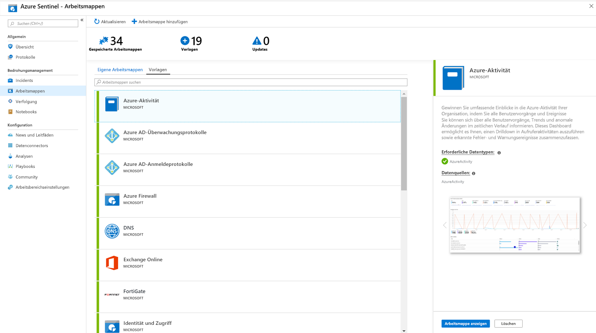

# Was ist Azure Sentinel?

Microsoft Azure Sentinel ist eine skalierbare, cloudnative Lösung für **Security Information & Event Management (SIEM)** und die **Sicherheitsorchestrierung mit automatisierter Reaktion (Security Orchestration Automated Response, SOAR)** . Azure Sentinel bietet intelligente Sicherheits- und Bedrohungsanalysen für das ganze Unternehmen und stellt eine zentrale Lösung für die Warnungs- und Bedrohungserkennung, die proaktive Suche sowie die Reaktion auf Bedrohungen bereit. 

Mit Azure Sentinel können Sie Ihr gesamtes Unternehmen sozusagen aus der Vogelperspektive beobachten und die immer komplexeren Angriffe mit Unmengen von Warnungen und lang andauernden Lösungsversuchen leichter in den Griff bekommen.

- **Sammeln Sie Daten auf Cloudebene** über alle Benutzer, Geräte, Anwendungen und Infrastrukturen hinweg, lokal und in mehreren Clouds. 

- **Ermitteln Sie bisher unentdeckte Bedrohungen**, und minimieren Sie falsch positive Ergebnisse mithilfe der Analysefunktionen und unvergleichlichen Informationen zu Bedrohungen von Microsoft. 

- **Untersuchen Sie Bedrohungen mit künstlicher Intelligenz (KI)** , und verfolgen Sie verdächtige Aktivitäten in großem Stil. Dabei profitieren Sie von der jahrelangen Erfahrung von Microsoft in Sachen Cybersicherheit. 

- **Reagieren** Sie dank der integrierten Orchestrierung und Automatisierung häufiger Aufgaben schnell auf Incidents.

Azure Sentinel beruht auf dem gesamten Spektrum bestehender Azure-Dienste und umfasst bewährte Konzepte wie Log Analytics und Logic Apps. Azure Sentinel erweitert die Untersuchung und Erkennung durch KI, bietet den Bedrohungsanalysestream von Microsoft und ermöglicht Ihnen die Verwendung eigener Bedrohungsanalysen. 

 
## Herstellen einer Verbindung mit all Ihren Daten

Zum Integrieren von Azure Sentinel müssen Sie zuerst eine [Verbindung mit Ihren Sicherheitsdatenquellen herstellen](connect-data-sources.md). Azure Sentinel enthält eine Reihe von Connectors für Microsoft-Lösungen, die vorkonfiguriert verfügbar sind und Echtzeitintegration bieten, u. a. für Microsoft Threat Protection-Lösungen und Microsoft 365-Quellen (darunter Office 365, Azure AD, Azure ATP, Microsoft Cloud App Security usw.). Außerdem stehen integrierte Connectors für Sicherheitslösungen von anderen Anbietern als Microsoft zur Verfügung. Sie können auch Common Event Format (CEF), Syslog oder eine REST-API verwenden, um Ihre Datenquellen mit Azure Sentinel zu verbinden.  

## Arbeitsmappen

Nachdem Sie Ihre  [Datenquellen mit Azure Sentinel verbunden](quickstart-onboard.md)  haben, können Sie die Daten mithilfe der Azure Sentinel-Integration, die für Vielseitigkeit bei der Erstellung benutzerdefinierter Arbeitsmappen sorgt, in Azure Monitor-Arbeitsmappen überwachen. Arbeitsmappen werden in Azure Sentinel zwar anders angezeigt werden, dennoch kann für Sie hilfreich sein, zu sehen, wie [interaktive Berichte mit Azure Monitor Arbeitsmappen erstellt werden](../azure-monitor/app/usage-workbooks.md). Azure Sentinel ermöglicht das Erstellen von benutzerdefinierten Arbeitsmappen für Ihre Daten und enthält auch integrierte Arbeitsmappenvorlagen, mit denen Sie schnell Erkenntnisse zu den Daten erhalten, sobald Sie eine Verbindung mit einer Datenquelle herstellen.

## Analytics

Um Fehlinformationen zu reduzieren und die Anzahl von Warnungen zu minimieren, die Sie überprüfen und untersuchen müssen, werden in Azure Sentinel [Warnungen mithilfe von Analysen zu Incidents korreliert](tutorial-detect-threats-built-in.md). **Incidents** sind Gruppen von verwandten Warnungen, die zusammen eine handlungsrelevante mögliche Bedrohung darstellen, die Sie untersuchen und beseitigen können. Verwenden Sie die integrierten Korrelationsregeln in unveränderter Form, oder nutzen Sie sie als Ausgangspunkt zum Erstellen eigener Regeln. Azure Sentinel bietet auch Regeln für maschinelles Lernen, mit denen Sie das Netzwerkverhalten abbilden und anschließend nach Anomalien bei Ihren Ressourcen suchen können. Diese Analysen stellen einen Zusammenhang her, indem sie zu verschiedenen Entitäten ausgegebene Warnungen mit geringer Genauigkeit zu Sicherheitsincidents mit hoher Genauigkeit kombinieren.

## Automatisierung und Orchestrierung der Sicherheit

Automatisieren Sie häufige Aufgaben, und [vereinfachen Sie die Sicherheitsorchestrierung mit Playbooks](tutorial-respond-threats-playbook.md), die sowohl in Azure-Dienste als auch Ihre vorhandenen Tools integriert werden können. Die Automatisierungs- und Orchestrierungslösung von Azure Sentinel beruht auf Azure Logic Apps. Sie bietet daher eine hochgradig erweiterbare Architektur, die eine skalierbare Automatisierung zur Berücksichtigung neuer Technologien und Bedrohungen ermöglicht. Zum Erstellen von Playbooks mit Azure Logic Apps steht Ihnen ein ständig wachsender Katalog von integrierten Playbooks zur Verfügung. Der Katalog umfasst [mehr als 200 Connectors](https://docs.microsoft.com/azure/connectors/apis-list) für Dienste wie Azure Functions. Mit den Connectors können Sie beliebige benutzerdefinierte Logik im Code, in ServiceNow, Jira, Zendesk, HTTP-Anforderungen, Microsoft Teams, Slack, Windows Defender ATP und Cloud App Security anwenden.

Wenn Sie beispielsweise das ServiceNow-Ticketsystem verwenden, können Sie Ihre Workflows mit den zur Verwendung von Azure Logic Apps verfügbaren Tools automatisieren und bei jeder Erkennung eines bestimmten Ereignisses ein Ticket in ServiceNow öffnen.

## Untersuchung

Die Azure Sentinel-Tools zur [detaillierten Untersuchung](tutorial-investigate-cases.md) befinden sich derzeit in der Vorschauphase und helfen Ihnen, den Umfang einer potenziellen Sicherheitsbedrohung zu verstehen und seine Grundursache zu ermitteln. Zum Ermitteln der Grundursache einer Bedrohung können Sie eine Entität im interaktiven Diagramm auswählen, um relevante Fragen zu stellen sowie Detailinformationen für diese Entität und ihre Verbindungen anzuzeigen. 

## Suche

Verwenden Sie die auf dem MITRE-Framework basierenden [leistungsstarken Such- und Abfragetools](hunting.md) von Azure Sentinel. Mit diesen Tools können Sie Sicherheitsbedrohungen für die Datenquellen Ihres Unternehmens proaktiv erkennen, bevor eine Warnung ausgelöst wird. Sobald Sie wissen, welche Suchabfrage wertvolle Erkenntnisse über mögliche Angriffe liefert, können Sie basierend auf der Abfrage auch benutzerdefinierte Erkennungsregeln erstellen und diese Erkenntnisse als Warnungen in Ihren Antwortdiensten für Sicherheitsincidents anzeigen. Während der Suche können Sie Lesezeichen für interessante Ereignisse erstellen. So können Sie später zu diesen Ereignissen zurückkehren, sie für andere Benutzer freigeben und mit anderen korrelierenden Ereignissen gruppieren, um einen überzeugenden Vorfall zur Untersuchung zu schaffen.

## Community

Die Azure Sentinel-Community ist eine hervorragende Ressource für die Bedrohungserkennung und Automatisierung. Die Sicherheitsanalysten von Microsoft erstellen laufend neue Arbeitsmappen, Playbooks, Suchabfragen usw., die in der Community veröffentlicht werden und Ihnen zur Verwendung in Ihrer Umgebung zur Verfügung stehen. Sie können Beispielinhalte aus dem privaten GitHub-[Repository](https://aka.ms/asicommunity) der Community herunterladen, um benutzerdefinierte Arbeitsmappen, Suchabfragen, Notebooks und Playbooks für Azure Sentinel zu erstellen. 

## Nächste Schritte

- Für den Einstieg in Azure Sentinel benötigen Sie ein Microsoft Azure-Abonnement. Wenn Sie nicht über ein Abonnement verfügen, können Sie sich für ein [kostenloses Testabonnement](https://azure.microsoft.com/free/)registrieren.
- Hier erfahren Sie, wie Sie [Ihre Daten in Azure Sentinel integrieren](quickstart-onboard.md) und [Einblicke in Daten und potenzielle Bedrohungen erhalten](quickstart-get-visibility.md).
