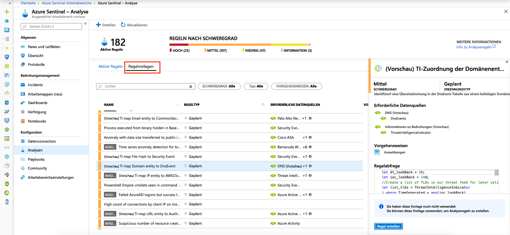

# Tutorial: Standardmäßig verfügbare Erkennung von Bedrohungen

> [!IMPORTANT]
> Die standardmäßig verfügbare Erkennung von Bedrohungen befindet sich derzeit in der öffentlichen Vorschauphase.
> Diese Funktion wird ohne Vereinbarung zum Servicelevel bereitgestellt und ist nicht für Produktionsworkloads vorgesehen.
> Weitere Informationen finden Sie unter [Zusätzliche Nutzungsbestimmungen für Microsoft Azure-Vorschauen](https://azure.microsoft.com/support/legal/preview-supplemental-terms/).

Nachdem Sie [Ihre Datenquellen mit Azure Sentinel verbunden](quickstart-onboard.md) haben, möchten Sie gewarnt werden, wenn etwas Verdächtiges geschieht. Zu diesem Zweck verfügt Azure Sentinel über integrierte Vorlagen, die bereits standardmäßig verfügbar sind. Diese Vorlagen wurden von den Sicherheitsexperten und Analysten von Microsoft basierend auf bekannten Bedrohungen, häufig verwendeten Angriffsvektoren und Eskalationsketten verdächtiger Aktivitäten entworfen. Nachdem diese Vorlagen aktiviert wurden, wird damit in Ihrer gesamten Umgebung automatisch nach allen Aktivitäten gesucht, die verdächtig erscheinen. Viele Vorlagen können so angepasst werden, dass gemäß Ihren besonderen Anforderungen nach Aktivitäten gesucht oder gefiltert werden kann. Mit den von diesen Vorlagen generierten Warnungen werden Incidents erstellt, die Sie in Ihrer Umgebung zuweisen und untersuchen können.

Dieses Tutorial unterstützt Sie bei der Erkennung von Bedrohungen mit Azure Sentinel:

> [!div class="checklist"]
> * Verwenden von standardmäßigen Erkennungen
> * Automatisieren der Reaktionen auf Bedrohungen

## Informationen zu standardmäßig verfügbaren Erkennungen

Navigieren Sie zum Anzeigen aller standardmäßig verfügbaren Erkennungen zu **Analytics** und dann zu **Regelvorlagen**. Diese Registerkarte enthält alle integrierten Azure Sentinel-Regeln.

   

Folgende Vorlagentypen sind verfügbar:

- **Microsoft-Sicherheit**: Mit Microsoft-Sicherheitsvorlagen werden aus den Warnungen, die in anderen Microsoft-Sicherheitslösungen generiert werden, in Echtzeit Azure Sentinel-Incidents erstellt. Sie können Microsoft-Sicherheitsregeln als Vorlage verwenden, um neue Regeln mit ähnlicher Logik zu erstellen. Weitere Informationen zu Sicherheitsregeln finden Sie unter [Automatisches Erstellen von Incidents aus Microsoft-Sicherheitswarnungen](create-incidents-from-alerts.md).
- **Fusion**: Basierend auf der Fusion-Technologie werden für die erweiterte Erkennung mehrstufiger Angriffe in Azure Sentinel skalierbare Algorithmen für maschinelles Lernen verwendet, mit denen viele Low-Fidelity-Warnungen und -Ereignisse über mehrere Produkte hinweg zu verwertbaren High-Fidelity-Incidents korreliert werden können. Fusion ist standardmäßig aktiviert. Da die Logik ausgeblendet ist, ist die Verwendung als Vorlage für die Erstellung von mehr als einer Regel nicht möglich.
- **Verhaltensanalysen für maschinelles Lernen**: Da diese Vorlagen auf proprietären Microsoft-Algorithmen für maschinelles Lernen basieren, ist die interne Logik in Bezug auf die Funktionsweise und den Zeitpunkt der Ausführung für Sie nicht sichtbar. Da die Logik ausgeblendet ist, ist die Verwendung als Vorlage für die Erstellung von mehr als einer Regel nicht möglich.
-   **Geplant**: Bei geplanten Analyseregeln handelt es sich um geplante Abfragen, die von Microsoft-Sicherheitsexperten geschrieben wurden. Sie sehen die Abfragelogik und können Änderungen daran vornehmen. Sie können geplante Regeln als Vorlage verwenden, um neue Regeln mit ähnlicher Logik zu erstellen.

## Verwenden von standardmäßigen Erkennungen

1. Klicken Sie zum Nutzen einer integrierten Vorlage auf **Regel erstellen**, um basierend auf der Vorlage eine neue aktive Regel zu erstellen. Jeder Eintrag verfügt über eine Liste mit den erforderlichen Datenquellen, die automatisch überprüft werden. Dies kann dazu führen, dass die Option **Regel erstellen** deaktiviert ist.
  
   
 
1. Hierbei wird je nach ausgewählter Vorlage der Assistent zum Erstellen von Regeln geöffnet. Alle Details werden automatisch eingefügt. Für **geplante Regeln** oder **Microsoft-Sicherheitsregeln** können Sie die Logik anpassen, damit sie für Ihre Organisation besser geeignet ist, oder basierend auf der integrierten Vorlage weitere Regeln erstellen. Nachdem Sie die Schritte im Assistenten zum Erstellen von Regeln ausgeführt und die Erstellung einer Regel basierend auf der Vorlage abgeschlossen haben, wird die neue Regel auf der Registerkarte **Active rules** (Aktive Regeln) angezeigt.

Weitere Informationen zu den Feldern im Assistenten finden Sie unter [Tutorial: Erstellen benutzerdefinierter Analyseregeln zum Erkennen von verdächtigen Bedrohungen](tutorial-detect-threats-custom.md).

## Nächste Schritte
In diesem Tutorial haben Sie eine Einführung erhalten, wie Bedrohungen mithilfe von Azure Sentinel erkannt werden. 

Informationen zum Automatisieren der Reaktionen auf Bedrohungen finden Sie im Tutorial [Einrichten automatisierter Reaktionen auf Bedrohungen in Azure Sentinel](tutorial-respond-threats-playbook.md).

