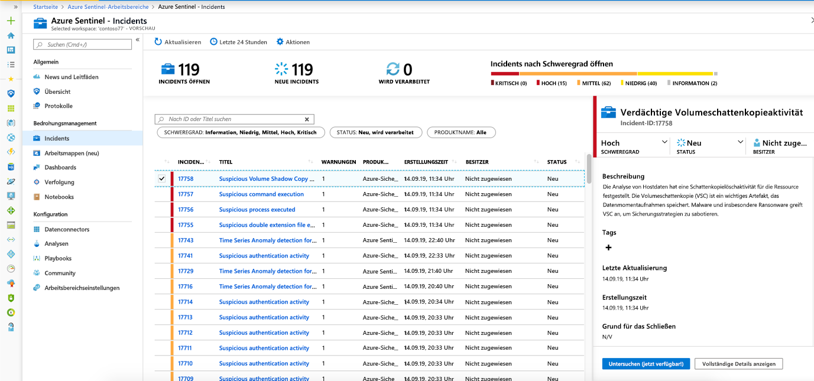
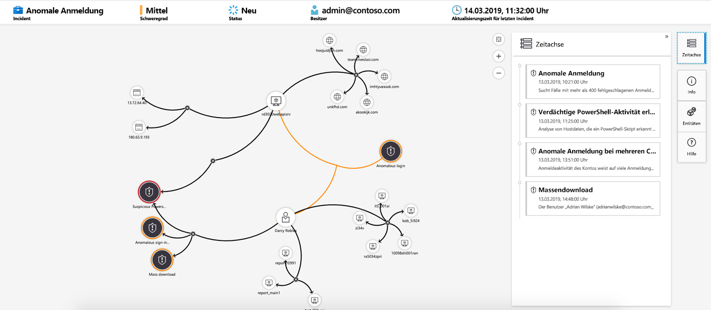

# Tutorial: Untersuchen von Vorfällen mit Azure Sentinel

> [!IMPORTANT]
> Das Untersuchungsdiagramm ist derzeit als Public Preview zugänglich.
> Dieses Feature wird ohne Vereinbarung zum Servicelevel bereitgestellt und ist nicht für Produktionsworkloads vorgesehen.
> Weitere Informationen finden Sie unter [Zusätzliche Nutzungsbestimmungen für Microsoft Azure-Vorschauen](https://azure.microsoft.com/support/legal/preview-supplemental-terms/).

In diesem Tutorial erfahren Sie, wie Sie Vorfälle mit Azure Sentinel untersuchen. Nachdem Sie Ihre Datenquellen mit Azure Sentinel verbunden haben, möchten Sie gewarnt werden, wenn etwas Verdächtiges geschieht. Damit Sie dies tun können, können Sie in Azure Sentinel erweiterte Warnungsregeln erstellen, die Vorfälle generieren, die Sie zuweisen und untersuchen können.

In diesem Artikel wird Folgendes behandelt:
> [!div class="checklist"]
> * Untersuchen von Vorfällen
> * Verwenden des Untersuchungsdiagramms
> * Reagieren auf Bedrohungen

Ein Vorfall kann mehrere Warnungen enthalten. Es ist eine Aggregation aller relevanten Beweise für eine bestimmte Untersuchung. Ein Vorfall wird auf der Grundlage von Analyseregeln erstellt, die Sie auf der Seite **Analytics** erstellt haben. Die Eigenschaften, die zu den Warnungen gehören, z. B. Schweregrad und Status, werden auf Vorfallsebene festgelegt. Nachdem Azure Sentinel die Informationen dazu hat, welche Bedrohungsarten Sie suchen und wie diese gefunden werden, können Sie erkannte Bedrohungen überwachen, indem Sie Vorfälle untersuchen.

## Voraussetzungen
Sie können den Vorfall nur untersuchen, wenn Sie beim Einrichten der Analyseregel die Entitätszuordnungsfelder verwendet haben. Das Untersuchungsdiagramm fordert, dass Ihr ursprünglicher Vorfall Entitäten enthält.

## Untersuchen von Vorfällen

1. Wählen Sie **Vorfälle** aus. Auf der Seite **Vorfälle** werden Sie darüber informiert, wie viele Vorfälle vorhanden sind, wie viele offen sind, für wie viele Sie **In progress** (In Arbeit) festgelegt haben, und wie viele geschlossen wurden. Für jeden Vorfall wird angezeigt, wann er aufgetreten ist, sowie der Vorfallsstatus. Beurteilen Sie anhand des Schweregrads, welche Fälle zuerst zu bearbeiten sind.

    

1. Sie können die Vorfälle nach Bedarf filtern, z. B. nach Status oder Schweregrad.

1. Wählen Sie einen bestimmten Vorfall aus, um mit der Untersuchung zu beginnen. Rechts sehen Sie ausführliche Informationen zum Vorfall, einschließlich des Schweregrads, einer Zusammenfassung zur Anzahl der betroffenen Entitäten, der ursprünglichen Ereignisse, die diesen Vorfall ausgelöst haben, sowie der eindeutigen ID des Vorfalls.

1. Wenn Sie sich mehr Details zu den Warnungen und Entitäten des Vorfalls ansehen möchten, wählen Sie auf der Vorfallsseite auf **Alle Informationen anzeigen** aus, und prüfen Sie die relevanten Registerkarten, in denen die Vorfallsinformationen zusammengefasst sind. Überprüfen Sie auf der Registerkarte **Warnungen** die Warnung selbst. Sie können sich alle relevanten Informationen zur Warnung ansehen: die Abfrage, die die Warnung ausgelöst hat, die Anzahl der Ergebnisse, die pro Abfrage zurückgegeben wurde, und die Möglichkeit, Playbooks für die Warnungen auszuführen. Wenn Sie noch detaillierte Informationen zum Vorfall erhalten möchten, wählen Sie die Anzahl der **Ereignisse** aus. Dadurch werden die Abfrage, die die Ergebnisse generiert hat, sowie die Ereignisse geöffnet, die die Warnung in Log Analytics ausgelöst haben. In der Registerkarte **Entitäten** können Sie sich alle Entitäten ansehen, die Sie als Teil der Warnungsregeldefinition zugeordnet haben.

    

1. Wenn Sie einen Vorfall aktiv untersuchen, empfiehlt es sich, den Vorfallsstatus auf **In Bearbeitung** festzulegen, bis Sie ihn schließen.

1. Vorfälle können einem bestimmten Benutzer zugewiesen werden. Jedem Vorfall können Sie einen Besitzer zuweisen, indem Sie das Feld **Incident Owner** (Besitzer des Vorfalls) festlegen. Alle Vorfälle sind zu Beginn nicht zugewiesen. Sie können auch Kommentare hinzufügen, damit andere Analysten verstehen können, was Sie untersucht haben und welche Probleme mit dem Vorfall verbunden sind.

    

1. Wählen Sie **Untersuchen** aus, um die Untersuchungszuordnung anzuzeigen.

## Ausführliche Untersuchung mit dem Untersuchungsdiagramm

Mithilfe des Untersuchungsdiagramms können Analysten für jede Untersuchung die richtigen Fragen stellen. Anhand des Untersuchungsdiagramms können Sie den Umfang einer potenziellen Sicherheitsbedrohung verstehen und deren Ursache bestimmen, indem Sie relevante Daten mit einer betroffenen Entität in Beziehung setzen. Sie können tiefer eintauchen und die einzelnen im Diagramm dargestellten Entitäten untersuchen, indem Sie die jeweilige Entität auswählen und verschiedene Erweiterungsoptionen wählen.  
  
Das Untersuchungsdiagramm bietet Ihnen Folgendes:

- **Visueller Kontext aus Rohdaten**: Im visuellen Livediagramm werden Entitätsbeziehungen veranschaulicht, die automatisch aus den Rohdaten extrahiert werden. Dadurch können Sie auf einfache Weise Verbindungen zwischen verschiedenen Datenquellen erkennen.

- **Ermittlung des vollständigen Untersuchungsumfangs**: Erweitern Sie den Untersuchungsumfang mithilfe integrierter Auswertungsabfragen, um das vollständige Ausmaß einer Sicherheitsverletzung aufzudecken.

- **Integrierte Untersuchungsschritte**: Stellen Sie mit vordefinierten Untersuchungsoptionen sicher, dass Sie angesichts einer Bedrohung die richtigen Fragen stellen.

So verwenden Sie das Untersuchungsdiagramm:

1. Wählen Sie einen Vorfall und anschließend **Untersuchen** aus. Dadurch wird das Untersuchungsdiagramm aufgerufen. Im Diagramm erhalten Sie eine anschauliche Zuordnung der Entitäten, die direkt mit dem Vorfall verbunden sind, sowie aller darüber hinaus damit verbundenen Ressourcen.

   > [!IMPORTANT] 
   > Sie können den Vorfall nur untersuchen, wenn Sie beim Einrichten der Analyseregel die Entitätszuordnungsfelder verwendet haben. Das Untersuchungsdiagramm fordert, dass Ihr ursprünglicher Vorfall Entitäten enthält.

   

1. Wählen Sie eine Entität aus, um den Bereich **Entitäten** zu öffnen, in dem Sie Informationen zur betreffenden Entität untersuchen können.

    
  
1. Erweitern Sie die Untersuchung, indem Sie den Mauszeiger über die einzelnen Entitäten bewegen. Dadurch wird eine Liste von Fragen eingeblendet, die von unseren Sicherheitsexperten und -analysten für den jeweiligen Entitätstyp entwickelt wurden, sodass Sie Ihre Untersuchung vertiefen können. Wir bezeichnen diese Optionen als **Erkundungsabfragen**.

    

   Sie können beispielsweise für einen Computer zugehörige Warnungen anfordern. Wenn Sie eine Erkundungsabfrage auswählen, werden die erhaltenen Entitäten dem Diagramm wieder hinzugefügt. In diesem Beispiel wurden durch Auswahl von **Related alerts** (Zugehörige Warnungen) die folgenden Warnungen in das Diagramm zurückgegeben:

    

1. Für jede Erkundungsabfrage können Sie die Ergebnisse zu ursächlichen Ereignissen und die in Log Analytics verwendete Abfrage öffnen, indem Sie **Ereignisse\>** auswählen.

1. Das Diagramm enthält eine parallele Zeitachse, um ein Verständnis des Vorfalls zu vermitteln.

    

1. Bewegen Sie den Mauszeiger über die Zeitachse, um festzustellen, welche Ereignisse im Diagramm zu welchem Zeitpunkt aufgetreten sind.

    

## Nächste Schritte
In diesem Tutorial haben Sie eine Einführung erhalten, wie Vorfälle mithilfe von Azure Sentinel untersucht werden. Fahren Sie mit dem [Tutorial: Einrichten automatisierter Reaktionen auf Bedrohungen in der Vorschauversion von Azure Sentinel](tutorial-respond-threats-playbook.md) fort.
> [!div class="nextstepaction"]
> [Reagieren Sie auf Bedrohungen](tutorial-respond-threats-playbook.md), um Ihre Maßnahmen zur Reaktion auf Bedrohungen zu automatisieren.

