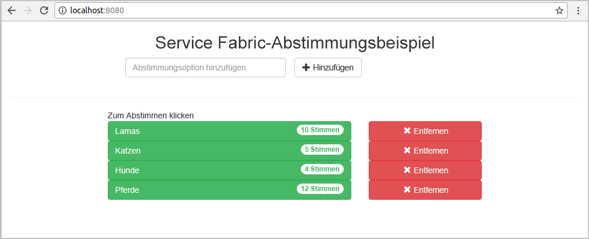
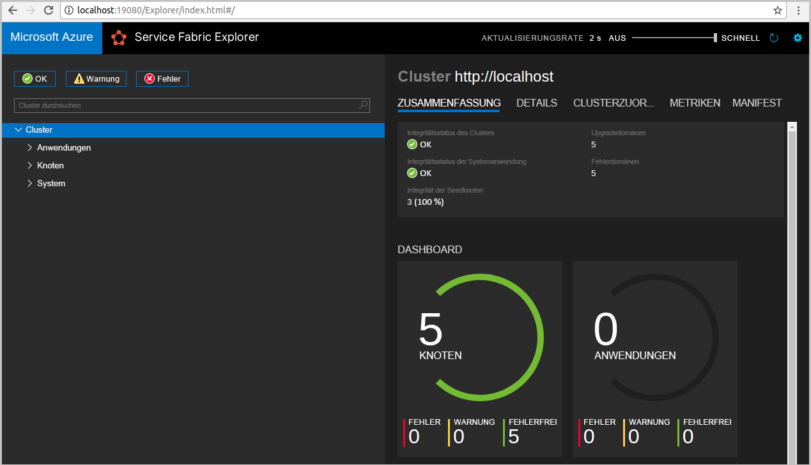
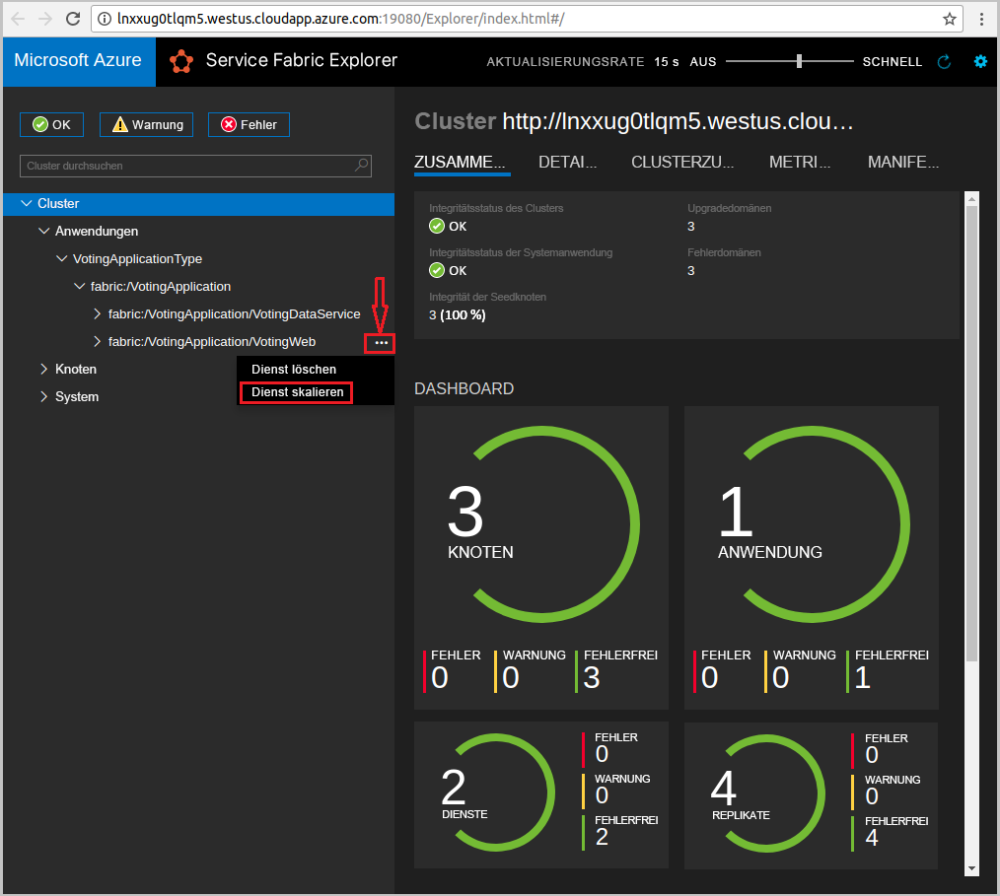
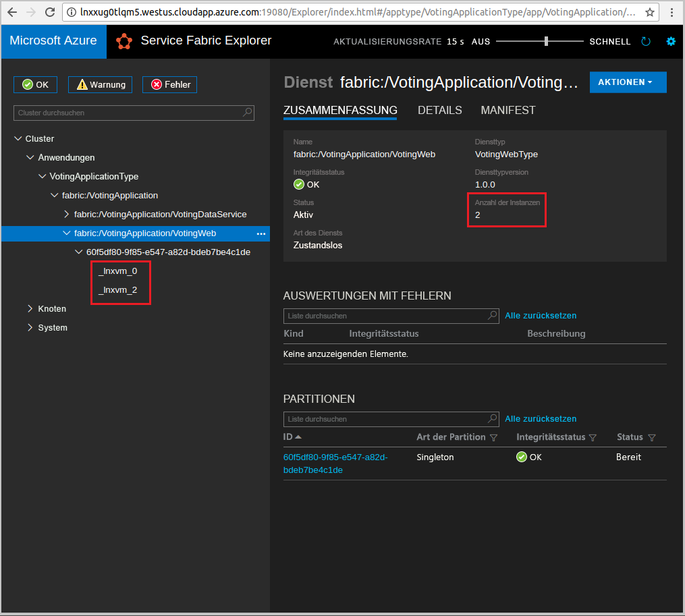

# <a name="quickstart--deploy-a-java-app-to-azure-service-fabric-on-linux"></a>Schnellstart:  Bereitstellen einer Java-App in Azure Service Fabric unter Linux

In dieser Schnellstartanleitung wird veranschaulicht, wie Sie mithilfe der Eclipse-IDE Ihre erste Java-Anwendung in Azure Service Fabric auf einem Linux-Entwicklercomputer bereitstellen. Das Ergebnis ist eine Anwendung mit einem Java-Web-Front-End, mit der Abstimmungsergebnisse im Cluster in einem zustandsbehafteten Back-End-Dienst gespeichert werden.

Azure Service Fabric ist eine Plattform, mit der verteilte Systeme bereitgestellt und skalierbare und zuverlässige Microservices und Container verwaltet werden können.



In dieser Schnellstartanleitung wird Folgendes vermittelt:

* Verwenden von Eclipse als Tool für Ihre Service Fabric-Java-Anwendungen
* Bereitstellen der Anwendung im Cluster
* Horizontales Hochskalieren der Anwendung über mehrere Knoten hinweg

## <a name="prerequisites"></a>Voraussetzungen

So führen Sie diesen Schnellstart durch:

1. [Installieren Sie das Service Fabric SDK und die Service Fabric-Befehlszeilenschnittstelle (Command Line Interface, CLI).](https://docs.microsoft.com/azure/service-fabric/service-fabric-get-started-linux#installation-methods)
2. [Installation von Git](https://git-scm.com/)
3. [Installieren Sie Eclipse.](https://www.eclipse.org/downloads/)
4. [Richten Sie eine Java-Umgebung ein](https://docs.microsoft.com/azure/service-fabric/service-fabric-get-started-linux#set-up-java-development), und führen Sie auch die optionalen Schritte für die Installation des Eclipse-Plug-Ins aus.

## <a name="download-the-sample"></a>Herunterladen des Beispiels

Führen Sie in einem Befehlsfenster den folgenden Befehl aus, um das Beispiel-App-Repository auf Ihren lokalen Computer zu klonen.

```git
git clone https://github.com/Azure-Samples/service-fabric-java-quickstart.git
```

## <a name="run-the-application-locally"></a>Lokales Ausführen der Anwendung

1. Starten Sie Ihren lokalen Cluster mit dem folgenden Befehl:

    ```bash
    sudo /opt/microsoft/sdk/servicefabric/common/clustersetup/devclustersetup.sh
    ```
    Es kann einige Zeit dauern, bis der lokale Cluster startet. Um zu prüfen, ob der Cluster vollständig betriebsbereit ist, greifen Sie unter **http://localhost:19080** auf Service Fabric Explorer zu. Wenn die fünf Knoten fehlerfrei sind, wird der lokale Cluster ausgeführt.

    

2. Öffnen Sie Eclipse.
3. Klicken Sie auf **Datei** > **Importieren** > **Gradle** > **Vorhandenes Gradle-Projekt**, und führen Sie die Schritte des Assistenten aus.
4. Klicken Sie auf **Verzeichnis**, und wählen Sie im Ordner `service-fabric-java-quickstart`, den Sie aus GitHub geklont haben, das Verzeichnis `Voting` aus. Wählen Sie **Fertig stellen** aus.

    

5. Das Projekt `Voting` befindet sich nun im Paket-Explorer von Eclipse.
6. Klicken Sie mit der rechten Maustaste auf das Projekt, und wählen Sie in der Dropdownliste **Service Fabric** die Option **Anwendung veröffentlichen** aus. Wählen Sie **PublishProfiles/Local.json** als Zielprofil aus, und klicken Sie auf **Veröffentlichen**.

    

7. Öffnen Sie Ihren bevorzugten Browser, und greifen Sie über `http://localhost:8080` auf die Anwendung zu.

    

Sie können jetzt einen Satz mit Abstimmungsoptionen hinzufügen und die Abstimmung freigeben. Die Anwendung führt alle Daten in Ihrem Service Fabric-Cluster aus und speichert sie dort, ohne dass eine separate Datenbank verwendet werden muss.

## <a name="scale-applications-and-services-in-a-cluster"></a>Skalieren von Anwendungen und Diensten in einem Cluster

Dienste können clusterweit skaliert werden, um eine Änderung der Last für die Dienste auszugleichen. Sie skalieren einen Dienst, indem Sie die Anzahl von Instanzen ändern, die im Cluster ausgeführt werden. Dienste können auf unterschiedliche Weise skaliert werden – beispielsweise mithilfe von Skripts oder Befehlen der Service Fabric-Befehlszeilenschnittstelle (sfctl). In den folgenden Schritten wird Service Fabric Explorer verwendet.

Service Fabric Explorer wird in allen Service Fabric-Clustern ausgeführt und kann in einem Browser geöffnet werden. Navigieren Sie hierzu zum HTTP-Verwaltungsport des Clusters (19.080). Beispiel: `http://localhost:19080`.

Gehen Sie zum Skalieren des Web-Front-End-Diensts wie folgt vor:

1. Öffnen Sie Service Fabric Explorer in Ihrem Cluster, z.B. `https://localhost:19080`.
2. Klicken Sie in der Strukturansicht neben dem Knoten **fabric:/Voting/VotingWeb** auf das Auslassungszeichen ( **...** ), und wählen Sie **Dienst skalieren** aus.

    

    Sie können jetzt angeben, dass die Anzahl von Instanzen des Web-Front-End-Diensts skaliert werden soll.

3. Ändern Sie die Anzahl in **2**, und wählen Sie **Dienst skalieren** aus.
4. Wählen Sie in der Strukturansicht den Knoten **fabric:/Voting/VotingWeb** aus, und erweitern Sie den Partitionsknoten (durch eine GUID dargestellt).

    

    Sie sehen nun, dass der Dienst über zwei Instanzen verfügt, und in der Strukturansicht ist zu erkennen, auf welchen Knoten die Instanzen ausgeführt werden.

Mit dieser einfachen Verwaltungsaufgabe haben Sie die Ressourcen verdoppelt, die dem Front-End-Dienst zur Bewältigung der Benutzerauslastung zur Verfügung stehen. Es ist wichtig zu verstehen, dass Sie nicht mehrere Instanzen eines Diensts benötigen, damit er zuverlässig ausgeführt wird. Sollte ein Dienst ausfallen, stellt Service Fabric sicher, dass im Cluster eine neue Dienstinstanz ausgeführt wird.

## <a name="next-steps"></a>Nächste Schritte

In diesem Schnellstart haben Sie Folgendes gelernt:

* Verwenden von Eclipse als Tool für Ihre Service Fabric-Java-Anwendungen
* Bereitstellen von Java-Anwendungen im lokalen Cluster
* Horizontales Hochskalieren der Anwendung über mehrere Knoten hinweg

Weitere Informationen zur Verwendung von Java-Apps in Service Fabric finden Sie im Tutorial für Java-Apps.

> [!div class="nextstepaction"]
> [Bereitstellen einer Java-App](./service-fabric-tutorial-create-java-app.md)
