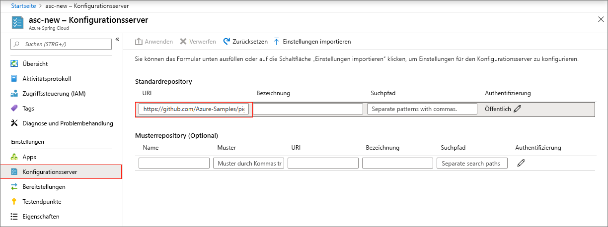
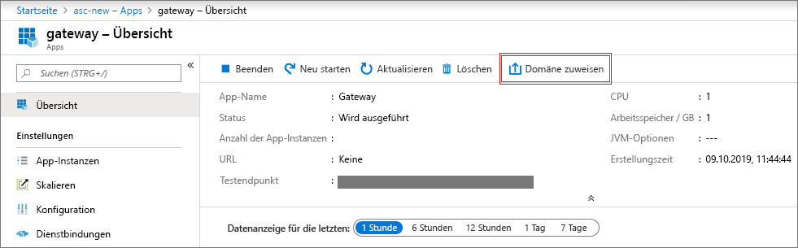
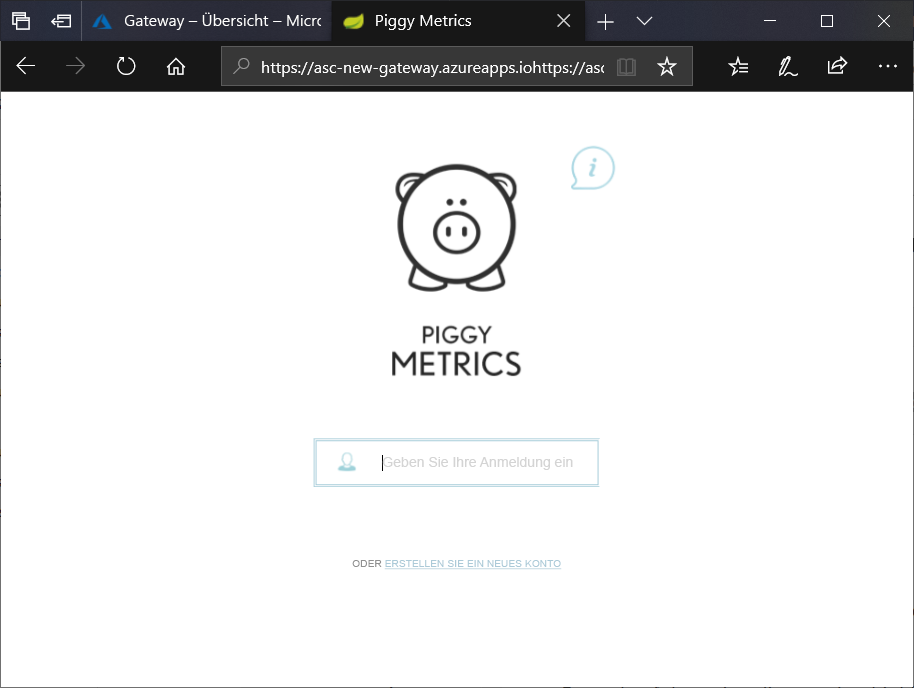

# <a name="quickstart-launch-an-azure-spring-cloud-application-using-the-azure-portal"></a>Schnellstart: Starten einer Azure Spring Cloud-Anwendung über das Azure-Portal

Azure Spring Cloud ermöglicht Ihnen die einfache Ausführung von Spring Cloud-basierten Microserviceanwendungen in Azure.

In dieser Schnellstartanleitung erfahren Sie, wie Sie eine vorhandene Spring Cloud-Anwendung in Azure bereitstellen.  Den in diesem Tutorial verwendeten Beispielanwendungscode finden Sie in unserem [GitHub-Beispielrepository](https://github.com/Azure-Samples/PiggyMetrics). Wenn Sie das Tutorial abgeschlossen haben, kann auf die bereitgestellte Beispielanwendung online zugegriffen werden, und sie kann über das Azure-Portal verwaltet werden.

In dieser Schnellstartanleitung wird Folgendes vermittelt:

> [!div class="checklist"]
> * Bereitstellen einer Dienstinstanz
> * Festlegen eines Konfigurationsservers für eine Instanz
> * Lokales Erstellen einer Microserviceanwendung
> * Bereitstellen der einzelnen Microservices
> * Zuweisen eines öffentlichen Endpunkts für Ihre Anwendung

## <a name="prerequisites"></a>Voraussetzungen

>[!Note]
> Azure Spring Cloud wird zurzeit als Public Preview angeboten. Angebote der Public Preview ermöglichen Kunden das Experimentieren mit neuen Funktionen vor der offiziellen Veröffentlichung.  Funktionen und Dienste in der Public Preview sind nicht zur Verwendung in der Produktion bestimmt.  Weitere Informationen zur Unterstützung während der Vorschauphase finden Sie unter den [häufig gestellten Fragen](https://azure.microsoft.com/support/faq/), oder reichen Sie eine [Supportanfrage](https://docs.microsoft.com/azure/azure-supportability/how-to-create-azure-support-request) ein, um weitere Informationen zu erhalten.

>[!TIP]
> Azure Cloud Shell ist eine kostenlose interaktive Shell, mit der Sie die Schritte in diesem Artikel ausführen können.  Sie verfügt über allgemeine vorinstallierte Azure-Tools, u. a. die aktuellen Versionen von Git, JDK, Maven und der Azure-Befehlszeilenschnittstelle. Wenn Sie bei Ihrem Azure-Abonnement angemeldet sind, starten Sie [Azure Cloud Shell](https://shell.azure.com) über shell.azure.com.  Weitere Informationen zu Azure Cloud Shell finden Sie in der [Dokumentation](../cloud-shell/overview.md).

So führen Sie diesen Schnellstart durch:

1. [Installation von Git](https://git-scm.com/)
2. [Installation von JDK 8](https://docs.microsoft.com/java/azure/jdk/?view=azure-java-stable)
3. [Installation von Maven 3.0 oder höher](https://maven.apache.org/download.cgi)
4. [Installation der Azure CLI, Version 2.0.67 oder höher](https://docs.microsoft.com/cli/azure/install-azure-cli?view=azure-cli-latest)
5. [Registrierung für ein Azure-Abonnement](https://azure.microsoft.com/free/)

## <a name="install-the-azure-cli-extension"></a>Installieren der Erweiterung für die Azure-Befehlszeilenschnittstelle

Führen Sie den folgenden Befehl aus, um die Azure Spring Cloud-Erweiterung für die Azure CLI zu installieren:

```Azure CLI
az extension add --name spring-cloud
```

## <a name="provision-a-service-instance-on-the-azure-portal"></a>Bereitstellen einer Dienstinstanz im Azure-Portal

1. Öffnen Sie in einem Webbrowser [diesen Link zur Azure Spring Cloud im Azure-Portal](https://ms.portal.azure.com/#create/Microsoft.AppPlatform).

1. Füllen Sie das Formular auf der Azure Spring Cloud-Seite **Erstellen** aus.  Berücksichtigen Sie die folgenden Richtlinien:
    - Servicename: Geben Sie den Namen Ihrer Dienstinstanz an.  Der Name muss zwischen 4 und 32 Zeichen lang sein und darf nur Kleinbuchstaben, Ziffern und Bindestriche enthalten.  Das erste Zeichen des Dienstnamens muss ein Buchstabe und das letzte Zeichen entweder ein Buchstabe oder eine Ziffer sein.
    - Abonnement: Wählen Sie das Abonnement aus, unter dem diese Ressource abgerechnet werden soll.  Stellen Sie sicher, dass dieses Abonnement der Zulassungsliste für Azure Spring Cloud hinzugefügt wurde.
    - Ressourcengruppe: Die Erstellung neuer Ressourcengruppen für neue Ressourcen ist eine bewährte Methode.
    - Standort: Wählen Sie den Speicherort für Ihre Dienstinstanz aus. Derzeit werden die Standorte „USA, Osten“, „USA, Westen 2“, „Europa, Westen“ und „Asien, Südosten“ unterstützt.

1. Klicken Sie auf **Überprüfen und erstellen**.

1. Überprüfen Sie Ihre Spezifikationen, und klicken Sie auf **Erstellen**.

Die Bereitstellung des Diensts dauert etwa fünf Minuten.  Nach der Bereitstellung wird die Seite **Übersicht** für die Dienstinstanz angezeigt.

## <a name="set-up-your-configuration-server"></a>Einrichten Ihres Konfigurationsservers

1. Navigieren Sie zur Seite **Übersicht**, und wählen Sie **Konfigurationsserver** aus.

1. Legen Sie im Abschnitt **Standardrepository** den Wert für **URI** auf „https\://github.com/Azure-Samples/piggymetrics“ und **BEZEICHNUNG** auf „Konfiguration“ fest, und wählen Sie **Anwenden** aus, um Ihre Änderungen zu speichern.

    

## <a name="build-and-deploy-microservice-applications"></a>Erstellen und Bereitstellen von Microserviceanwendungen

1. Öffnen Sie [Azure Cloud Shell](https://shell.azure.com), und klonen Sie das Beispiel-App-Repository auf Ihren lokalen Computer.  Hier wird vor dem Klonen der App zunächst ein temporäres Verzeichnis mit dem Namen `source-code` erstellt.

    ```azurecli
    mkdir source-code
    cd source-code
    git clone https://github.com/Azure-Samples/piggymetrics
    ```

1. Erstellen Sie das geklonte Paket.

    ```azurecli
    cd piggymetrics
    mvn clean package -DskipTests
    ```

1. Melden Sie sich bei der Azure CLI an, und legen Sie Ihr aktives Abonnement fest:

    ```azurecli
    # Login to Azure CLI
    az login

    # List all subscriptions
    az account list -o table

    # Set active subscription
    az account set --subscription <target subscription ID>
    ```

1. Weisen Sie Ihrer Ressourcengruppe und Ihrem Dienst Namen zu. Ersetzen Sie die unten angegebenen Platzhalter durch den Ressourcengruppennamen und den Dienstnamen, die Sie weiter oben in diesem Tutorial bereitgestellt haben.

    ```azurecli
    az configure --defaults group=<resource group name>
    az configure --defaults spring-cloud=<service instance name>
    ```

1. Erstellen Sie die Anwendung `gateway`, und stellen Sie die JAR-Datei bereit:

    ```azurecli
    az spring-cloud app create -n gateway
    az spring-cloud app deploy -n gateway --jar-path ./gateway/target/gateway.jar
    ```

1. Erstellen Sie nach dem gleichen Muster die Anwendungen `account-service` und `auth-service`, und stellen Sie ihre JAR-Dateien bereit:

    ```azurecli
    az spring-cloud app create -n account-service
    az spring-cloud app deploy -n account-service --jar-path ./account-service/target/account-service.jar
    az spring-cloud app create -n auth-service
    az spring-cloud app deploy -n auth-service --jar-path ./auth-service/target/auth-service.jar
    ```

1. Es dauert einige Minuten, bis die Bereitstellung der Anwendungen abgeschlossen ist. Navigieren Sie im Azure-Portal zum Blatt **Apps**, um zu überprüfen, ob die Anwendungen bereitgestellt wurden. Für die drei Anwendungen sollte jeweils eine Zeile angezeigt werden.

## <a name="assign-a-public-endpoint-to-gateway"></a>Zuweisen eines öffentlichen Endpunkts zum Gateway

1. Öffnen Sie im Menü auf der linken Seite die Registerkarte **Apps**.

1. Wählen Sie die `gateway`-Anwendung aus, um die Seite **Übersicht** anzuzeigen.

1. Wählen Sie **Domäne zuweisen** aus, um dem Gateway einen öffentlichen Endpunkt zuzuweisen. Dies kann einige Minuten dauern.

    

1. Geben Sie in Ihrem Browser den zugewiesenen öffentlichen Endpunkt (mit der Bezeichnung **URL**) ein, um die laufende Anwendung anzuzeigen.

    


## <a name="next-steps"></a>Nächste Schritte

In diesem Schnellstart haben Sie Folgendes gelernt:

> [!div class="checklist"]
> * Bereitstellen einer Dienstinstanz
> * Festlegen eines Konfigurationsservers für eine Instanz
> * Lokales Erstellen einer Microserviceanwendung
> * Bereitstellen der einzelnen Microservices
> * Zuweisen eines öffentlichen Endpunkts für Ihr Anwendungsgateway

> [!div class="nextstepaction"]
> [Tutorial: Vorbereiten einer Java Spring-Anwendung für die Bereitstellung in Azure Spring Cloud](spring-cloud-tutorial-prepare-app-deployment.md)
