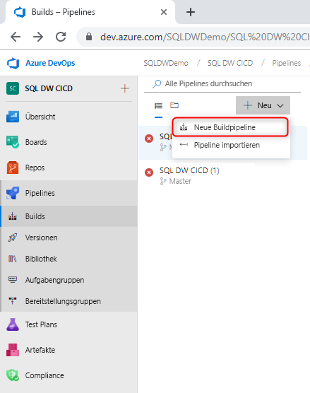
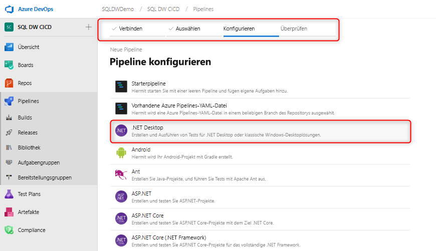
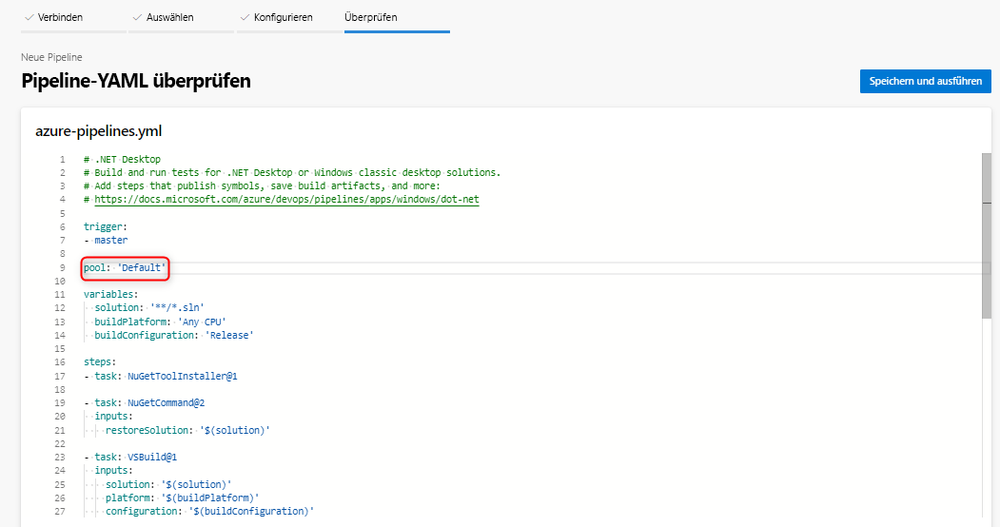
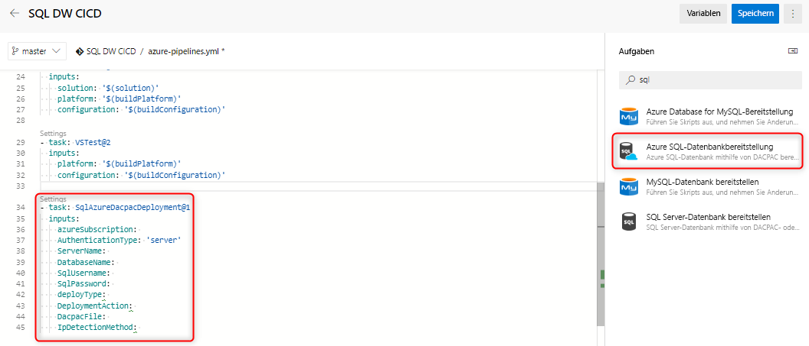
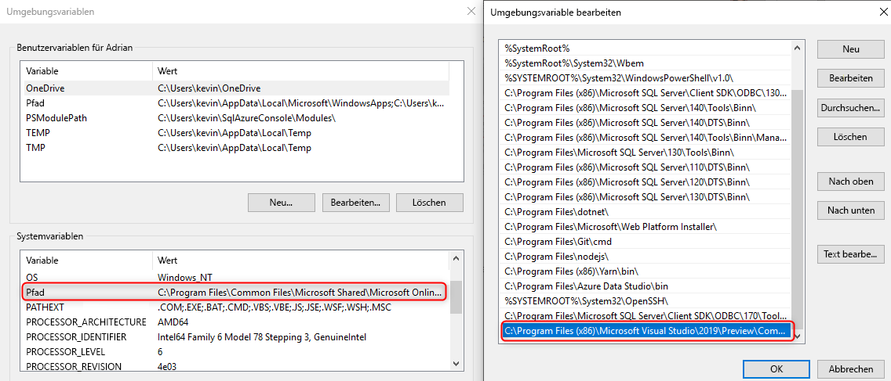

# Continuous Integration und Continuous Deployment für Azure SQL Data Warehouse

In diesem einfachen Tutorial wird erläutert, wie Sie Ihr SSDT-Datenbankprojekt (SQL Server Data Tools) in Azure DevOps integrieren und Azure Pipelines zum Einrichten von Continuous Integration und Continuous Deployment nutzen. Dieses Tutorial ist der zweite Schritt beim Erstellen Ihrer Continuous Integration- und Continuous Deployment-Pipeline mit SQL Data Warehouse. 

## Voraussetzungen

- Lesen Sie das Tutorial zur [Integration der Quellcodeverwaltung](https://docs.microsoft.com/azure/sql-data-warehouse/sql-data-warehouse-source-control-integration).

- Erstellen Sie einen [selbstgehosteten Agent](https://docs.microsoft.com/azure/devops/pipelines/agents/agents?view=azure-devops#install), bei dem die SSDT-Vorschaukomponenten (ab Version 16.3, Vorschauversion 2) für SQL Data Warehouse (Vorschauversion) installiert sind.

- Einrichten von Azure DevOps und Herstellen einer Verbindung

  > [!NOTE]
  > SSDT befindet sich derzeit in der Vorschauphase, in der Sie einen selbstgehosteten Agent nutzen müssen. Die von Microsoft gehosteten Agents werden in den nächsten Monaten aktualisiert.

## Continuous Integration mit Visual Studio Build

1. Navigieren Sie zu Azure Pipelines, und erstellen Sie eine neue Buildpipeline.

      

2. Wählen Sie Ihr Quellcoderepository (Azure Repos Git) und anschließend die .NET-Desktop-App-Vorlage aus.

       

3. Bearbeiten Sie Ihre YAML-Datei, damit der richtige Pool Ihres Agents verwendet wird. Ihre YAML-Datei sollte in etwa wie folgt aussehen:

      

Nun verfügen Sie über eine einfache Umgebung, in der jeder Check-In bei Ihrem Quellcoderepository-Masterbranch automatisch einen erfolgreichen Visual Studio-Build Ihres Datenbankprojekts auslösen sollte. Überprüfen Sie, ob die Automatisierung insgesamt funktioniert, indem Sie eine Änderung an Ihrem lokalen Datenbankprojekt vornehmen und diese Änderung beim Masterbranch einchecken.

## Continuous Deployment mit der Azure SQL-Datenbank-Bereitstellungsaufgabe

1. Fügen Sie mithilfe der [Azure SQL-Datenbank-Bereitstellungsaufgabe](https://docs.microsoft.com/azure/devops/pipelines/tasks/deploy/sql-azure-dacpac-deployment?view=azure-devops) eine neue Aufgabe hinzu, und füllen Sie die erforderlichen Felder aus, um eine Verbindung mit dem Ziel-Data Warehouse herzustellen. Wenn diese Aufgabe ausgeführt wird, wird die DACPAC-Datei, die vom vorherigen Buildprozess generiert wurde, auf dem Ziel-Data Warehouse bereitgestellt.

      

2. Stellen Sie bei Verwendung eines selbstgehosteten Agents sicher, dass Sie die Umgebungsvariable so festlegen, dass sie die richtige Version von „SqlPackage.exe“ für Ihr SQL Data Warehouse verwendet. Der Pfad sollte in etwa wie folgt aussehen:

      

   C:\Programme (x86)\Microsoft Visual Studio\2019\Preview\Common7\IDE\Extensions\Microsoft\SQLDB\DAC\150  

   Führen Sie Ihre Pipeline aus, und überprüfen Sie sie. Sie können Änderungen lokal vornehmen und Änderungen an der Quellcodeverwaltung einchecken, die eine automatische Erstellung und Bereitstellung generiert.

## Nächste Schritte

- Erkunden der [Azure SQL Data Warehouse-Architektur](/azure/sql-data-warehouse/massively-parallel-processing-mpp-architecture)
- Schnelles [Erstellen einer SQL Data Warehouse-Instanz][create a SQL Data Warehouse]
- [Laden von Beispieldaten][load sample data]
- Ansehen von [Videos](/azure/sql-data-warehouse/sql-data-warehouse-videos)

<!--Image references-->

[1]: ./media/sql-data-warehouse-overview-what-is/dwarchitecture.png

<!--Article references-->
[Create a support ticket]: ./sql-data-warehouse-get-started-create-support-ticket.md
[load sample data]: ./sql-data-warehouse-load-sample-databases.md
[create a SQL Data Warehouse]: ./sql-data-warehouse-get-started-provision.md
[Migration documentation]: ./sql-data-warehouse-overview-migrate.md
[SQL Data Warehouse solution partners]: ./sql-data-warehouse-partner-business-intelligence.md
[Integrated tools overview]: ./sql-data-warehouse-overview-integrate.md
[Backup and restore overview]: ./sql-data-warehouse-restore-database-overview.md
[Azure glossary]: ../azure-glossary-cloud-terminology.md

<!--MSDN references-->

<!--Other Web references-->
[Blogs]: https://azure.microsoft.com/blog/tag/azure-sql-data-warehouse/
[Customer Advisory Team blogs]: https://blogs.msdn.microsoft.com/sqlcat/tag/sql-dw/
[Feature requests]: https://feedback.azure.com/forums/307516-sql-data-warehouse
[MSDN forum]: https://social.msdn.microsoft.com/Forums/azure/home?forum=AzureSQLDataWarehouse
[Stack Overflow forum]: https://stackoverflow.com/questions/tagged/azure-sqldw
[Twitter]: https://twitter.com/hashtag/SQLDW
[Videos]: https://azure.microsoft.com/documentation/videos/index/?services=sql-data-warehouse
[SLA for SQL Data Warehouse]: https://azure.microsoft.com/support/legal/sla/sql-data-warehouse/v1_0/
[Volume Licensing]: https://www.microsoftvolumelicensing.com/DocumentSearch.aspx?Mode=3&DocumentTypeId=37
[Service Level Agreements]: https://azure.microsoft.com/support/legal/sla/
