# Integration der Quellcodeverwaltung für Azure SQL Data Warehouse

In diesem Tutorial wird erläutert, wie Sie Ihr SSDT-Datenbankprojekt (SQL Server Data Tools) mit Quellcodeverwaltung integrieren.  Die Integration der Quellcodeverwaltung ist der erste Schritt bei der Erstellung Ihrer Continuous Integration- und Continuous Deployment-Pipeline mit SQL Data Warehouse. 

## Voraussetzungen

- Registrieren für eine [Azure DevOps-Organisation](https://azure.microsoft.com/services/devops/)
- Absolvieren des Tutorials [Schnellstart: Erstellen und Abfragen einer Azure SQL Data Warehouse-Instanz im Azure-Portal](https://docs.microsoft.com/azure/sql-data-warehouse/create-data-warehouse-portal)
-  [Installieren von Visual Studio 2019](https://visualstudio.microsoft.com/vs/older-downloads/) 

## Einrichten von Azure DevOps und Herstellen einer Verbindung

1. Erstellen Sie in Ihrer Azure DevOps-Organisation ein Projekt, das Ihr SSDT-Datenbankprojekt über ein Azure-Repository hostet.

   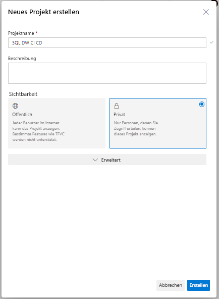

2. Öffnen Sie Visual Studio, und stellen Sie mit Ihrer Azure DevOps-Organisation und Ihrem Projekt aus Schritt 1 eine Verbindung her, indem Sie „Verbindungen verwalten“ auswählen.

   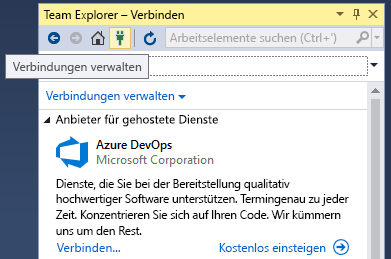

   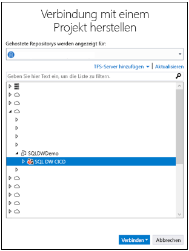

3. Klonen Sie das Azure-Repository aus Ihrem Projekt auf dem lokalen Computer.

   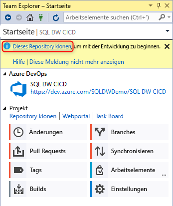

## Erstellen und Verbinden Ihres Projekts

1. Erstellen Sie in Visual Studio ein neues SQL Server-Datenbankprojekt mit einem Verzeichnis und einem lokalen Git-Repository in Ihrem **lokalen geklonten Repository**.

     

2. Klicken Sie mit der rechten Maustaste auf das leere SQL-Projekt, und importieren Sie Ihr Data Warehouse in das Datenbankprojekt.

   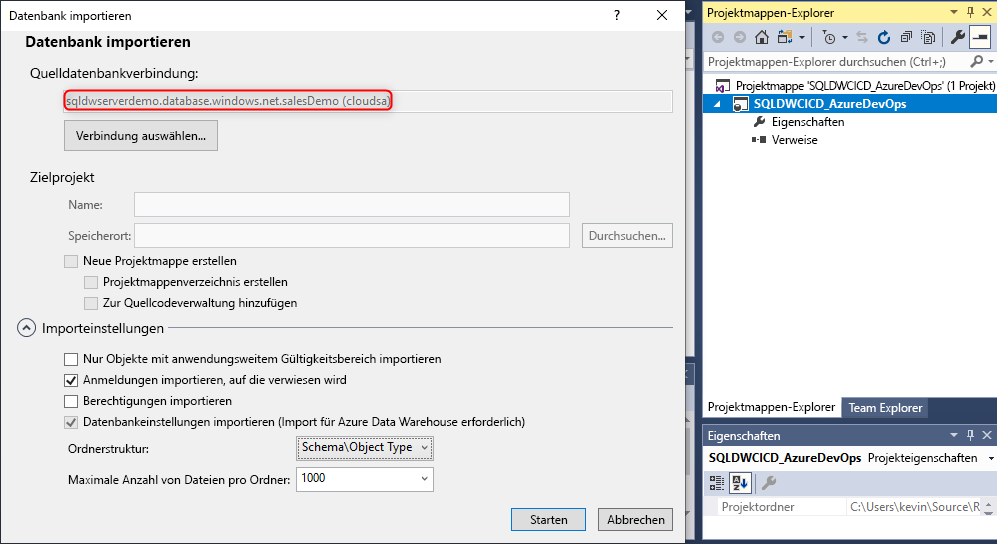  

3. Committen Sie im Team Explorer in Visual Studio alle Änderungen im lokalen Git-Repository. 

   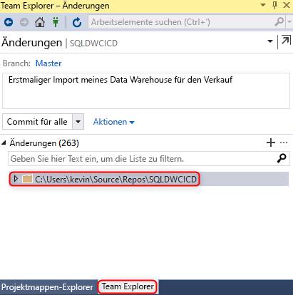  

4. Nachdem Sie die Änderungen lokal im geklonten Repository committet haben, synchronisieren Sie die Änderungen, und pushen Sie sie in das Azure-Repository in Ihrem Azure DevOps-Projekt.

   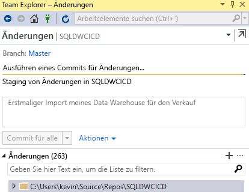

   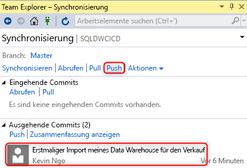  

## Überprüfen

1. Überprüfen Sie, ob die Änderungen in das Azure-Repository gepusht wurden, indem Sie eine Tabellenspalte in Ihrem Datenbankprojekt über Visual Studio SQL Server Data Tools (SSDT) aktualisieren.

   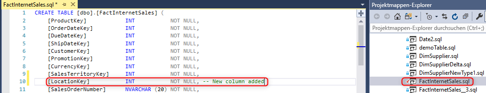

2. Committen und Pushen der Änderung von Ihrem lokalen Repository in das Azure-Repository

   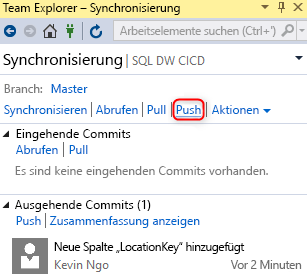

3. Überprüfen, ob die Änderung in Ihr Azure-Repository gepusht wurde

   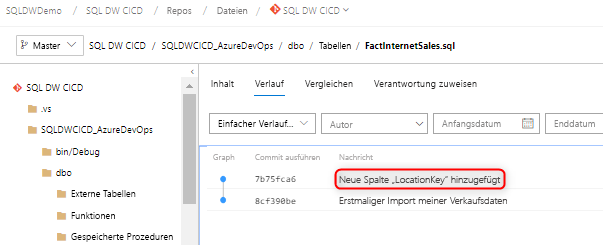

4. (**Optional**) Verwenden Sie den Schemavergleich, und übertragen Sie die Änderungen mithilfe von SSDT in Ihre Data Warehouse-Zielinstanz, um sicherzustellen, dass die Objektdefinitionen in Ihrem Azure-Repository und im lokalen Repository Ihr Data Warehouse widerspiegeln.

## Nächste Schritte

- [Entwickeln für Azure SQL Data Warehouse](sql-data-warehouse-overview-develop.md)

<!--Image references-->

<!--Article references-->

<!--MSDN references-->

<!--Other Web references-->

