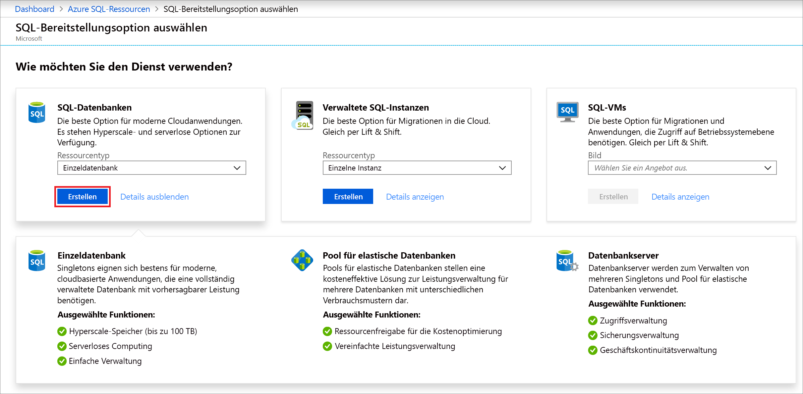
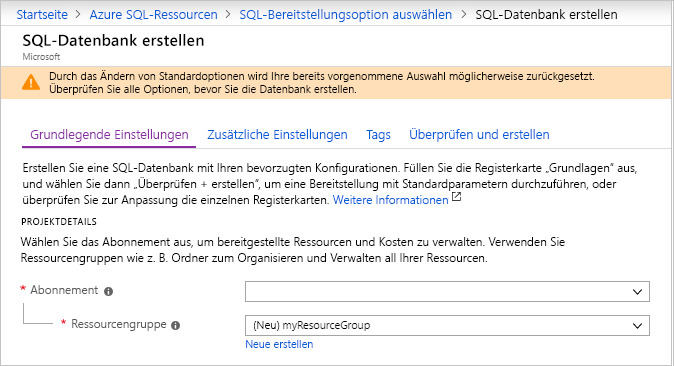
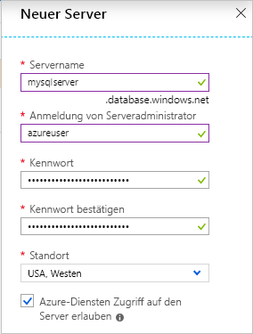
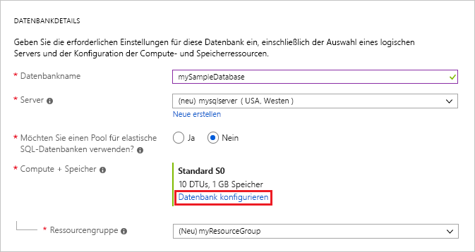
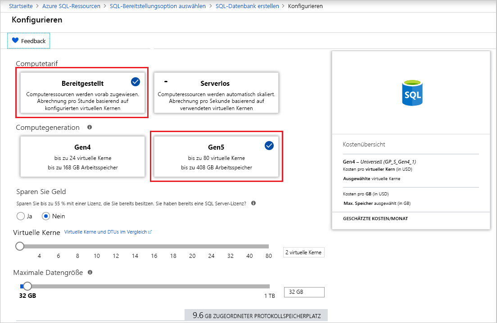
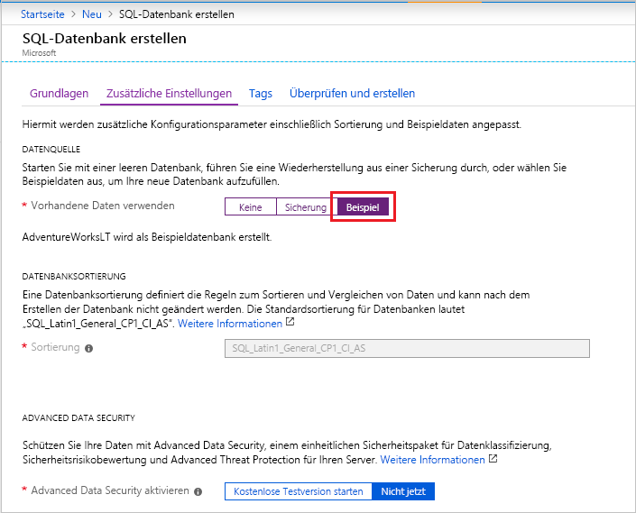

In diesem Schritt erstellen Sie eine Azure SQL-Einzeldatenbank. 

> [!IMPORTANT]
> Richten Sie auf dem für diesen Artikel verwendeten Computer Firewallregeln für die öffentliche IP-Adresse des Computers ein.
>
> Weitere Informationen finden Sie unter [Erstellen einer Firewallregel auf Datenbankebene](/sql/relational-databases/system-stored-procedures/sp-set-database-firewall-rule-azure-sql-database). Eine Beschreibung, wie Sie die IP-Adresse für die Firewallregel auf Serverebene für Ihren Computer ermitteln, finden Sie unter [Erstellen einer Firewall auf Serverebene](../sql-database-server-level-firewall-rule.md).  

# <a name="portaltabazure-portal"></a>[Portal](#tab/azure-portal)

Erstellen Sie Ihre Ressourcengruppe und einzelne Datenbanken über das Azure-Portal.

1. Wählen Sie im [Azure-Portal](https://portal.azure.com) im linken Menü die Option **Azure SQL** aus. Wenn **Azure SQL** in der Liste nicht aufgeführt ist, wählen Sie **Alle Dienste** aus, und geben Sie dann *Azure SQL* ins Suchfeld ein. (Optional:) Wählen Sie den Stern neben **Azure SQL** aus, um die Option als Favorit zu markieren und als Element im linken Navigationsbereich hinzuzufügen. 
2. Wählen Sie **+ Hinzufügen** aus, um die Seite **SQL-Bereitstellungsoption auswählen** zu öffnen. Sie können weitere Informationen zu den verschiedenen Datenbanken anzeigen, indem Sie auf der Kachel **Datenbanken** die Option **Details anzeigen** auswählen.
3. Wählen Sie **Erstellen** aus:

   

3. Geben Sie auf der Registerkarte **Grundlagen** im Abschnitt **Projektdetails** die folgenden Werte ein, bzw. wählen Sie sie aus:

   - **Abonnement**: Wählen Sie in der Dropdownliste das richtige Abonnement aus, falls es nicht angezeigt wird.
   - **Ressourcengruppe**: Wählen Sie **Neu erstellen**, geben Sie `myResourceGroup` ein, und wählen Sie **OK**.

     

4. Geben Sie im Abschnitt **Datenbankdetails** die folgenden Werte ein, bzw. wählen Sie sie aus:

   - **Datenbankname**: Geben Sie `mySampleDatabase` ein.
   - **Server**: Wählen Sie **Neu erstellen**, geben Sie die folgenden Werte ein, und wählen Sie anschließend die Option **Auswählen** aus.
       - **Servername**: Geben Sie `mysqlserver` mit einigen Zahlen ein, um die Eindeutigkeit sicherzustellen.
       - **Serveradministratoranmeldung**: Geben Sie `azureuser`ein.
       - **Kennwort**: Geben Sie ein komplexes Kennwort ein, das die Anforderungen für Kennwörter erfüllt.
       - **Standort**: Wählen Sie in der Dropdownliste einen Standort aus, z. B. `West US`.

         

      > [!IMPORTANT]
      > Notieren Sie sich die Serveradministratoranmeldung (Anmelde-ID) und das Kennwort, damit Sie sich für diesen und andere Schnellstarts beim Server und bei den Datenbanken anmelden können. Falls Sie die Anmeldeinformationen vergessen, können Sie auf der Seite **SQL Server** die Anmelde-ID abrufen oder das Kennwort zurücksetzen. Um die Seite **SQL Server** zu öffnen, wählen Sie nach dem Erstellen der Datenbank auf der Seite **Übersicht** für die Datenbank den Servernamen aus.

   - **Möchten Sie einen Pool für elastische SQL-Datenbanken verwenden?** Wählen Sie die Option **Nein**.
   - **Compute und Speicher**: Wählen Sie **Datenbank konfigurieren** aus. 

     

   - Wählen Sie **Bereitgestellt** aus.

     

   - Überprüfen Sie die Einstellungen für **Virtuelle Kerne** und **Maximale Datengröße**. Ändern Sie diese wie gewünscht. 
     - Optional können Sie auch **Konfiguration ändern** auswählen, um die Hardwaregeneration zu ändern.
   - Wählen Sie **Übernehmen**.

5. Wählen Sie die Registerkarte **Zusätzliche Einstellungen**. 
6. Wählen Sie im Abschnitt **Datenquelle** unter **Vorhandene Daten verwenden** die Option `Sample`.

   

   > [!IMPORTANT]
   > Sie müssen die Daten **Sample (AdventureWorksLT)** auswählen, um diesen Schnellstart und andere Schnellstarts für Azure SQL-Datenbank, in denen diese Daten verwendet werden, einfach ausführen zu können.

7. Behalten Sie die restlichen Standardwerte bei, und wählen Sie unten im Formular die Option **Bewerten + erstellen**.
8. Überprüfen Sie die endgültigen Einstellungen, und wählen Sie **Erstellen**.

9. Klicken Sie im Formular **SQL-Datenbank** auf **Erstellen**, um die Ressourcengruppe, den Server und die Datenbank bereitzustellen.

# <a name="powershelltabazure-powershell"></a>[PowerShell](#tab/azure-powershell)

[!INCLUDE [updated-for-az](../../../includes/updated-for-az.md)]

Erstellen Sie Ihre Ressourcengruppe und einzelne Datenbanken mit PowerShell.

   ```powershell-interactive
   # Set variables for your server and database
   $subscriptionId = '<SubscriptionID>'
   $resourceGroupName = "myResourceGroup-$(Get-Random)"
   $location = "West US"
   $adminLogin = "azureuser"
   $password = "PWD27!"+(New-Guid).Guid
   $serverName = "mysqlserver-$(Get-Random)"
   $databaseName = "mySampleDatabase"

   # The ip address range that you want to allow to access your server 
   # (leaving at 0.0.0.0 will prevent outside-of-azure connections to your DB)
   $startIp = "0.0.0.0"
   $endIp = "0.0.0.0"

   # Show randomized variables
   Write-host "Resource group name is" $resourceGroupName 
   Write-host "Password is" $password  
   Write-host "Server name is" $serverName 

   # Connect to Azure
   Connect-AzAccount

   # Set subscription ID
   Set-AzContext -SubscriptionId $subscriptionId 

   # Create a resource group
   Write-host "Creating resource group..."
   $resourceGroup = New-AzResourceGroup -Name $resourceGroupName -Location $location -Tag @{Owner="SQLDB-Samples"}
   $resourceGroup

   # Create a server with a system wide unique server name
   Write-host "Creating primary logical server..."
   $server = New-AzSqlServer -ResourceGroupName $resourceGroupName `
      -ServerName $serverName `
      -Location $location `
      -SqlAdministratorCredentials $(New-Object -TypeName System.Management.Automation.PSCredential `
      -ArgumentList $adminLogin, $(ConvertTo-SecureString -String $password -AsPlainText -Force))
   $server

   # Create a server firewall rule that allows access from the specified IP range
   Write-host "Configuring firewall for primary logical server..."
   $serverFirewallRule = New-AzSqlServerFirewallRule -ResourceGroupName $resourceGroupName `
      -ServerName $serverName `
      -FirewallRuleName "AllowedIPs" -StartIpAddress $startIp -EndIpAddress $endIp
   $serverFirewallRule

   # Create General Purpose Gen4 database with 1 vCore
   Write-host "Creating a gen5 2 vCore database..."
   $database = New-AzSqlDatabase  -ResourceGroupName $resourceGroupName `
      -ServerName $serverName `
      -DatabaseName $databaseName `
      -Edition GeneralPurpose `
      -VCore 2 `
      -ComputeGeneration Gen5 `
      -MinimumCapacity 2 `
      -SampleName "AdventureWorksLT"
   $database
   ```

In diesem Teil des Artikels werden die folgenden PowerShell-Cmdlets verwendet:

| Get-Help | Notizen |
|---|---|
| [New-AzResourceGroup](/powershell/module/az.resources/new-azresourcegroup) | Erstellt eine Ressourcengruppe, in der alle Ressourcen gespeichert sind. |
| [New-AzSqlServer](/powershell/module/az.sql/new-azsqlserver) | Erstellt einen SQL-Datenbank-Server, der Einzeldatenbanken und Pools für elastische Datenbanken hostet. |
| [New-AzSqlServerFirewallRule](/powershell/module/az.sql/new-azsqlserverfirewallrule) | Erstellt eine Firewallregel für einen logischen Server. | 
| [New-AzSqlDatabase](/powershell/module/az.sql/new-azsqldatabase) | Erstellt eine neue Azure SQL-Einzeldatenbank. | 

# <a name="azure-clitabazure-cli"></a>[Azure-Befehlszeilenschnittstelle](#tab/azure-cli)

Erstellen Sie Ihre Ressourcengruppe und einzelne Datenbanken mit der Azure CLI.

   ```azurecli-interactive
   #!/bin/bash
   # Set variables
   subscriptionID=<SubscriptionID>
   resourceGroupName=myResourceGroup-$RANDOM
   location=SouthCentralUS
   adminLogin=azureuser
   password="PWD27!"+`openssl rand -base64 18`
   serverName=mysqlserver-$RANDOM
   databaseName=mySampleDatabase
   drLocation=NorthEurope
   drServerName=mysqlsecondary-$RANDOM
   failoverGroupName=failovergrouptutorial-$RANDOM

   # The ip address range that you want to allow to access your DB. 
   # Leaving at 0.0.0.0 will prevent outside-of-azure connections to your DB
   startip=0.0.0.0
   endip=0.0.0.0
  
   # Connect to Azure
   az login

   # Set the subscription context for the Azure account
   az account set -s $subscriptionID

   # Create a resource group
   echo "Creating resource group..."
   az group create \
      --name $resourceGroupName \
      --location $location \
      --tags Owner[=SQLDB-Samples]

   # Create a logical server in the resource group
   echo "Creating primary logical server..."
   az sql server create \
      --name $serverName \
      --resource-group $resourceGroupName \
      --location $location  \
      --admin-user $adminLogin \
      --admin-password $password

   # Configure a firewall rule for the server
   echo "Configuring firewall..."
   az sql server firewall-rule create \
      --resource-group $resourceGroupName \
      --server $serverName \
      -n AllowYourIp \
      --start-ip-address $startip \
      --end-ip-address $endip

   # Create a gen5 1vCore database in the server 
   echo "Creating a gen5 2 vCore database..."
   az sql db create \
      --resource-group $resourceGroupName \
      --server $serverName \
      --name $databaseName \
      --sample-name AdventureWorksLT \
      --edition GeneralPurpose \
      --family Gen5 \
      --capacity 2
   ```

Das Skript verwendet die folgenden Befehle. Jeder Befehl in der Tabelle ist mit der zugehörigen Dokumentation verknüpft.

| Get-Help | Notizen |
|---|---|
| [az account set](/cli/azure/account?view=azure-cli-latest#az-account-set) | Legt ein Abonnement als aktuelles aktives Abonnement fest. | 
| [az group create](/cli/azure/group#az-group-create) | Erstellt eine Ressourcengruppe, in der alle Ressourcen gespeichert sind. |
| [az sql server create](/cli/azure/sql/server#az-sql-server-create) | Erstellt einen SQL-Datenbank-Server, der Einzeldatenbanken und Pools für elastische Datenbanken hostet. |
| [az sql server firewall-rule create](/cli/azure/sql/server/firewall-rule) | Erstellt die Firewallregeln eines Servers. | 
| [az sql db create](/cli/azure/sql/db?view=azure-cli-latest) | Erstellt eine Datenbank. | 


---
