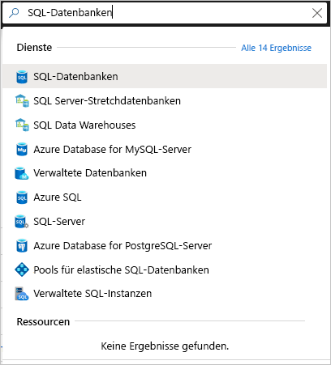
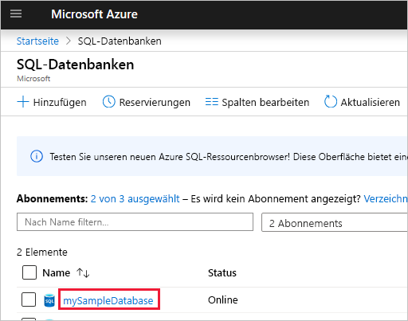
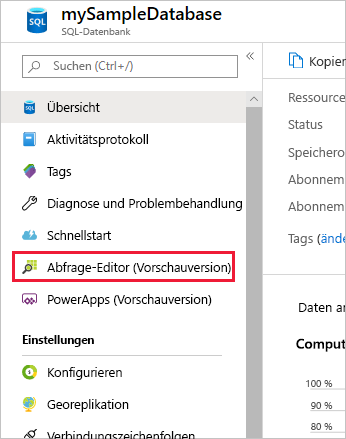
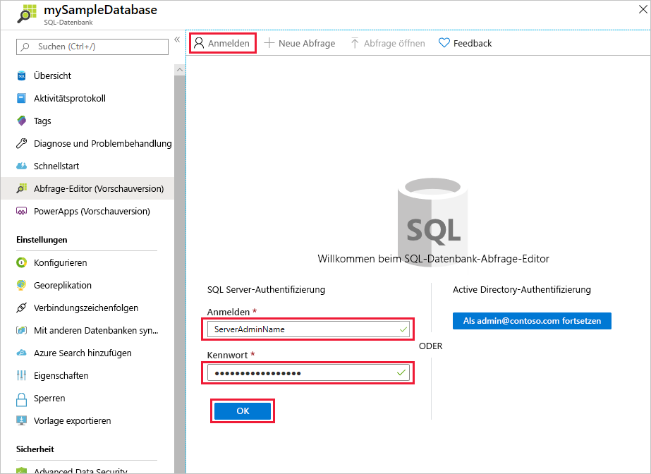
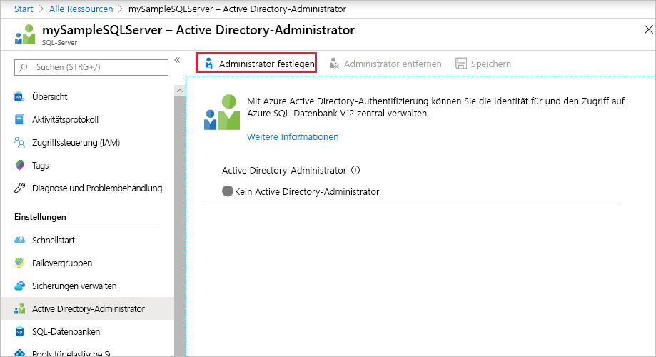
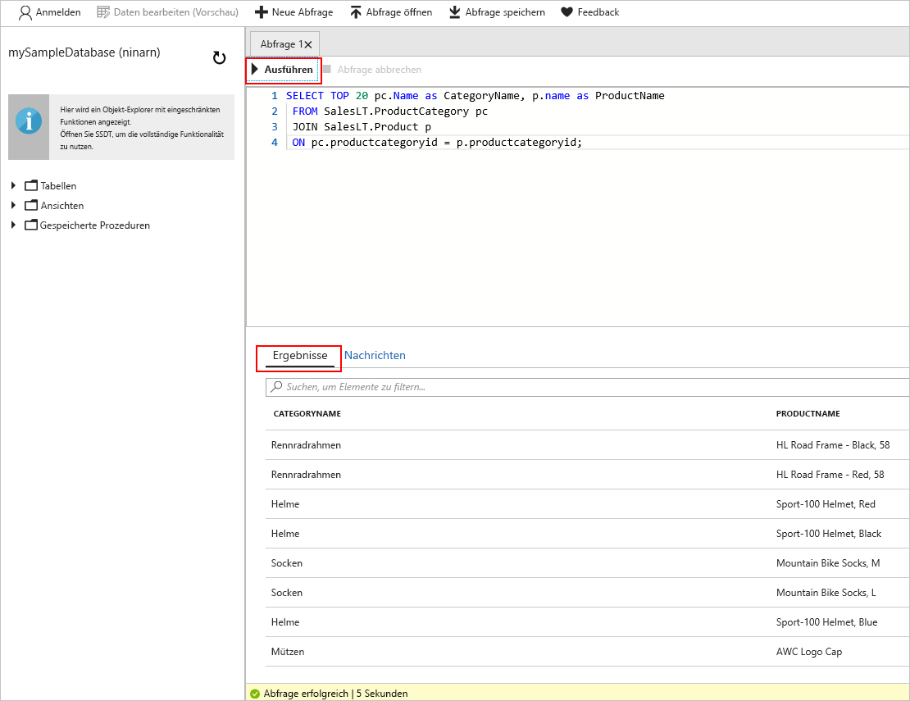

# <a name="quickstart-use-the-azure-portals-sql-query-editor-to-connect-and-query-data"></a>Schnellstart: Verwenden des SQL-Abfrage-Editors im Azure-Portal zum Verbinden und Abfragen von Daten

Der SQL-Abfrage-Editor ist ein Browsertool im Azure-Portal, über den einfach SQL-Abfragen für Ihre Azure SQL-Datenbank- oder Azure SQL Data Warehouse-Instanz ausgeführt werden können. In dieser Schnellstartanleitung verwenden Sie den Abfrage-Editor zum Herstellen einer Verbindung mit einer SQL-Datenbank und führen anschließend Transact-SQL-Anweisungen aus, um Daten abzufragen, einzufügen, zu aktualisieren und zu löschen.

## <a name="prerequisites"></a>Voraussetzungen

Für dieses Tutorial benötigen Sie Folgendes:

- Eine Azure SQL-Datenbank. In den folgenden Schnellstartanleitungen erfahren Sie jeweils, wie Sie eine Datenbank in Azure SQL-Datenbank erstellen und anschließend konfigurieren:

  || Einzeldatenbank |
  |:--- |:--- |
  | Erstellen| [Portal](sql-database-single-database-get-started.md) |
  || [BEFEHLSZEILENSCHNITTSTELLE (CLI)](scripts/sql-database-create-and-configure-database-cli.md) |
  || [PowerShell](scripts/sql-database-create-and-configure-database-powershell.md) |
  | Konfigurieren | [IP-Firewallregel auf Serverebene](sql-database-server-level-firewall-rule.md)|
  |||

> [!NOTE]
> Der Abfrage-Editor verwendet die Ports 443 und 1443 zum Kommunizieren.  Stellen Sie sicher, dass Sie ausgehenden HTTPS-Datenverkehr auf diesen Ports aktiviert haben. Sie müssen auch Ihre ausgehende IP-Adresse den Firewallzulassungsregeln des Servers hinzufügen, um auf Ihre Datenbanken und Data Warehouses zugreifen zu können.

## <a name="sign-in-the-azure-portal"></a>Anmelden beim Azure-Portal

Melden Sie sich beim [Azure-Portal](https://portal.azure.com/) an.

## <a name="connect-using-sql-authentication"></a>Herstellen einer Verbindung per SQL-Authentifizierung

1. Öffnen Sie das Azure-Portal, um eine Verbindung mit einer SQL-Datenbank herzustellen. Suchen Sie nach **SQL-Datenbanken**, und wählen Sie diese Option aus.

    

2. Wählen Sie Ihre SQL-Datenbank aus.

    

3. Wählen Sie im Menü **SQL-Datenbank** die Option **Abfrage-Editor (Vorschau)** aus.

    

4. Geben Sie auf der **Anmeldeseite** unter **SQL Server-Authentifizierung** die **Anmelde-ID** und das **Kennwort** des Serveradministratorkontos ein, das zum Erstellen der Datenbank verwendet wurde. Wählen Sie dann **OK**aus.

    

## <a name="connect-using-azure-active-directory"></a>Herstellen einer Verbindung mit Azure Active Directory

Wenn Sie einen Azure Active Directory-Administrator (Azure AD) konfigurieren, können Sie eine einzelne Identität verwenden, um sich beim Azure-Portal und bei Ihrer SQL-Datenbank anzumelden. Führen Sie die unten beschriebenen Schritte aus, um einen Azure AD-Administrator für Ihre SQL Server-Instanz zu konfigurieren.

> [!NOTE]
> * E-Mail-Konten (etwa „outlook.com“, „gmail.com“, „yahoo.com“ usw.) werden noch nicht als Azure AD-Administratoren unterstützt. Stellen Sie sicher, dass Sie einen Benutzer auswählen, der entweder nativ in Azure AD erstellt oder in einen Azure AD-Verbund eingefügt wurde.
> * Die Azure AD-Administratoranmeldung funktioniert nicht bei Konten, für die die zweistufige Authentifizierung aktiviert ist.

1. Wählen Sie im Azure-Portalmenü oder auf der **Startseite** die Option **Alle Ressourcen** aus.

2. Wählen Sie Ihre SQL Server-Instanz aus.

3. Wählen Sie im Menü **SQL Server** unter **Einstellungen** die Option **Active Directory-Administrator** aus.

4. Wählen Sie auf der Symbolleiste der Seite **Active Directory-Administrator** der SQL Server-Instanz die Option **Administrator festlegen** aus, und legen Sie dann den Benutzer oder die Gruppe als Azure AD-Administrator fest.

    

5. Geben Sie auf der Seite **Administrator hinzufügen** im Suchfeld einen Benutzer oder eine Gruppe ein, nach dem bzw. der Sie suchen möchten, und wählen Sie ihn bzw. sie als Administrator aus. Wählen Sie anschließend die Schaltfläche **Auswählen** aus.

6. Wählen Sie auf der Symbolleiste der Seite **Active Directory-Administrator** der SQL Server-Instanz die Option **Speichern** aus.

7. Wählen Sie im Menü **SQL Server** die Option **SQL-Datenbanken** und anschließend Ihre SQL-Datenbank aus.

8. Wählen Sie im Menü **SQL-Datenbank** die Option **Abfrage-Editor (Vorschau)** aus. Auf der **Anmeldeseite** wird für Azure AD-Administratoren unter **Active Directory-Authentifizierung** eine Meldung mit dem Hinweis angezeigt, dass sie angemeldet wurden. Wählen Sie dann die Schaltfläche **Als *\<Benutzer- oder Gruppen-ID> fortsetzen*** aus.

## <a name="view-data"></a>Anzeigen von Daten

1. Geben Sie nach der Authentifizierung im Abfrage-Editor die folgende SQL-Abfrage ein, um die Top 20 der Produkte nach Kategorie abzurufen.

   ```sql
    SELECT TOP 20 pc.Name as CategoryName, p.name as ProductName
    FROM SalesLT.ProductCategory pc
    JOIN SalesLT.Product p
    ON pc.productcategoryid = p.productcategoryid;
   ```

2. Wählen Sie auf der Symbolleiste **Ausführen** aus, und sehen Sie sich dann die Ausgabe im Bereich **Ergebnisse** an.

   

## <a name="insert-data"></a>Einfügen von Daten

Führen Sie die folgende [INSERT](https://msdn.microsoft.com/library/ms174335.aspx)-Transact-SQL-Anweisung aus, um in der Tabelle `SalesLT.Product` ein neues Produkt hinzuzufügen.

1. Ersetzen Sie die vorherige Abfrage durch diese.

    ```sql
    INSERT INTO [SalesLT].[Product]
           ( [Name]
           , [ProductNumber]
           , [Color]
           , [ProductCategoryID]
           , [StandardCost]
           , [ListPrice]
           , [SellStartDate]
           )
    VALUES
           ('myNewProduct'
           ,123456789
           ,'NewColor'
           ,1
           ,100
           ,100
           ,GETDATE() );
   ```


2. Wählen Sie **Ausführen**, um eine neue Zeile in die Tabelle `Product` einzufügen. Im Bereich **Nachrichten** wird folgende Meldung angezeigt: **Abfrage erfolgreich: Betroffene Zeilen: 1**.


## <a name="update-data"></a>Aktualisieren von Daten

Führen Sie die folgende [UPDATE](https://msdn.microsoft.com/library/ms177523.aspx)-Transact-SQL-Anweisung aus, um Ihr neues Produkt zu ändern.

1. Ersetzen Sie die vorherige Abfrage durch diese.

   ```sql
   UPDATE [SalesLT].[Product]
   SET [ListPrice] = 125
   WHERE Name = 'myNewProduct';
   ```

2. Wählen Sie **Ausführen**, um die angegebene Zeile in der Tabelle `Product` zu aktualisieren. Im Bereich **Nachrichten** wird folgende Meldung angezeigt: **Abfrage erfolgreich: Betroffene Zeilen: 1**.

## <a name="delete-data"></a>Löschen von Daten

Führen Sie die folgende [DELETE](https://msdn.microsoft.com/library/ms189835.aspx)-Transact-SQL-Anweisung aus, um das neue Produkt zu entfernen.

1. Ersetzen Sie die vorherige Abfrage durch diese:

   ```sql
   DELETE FROM [SalesLT].[Product]
   WHERE Name = 'myNewProduct';
   ```

2. Wählen Sie **Ausführen**, um die angegebene Zeile in der Tabelle `Product` zu löschen. Im Bereich **Nachrichten** wird folgende Meldung angezeigt: **Abfrage erfolgreich: Betroffene Zeilen: 1**.


## <a name="query-editor-considerations"></a>Aspekte des Abfrage-Editors

Bei der Verwendung des Abfrage-Editors sind ein paar Dinge zu beachten:

* Der Abfrage-Editor verwendet die Ports 443 und 1443 zum Kommunizieren.  Stellen Sie sicher, dass Sie ausgehenden HTTPS-Datenverkehr auf diesen Ports aktiviert haben. Sie müssen auch Ihre ausgehende IP-Adresse den Firewallzulassungsregeln des Servers hinzufügen, um auf Ihre Datenbanken und Data Warehouses zugreifen zu können.

* Durch Drücken von F5 wird die Seite des Abfrage-Editors aktualisiert, und aktuell bearbeitete Abfragen gehen verloren.

* Das Herstellen einer Verbindung mit der `master`-Datenbank wird vom Abfrage-Editor nicht unterstützt.

* Bei der Abfrageausführung gilt ein Timeout von fünf Minuten.

* Der Abfrage-Editor unterstützt für geografische Datentypen nur die zylindrische Projektion.

* Für Datenbanktabellen und -sichten ist keine IntelliSense-Unterstützung vorhanden. Der Editor unterstützt aber das automatische Vervollständigen von Namen, die bereits eingegeben wurden.


## <a name="next-steps"></a>Nächste Schritte

Weitere Informationen zur Unterstützung von Transact-SQL in Azure SQL-Datenbanken finden Sie unter [Auflösen von Transact-SQL-Unterschieden während der Migration zur SQL-Datenbank](sql-database-transact-sql-information.md).
