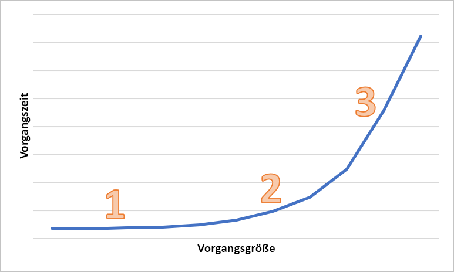

# Wartezeit in Blob Storage

Wartezeit wird gelegentlich auch als Antwortzeit bezeichnet und ist die Zeit, die eine Anwendung auf den Abschluss einer Anforderung warten muss. Die Wartezeit kann sich direkt auf die Leistung einer Anwendung auswirken. Eine kurze Wartezeit ist häufig wichtig in Szenarien mit menschlicher Interaktion – etwa bei Kreditkartentransaktionen oder beim Laden von Webseiten. Systeme, die eine hohe Verarbeitungsrate für Ereignisse benötigen (beispielsweise IoT-Ereignisse oder Protokollierung von Telemetriedaten) sind ebenfalls auf kurze Wartezeiten angewiesen. In diesem Artikel erfahren Sie, wie Sie die Wartezeit für Vorgänge in Blockblobs nachvollziehen und messen und wie Sie Anwendungen mit kurzer Wartezeit entwerfen.

In Azure Storage stehen für Blockblobs zwei verschiedene Leistungsoptionen zur Verfügung: „Premium“ und „Standard“. Premium-Blockblobs bieten dank SSD-Hochleistungsdatenträgern eine deutlich kürzere und konsistentere Wartezeit als Standard-Blockblobs. Weitere Informationen finden Sie im Artikel [Azure Blob Storage: Zugriffsebenen „Heiß“, „Kalt“ und „Archiv“](storage-blob-storage-tiers.md) unter **Blockblobspeicher mit Premium-Leistung**.

## Informationen zur Azure Storage-Wartezeit

Azure Storage-Wartezeit bezieht sich auf Anforderungsraten für Azure Storage-Vorgänge. Anforderungsraten werden auch als IOPS (Input/Output operations Per Second, Eingabe-/Ausgabevorgängen pro Sekunde) bezeichnet.

Bestimmen Sie zur Berechnung der Anforderungsrate zunächst die Zeitspanne bis zum Abschluss der einzelnen Anforderungen, und berechnen Sie anschließend, wie viele Anforderungen pro Sekunde verarbeitet werden können. Ein Beispiel: Angenommen, eine Anforderung dauert 50 Millisekunden (ms). Eine Anwendung, die einen einzelnen Thread mit einem einzelnen ausstehenden Lese- oder Schreibvorgang verwendet, sollte 20 IOPS erreichen (eine Sekunde bzw. 1.000 ms / 50 ms pro Anforderung). Wird die Threadanzahl auf zwei Threads verdoppelt, sollte die Anwendung theoretisch 40 IOPS erreichen. Werden die ausstehenden asynchronen Lese- oder Schreibvorgänge für jeden Thread auf zwei verdoppelt, sollte die Anwendung 80 IOPS erreichen.

In der Praxis werden Anforderungsraten allerdings nicht immer so linear skaliert, was auf den Zusatzaufwand des Clients (Aufgabenplanung, Kontextwechsel und Ähnliches) zurückzuführen ist. Auf der Dienstseite kann es abhängig von der Auslastung des Azure Storage-Systems sowie aufgrund von Unterschieden bei den verwendeten Speichermedien, Störungen durch andere Workloads, Wartungsaufgaben und anderen Faktoren zu Schwankungen bei der Wartezeit kommen. Und schließlich kann sich auch die Netzwerkverbindung zwischen Client und Server auf die Azure Storage-Wartezeit auswirken – etwa aufgrund von Überlastungen, Umleitungen oder anderen Faktoren.

Die Azure Storage-Bandbreite (auch Durchsatz genannt) bezieht sich auf die Anforderungsrate und kann durch Multiplizieren von Anforderungsrate (IOPS) und Anforderungsgröße berechnet werden. Ein Beispiel: Bei 160 Anforderungen pro Sekunde ergibt sich pro 256 KiB ein Durchsatz von 40.960 KiB pro Sekunde bzw. von 40 MiB pro Sekunde.

## Wartezeitmetriken für Blockblobs

In Azure Storage stehen zwei Wartezeitmetriken für Blockblobs zur Verfügung. Diese Metriken können im Azure-Portal angezeigt werden:

- **E2E-Latenz (End-to-End):** Misst das Intervall zwischen dem Eingang des ersten Pakets der Anforderung bei Azure Storage und dem Eingang einer Clientbestätigung bei Azure Storage im letzten Paket der Antwort.

- **Serverlatenz:** Misst das Intervall zwischen dem Eingang des letzten Pakets der Anforderung bei Azure Storage und der Rückgabe des ersten Pakets der Antwort von Azure Storage.

Die folgende Abbildung zeigt die **durchschnittliche E2E-Latenz bei Erfolg** und die **durchschnittliche Serverlatenz bei Erfolg** für eine Beispielworkload, die den Vorgang `Get Blob` aufruft:

Im Normalfall unterscheidet sich die End-to-End-Latenz nur geringfügig von der Serverlatenz, wie in der Abbildung für die Beispielworkload zu sehen.

Sollten Sie bei der Überprüfung Ihrer Metriken für End-to-End-Latenz und Serverlatenz feststellen, dass die End-to-End-Latenz erheblich höher ist als die Serverlatenz, gehen Sie der Sache auf den Grund, und beheben Sie die Ursache für die zusätzliche Wartezeit.

Wenn End-to-End-Latenz und Serverlatenz annähernd gleich sind, Sie aber eine kürzere Wartezeit benötigen, empfiehlt sich ggf. eine Migration zu Premium-Blockblobspeicher.

## Faktoren, die sich auf die Wartezeit auswirken

Die Wartezeit hängt in erster Linie von der Größe des Vorgangs ab. Große Vorgänge dauern länger, da mehr Daten über das Netzwerk übertragen und von Azure Storage verarbeitet werden müssen.

Das folgende Diagramm zeigt die Gesamtdauer unterschiedlich großer Vorgänge. Bei kleinen Datenmengen entfällt der Großteil des Wartezeitintervalls auf die Verarbeitung der Anforderung, nicht auf die Datenübertragung. Das Wartezeitintervall erhöht sich bei zunehmender Größe des Vorgangs nur geringfügig („1“ im Diagramm). Bei weiterer Zunahme des Vorgangsgröße erhöht sich die Dauer der Datenübertragung, sodass ein Teil des Wartezeitintervalls auf die Anforderungsverarbeitung und ein Teil auf die Datenübertragung entfällt („2“ im Diagramm). Bei größeren Vorgängen entfällt nahezu das gesamte Wartezeitintervall auf die Datenübertragung, während die Anforderungsverarbeitung nur noch eine untergeordnete Rolle spielt („3“ im Diagramm).

Auch Clientkonfigurationsfaktoren wie Parallelität und Threading haben Einfluss auf die Wartezeit. Der Gesamtdurchsatz hängt davon ab, wie viele Speicheranforderungen zu einem bestimmten Zeitpunkt aktiv sind und wie Ihre Anwendung das Threading handhabt. Clientressourcen wie CPU, Arbeitsspeicher, lokaler Speicher und Netzwerkschnittstellen können sich ebenfalls auf die Wartezeit auswirken.

Bei der Verarbeitung von Azure Storage Anforderungen werden CPU- und Arbeitsspeicherressourcen des Clients beansprucht. Wenn es beim Client aufgrund eines überlasteten virtuellen Computers oder eines Endlosprozesses im System zu einem Engpass kommt, stehen weniger Ressourcen für die Verarbeitung von Azure Storage Anforderungen zur Verfügung. Jeglicher Konflikt oder Mangel an Clientressourcen führt zu einer Erhöhung der End-to-End-Latenz. Die Serverlatenz bleibt in diesem Fall allerdings unverändert, wodurch sich der Abstand zwischen den beiden Metriken vergrößert.

Ebenso wichtig sind die Netzwerkschnittstelle und die Netzwerk-Pipe zwischen dem Client und Azure Storage. Die physische Entfernung allein kann erhebliche Auswirkungen haben – etwa, wenn sich ein virtueller Clientcomputer in einer anderen Azure-Region oder in der lokalen Umgebung befindet. Weitere mögliche Einflussfaktoren für die allgemeine Speicherwartezeit sind Netzwerkhops, ISP-Routing und Internetstatus.

Bestimmen Sie zur Bewertung der Wartezeit zunächst Baselinemetriken für Ihr Szenario. Bei Baselinemetriken handelt es sich um die erwarteten Werte für End-to-End-Latenz und Serverlatenz im Kontext Ihrer Anwendungsumgebung in Abhängigkeit von Ihrem Workloadprofil, Ihrer Anwendungskonfiguration, Ihren Clientressourcen, Ihrer Netzwerk-Pipe und anderen Faktoren. Baselinemetriken erleichtern die Unterscheidung zwischen ungewöhnlichen und normalen Bedingungen. Darüber hinaus können Sie anhand von Baselinemetriken die Auswirkungen von Parameteränderungen erkennen – etwa bei Änderungen der Anwendungskonfiguration oder der VM-Größe.

## Nächste Schritte

- [Skalierbarkeits- und Leistungsziele für Speicherkonten in Azure Storage](../common/storage-scalability-targets.md)
- [Checkliste zu Leistung und Skalierbarkeit von Microsoft Azure Storage](../common/storage-performance-checklist.md)
