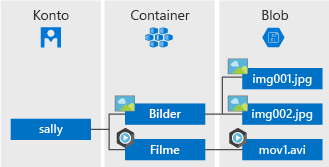

# <a name="quickstart-azure-blob-storage-client-library-for-net"></a>Schnellstart: Azure Blob Storage-Clientbibliothek für .NET

Erfahren Sie etwas über die ersten Schritte mit der Azure Blob Storage-Clientbibliothek für .NET. Azure Blob Storage ist die Objektspeicherlösung von Microsoft für die Cloud. Führen Sie die Schritte zum Installieren des Pakets aus, und testen Sie den Beispielcode für grundlegende Aufgaben. Blobspeicher ist für die Speicherung großer Mengen unstrukturierter Daten optimiert.

Mit der Azure Blob Storage-Clientbibliothek für .NET ist Folgendes möglich:

* Erstellen eines Containers
* Festlegen von Berechtigungen für einen Container
* Erstellen eines Blobs in Azure Storage
* Herunterladen des Blobs auf den lokalen Computer
* Auflisten aller Blobs in einem Container
* Löschen eines Containers

[API-Referenzdokumentation](https://docs.microsoft.com/dotnet/api/overview/azure/storage?view=azure-dotnet) | [Quellcode der Bibliothek](https://github.com/Azure/azure-storage-net/tree/master/Blob) | [Paket (NuGet)](https://www.nuget.org/packages/Microsoft.Azure.Storage.Blob/) | [Beispiele](https://azure.microsoft.com/resources/samples/?sort=0&service=storage&platform=dotnet&term=blob)

[!INCLUDE [storage-multi-protocol-access-preview](../../../includes/storage-multi-protocol-access-preview.md)]

## <a name="prerequisites"></a>Voraussetzungen

* Azure-Abonnement – [Erstellen eines kostenlosen Kontos](https://azure.microsoft.com/free/)
* Azure Storage-Konto – [Erstellen eines Speicherkontos](https://docs.microsoft.com/azure/storage/common/storage-quickstart-create-account)
* Aktuelles [.NET Core SDK](https://dotnet.microsoft.com/download/dotnet-core) für Ihr Betriebssystem. Laden Sie unbedingt das SDK und nicht die Runtime herunter.

## <a name="setting-up"></a>Einrichten

In diesem Abschnitt wird beschrieben, wie ein Projekt zur Verwendung mit der Azure Blob Storage-Clientbibliothek für .NET vorbereitet wird.

### <a name="create-the-project"></a>Erstellen des Projekts

Erstellen Sie zunächst eine .NET Core-Anwendung mit dem Namen *blob-quickstart*.

1. Verwenden Sie in einem Konsolenfenster (z. B. cmd, PowerShell oder Bash) den Befehl `dotnet new` zum Erstellen einer neuen Konsolen-App mit dem Namen *blob-quickstart*. Dieser Befehl erstellt ein einfaches „Hallo Welt“-C#-Projekt mit einer einzigen Quelldatei: *Program.cs*.

   ```console
   dotnet new console -n blob-quickstart
   ```

2. Wechseln Sie zum neu erstellten Ordner *blob-quickstart*, und erstellen Sie die App, um zu überprüfen, ob alles funktioniert.

   ```console
   cd blob-quickstart
   ```

   ```console
   dotnet build
   ```

Die erwartete Ausgabe aus dem Build sollte etwa wie folgt aussehen:

```output
C:\QuickStarts\blob-quickstart> dotnet build
Microsoft (R) Build Engine version 16.0.450+ga8dc7f1d34 for .NET Core
Copyright (C) Microsoft Corporation. All rights reserved.

  Restore completed in 44.31 ms for C:\QuickStarts\blob-quickstart\blob-quickstart.csproj.
  blob-quickstart -> C:\QuickStarts\blob-quickstart\bin\Debug\netcoreapp2.1\blob-quickstart.dll

Build succeeded.
    0 Warning(s)
    0 Error(s)

Time Elapsed 00:00:03.08
```

### <a name="install-the-package"></a>Installieren des Pakets

Installieren Sie im Anwendungsverzeichnis mit dem Befehl `dotnet add package` das Palet für die Azure Blob Storage-Clientbibliothek für .NET.

```console
dotnet add package Microsoft.Azure.Storage.Blob
```

### <a name="set-up-the-app-framework"></a>Einrichten des App-Frameworks

Über das Projektverzeichnis:

1. Öffnen Sie die Datei *Program.cs* im Editor.
2. Entfernen Sie die Anweisung `Console.WriteLine`.
3. Fügen Sie Anweisungen vom Typ `using` hinzu.
4. Erstellen Sie eine `ProcessAsync`-Methode, in der sich der Hauptcode für das Beispiel befindet.
5. Rufen Sie die Methode `ProcessAsync` asynchron über `Main` auf.

Der Code lautet wie folgt:

```csharp
using System;
using System.IO;
using System.Threading.Tasks;
using Microsoft.Azure.Storage;
using Microsoft.Azure.Storage.Blob;

namespace blob_quickstart
{
    class Program
    {
        public static void Main()
        {
            Console.WriteLine("Azure Blob Storage - .NET quickstart sample\n");

            // Run the examples asynchronously, wait for the results before proceeding
            ProcessAsync().GetAwaiter().GetResult();

            Console.WriteLine("Press any key to exit the sample application.");
            Console.ReadLine();
        }

        private static async Task ProcessAsync()
        {
        }
    }
}
```

### <a name="copy-your-credentials-from-the-azure-portal"></a>Kopieren Ihrer Anmeldeinformationen aus dem Azure-Portal

Wenn die Beispielanwendung eine Anforderung an Azure Storage sendet, muss diese autorisiert werden. Fügen Sie zum Autorisieren einer Anforderung die Anmeldeinformationen für Ihr Speicherkonto in Form einer Verbindungszeichenfolge hinzu. Führen Sie zum Anzeigen der Anmeldeinformationen Ihres Speicherkontos die folgenden Schritte aus:

1. Navigieren Sie zum [Azure-Portal](https://portal.azure.com).
2. Suchen Sie nach Ihrem Speicherkonto.
3. Wählen Sie im Abschnitt **Einstellungen** der Speicherkontoübersicht die Option **Zugriffsschlüssel**. Hier können Sie Ihre Kontozugriffsschlüssel und die vollständige Verbindungszeichenfolge für jeden Schlüssel anzeigen.
4. Suchen Sie unter **key1** nach dem Wert für die **Verbindungszeichenfolge**, und wählen Sie dann die Schaltfläche **Kopieren**, um die Verbindungszeichenfolge zu kopieren. Der Wert der Verbindungszeichenfolge wird in einem späteren Schritt einer Umgebungsvariablen hinzugefügt.

    

### <a name="configure-your-storage-connection-string"></a>Konfigurieren der Speicherverbindungszeichenfolge

Schreiben Sie die Verbindungszeichenfolge nach dem Kopieren in eine neue Umgebungsvariable auf dem lokalen Computer, auf dem die Anwendung ausgeführt wird. Öffnen Sie zum Festlegen der Umgebungsvariablen ein Konsolenfenster, und befolgen Sie die Anleitung für Ihr Betriebssystem. Ersetzen Sie `<yourconnectionstring>` durch Ihre Verbindungszeichenfolge.

#### <a name="windows"></a>Windows

```cmd
setx CONNECT_STR "<yourconnectionstring>"
```

Sie müssen nach dem Hinzufügen der Umgebungsvariablen unter Windows eine neue Instanz des Befehlsfensters öffnen.

#### <a name="linux"></a>Linux

```bash
export CONNECT_STR="<yourconnectionstring>"
```

#### <a name="macos"></a>macOS

```bash
export CONNECT_STR="<yourconnectionstring>"
```

Nachdem Sie die Umgebungsvariable hinzugefügt haben, starten Sie alle ausgeführten Programme neu, in denen die Umgebungsvariable gelesen werden muss. Starten Sie beispielsweise die Entwicklungsumgebung oder den Editor neu, bevor Sie fortfahren.

## <a name="object-model"></a>Objektmodell

Azure Blob Storage ist für die Speicherung großer Mengen unstrukturierter Daten optimiert. Unstrukturierte Daten sind Daten, die keinem bestimmten Datenmodell und keiner bestimmten Definition entsprechen (also beispielsweise Text- oder Binärdaten). Blob Storage bietet drei Typen von Ressourcen:

* Das Speicherkonto
* Einen Container im Speicherkonto
* Ein Blob in einem Container

Im folgenden Diagramm ist die Beziehung zwischen diesen Ressourcen dargestellt.



Verwenden Sie die folgenden .NET-Klassen zur Interaktion mit folgenden Ressourcen:

* [CloudStorageAccount:](/dotnet/api/microsoft.azure.storage.cloudstorageaccount) Die `CloudStorageAccount`-Klasse stellt Ihr Azure Storage-Konto dar. Verwenden Sie diese Klasse für den Zugriff auf Blob Storage mithilfe Ihrer Kontozugriffsschlüssel.
* [CloudBlobClient:](/dotnet/api/microsoft.azure.storage.blob.cloudblobclient) Die `CloudBlobClient`-Klasse gibt einen Zugriffspunkt für den Blob-Dienst im Code an.
* [CloudBlobContainer:](/dotnet/api/microsoft.azure.storage.blob.cloudblobcontainer) Die `CloudBlobContainer`-Klasse stellt einen Blobcontainer im Code dar.
* [CloudBlockBlob:](/dotnet/api/microsoft.azure.storage.blob.cloudblockblob) Das `CloudBlockBlob`-Objekt stellt ein Blockblob im Code dar. Blockblobs bestehen aus Datenblöcken, die einzeln verwaltet werden können.

## <a name="code-examples"></a>Codebeispiele

Mit den Beispielcodeausschnitten wird veranschaulicht, wie folgende Vorgänge mit der Azure Blob Storage-Clientbibliothek für .NET durchgeführt werden:

   * [Authentifizieren des Clients](#authenticate-the-client)
   * [Container erstellen](#create-a-container)
   * [Festlegen von Berechtigungen für einen Container](#set-permissions-on-a-container)
   * [Hochladen von Blobs in einen Container](#upload-blobs-to-a-container)
   * [Auflisten der Blobs in einem Container](#list-the-blobs-in-a-container)
   * [Herunterladen von Blobs](#download-blobs)
   * [Löschen eines Containers](#delete-a-container)

### <a name="authenticate-the-client"></a>Authentifizieren des Clients

Mit dem folgenden Code wird überprüft, ob die Umgebungsvariable eine Verbindungszeichenfolge enthält, die analysiert werden kann, um ein Objekt vom Typ [CloudStorageAccount](/dotnet/api/microsoft.azure.storage.cloudstorageaccount?view=azure-dotnet) zu erstellen, das auf das Speicherkonto verweist. Verwenden Sie die [TryParse](/dotnet/api/microsoft.azure.storage.cloudstorageaccount.tryparse?view=azure-dotnet)-Methode, um zu überprüfen, ob die Verbindungszeichenfolge gültig ist. Wenn `TryParse` erfolgreich ist, wird die Variable `storageAccount` initialisiert, und `true` wird zurückgegeben.

Fügen Sie diesen Code in der `ProcessAsync`-Methode hinzu:

```csharp
// Retrieve the connection string for use with the application. The storage 
// connection string is stored in an environment variable on the machine 
// running the application called CONNECT_STR. If the 
// environment variable is created after the application is launched in a 
// console or with Visual Studio, the shell or application needs to be closed
// and reloaded to take the environment variable into account.
string storageConnectionString = Environment.GetEnvironmentVariable("CONNECT_STR");

// Check whether the connection string can be parsed.
CloudStorageAccount storageAccount;
if (CloudStorageAccount.TryParse(storageConnectionString, out storageAccount))
{
    // If the connection string is valid, proceed with operations against Blob
    // storage here.
    // ADD OTHER OPERATIONS HERE
}
else
{
    // Otherwise, let the user know that they need to define the environment variable.
    Console.WriteLine(
        "A connection string has not been defined in the system environment variables. " +
        "Add an environment variable named 'CONNECT_STR' with your storage " +
        "connection string as a value.");
    Console.WriteLine("Press any key to exit the application.");
    Console.ReadLine();
}
```

> [!NOTE]
> Um die restlichen Vorgänge in diesem Artikel auszuführen, ersetzen Sie `// ADD OTHER OPERATIONS HERE` im Code oben durch die in den folgenden Abschnitten verwendeten Codeausschnitte.

### <a name="create-a-container"></a>Erstellen eines Containers

Erstellen Sie bei der Containererstellung zuerst eine Instanz des [CloudBlobClient](/dotnet/api/microsoft.azure.storage.blob.cloudblobclient)-Objekts, das auf Blobspeicher in Ihrem Speicherkonto verweist. Erstellen Sie als Nächstes eine Instanz des [CloudBlobContainer](/dotnet/api/microsoft.azure.storage.blob.cloudblobcontainer)-Objekts und anschließend den Container.

In diesem Fall wird im Code die [CreateAsync](/dotnet/api/microsoft.azure.storage.blob.cloudblobcontainer.createasync)-Methode aufgerufen, um den Container zu erstellen. Ein GUID-Wert wird an den Containernamen angehängt, um sicherzustellen, dass er eindeutig ist. In einer Produktionsumgebung ist es häufig besser, die [CreateIfNotExistsAsync](/dotnet/api/microsoft.azure.storage.blob.cloudblobcontainer.createifnotexistsasync)-Methode nur dann zum Erstellen eines Containers zu verwenden, wenn er noch nicht vorhanden ist.

> [!IMPORTANT]
> Die Containernamen müssen klein geschrieben werden. Weitere Informationen zum Benennen von Containern und Blobs finden Sie unter [Naming and Referencing Containers, Blobs, and Metadata](https://docs.microsoft.com/rest/api/storageservices/naming-and-referencing-containers--blobs--and-metadata) (Benennen von Containern, Blobs und Metadaten und Verweisen auf diese).

```csharp
// Create the CloudBlobClient that represents the 
// Blob storage endpoint for the storage account.
CloudBlobClient cloudBlobClient = storageAccount.CreateCloudBlobClient();

// Create a container called 'quickstartblobs' and 
// append a GUID value to it to make the name unique.
CloudBlobContainer cloudBlobContainer = 
    cloudBlobClient.GetContainerReference("quickstartblobs" + 
        Guid.NewGuid().ToString());
await cloudBlobContainer.CreateAsync();
```

### <a name="set-permissions-on-a-container"></a>Festlegen von Berechtigungen für einen Container

Legen Sie Berechtigungen für den Container fest, sodass alle Blobs im Container öffentlich sind. Wenn ein Blob öffentlich ist, kann darauf über jeden Client anonym zugegriffen werden.

```csharp
// Set the permissions so the blobs are public.
BlobContainerPermissions permissions = new BlobContainerPermissions
{
    PublicAccess = BlobContainerPublicAccessType.Blob
};
await cloudBlobContainer.SetPermissionsAsync(permissions);
```

### <a name="upload-blobs-to-a-container"></a>Hochladen von Blobs in einen Container

Im folgenden Codeausschnitt wird ein Verweis auf ein `CloudBlockBlob`-Objekt abgerufen, indem die [GetBlockBlobReference](/dotnet/api/microsoft.azure.storage.blob.cloudblobcontainer.getblockblobreference)-Methode für den im vorherigen Abschnitt erstellten Container aufgerufen wird. Anschließend wird die ausgewählte lokale Datei in das Blob hochgeladen, indem die [UploadFromFileAsync](/dotnet/api/microsoft.azure.storage.blob.cloudblockblob.uploadfromfileasync)-Methode aufgerufen wird. Mit dieser Methode wird das Blob erstellt, falls es nicht vorhanden ist, oder überschrieben, sofern es bereits vorhanden ist.

```csharp
// Create a file in your local MyDocuments folder to upload to a blob.
string localPath = Environment.GetFolderPath(Environment.SpecialFolder.MyDocuments);
string localFileName = "QuickStart_" + Guid.NewGuid().ToString() + ".txt";
string sourceFile = Path.Combine(localPath, localFileName);
// Write text to the file.
File.WriteAllText(sourceFile, "Hello, World!");

Console.WriteLine("Temp file = {0}", sourceFile);
Console.WriteLine("Uploading to Blob storage as blob '{0}'", localFileName);

// Get a reference to the blob address, then upload the file to the blob.
// Use the value of localFileName for the blob name.
CloudBlockBlob cloudBlockBlob = cloudBlobContainer.GetBlockBlobReference(localFileName);
await cloudBlockBlob.UploadFromFileAsync(sourceFile);
```

### <a name="list-the-blobs-in-a-container"></a>Auflisten der Blobs in einem Container

Listen Sie die Blobs im Container mithilfe der [ListBlobsSegmentedAsync](/dotnet/api/microsoft.azure.storage.blob.cloudblobcontainer.listblobssegmentedasync)-Methode auf. In diesem Fall wurde dem Container nur ein Blob hinzugefügt, sodass beim Auflisten auch nur ein Blob zurückgegeben wird.

Falls die Anzahl von zurückzugebenden Blobs für einen Aufruf zu hoch ist (standardmäßig > 5.000), gibt die `ListBlobsSegmentedAsync`-Methode ein Segment des gesamten Resultsets und ein Fortsetzungstoken zurück. Zum Abrufen des nächsten Blobsegments geben Sie das vom vorherigen Aufruf zurückgegebene Fortsetzungstoken an und fahren damit fort, bis das Fortsetzungstoken null ist. Ein Fortsetzungstoken von „null“ gibt an, dass alle Blobs abgerufen wurden. Im Code wird angezeigt, wie Sie das Fortsetzungstoken im Rahmen der bewährten Methoden einsetzen.

```csharp
// List the blobs in the container.
Console.WriteLine("List blobs in container.");
BlobContinuationToken blobContinuationToken = null;
do
{
    var results = await cloudBlobContainer.ListBlobsSegmentedAsync(null, blobContinuationToken);
    // Get the value of the continuation token returned by the listing call.
    blobContinuationToken = results.ContinuationToken;
    foreach (IListBlobItem item in results.Results)
    {
        Console.WriteLine(item.Uri);
    }
} while (blobContinuationToken != null); // Loop while the continuation token is not null.

```

### <a name="download-blobs"></a>Herunterladen von Blobs

Laden Sie das zuvor erstellte Blob mithilfe der [DownloadToFileAsync](/dotnet/api/microsoft.azure.storage.blob.cloudblob.downloadtofileasync)-Methode in das lokale Dateisystem herunter. Im Beispielcode wird das Suffix „_DOWNLOADED“ an den Blobnamen angefügt, damit beide Dateien im lokalen Dateisystem angezeigt werden können.

```csharp
// Download the blob to a local file, using the reference created earlier.
// Append the string "_DOWNLOADED" before the .txt extension so that you 
// can see both files in MyDocuments.
string destinationFile = sourceFile.Replace(".txt", "_DOWNLOADED.txt");
Console.WriteLine("Downloading blob to {0}", destinationFile);
await cloudBlockBlob.DownloadToFileAsync(destinationFile, FileMode.Create);
```

### <a name="delete-a-container"></a>Löschen eines Containers

Im folgenden Code werden die mit der App erstellten Ressourcen bereinigt, indem der gesamte Container mithilfe von [CloudBlobContainer.DeleteAsync](/dotnet/api/microsoft.azure.storage.blob.cloudblobcontainer.deleteasync) gelöscht wird. Sie können bei Bedarf auch die lokalen Dateien löschen.

```csharp
Console.WriteLine("Press the 'Enter' key to delete the example files, " +
    "example container, and exit the application.");
Console.ReadLine();
// Clean up resources. This includes the container and the two temp files.
Console.WriteLine("Deleting the container");
if (cloudBlobContainer != null)
{
    await cloudBlobContainer.DeleteIfExistsAsync();
}
Console.WriteLine("Deleting the source, and downloaded files");
File.Delete(sourceFile);
File.Delete(destinationFile);
```

## <a name="run-the-code"></a>Ausführen des Codes

Mit dieser App wird in Ihrem lokalen Ordner *MyDocuments* eine Testdatei erstellt und in Blob Storage hochgeladen. Anschließend werden im Beispiel die Blobs im Container aufgelistet, und die Datei wird mit einem neuen Namen heruntergeladen, damit Sie die alte und neue Datei vergleichen können.

Navigieren Sie andernfalls zu Ihrem Anwendungsverzeichnis, erstellen Sie die Anwendung, und führen Sie sie aus.

```console
dotnet build
```

```console
dotnet run
```

Die Ausgabe der Beispielanwendung ähnelt dem folgenden Beispiel:

```output
Azure Blob storage - .NET Quickstart example

Created container 'quickstartblobs33c90d2a-eabd-4236-958b-5cc5949e731f'

Temp file = C:\Users\myusername\Documents\QuickStart_c5e7f24f-a7f8-4926-a9da-96
97c748f4db.txt
Uploading to Blob storage as blob 'QuickStart_c5e7f24f-a7f8-4926-a9da-9697c748f
4db.txt'

Listing blobs in container.
https://storagesamples.blob.core.windows.net/quickstartblobs33c90d2a-eabd-4236-
958b-5cc5949e731f/QuickStart_c5e7f24f-a7f8-4926-a9da-9697c748f4db.txt

Downloading blob to C:\Users\myusername\Documents\QuickStart_c5e7f24f-a7f8-4926
-a9da-9697c748f4db_DOWNLOADED.txt

Press any key to delete the example files and example container.
```

Wenn Sie die **EINGABETASTE** drücken, löscht die Anwendung den Speichercontainer und die Dateien. Überprüfen Sie den Ordner *MyDocuments* vor dem Löschen auf die beiden Dateien. Sie können sie öffnen und sich vergewissern, dass sie identisch sind. Kopieren Sie die Blob-URL aus dem Konsolenfenster, und fügen Sie sie in einen Browser ein, um den Blobinhalt anzuzeigen.

Nachdem Sie die Dateien erfolgreich überprüft haben, drücken Sie eine beliebige Taste, um die Demo zu beenden und die Testdateien zu löschen.

## <a name="next-steps"></a>Nächste Schritte

In dieser Schnellstartanleitung wurde beschrieben, wie Sie Blobs per .NET hochladen, herunterladen und auflisten.

Informationen zum Erstellen einer Web-App, die ein Bild in Blob Storage hochlädt, finden Sie hier:

> [!div class="nextstepaction"]
> [Tutorial: Hochladen von Bilddaten in die Cloud mit Azure Storage](storage-upload-process-images.md)

* Weitere Informationen zu .NET Core finden Sie unter [Get started with .NET in 10 minutes](https://www.microsoft.com/net/learn/get-started/) (Einstieg in .NET in 10 Minuten).
* Eine Beispielanwendung, die Sie über Visual Studio für Windows bereitstellen können, finden Sie unter [.NET Photo Gallery Web Application Sample with Azure Blob Storage](https://azure.microsoft.com/resources/samples/storage-blobs-dotnet-webapp/) (Beispiel für .NET-Fotogalerie-Anwendung mit Azure Blob Storage).
