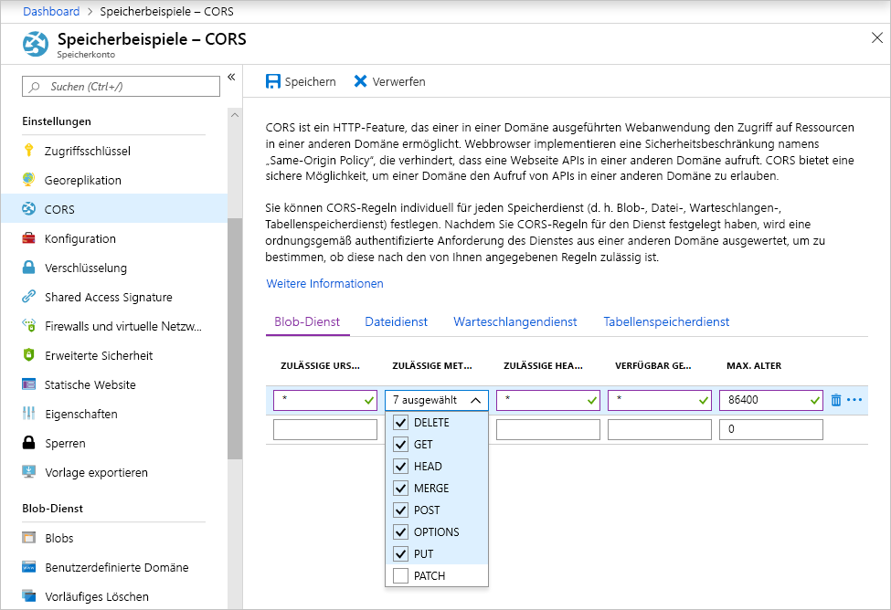

<!-- Customer intent: As a web application developer I want to interface with Azure Blob storage entirely on the client so that I can build a SPA application that is able to upload and delete files on blob storage. -->

# <a name="quickstart-upload-list-and-delete-blobs-using-azure-storage-v10-sdk-for-javascripthtml-in-the-browser"></a>Schnellstart: Hochladen, Auflisten und Löschen von Blobs mit Azure Storage v10 SDK für JavaScript/HTML im Browser

In diesem Schnellstart erfahren Sie, wie Sie die Bibliothek [Azure Storage SDK V10 für JavaScript – Blob](https://github.com/Azure/azure-sdk-for-js/tree/master/sdk/storage/storage-blob#readme) verwenden, um Blobs über vollständig im Browser ausgeführten JavaScript-Code zu verwalten. Der hier verwendete Ansatz zeigt, wie Sie erforderliche Sicherheitsmaßnahmen einsetzen, um den geschützten Zugriff auf Ihr Blobspeicherkonto sicherzustellen.

## <a name="prerequisites"></a>Voraussetzungen

[!INCLUDE [storage-quickstart-prereq-include](../../../includes/storage-quickstart-prereq-include.md)]

Die Azure Storage-JavaScript-Clientbibliotheken können nicht direkt über das Dateisystem verwendet werden und müssen von einem Webserver bereitgestellt werden. In diesem Thema wird [Node.js](https://nodejs.org) zum Starten eines Basisservers verwendet. Falls Sie Node nicht installieren möchten, können Sie auch eine andere Methode zum Ausführen eines lokalen Webservers verwenden.

Um die Schritte zum Debuggen ausführen zu können, brauchen Sie [Visual Studio Code](https://code.visualstudio.com) und entweder die Erweiterung [Debugger for Chrome](vscode:extension/msjsdiag.debugger-for-chrome) oder die Erweiterung [Debugger for Microsoft Edge](vscode:extension/msjsdiag.debugger-for-edge).

## <a name="setting-up-storage-account-cors-rules"></a>Einrichten von CORS-Regeln für das Speicherkonto

Damit Ihre Webanwendung vom Client aus auf einen Blobspeicher zugreifen kann, müssen Sie Ihr Konto so konfigurieren, dass [Cross-Origin Resource Sharing (CORS)](https://docs.microsoft.com/rest/api/storageservices/cross-origin-resource-sharing--cors--support-for-the-azure-storage-services) aktiviert ist.

Kehren Sie zum Azure-Portal zurück, und wählen Sie Ihr Speicherkonto aus. Navigieren Sie zum Definieren einer neuen CORS-Regel zum Abschnitt **Einstellungen**, und klicken Sie auf den Link **CORS**. Klicken Sie anschließend auf die Schaltfläche **Hinzufügen**, um das Fenster **CORS-Regel hinzufügen** zu öffnen. Im Rahmen dieser Schnellstartanleitung erstellen Sie eine offene CORS-Regel:



In der folgenden Tabelle werden die einzelnen CORS-Einstellungen beschrieben und die Definitionswerte der Regel erläutert:

|Einstellung  |Wert  | BESCHREIBUNG |
|---------|---------|---------|
| Zulässige Ursprünge | * | Akzeptiert eine kommagetrennte Liste mit Domänen, die als zulässige Ursprünge festgelegt werden. Wenn Sie den Wert auf `*` festlegen, wird allen Domänen Zugriff auf das Speicherkonto gewährt. |
| Zulässige Verben     | „delete“, „get“, „head“, „merge“, „post“, „options“ und „put“ | Listet die zulässigen HTTP-Verben für das Speicherkonto auf. Wählen Sie für diese Schnellstartanleitung alle verfügbaren Optionen aus. |
| Zulässige Header | * | Definiert eine Liste mit Anforderungsheadern (einschließlich Header mit Präfix), die vom Speicherkonto zugelassen werden. Wenn Sie den Wert auf `*` festlegen, wird allen Headern Zugriff gewährt. |
| Verfügbar gemachte Header | * | Listet die zulässigen Antwortheader für das Konto auf. Wenn Sie den Wert auf `*` festlegen, kann das Konto einen beliebigen Header senden.  |
| Maximales Alter (Sekunden) | 86.400 | Die maximale Zeit, für die der Browser die OPTIONS-Preflight-Anforderung zwischenspeichert. Bei Verwendung des Werts *86.400* bleibt der Cache einen ganzen Tag erhalten. |

> [!IMPORTANT]
> Achten Sie in einer Produktionsumgebung darauf, dass alle verwendeten Einstellungen jeweils nur ein Mindestmaß an Zugriff auf Ihr Speicherkonto gewähren, um einen sicheren Zugriff zu gewährleisten. Die hier beschriebenen CORS-Einstellungen definieren eine gemäßigte Sicherheitsrichtlinie und sind für eine Schnellstartanleitung angemessen. Sie sollten allerdings nicht in der Praxis verwendet werden.

Erstellen Sie als Nächstes mithilfe von Azure Cloud Shell ein Sicherheitstoken.

[!INCLUDE [Open the Azure cloud shell](../../../includes/cloud-shell-try-it.md)]

## <a name="create-a-shared-access-signature"></a>Erstellen einer SAS (Shared Access Signature)

Die SAS (Shared Access Signature) wird von dem im Browser ausgeführten Code verwendet, um Anforderungen an Blob Storage zu autorisieren. Mithilfe der SAS kann der Client den Zugriff auf Speicherressourcen ohne Kontozugriffsschlüssel oder Verbindungszeichenfolge autorisieren. Weitere Informationen zur SAS finden Sie unter [Verwenden von Shared Access Signatures (SAS)](../common/storage-dotnet-shared-access-signature-part-1.md).

Sie können eine SAS mithilfe der Azure-Befehlszeilenschnittstelle über Azure Cloud Shell, über das Azure-Portal oder über den Azure Storage-Explorer erstellen. In der folgenden Tabelle werden die Parameter beschrieben, für die Sie Werte angeben müssen, um eine SAS mithilfe der CLI zu generieren.

| Parameter      |BESCHREIBUNG  | Platzhalter |
|----------------|-------------|-------------|
| *expiry*       | Das Ablaufdatum des Zugriffstokens im Format JJJJ-MM-TT. Geben Sie im Rahmen dieser Schnellstartanleitung das morgige Datum ein. | *FUTURE_DATE* |
| *account-name* | Der Name des Speicherkontos. Verwenden Sie den Namen, den Sie sich in einem früheren Schritt notiert haben. | *YOUR_STORAGE_ACCOUNT_NAME* |
| *account-key*  | Der Speicherkontoschlüssel. Verwenden Sie den Schlüssel, den Sie sich in einem früheren Schritt notiert haben. | *YOUR_STORAGE_ACCOUNT_KEY* |

Verwenden Sie den folgenden CLI-Befehl mit tatsächlichen Werten für die einzelnen Platzhalter, um eine SAS zu erstellen, die Sie in Ihrem JavaScript-Code verwenden können.

```azurecli-interactive
az storage account generate-sas \
  --permissions racwdl \
  --resource-types sco \
  --services b \
  --expiry FUTURE_DATE \
  --account-name YOUR_STORAGE_ACCOUNT_NAME \
  --account-key YOUR_STORAGE_ACCOUNT_KEY
```

Die Reihe von Werten nach den einzelnen Parametern erscheint unter Umständen etwas kryptisch. Diese Parameterwerte setzen sich aus den Anfangsbuchstaben der jeweiligen Berechtigung zusammen. Die Herkunft der Werte wird in der folgenden Tabelle erläutert:

| Parameter        | Wert   | BESCHREIBUNG  |
|------------------|---------|---------|
| *Berechtigungen*    | racwdl  | Diese SAS umfasst Folgendes: *read* (Lesen), *append* (Anfügen), *create* (Erstellen), *write* (Schreiben), *delete* (Löschen) und *list* (Auflisten). |
| *resource-types* | sco     | Die SAS gilt für folgende Ressourcen: *service* (Dienst), *container* (Container) und *object* (Objekt). |
| *services*       | b       | Die SAS gilt für den *Blob-Dienst*. |

Nachdem die SAS generiert wurde, kopieren Sie den Rückgabewert, und speichern Sie ihn zur Verwendung in einem späteren Schritt. Wenn Sie Ihre SAS mit einer anderen Methode als der Azure-Befehlszeilenschnittstelle erstellt haben, müssen Sie ggf. das `?` entfernen. Dieses Zeichen ist ein URL-Trennzeichen, das in der URL-Vorlage weiter unten in diesem Thema (bei der SAS-Verwendung) bereits angegeben ist.

> [!IMPORTANT]
> Übergeben Sie SAS-Token in einer Produktionsumgebung immer unter Verwendung von SSL. SAS-Token sollten für die Rückgabe an Azure Blob Storage außerdem auf dem Server generiert und an die HTML-Seite gesendet werden. Eine Möglichkeit besteht darin, SAS-Funktionen mit einer serverlosen Funktion zu generieren. Im Azure-Portal stehen Funktionsvorlagen zur Verfügung, die die Generierung einer SAS mit einer JavaScript-Funktion ermöglichen.

## <a name="implement-the-html-page"></a>Implementieren der HTML-Seite

In diesem Abschnitt erstellen Sie eine einfache Webseite und konfigurieren VS Code für den Start und das Debuggen der Seite. Bevor der Start möglich ist, müssen Sie jedoch über Node.js einen lokalen Webserver starten und die Seite bereitstellen, wenn sie von Ihrem Browser angefordert wird. Als Nächstes fügen Sie JavaScript-Code hinzu, um verschiedene Blobspeicher-APIs aufzurufen und die Ergebnisse auf der Seite anzuzeigen. Die Ergebnisse dieser Aufrufe werden auch im [Azure-Portal](https://portal.azure.com), im [Azure Storage-Explorer](https://azure.microsoft.com/features/storage-explorer) und in der [Azure Storage-Erweiterung](vscode:extension/ms-azuretools.vscode-azurestorage) für VS Code angezeigt.

### <a name="set-up-the-web-application"></a>Einrichten der Webanwendung

Erstellen Sie zunächst einen neuen Ordner namens *azure-blobs-javascript*, und öffnen Sie ihn in Visual Studio Code. Erstellen Sie dann eine neue Datei in VS Code, fügen Sie den folgenden HTML-Code hinzu, und speichern Sie die Datei als *index.html* im Ordner *azure-blobs-javascript*.

```html
<!DOCTYPE html>
<html>

<body>
    <button id="create-container-button">Create container</button>
    <button id="delete-container-button">Delete container</button>
    <button id="select-button">Select and upload files</button>
    <input type="file" id="file-input" multiple style="display: none;" />
    <button id="list-button">List files</button>
    <button id="delete-button">Delete selected files</button>
    <p><b>Status:</b></p>
    <p id="status" style="height:160px; width: 593px; overflow: scroll;" />
    <p><b>Files:</b></p>
    <select id="file-list" multiple style="height:222px; width: 593px; overflow: scroll;" />
</body>

<!-- You'll add code here later in this quickstart. -->

</html>
```

### <a name="configure-the-debugger"></a>Konfigurieren des Debuggers

Wählen Sie zum Einrichten der Debuggererweiterung in VS Code die Optionen **Debuggen > Konfiguration hinzufügen**, und wählen Sie dann **Chrome** bzw. **Microsoft Edge** aus, je nachdem, welche Erweiterung Sie oben im Abschnitt „Voraussetzungen“ installiert haben. Durch diese Aktion wird eine Datei *launch.json* erstellt und im Editor geöffnet.

Ändern Sie als Nächstes die Datei *launch.json* so, dass der `url`-Wert `/index.html` enthält:

```json
{
    // Use IntelliSense to learn about possible attributes.
    // Hover to view descriptions of existing attributes.
    // For more information, visit: https://go.microsoft.com/fwlink/?linkid=830387
    "version": "0.2.0",
    "configurations": [
        {
            "type": "chrome",
            "request": "launch",
            "name": "Launch Chrome against localhost",
            "url": "http://localhost:8080/index.html",
            "webRoot": "${workspaceFolder}"
        }
    ]
}
```

Diese Konfiguration weist VS Code an, den gewünschten Browser zu starten und die gewünschte URL zu laden.

### <a name="launch-the-web-server"></a>Starten des Webservers

Um den lokalen Node.js-Webserver zu starten, wählen Sie **Ansicht > Terminal** aus, um in VS Code ein Konsolenfenster öffnen, und geben Sie dann den folgenden Befehl ein.

```console
npx http-server
```

Dieser Befehl installiert das *http-server*-Paket und startet den Server, um den aktuellen Ordner über Standard-URLs (einschließlich der im vorherigen Schritt angegeben) verfügbar zu machen.

### <a name="start-debugging"></a>Starten des Debugvorgangs

Um *index.html* im Browser mit angefügtem VS Code-Debugger zu starten, wählen Sie **Debuggen > Debuggen starten**, oder drücken Sie F5 in Visual Studio Code.

Die angezeigte Benutzeroberfläche führt noch keine Vorgänge aus, aber Sie fügen im folgenden Abschnitt JavaScript-Code hinzu, um die einzelnen gezeigten Funktionen zu implementieren. Anschließend können Sie Haltepunkte festlegen und mit dem Debugger interagieren, wenn er auf Ihrem Code angehalten ist.

Wenn Sie Änderungen an *index.html* vornehmen, achten Sie darauf, die Seite neu zu laden, um die Änderungen im Browser anzuzeigen. Sie können in VS Code auch **Debuggen > Debuggen erneut starten** auswählen oder STRG + UMSCHALT + F5 drücken.

### <a name="add-the-blob-storage-client-library"></a>Hinzufügen der Clientbibliothek für Blobspeicher

Um Aufrufe an die Blobspeicher-API zu aktivieren, laden Sie zuerst [Azure Storage SDK für JavaScript – Blobclientbibliothek](https://aka.ms/downloadazurestoragejsblob) herunter, extrahieren Sie den Inhalt der ZIP-Datei, und legen Sie die Datei *azure-storage.blob.js* im Ordner *azure-blobs-javascript* ab.

Fügen Sie dann in *index.html* nach dem schließenden `</body>`-Tag den folgenden HTML-Code ein, und ersetzen Sie dadurch den Platzhalterkommentar.

```html
<script src="azure-storage.blob.js" charset="utf-8"></script>

<script>
// You'll add code here in the following sections.
</script>
```

Dieser Code fügt einen Verweis auf die Skriptdatei hinzu und bietet Platz für Ihren eigenen JavaScript-Code. Im Rahmen dieses Schnellstarts verwenden wir die Skriptdatei *azure-storage.blob.js*, damit Sie sie in VS Code öffnen, ihren Inhalt lesen und Haltepunkte festlegen können. In einer Produktionsumgebung sollten Sie die kompaktere Datei *azure-storage.blob.min.js* verwenden, die ebenfalls in der ZIP-Datei enthalten ist.

In der [Referenzdokumentation](https://docs.microsoft.com/javascript/api/%40azure/storage-blob/index) finden Sie weitere Informationen zu den einzelnen Blobspeicherfunktionen. Beachten Sie, dass einige der Funktionen im SDK nur in Node.js oder nur im Browser verfügbar sind.

Der Code in *azure-storage.blob.js* exportiert eine globale Variable namens `azblob`, die Sie im JavaScript-Code für den Zugriff auf die Blobspeicher-APIs verwenden.

### <a name="add-the-initial-javascript-code"></a>Hinzufügen des anfänglichen JavaScript-Codes

Als Nächstes fügen Sie den folgenden Code in das `<script>`-Element im vorherigen Codeblock ein und ersetzen dadurch den Platzhalterkommentar.

```javascript
const createContainerButton = document.getElementById("create-container-button");
const deleteContainerButton = document.getElementById("delete-container-button");
const selectButton = document.getElementById("select-button");
const fileInput = document.getElementById("file-input");
const listButton = document.getElementById("list-button");
const deleteButton = document.getElementById("delete-button");
const status = document.getElementById("status");
const fileList = document.getElementById("file-list");

const reportStatus = message => {
    status.innerHTML += `${message}<br/>`;
    status.scrollTop = status.scrollHeight;
}
```

Dieser Code erstellt Felder für die einzelnen HTML-Elemente, die vom folgenden Code verwendet werden, und implementiert eine `reportStatus`-Funktion zum Anzeigen der Ausgabe.

In den folgenden Abschnitten fügen Sie jeden neuen Block mit JavaScript-Code hinter dem vorherigen Block hinzu.

### <a name="add-your-storage-account-info"></a>Hinzufügen Ihrer Speicherkontoinformationen

Fügen Sie als Nächstes Code für den Zugriff auf Ihr Speicherkonto hinzu, indem Sie die Platzhalter durch Ihren Kontonamen und die SAS ersetzen, die Sie in einem vorherigen Schritt generiert haben.

```javascript
const accountName = "<Add your storage account name>";
const sasString = "<Add the SAS you generated earlier>";
const containerName = "testcontainer";
const containerURL = new azblob.ContainerURL(
    `https://${accountName}.blob.core.windows.net/${containerName}?${sasString}`,
    azblob.StorageURL.newPipeline(new azblob.AnonymousCredential)));
```

Dieser Code verwendet Ihre Kontoinformationen und die SAS zum Erstellen einer [ContainerURL](https://docs.microsoft.com/javascript/api/@azure/storage-blob/ContainerURL)-Instanz, die zum Erstellen und Bearbeiten eines Speichercontainers nützlich ist.

### <a name="create-and-delete-a-storage-container"></a>Erstellen und Löschen eines Speichercontainers

Als Nächstes fügen Sie Code hinzu, mit dem der Speichercontainer erstellt oder gelöscht wird, wenn Sie auf die entsprechende Schaltfläche klicken.

```javascript
const createContainer = async () => {
    try {
        reportStatus(`Creating container "${containerName}"...`);
        await containerURL.create(azblob.Aborter.none);
        reportStatus(`Done.`);
    } catch (error) {
        reportStatus(error.body.message);
    }
};

const deleteContainer = async () => {
    try {
        reportStatus(`Deleting container "${containerName}"...`);
        await containerURL.delete(azblob.Aborter.none);
        reportStatus(`Done.`);
    } catch (error) {
        reportStatus(error.body.message);
    }
};

createContainerButton.addEventListener("click", createContainer);
deleteContainerButton.addEventListener("click", deleteContainer);
```

Dieser Code ruft die [create](https://docs.microsoft.com/javascript/api/@azure/storage-blob/ContainerURL#create-aborter--icontainercreateoptions-) und [delete](https://docs.microsoft.com/javascript/api/@azure/storage-blob/ContainerURL#delete-aborter--icontainerdeletemethodoptions-)-Funktionen von ContainerURL auf, ohne eine [Aborter](https://docs.microsoft.com/javascript/api/@azure/storage-blob/aborter)-Instanz zu verwenden. Um diesen Schnellstart zu vereinfachen, wird in diesem Code davon ausgegangen, dass Ihr Speicherkonto erstellt wurde und aktiviert ist. Verwenden Sie im Produktionscode eine Aborter-Instanz, um die Timeoutfunktionalität hinzuzufügen.

### <a name="list-blobs"></a>Auflisten von Blobs

Fügen Sie anschließend Code hinzu, um den Inhalt des Speichercontainers aufzulisten, wenn Sie die Schaltfläche **List files** (Dateien auflisten) auswählen.

```javascript
const listFiles = async () => {
    fileList.size = 0;
    fileList.innerHTML = "";
    try {
        reportStatus("Retrieving file list...");
        let marker = undefined;
        do {
            const listBlobsResponse = await containerURL.listBlobFlatSegment(
                azblob.Aborter.none, marker);
            marker = listBlobsResponse.nextMarker;
            const items = listBlobsResponse.segment.blobItems;
            for (const blob of items) {
                fileList.size += 1;
                fileList.innerHTML += `<option>${blob.name}</option>`;
            }
        } while (marker);
        if (fileList.size > 0) {
            reportStatus("Done.");
        } else {
            reportStatus("The container does not contain any files.");
        }
    } catch (error) {
        reportStatus(error.body.message);
    }
};

listButton.addEventListener("click", listFiles);
```

Dieser Code ruft die [ContainerURL.listBlobFlatSegment](https://docs.microsoft.com/javascript/api/@azure/storage-blob/ContainerURL#listblobflatsegment-aborter--string--icontainerlistblobssegmentoptions-)-Funktion in einer Schleife auf, um sicherzustellen, dass alle Segmente abgerufen werden. Für jedes Segment durchläuft diese Funktion die Liste der enthaltenen Blobelemente und aktualisiert die Liste **Files** (Dateien).

### <a name="upload-blobs"></a>Hochladen von Blobs

Fügen Sie als Nächstes den Code hinzu, mit dem Dateien in den Speichercontainer hochgeladen werden, wenn Sie die Schaltfläche **Select and upload files** (Dateien auswählen und hochladen) auswählen.

```javascript
const uploadFiles = async () => {
    try {
        reportStatus("Uploading files...");
        const promises = [];
        for (const file of fileInput.files) {
            const blockBlobURL = azblob.BlockBlobURL.fromContainerURL(containerURL, file.name);
            promises.push(azblob.uploadBrowserDataToBlockBlob(
                azblob.Aborter.none, file, blockBlobURL));
        }
        await Promise.all(promises);
        reportStatus("Done.");
        listFiles();
    } catch (error) {
        reportStatus(error.body.message);
    }
}

selectButton.addEventListener("click", () => fileInput.click());
fileInput.addEventListener("input", uploadFiles);
```

Dieser Code verbindet die Schaltfläche **Select and upload files** (Dateien auswählen und hochladen) mit dem ausgeblendeten `file-input`-Element. Auf diese Weise löst das Schaltflächen-`click`-Ereignis das Dateieingabe-`click`-Ereignis aus und zeigt die Dateiauswahl an. Nachdem Sie Dateien ausgewählt und das Dialogfeld geschlossen haben, tritt das `input`-Ereignis auf, und die `uploadFiles`-Funktion wird aufgerufen. Diese Funktion ruft die nur im Browser verfügbare Funktion [UploadBrowserDataToBlockBlob](https://docs.microsoft.com/javascript/api/@azure/storage-blob/#uploadbrowserdatatoblockblob-aborter--blob---arraybuffer---arraybufferview--blockbloburl--iuploadtoblockbloboptions-) für jede Datei auf, die Sie ausgewählt haben. Jeder Aufruf gibt eine Zusicherung (Promise) zurück, die einer Liste hinzugefügt wird. So ist für alle gleichzeitig ein await-Vorgang möglich, sodass die Dateien parallel hochgeladen werden.

### <a name="delete-blobs"></a>Löschen von Blobs

Fügen Sie als Nächstes den Code hinzu, mit dem Dateien aus dem Speichercontainer gelöscht werden, wenn Sie die Schaltfläche **Delete selected files** (Ausgewählte Dateien löschen) auswählen.

```javascript
const deleteFiles = async () => {
    try {
        if (fileList.selectedOptions.length > 0) {
            reportStatus("Deleting files...");
            for (const option of fileList.selectedOptions) {
                const blobURL = azblob.BlobURL.fromContainerURL(containerURL, option.text);
                await blobURL.delete(azblob.Aborter.none);
            }
            reportStatus("Done.");
            listFiles();
        } else {
            reportStatus("No files selected.");
        }
    } catch (error) {
        reportStatus(error.body.message);
    }
};

deleteButton.addEventListener("click", deleteFiles);
```

Dieser Code ruft die Funktion [BlobURL.delete](https://docs.microsoft.com/javascript/api/@azure/storage-blob/BlobURL#delete-aborter--iblobdeleteoptions-) auf, um die in der Liste ausgewählten Dateien zu entfernen. Anschließend wird die weiter oben gezeigte `listFiles`-Funktion aufgerufen, um den Inhalt der Liste **Files** (Dateien) zu aktualisieren.

### <a name="run-and-test-the-web-application"></a>Ausführen und Testen der Webanwendung

Zu diesem Zeitpunkt können Sie die Seite und das Experiment starten, um ein Gefühl für die Funktionsweise von Blobspeicher zu erhalten. Wenn Fehler auftreten (z. B. wenn Sie die Dateien aufzulisten versuchen, bevor Sie den Container erstellt haben), wird im Bereich **Status** die empfangene Fehlermeldung angezeigt. Sie können auch Haltepunkte im JavaScript-Code festlegen, um die von den Speicher-APIs zurückgegebenen Werte zu überprüfen.

## <a name="clean-up-resources"></a>Bereinigen von Ressourcen

Um die in diesem Schnellstart erstellten Ressourcen zu bereinigen, wechseln Sie zum [Azure-Portal](https://portal.azure.com), und löschen Sie die Ressourcengruppe, die Sie im Abschnitt „Voraussetzungen“ erstellt haben.

## <a name="next-steps"></a>Nächste Schritte

In diesem Schnellstart haben Sie eine einfache Website erstellt, die über browserbasiertes JavaScript auf Blobspeicher zugreift. Um zu erfahren, wie Sie eine Website selbst in Blobspeicher hosten können, fahren Sie mit dem folgenden Tutorial fort:

> [!div class="nextstepaction"]
> [Hosten einer statischen Website in Blob Storage](https://docs.microsoft.com/azure/storage/blobs/storage-blob-static-website-host)
