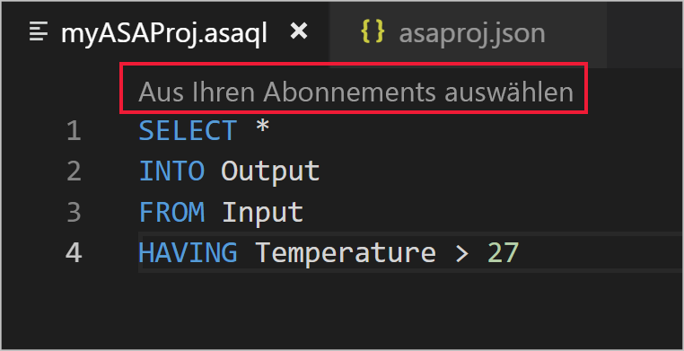

# Kopieren oder Sichern von Azure Stream Analytics-Aufträgen

Sie können Ihre bereitgestellten Azure Stream Analytics-Aufträge mit Visual Studio Code oder Visual Studio kopieren oder sichern. 

## Voraussetzungen
* Wenn Sie kein Azure-Abonnement besitzen, können Sie ein [kostenloses Konto](https://azure.microsoft.com/free/) erstellen.

* Melden Sie sich beim [Azure-Portal](https://portal.azure.com/) an.

* Installieren Sie die [Azure Stream Analytics-Erweiterung für Visual Studio Code](https://docs.microsoft.com/azure/stream-analytics/quick-create-vs-code#install-the-azure-stream-analytics-extension) oder die [Azure Stream Analytics-Tools für Visual Studio](https://docs.microsoft.com/azure/stream-analytics/quick-create-vs-code#install-the-azure-stream-analytics-extension).  

## Visual Studio Code 

1. Klicken Sie auf der Aktivitätsleiste von Visual Studio Code auf das **Azure**-Symbol, und erweitern Sie dann den Knoten **Stream Analytics**. Ihre Aufträge sollten unter Ihren Abonnements angezeigt werden.

   

2. Suchen Sie den zu exportierenden Auftrag im **Stream Analytics-Explorer** in Visual Studio Code, um einen Auftrag in ein lokales Projekt zu exportieren. Wählen Sie dann einen Ordner für Ihr Projekt aus. 

    

    Das Projekt wird in den von Ihnen ausgewählten Ordner exportiert und zu Ihrem aktuellen Arbeitsbereich hinzugefügt.

    

3. Um den Auftrag in einer anderen Region zu veröffentlichen oder unter einem anderen Namen zu sichern, wählen Sie **Zum Veröffentlichen aus Ihren Abonnements auswählen** im Abfrage-Editor (\*.asaql) aus, und befolgen Sie die Anweisungen. 

    

## Visual Studio 

1. Befolgen Sie die [Anweisungen zum Exportieren eines bereitgestellten Azure Stream Analytics-Auftrags zu einem Projekt](https://docs.microsoft.com/azure/stream-analytics/stream-analytics-vs-tools#export-jobs-to-a-project). 

2. Öffnen Sie im Abfrage-Editor die \*.asaql-Datei, wählen Sie **An Azure übermitteln** im Skript-Editor aus, und befolgen Sie die Anweisungen, um den Auftrag in einer anderen Region zu veröffentlichen oder unter einem neuen Namen zu sichern. 

## Nächste Schritte

* [Schnellstart: Erstellen eines Stream Analytics-Auftrags mithilfe von Visual Studio Code](quick-create-vs-code.md)
* [Schnellstart: Erstellen eines Stream Analytics-Auftrags mithilfe von Visual Studio](stream-analytics-quick-create-vs.md)
* [Bereitstellen eines Azure Stream Analytics-Auftrags mit CI/CD mithilfe von Azure Pipelines](stream-analytics-tools-visual-studio-cicd-vsts.md)