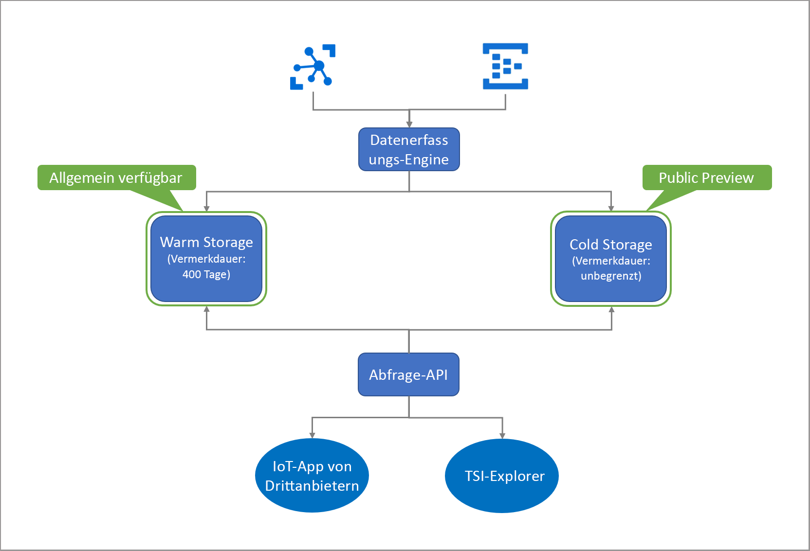

# Was ist Azure Time Series Insights (Vorschauversion)?

Azure Time Series Insights (Vorschauversion) ist ein End-to-End-PaaS-Angebot (Platform-as-a-Service). Sie können damit Daten auf IoT-Niveau (Internet der Dinge) sammeln, verarbeiten, speichern, analysieren und abfragen – Daten, die stark kontextualisiert und für Zeitreihen optimiert sind. 

Time Series Insights ist für die Ad-hoc-Datenuntersuchungen und Betriebsanalyse konzipiert. Hierbei handelt es sich um ein speziell erweiterbares und angepasstes Dienstangebot, das für die weit reichenden Anforderungen von IoT-Bereitstellungen in der Industrie konzipiert ist.

## Video

Weitere Informationen zur Vorschauversion von Azure Time Series Insights.

> [!VIDEO https://channel9.msdn.com/Shows/Internet-of-Things-Show/Azure-Time-Series-Insights-e2e-solution-for-industrial-IoT-analytics/player]

## Definition von IoT-Daten

Industrielle IoT-Daten in ressourcenintensiven Unternehmen weisen aufgrund der Vielfalt der Geräte und Sensoren in einer Industrieumgebung oft keine strukturelle Konsistenz auf. Daten aus diesen Datenströme weisen erhebliche Lücken und gelegentlich beschädigte Signale sowie fehlerhafte Messwerte auf. IoT-Daten sind häufig im Kontext zusätzlicher Daten sinnvoll, die von Erstanbieterquellen wie CRM oder ERP stammen, die den Kontext für End-to-End-Workflows hinzufügen. Eingaben aus Datenquellen von Drittanbietern (z. B. Wetterdaten) können helfen, Telemetriedatenströme in einer bestimmten Installation zu erweitern. 

All dies bedeutet, dass nur ein Bruchteil der Daten für betriebliche und geschäftliche Zwecke verwendet wird und die Analyse eine Kontextualisierung erfordert. Industrielle Daten werden oft für eine detaillierte Analyse über einen längeren Zeitraum historisiert, um Trends zu verstehen und zu korrelieren. Erfasste IoT-Daten in verwertbare Erkenntnisse umzuwandeln, setzt voraus: 

* Datenverarbeitung zum Bereinigen, Filtern, Interpolieren, Transformieren und Aufbereiten von Daten für die Analyse.
* Eine Struktur, damit eine Navigation durch die Daten möglich ist und diese verstanden werden können, d. h. für die Normalisierung und Kontextualisierung der Daten.
* Kostengünstige Speicherung zur langen bzw. endlosen Aufbewahrung von verarbeiteten (oder abgeleiteten) Daten und Rohdaten.

Diese Daten bieten konsistente, umfassende, aktuelle und korrekte Informationen für Geschäftsanalysen und -berichte.

Die folgende Abbildung zeigt einen typischen IoT-Datenfluss.

## Azure Time Series Insights für industrielle IoT-Daten

Die IoT-Landschaft ist vielfältig, mit Kunden aus den verschiedensten Branchen wie Fertigung, Autoindustrie, Energie, Versorgung, intelligente Gebäude und Beratung. In diesem breiten Spektrum des industriellen IoT-Markts entwickeln sich weiterhin cloudbasierte Lösungen, die umfassende Analysen für umfangreiche IoT-Daten anbieten. 

Azure Time Series Insights bedient diese Marktanforderungen, indem es eine schlüsselfertige, durchgängige IoT-Analyselösung mit umfangreicher semantischer Modellierung zur Kontextualisierung von Zeitreihendaten, ressourcenbasierten Erkenntnissen und einer erstklassigen Benutzererfahrung für Ermittlung, Trendanalyse, Anomalieerkennung und Operational Intelligence bietet. 

Als umfassende operative Analyseplattform in Kombination mit unseren interaktiven Funktionen zur Datenuntersuchung können Sie Time Series Insights zum Ableiten eines höheren Nutzens aus Daten verwenden, die über IoT-Ressourcen erfasst wurden. Die Vorschau unterstützt: 

* Mehrschichtige Speicherlösung mit Unterstützung von „warmen“ und „kalten“ Analysen, die dem Kunden die Möglichkeit bietet, Daten für interaktive Analysen anhand „warmer“ Daten sowie Operational Intelligence über historische Daten, die über Jahrzehnte erfasst wurden, zwischen „warm“ und „kalt“ zu leiten. 

    *   Eine hochgradig interaktive, „warme“ Analyselösung zur Durchführung häufiger und umfangreicher Abfragen über kürzere Zeiträume hinweg. 
    *   Ein skalierbarer, leistungsstarker und kostenoptimierter Zeitreihen-Data Lake auf Basis von Azure Storage, der es Kunden ermöglicht, Zeitreihendaten aus mehreren Jahren in Sekundenschnelle zu erfassen. 

* Unterstützung des Semantikmodells zur Beschreibung der Domänen- und Metadaten, die den abgeleiteten und unformatierten Signalen von Ressourcen und Geräten zugeordnet sind.

* Flexible Analyseplattform zur Speicherung historischer Zeitreihendaten in einem kundeneigenen Azure Storage-Konto, wodurch die IoT-Daten im Besitz der Kunden bleiben. Die Daten werden im Open-Source-Apache Parquet-Format gespeichert, das die Konnektivität und Interoperabilität über eine Vielzahl von Datenszenarien hinweg ermöglicht, einschließlich Predictive Analytics, maschinelles Lernen und anderer benutzerdefinierter Berechnungen, die mit bekannten Technologien wie Spark, Databricks und Jupyter durchgeführt werden.

* Umfassende Analysen mit erweiterten Abfrage-APIs und einer Benutzererfahrung, die ressourcenbasierte Datenerkenntnisse mit umfassenden Ad-hoc-Datenanalysen kombiniert, mit Unterstützung von Interpolations-, Skalar- und Aggregatfunktionen, Kategorievariablen, Punktdiagrammen und Zeitverschiebung von Zeitreihensignalen für tief greifende Analysen.

*   Für große Unternehmen geeignete Plattform zur Unterstützung der Skalierungs-, Leistungs-, Sicherheits- und Zuverlässigkeitsanforderungen unserer IoT-Unternehmenskunden.

* Unterstützung von Erweiterbarkeit und Integration für End-to-End-Analysen. Time Series Insights bietet eine erweiterbare Analyseplattform für eine Vielzahl von Datenszenarien. Time Series Insights-Power BI-Connector ermöglicht es Kunden, Abfragen aus Time Series Insights direkt in Power BI zu übertragen, um eine einzelne, vereinheitlichte Ansicht von BI- und Zeitreihenanalysen zu erzielen.

Das folgende Diagramm zeigt eine Übersicht über den allgemeinen Workflow.

  

Azure Time Series Insights bietet ein skalierbares nutzungsbasiertes Preismodell für Datenverarbeitung, Speicherung (Daten und Metadaten) und Abfrage, mit dem Kunden ihre Nutzung an ihre Geschäftsanforderungen anpassen können. 
 
Aufgrund der Einführung dieser wichtigen IoT-Funktionen für die Industrie verfügt Time Series Insights auch über die unten angegebenen entscheidenden Vorteile.  

| | |
| ---| ---|
| Speicherung auf mehreren Ebenen für Zeitreihendaten im IoT-Maßstab | Mit einer gemeinsamen Datenverarbeitungspipeline zur Datenerfassung können Sie Daten sowohl in Warm Storage als auch in Cold Storage erfassen. Verwenden Sie den Warm Storage für interaktive Abfragen und den Cold Storage für die Speicherung großer Datenmengen. Weitere Informationen zum Nutzen der Vorteile von leistungsstarken, ressourcenbasierten Abfragen finden Sie unter [Abfragen](./time-series-insights-update-tsq.md). |
| Zeitreihenmodell zum Kontextualisieren von Telemetrierohdaten und Gewinnen von ressourcenbasierten Erkenntnissen | Mit dem Zeitreihenmodell können Sie Instanzen, Hierarchien, Typen und Variablen für Ihre Zeitreihendaten erstellen. Weitere Informationen zum Zeitreihenmodell finden Sie unter [Zeitreihenmodell](./time-series-insights-update-tsm.md).  |
| Nahtlose und kontinuierliche Integration in andere Datenlösungen | Daten im Cold Storage von Time Series Insights werden in Apache Parquet-Open-Source-Dateien [gespeichert](./time-series-insights-update-storage-ingress.md). Dies ermöglicht die Datenintegration mit anderen Datenlösungen (Erst- oder Drittanbieter) für Szenarien wie Business Intelligence, Advanced Machine Learning und Predictive Analytics. |
| Datenuntersuchung nahezu in Echtzeit | Die Benutzeroberfläche des [Azure Time Series Insights Preview-Explorers](./time-series-insights-update-explorer.md) ermöglicht die Visualisierung für den gesamten Datenstreamingprozess über die Erfassungspipeline. Nachdem Sie eine Verbindung mit einer Ereignisquelle hergestellt haben, können Sie Ereignisdaten anzeigen, durchsuchen und abfragen. Auf diese Weise können Sie überprüfen, ob ein Gerät Daten wie erwartet ausgibt. Sie können auch eine IoT-Ressource auf Integrität, Produktivität und allgemeine Wirksamkeit überwachen. | 
| Erweiterbarkeit und Integration | Die Integration von Azure Time Series Insights-Power BI-Connector steht auf der Oberfläche des Time Series-Explorers über die Option **Export** zur Verfügung. Kunden können damit die erstellten Zeitreihenabfragen direkt auf unserer Benutzeroberfläche in den Power BI-Desktop exportieren und die Zeitreihendiagramme gemeinsam mit anderen BI-Analysen anzeigen. Dies öffnet die Tür zu einer neuen Klasse von Szenarien für industrielle IoT-Unternehmen, die in Power BI investiert haben, indem sie eine zentralisierte Benutzeroberfläche für Analysen aus verschiedenen Datenquellen einschließlich IoT-Zeitreihen bereitstellen. | 
| Benutzerdefinierte Anwendungen, die auf der Time Series Insights-Plattform basieren | Time Series Insights unterstützt das [JavaScript SDK](https://github.com/microsoft/tsiclient/blob/master/docs/API.md). Das SDK bietet umfassende Steuerungsmöglichkeiten und vereinfachten Zugriff auf Abfragen. Verwenden Sie das SDK zum Erstellen benutzerdefinierter IoT-Anwendungen ergänzend zu Time Series Insights zur Anpassung an Ihre geschäftlichen Anforderungen. Darüber hinaus können Sie Time Series Insights-[Abfrage-APIs](./time-series-insights-update-tsq.md) direkt verwenden, um Daten in benutzerdefinierte IoT-Anwendungen zu befördern. |

## Nächste Schritte

Erste Schritte mit Azure Time Series Insights (Vorschauversion):

> [!div class="nextstepaction"]
> [Leitfaden für den Schnellstart](./time-series-insights-update-quickstart.md)

Hier erfahren Sie mehr über Anwendungsfälle:

> [!div class="nextstepaction"]
> [Anwendungsfälle für Azure Time Series Insights Preview](./time-series-insights-update-use-cases.md)