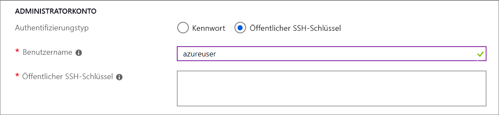

# Vorschau: Bereitstellen von VMs auf dedizierten Hosts über das Portal

Dieser Artikel führt Sie durch die Erstellung eines [dedizierten Azure-Hosts](dedicated-hosts.md) zum Hosten Ihrer virtuellen Computer (VMs). 

[!INCLUDE [virtual-machines-common-dedicated-hosts-portal](../../../includes/virtual-machines-common-dedicated-hosts-portal.md)]

## Erstellen einer VM

1. Klicken Sie links oben im Azure-Portal auf **Ressource erstellen**.
1. Suchen Sie im Suchfeld oberhalb der Liste der Azure Marketplace-Ressourcen nach **Ubuntu Server 16.04 LTS** von Canonical, und klicken Sie auf **Erstellen**.
1. Stellen Sie auf der Registerkarte **Grundlagen** unter **Projektdetails** sicher, dass das richtige Abonnement ausgewählt ist, und wählen Sie dann *myDedicatedHostsRG* als **Ressourcengruppe** aus. 
1. Geben Sie unter **Instanzdetails** *myVM* als **Namen des virtuellen Computers** ein, und wählen Sie *USA, Osten* als Ihre **Ort** aus.
1. Wählen Sie unter **Verfügbarkeitsoptionen** die Option **Verfügbarkeitszone** aus, und wählen Sie in der Dropdownliste *1* aus.
1. Wählen Sie für die Größe **Größe ändern** aus. Wählen Sie in der Liste der verfügbaren Größen eine der Esv3-Serie aus, z. B. **Standard E2s v3**. Möglicherweise müssen Sie den Filter löschen, um alle verfügbaren Größen anzuzeigen.
1. Wählen Sie unter **Administratorkonto** die Option **Öffentlicher SSH-Schlüssel** aus, geben Sie Ihren Benutzernamen ein, und fügen Sie Ihren öffentlichen Schlüssel in das Textfeld ein. Entfernen Sie in Ihrem öffentlichen Schlüssel alle führenden bzw. nachgestellten Leerzeichen.

    

1. Wählen Sie unter **Regeln für eingehende Ports** > **Öffentliche Eingangsports** die Option **Ausgewählte Ports zulassen** und dann in der Dropdownliste **SSH (22)** aus. 
1. Wählen Sie oben auf der Seite die Registerkarte **Erweitert** und im Abschnitt **Host** den Eintrag *myHostGroup* für **Hostgruppe**  und *myHost* für den **Host** aus. 
    
1. Belassen Sie die übrigen Standardeinstellungen, und wählen Sie dann die Schaltfläche **Überprüfen + erstellen** am unteren Rand der Seite aus.
1. Wenn eine Meldung über die erfolgreiche Validierung angezeigt wird, wählen Sie **Erstellen** aus.

Die Bereitstellung des virtuellen Computers dauert ein paar Minuten.

## Nächste Schritte

- Weitere Informationen finden Sie in der Übersicht zu [dedizierten Hosts](dedicated-hosts.md).

- [Hier](https://github.com/Azure/azure-quickstart-templates/blob/master/201-vm-dedicated-hosts/README.md) finden Sie eine Beispielvorlage, die sowohl Zonen als auch Fehlerdomänen für maximale Resilienz in einer Region verwendet.

- Sie können einen dedizierten Host auch über die [Azure-Befehlszeilenschnittstelle](dedicated-hosts-cli.md) bereitstellen.

