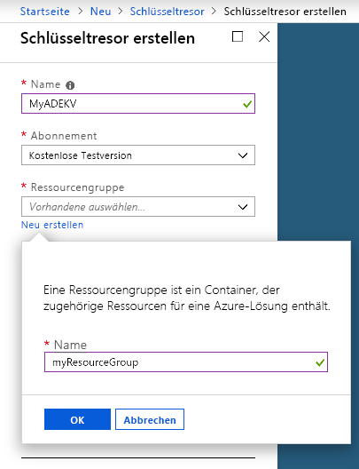
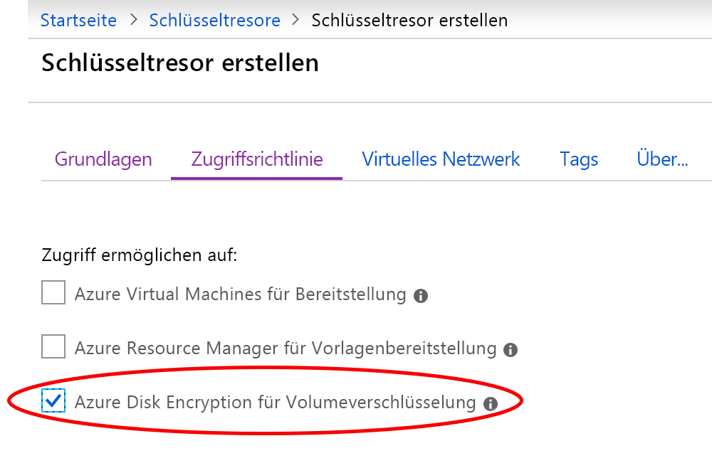
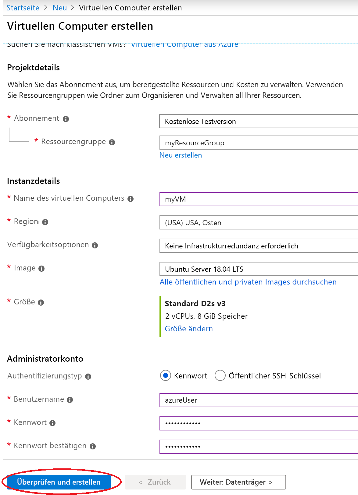
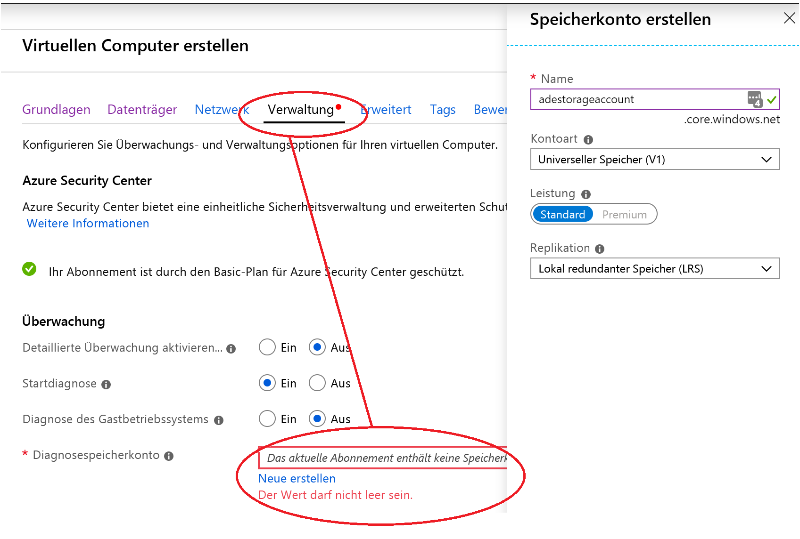
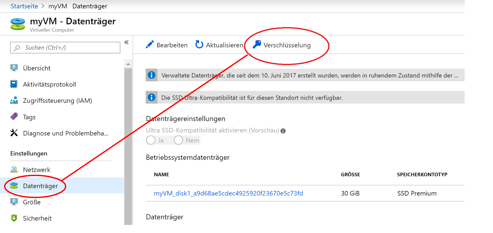
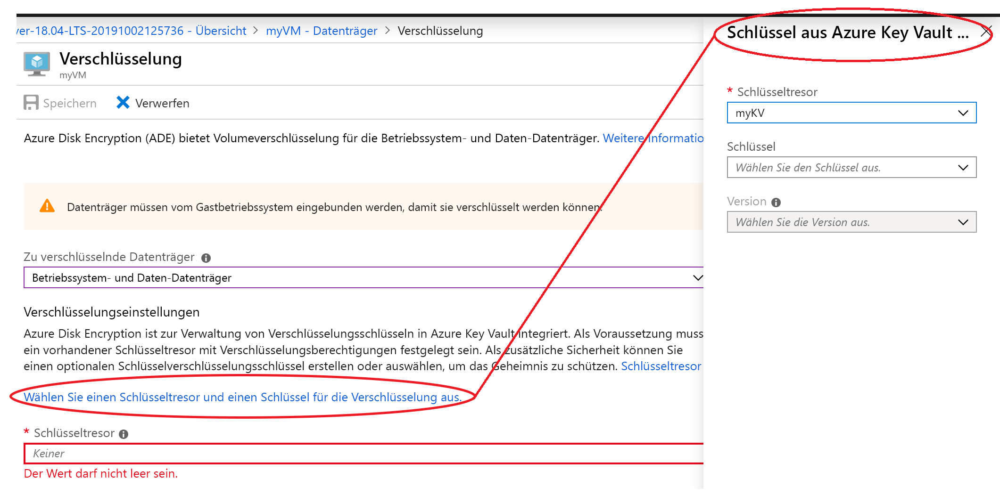

# Schnellstart: Erstellen und Verschlüsseln eines virtuellen Linux-Computers mit dem Azure-Portal

Virtuelle Azure-Computer (VMs) können über das Azure-Portal erstellt werden. Das Azure-Portal ist eine browserbasierte Benutzeroberfläche, über die Sie virtuelle Computer und die dazugehörigen Ressourcen erstellen können. In dieser Schnellstartanleitung verwenden Sie das Azure-Portal, um einen virtuellen Linux-Computer (VM) unter Ubuntu 18.04 LTS bereitzustellen, einen Schlüsseltresor zum Speichern von Verschlüsselungsschlüsseln zu erstellen und den virtuellen Computer zu verschlüsseln.

Wenn Sie kein Azure-Abonnement besitzen, können Sie ein [kostenloses Konto](https://azure.microsoft.com/free/?WT.mc_id=A261C142F) erstellen, bevor Sie beginnen.

## Anmelden bei Azure

Melden Sie sich beim [Azure-Portal](https://portal.azure.com) an.

## Erstellen eines Schlüsseltresors

1. Klicken Sie in der linken oberen Ecke des Azure-Portals auf die Option **Ressource erstellen**.
1. Geben Sie **Key Vault** in das Suchfeld ein.
1. Wählen Sie in der Ergebnisliste **Key Vault** aus.
1. Wählen Sie im Abschnitt „Key Vault“ die Option **Erstellen** aus.
1. Wählen Sie auf dem Bildschirm **Schlüsseltresor erstellen** einen eindeutigen Namen für Ihren neuen Schlüsseltresor aus.

    > [!Important]
    > Jeder Schlüsseltresor muss einen eindeutigen Namen haben. Das folgende Beispiel erstellt einen Schlüsseltresor mit dem Namen *myADEKV*. Ihrem eigenen müssen Sie jedoch einen anderen Namen geben.

1. Wählen Sie unter **Abonnement** ein Abonnement aus.
1.  Wählen Sie unter **Ressourcengruppe** die Option **Neu erstellen** aus. Geben Sie in dem Popup *myResourceGroup* als Namen der Ressourcengruppe ein, und wählen Sie dann **OK** aus. 

    

1. Wählen Sie im Pulldownmenü **Standort** die Option **USA, Osten** aus.
1. Behalten Sie bei den anderen Optionen die Standardeinstellungen bei.
1. Wählen Sie „Zugriffsrichtlinien“ aus. Dadurch werden Sie auf einen neuen Bildschirm weitergeleitet.
1. Aktivieren Sie das Kontrollkästchen neben „Zugriff auf Azure Disk Encryption für Volumeverschlüsselung aktivieren“.

    

1. Klicken Sie am unteren Rand des Bildschirms „Zugriffsrichtlinien“ auf „Überprüfen + erstellen“.
1. Klicken Sie nach der Überprüfung auf „Create“.

## Erstellen eines virtuellen Computers

1. Klicken Sie links oben im Azure-Portal auf **Ressource erstellen**.

1. Wählen Sie auf der Seite „Neu“ unter „Beliebt“ die Option **Ubuntu Server 18.04 LTS** aus.
1. Stellen Sie sicher, dass auf der Registerkarte **Grundlagen** unter **Projektdetails** das richtige Abonnement ausgewählt ist.
1. Wählen Sie unter **Ressourcengruppe** die Ressourcengruppe aus, die Sie oben beim Erstellen Ihres Schlüsseltresors erstellt haben (z. B. **myResourceGroup**).
1. Geben Sie unter **Name des virtuellen Computers** den Namen *MyVM* ein, und wählen Sie Folgendes aus: 
1. Wählen Sie unter **Region** die Region aus, die Sie auch oben beim Erstellen Ihres Schlüsseltresors verwendet haben (z. B. **USA, Osten**).
1. Stellen Sie sicher, dass als **Größe** die Option *Standard D2s v3* festgelegt ist.
1. Wählen Sie unter **Administratorkonto** die Option **Kennwort** aus. Geben Sie einen Benutzernamen und ein Kennwort ein.
    
1. Wählen Sie die Registerkarte „Verwaltung“ aus, und vergewissern Sie sich, dass Sie ein Diagnosespeicherkonto besitzen. Falls Sie keine Speicherkonten besitzen, wählen Sie „Neu erstellen“ aus, geben Sie einen Namen für Ihr Konto ein, und wählen Sie „OK“ aus. 
1. Klicken Sie auf „Überprüfen und erstellen“.
1. Auf der Seite zum **Erstellen eines virtuellen Computers** werden die Details des virtuellen Computers angezeigt, den Sie erstellen möchten. Klicken Sie auf **Erstellen**, wenn Sie so weit sind.

Die Bereitstellung des virtuellen Computers dauert ein paar Minuten. Fahren Sie nach Abschluss der Bereitstellung mit dem nächsten Abschnitt fort.

## Verschlüsseln des virtuellen Computers

1. Wählen Sie nach Abschluss der Bereitstellung des virtuellen Computers die Option **Zu Ressource wechseln** aus.
1. Wählen Sie auf der linken Seitenleiste **Datenträger** aus.
1. Wählen Sie auf dem Bildschirm „Datenträger“ die Option **Verschlüsselung** aus. 

    

1. Wählen Sie auf dem Bildschirm „Verschlüsselung“ unter **Disks to encrypt** (Zu verschlüsselnde Datenträger) die Option **Datenträger für Betriebssystem und Daten** aus.
1. Klicken Sie unter **Verschlüsselungseinstellungen** auf „Wählen Sie einen Schlüsseltresor und einen Schlüssel für die Verschlüsselung aus.“.
1. Wählen Sie auf der rechten Seitenleiste den Namen des zuvor erstellten Schlüsseltresors als Wert für *Schlüsseltresor** aus, und klicken Sie auf **Auswählen**.

    
1. Klicken Sie oben auf dem Verschlüsselungsbildschirm auf „Speichern“. In einem Popup werden Sie gewarnt, dass der virtuelle Computer neu gestartet wird. Klicken Sie auf **Ja**.

## Bereinigen von Ressourcen

Wenn Ressourcengruppe, virtueller Computer und alle zugehörigen Ressourcen nicht mehr benötigt werden, können Sie sie löschen. Wählen Sie dazu die Ressourcengruppe für den virtuellen Computer und dann „Löschen“ aus, und bestätigen Sie den Namen der zu löschenden Ressourcengruppe.

## Nächste Schritte

In dieser Schnellstartanleitung haben Sie einen Schlüsseltresor, der für Verschlüsselungsschlüssel aktiviert wurde, und einen virtuellen Computer erstellt und den virtuellen Computer für die Verschlüsselung aktiviert.  

> [!div class="nextstepaction"]
> [Übersicht über Azure Disk Encryption](disk-encryption-overview.md)