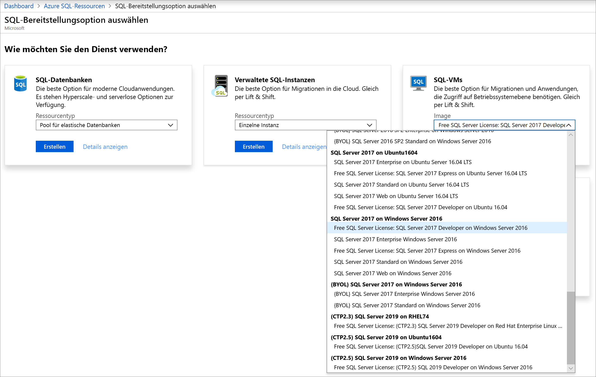
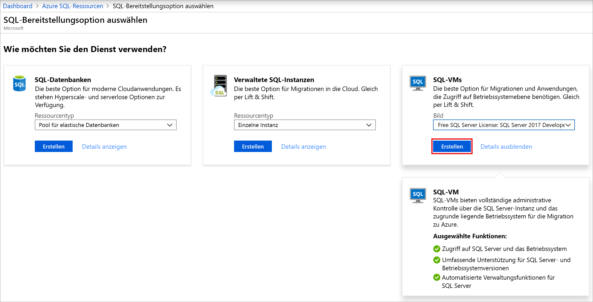

# Schnellstart: Erstellen eines virtuellen Windows-Computer mit SQL Server 2017 im Azure-Portal

> [!div class="op_single_selector"]
> * [Windows](quickstart-sql-vm-create-portal.md)
> * [Linux](../../linux/sql/provision-sql-server-linux-virtual-machine.md)

In dieser Schnellstartanleitung wird beschrieben, wie Sie im Azure-Portal einen virtuellen SQL Server-Computer erstellen.

  > [!TIP]
  > - Sie erfahren, wie Sie schnell einen virtuellen SQL-Computer bereitstellen und eine Verbindung damit herstellen. Weitere Informationen zu anderen Bereitstellungsoptionen für virtuelle SQL-Computer finden Sie im [Bereitstellungshandbuch für virtuelle Windows-Computer mit SQL Server im Azure-Portal](virtual-machines-windows-portal-sql-server-provision.md).
  > - Falls Sie Fragen zu SQL Server-VMs haben, finden Sie in den [häufig gestellten Fragen](virtual-machines-windows-sql-server-iaas-faq.md) weitere Informationen.

##  Einrichten eines Azure-Abonnements

Wenn Sie kein Azure-Abonnement besitzen, können Sie ein [kostenloses Konto](https://azure.microsoft.com/free/?WT.mc_id=A261C142F) erstellen, bevor Sie beginnen.

##  Auswählen eines SQL Server-VM-Images

1. Melden Sie sich mit Ihrem Konto beim [Azure-Portal](https://portal.azure.com) an.

1. Wählen Sie im linken Menü im Azure-Portal die Option **Azure SQL** aus. Wenn **Azure SQL** in der Liste nicht aufgeführt ist, wählen Sie **Alle Dienste** aus, und geben Sie dann *Azure SQL* ins Suchfeld ein.
1. Wählen Sie **+Hinzufügen** aus, um die Seite **SQL-Bereitstellungsoption auswählen** zu öffnen. Sie können weitere Informationen anzeigen, indem Sie auf der Kachel **SQL-VMs** die Option **Details anzeigen** auswählen.
1. Wählen Sie das Image **Free SQL Server License: SQL Server 2017 Developer on Windows Server 2016** (Kostenlose SQL Server-Lizenz: SQL Server 2017 Developer unter Windows Server 2016) aus.

   

1. Klicken Sie auf **Erstellen**.

   

##  Angeben grundlegender Informationen

Geben Sie auf der Registerkarte **Grundeinstellungen** die folgenden Informationen an:

1. Wählen Sie im Abschnitt **Projektdetails** Ihr Azure-Abonnement und anschließend **Neue erstellen** aus, um eine neue Ressourcengruppe zu erstellen. Geben Sie als Name _SQLVM-RG_ ein.

   

1. Gehen Sie unter **Instanzendetails** wie folgt vor:
    1. Geben Sie unter **Name des virtuellen Computers** den Namen _SQLVM_ ein. 
    1. Wählen Sie unter **Region** einen Standort aus. 
    1. Übernehmen Sie für diese Schnellstartanleitung für **Verfügbarkeitsoptionen** die Einstellung _Keine Infrastrukturredundanz erforderlich_. Weitere Informationen zu Verfügbarkeitsoptionen finden Sie unter [Verfügbarkeit](../../windows/availability.md). 
    1. Wählen Sie in der Liste unter **Image** die Option _Free SQL Server License: SQL Server 2017 Developer on Windows Server 2016_ aus. 
    1. Wählen Sie unter **Größe** die Option **Größe ändern** aus, um die Größe des virtuellen Computers anzupassen, und wählen Sie das Angebot **Basic A2** aus. Bereinigen Sie unbedingt die Ressourcen, wenn Sie fertig sind, um unerwartete Gebühren zu vermeiden. 

   

1. Geben Sie unter **Administratorkonto** einen Benutzernamen wie _azureuser_ sowie ein Kennwort an. Das Kennwort muss mindestens zwölf Zeichen lang sein und die [definierten Anforderungen an die Komplexität](../../windows/faq.md#what-are-the-password-requirements-when-creating-a-vm) erfüllen.

   

1. Wählen Sie unter **Regeln für eingehende Ports** die Option **Ausgewählte Ports zulassen** aus, und wählen Sie dann **RDP (3389)** aus der Dropdownliste aus. 

   

## SQL Server-Einstellungen

Konfigurieren Sie auf der Registerkarte **SQL Server-Einstellungen** die folgenden Optionen:

1. Wählen Sie unter **Sicherheit + Netzwerkbetrieb** für **SQL-Konnektivität** die Option _Öffentlich (Internet)_ aus, und ändern Sie den Port in `1401`, um eine bekannte Portnummer im öffentlichen Szenario zu vermeiden. 
1. Wählen Sie unter **SQL-Authentifizierung** die Option **Aktivieren** aus. Für die SQL-Anmeldung werden der gleiche Benutzername und das gleiche Kennwort festgelegt, die Sie für den virtuellen Computer konfiguriert haben. Verwenden Sie die Standardeinstellung für [**Azure Key Vault-Integration**](virtual-machines-windows-ps-sql-keyvault.md). **Speicherkonfiguration** ist für das SQL Server-VM-Basisimage nicht verfügbar. Weitere Informationen zu verfügbaren Optionen für andere Images finden Sie jedoch unter [Speicherkonfiguration](virtual-machines-windows-sql-server-storage-configuration.md#new-vms).  

   

1. Ändern Sie ggf. weitere Einstellungen, und wählen Sie dann **Bewerten + erstellen** aus. 

   

## Erstellen des virtuellen SQL Server-Computers

Überprüfen Sie auf der Registerkarte **Bewerten + erstellen** die Zusammenfassung, und wählen Sie **Erstellen** aus, um SQL Server, die Ressourcengruppe und die für diesen virtuellen Computer angegebenen Ressourcen zu erstellen.

Sie können die Bereitstellung über das Azure-Portal überwachen. Auf der Schaltfläche **Benachrichtigungen** oben auf der Seite wird der grundlegende Status der Bereitstellung angezeigt. Die Bereitstellung kann einige Minuten dauern. 

## Herstellen einer Verbindung mit SQL Server

1. Suchen Sie im Portal im Abschnitt **Übersicht** der Eigenschaften Ihres virtuellen Computers den Wert für **Öffentliche IP-Adresse** Ihres virtuellen SQL Server-Computers.

1. Öffnen Sie [SQL Server Management Studio (SSMS)](/sql/ssms/download-sql-server-management-studio-ssms) auf einem anderen Computer mit Internetverbindung.

1. Bearbeiten Sie im Dialogfeld **Mit Server verbinden** oder **Verbindung mit Datenbank-Engine herstellen** den Wert **Servername**. Geben Sie die öffentliche IP-Adresse des virtuellen Computers ein. Fügen Sie dann ein Komma und den benutzerdefinierten Port **1401** hinzu, den wir beim Konfigurieren des neuen virtuellen Computers angegeben haben. Beispiel: `11.22.33.444,1401`.

1. Wählen Sie im Feld **Authentifizierung** den Eintrag **SQL Server-Authentifizierung**.

1. Geben Sie im Feld **Anmelden** einen gültigen SQL-Anmeldenamen ein.

1. Geben Sie im Feld **Kennwort** das Kennwort für die Anmeldung ein.

1. Wählen Sie **Verbinden**aus.

    

##  Remoteanmeldung beim virtuellen Computer

Führen Sie die folgenden Schritte aus, um mithilfe von Remotedesktop eine Verbindung mit dem virtuellen SQL Server-Computer herzustellen:

[!INCLUDE [Connect to SQL Server VM with remote desktop](../../../../includes/virtual-machines-sql-server-remote-desktop-connect.md)]

Nachdem Sie eine Verbindung mit dem virtuellen SQL Server-Computer hergestellt haben, können Sie SQL Server Management Studio starten und mit Ihren Anmeldeinformationen für den lokalen Administrator eine Verbindung mit der Windows-Authentifizierung herstellen. Wenn Sie die SQL Server-Authentifizierung aktiviert haben, können Sie die Verbindung auch per SQL-Authentifizierung herstellen, indem Sie den während der Bereitstellung konfigurierten SQL-Benutzernamen und das Kennwort verwenden.

Durch den Zugriff auf den Computer können Sie die Computer- und SQL Server-Einstellungen je nach Ihren Anforderungen direkt ändern. Beispielsweise können Sie die Firewalleinstellungen konfigurieren oder die SQL Server-Konfigurationseinstellungen ändern.

## Bereinigen von Ressourcen

Wenn der virtuelle SQL-Computer nicht kontinuierlich ausgeführt werden muss, können Sie unnötige Kosten vermeiden, indem Sie ihn anhalten, wenn er nicht verwendet wird. Sie können darüber hinaus alle dem virtuellen Computer zugeordneten Ressourcen endgültig entfernen, indem Sie die zugeordnete Ressourcengruppe im Portal löschen. Dadurch wird auch der virtuelle Computer endgültig gelöscht, lassen Sie daher bei Verwendung dieses Befehls Vorsicht walten. Weitere Informationen finden Sie unter [Verwalten von Azure-Ressourcen über das Portal](../../../azure-resource-manager/manage-resource-groups-portal.md).

## Nächste Schritte

In dieser Schnellstartanleitung haben Sie einen virtuellen SQL Server 2017-Computer im Azure-Portal erstellt. Weitere Informationen zum Migrieren Ihrer Daten zu dem neuen SQL Server-Computer finden Sie im folgenden Artikel:

> [!div class="nextstepaction"]
> [Migrieren einer SQL Server-Datenbank zu SQL Server auf einem virtuellen Azure-Computer](virtual-machines-windows-migrate-sql.md)
